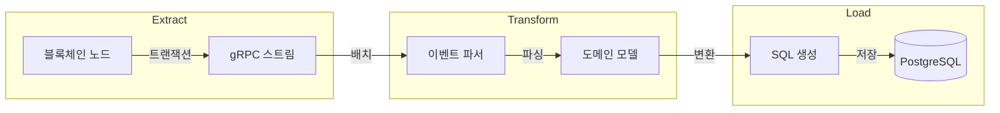
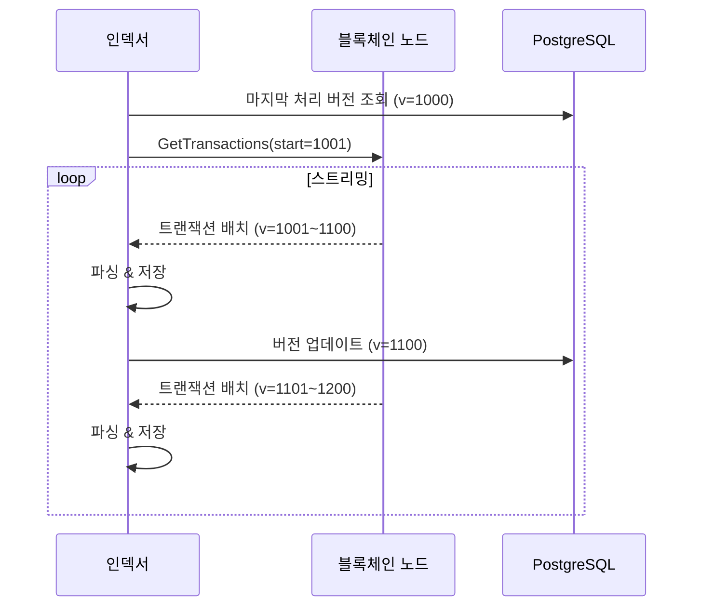
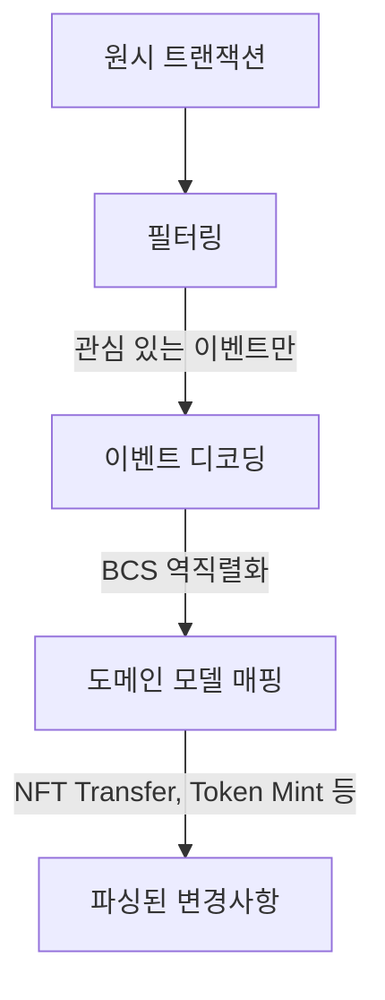
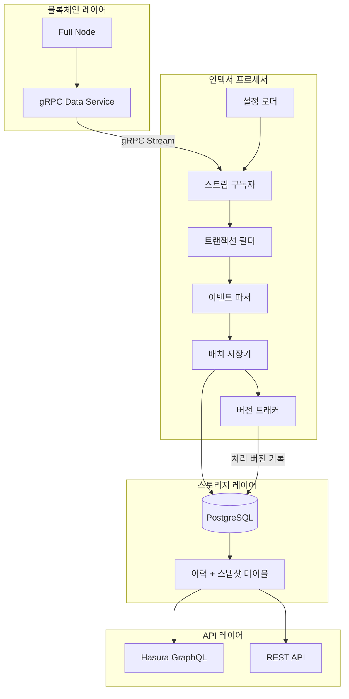

## 시리즈 목차

1. [블록체인 인덱서란?](/blog/blockchain/indexer-01-introduction)
2. **인덱서 아키텍처 Deep Dive** (현재 글)
3. [이력 테이블 vs 스냅샷 테이블](/blog/blockchain/indexer-03-database-design)
4. [Rust로 인덱서 SDK 만들기](/blog/blockchain/indexer-04-rust-sdk)
5. [Diesel ORM 실전 활용](/blog/blockchain/indexer-05-diesel-orm)
6. [멱등성 있는 인덱서 핸들러 설계](/blog/blockchain/indexer-06-idempotency)

---

## 인덱서는 ETL 파이프라인이다

인덱서의 핵심은 **ETL(Extract-Transform-Load)** 파이프라인입니다. 데이터 엔지니어링에서 친숙한 이 패턴이 블록체인 인덱서에도 그대로 적용됩니다.



각 단계를 자세히 살펴보겠습니다.

---

## 1. Extract: gRPC 트랜잭션 스트림

### 왜 gRPC인가?

블록체인 노드와 인덱서 간 통신에는 **gRPC 스트리밍**이 표준으로 사용됩니다:

| 방식 | 장점 | 단점 |
|------|------|------|
| **REST Polling** | 구현 단순 | 지연, 불필요한 요청 |
| **WebSocket** | 실시간, 양방향 | 프로토콜 오버헤드 |
| **gRPC Stream** | 고성능, 타입 안전, 배치 지원 | 초기 설정 복잡 |

gRPC의 **Server-side streaming**을 사용하면:

- 연결 유지하며 **새 트랜잭션을 푸시**
- Protocol Buffers로 **직렬화 효율 극대화**
- 자동 재연결 및 **백프레셔(backpressure)** 지원

### 스트림 구독 흐름



### 시작 버전(Starting Version) 결정

인덱서가 시작할 때 **어디서부터 처리할지** 결정해야 합니다:

```
시작 버전 = MAX(설정값, DB에 저장된 마지막 버전 + 1)
```

이를 통해:

- **신규 배포 시**: 설정된 버전부터 시작
- **재시작 시**: 마지막 처리 지점부터 재개
- **장애 복구 시**: 중복 처리 없이 이어서 진행

---

## 2. Transform: 이벤트 파싱

### 원시 트랜잭션 구조

블록체인 노드에서 받는 원시 데이터는 복잡한 구조를 가집니다:

```json
{
  "version": 12345,
  "hash": "0xabc...",
  "events": [
    {
      "type": "0x1::nft::TransferEvent",
      "data": "0x0102030405..."  // BCS 인코딩된 바이트
    }
  ]
}
```

### 파싱 파이프라인

파싱은 여러 단계로 나뉩니다:



### 필터링 전략

모든 트랜잭션을 처리할 필요는 없습니다:

| 필터 유형 | 예시 | 목적 |
|----------|------|------|
| **발신자 필터** | 시스템 계정 제외 | 노이즈 감소 |
| **이벤트 타입 필터** | `TransferEvent`만 | 관심 이벤트 집중 |
| **모듈 필터** | 특정 컨트랙트만 | 범위 한정 |

---

## 3. Load: DB 적재

### 배치 저장의 중요성

트랜잭션을 하나씩 저장하면 성능이 급격히 저하됩니다:

```
❌ 트랜잭션별 개별 INSERT
   → 1000 TPS × 1ms/쿼리 = 1초에 1000 쿼리 = 병목

✅ 배치 INSERT
   → 1000 트랜잭션 × 1 배치 = 10ms = 100배 빠름
```

### 청크 단위 처리

PostgreSQL에는 **쿼리당 파라미터 수 제한(~65,535)**이 있습니다.

10개 컬럼 테이블에 10,000 row를 삽입하면:

- 파라미터 수 = 10 × 10,000 = **100,000 → 제한 초과!**

해결책: **청크 단위 분할**

```
전체 10,000 rows
    ↓
청크 1: 1~6,000 rows (60,000 params)
청크 2: 6,001~10,000 rows (40,000 params)
    ↓
각 청크를 병렬 실행
```

5편에서 Diesel ORM으로 이를 구현하는 방법을 다룹니다.

---

## 전체 아키텍처 다이어그램



---

## 파이프라인 단계별 책임

| 단계 | 책임 | 실패 시 동작 |
|------|------|-------------|
| **스트림 구독자** | gRPC 연결 관리, 재연결 | 지수 백오프 재시도 |
| **트랜잭션 필터** | 불필요 트랜잭션 제외 | 패스스루(다음 단계로) |
| **이벤트 파서** | 도메인 모델 변환 | 에러 로깅 후 스킵 |
| **배치 저장기** | 청크 단위 DB 쓰기 | 트랜잭션 롤백 후 재시도 |
| **버전 트래커** | 처리 진행률 기록 | 다음 배치에서 재기록 |

---

## 정리

- 인덱서는 **Extract-Transform-Load** 패턴으로 동작
- **gRPC 스트리밍**으로 실시간 트랜잭션 수신
- **이벤트 파싱**으로 원시 데이터를 도메인 모델로 변환
- **배치 저장**으로 DB 쓰기 성능 최적화
- **버전 트래킹**으로 장애 복구 및 재시작 지원

---

## 다음 편 예고

**[3편: 이력 테이블 vs 스냅샷 테이블 - 인덱서 DB 설계 전략](/blog/blockchain/indexer-03-database-design)**

- 변경 이력 추적의 필요성
- 현재 상태 조회 최적화
- 이중 테이블 패턴 상세 설명
- SQL 스키마 예시
