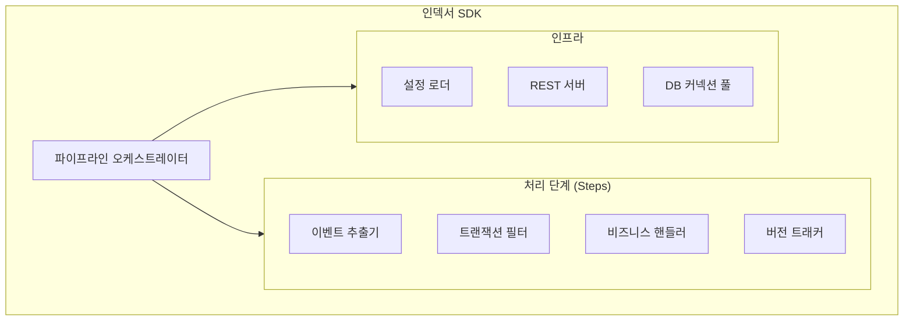
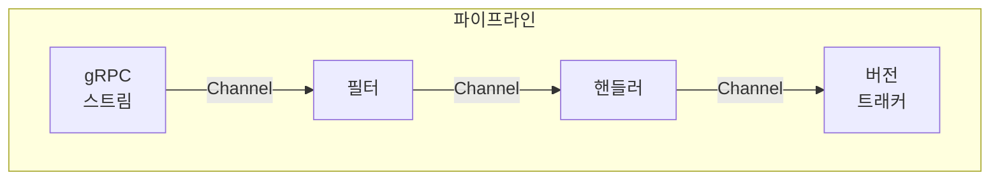
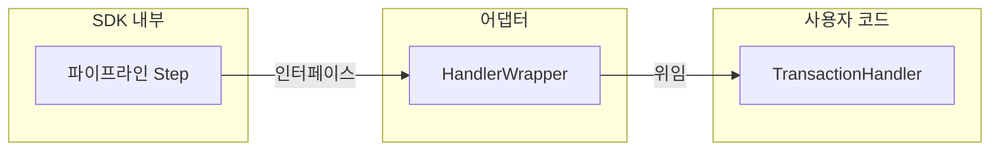
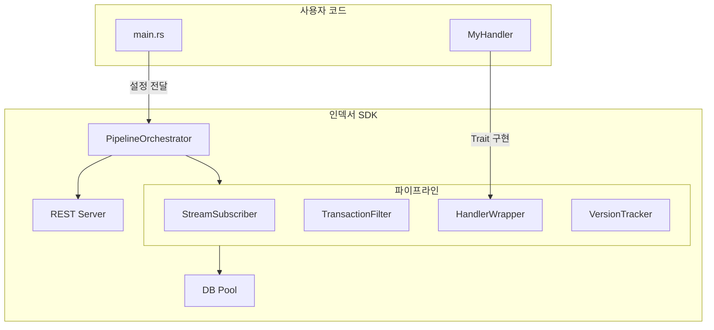

## 시리즈 목차

1. [블록체인 인덱서란?](/blog/blockchain/indexer/indexer-01-introduction)
2. [인덱서 아키텍처 Deep Dive](/blog/blockchain/indexer/indexer-02-architecture)
3. [이력 테이블 vs 스냅샷 테이블](/blog/blockchain/indexer/indexer-03-database-design)
4. **Rust로 인덱서 SDK 만들기** (현재 글)
5. [Diesel ORM 실전 활용](/blog/blockchain/indexer/indexer-05-diesel-orm)
6. [멱등성 있는 인덱서 핸들러 설계](/blog/blockchain/indexer/indexer-06-idempotency)

---

## 왜 SDK가 필요한가?

여러 도메인의 인덱서를 개발하다 보면 **반복되는 코드**가 있습니다:

- gRPC 스트림 연결 및 재연결
- 트랜잭션 필터링
- 버전 트래킹
- 배치 저장 로직
- 헬스체크 엔드포인트

이런 보일러플레이트를 **SDK로 추상화**하면:

| 개별 구현 | SDK 사용 |
|----------|---------|
| 각 인덱서마다 500줄+ | 비즈니스 로직 50줄 |
| 버그 수정 시 N곳 패치 | 한 곳만 수정 |
| 일관성 없는 에러 처리 | 표준화된 패턴 |

---

## SDK 핵심 컴포넌트



---

## 1. 파이프라인 오케스트레이터

오케스트레이터는 **전체 파이프라인의 생명주기를 관리**합니다:

```rust
pub struct PipelineOrchestrator<H: TransactionHandler> {
    config: IndexerConfig,
    handler: H,
    db_pool: Pool<AsyncPgConnection>,
}

impl<H: TransactionHandler> PipelineOrchestrator<H> {
    pub async fn run(&mut self) -> Result<()> {
        // 1. DB 마이그레이션 실행
        self.run_migrations().await?;
        
        // 2. 시작 버전 결정
        let start_version = self.determine_starting_version().await?;
        
        // 3. 파이프라인 구성
        let pipeline = self.build_pipeline(start_version);
        
        // 4. REST 서버 + 파이프라인 동시 실행
        tokio::select! {
            result = pipeline.run() => result,
            result = self.run_server() => result,
        }
    }
}
```

### 구성요소 연결



각 단계는 **채널(Channel)**로 연결되어 비동기적으로 데이터를 전달합니다.

---

## 2. 핸들러 Trait 설계

SDK의 핵심은 **확장 포인트를 잘 정의**하는 것입니다.

### Trait 정의

```rust
#[async_trait]
pub trait TransactionHandler: Clone + Send + Sync + 'static {
    /// 트랜잭션 배치를 처리하고 결과를 반환
    async fn process(
        &self,
        context: TransactionContext,
    ) -> Result<Option<TransactionContext>, ProcessorError>;
}
```

### 사용자 구현 예시

```rust
#[derive(Clone)]
pub struct NftTransferHandler {
    db_pool: Pool<AsyncPgConnection>,
}

#[async_trait]
impl TransactionHandler for NftTransferHandler {
    async fn process(
        &self,
        context: TransactionContext,
    ) -> Result<Option<TransactionContext>, ProcessorError> {
        // 1. 이벤트 파싱
        let transfers = self.parse_transfer_events(&context.transactions)?;
        
        // 2. DB 저장
        self.store_transfers(&transfers).await?;
        
        // 3. 다음 단계로 전달 (None이면 중단)
        Ok(Some(context))
    }
}
```

### Trait 설계 원칙

| 원칙 | 적용 |
|------|------|
| **Clone** | 멀티스레드 환경에서 핸들러 복제 |
| **Send + Sync** | 스레드 간 안전한 공유 |
| **'static** | 비동기 태스크에서 수명 관리 |
| **Option 반환** | 파이프라인 중단 제어 |

---

## 3. Producer-Consumer 채널 패턴

### 왜 채널인가?

단계 간 직접 호출 대신 **채널을 사용하는 이유**:

```
❌ 직접 호출
   Step1.process() → Step2.process() → Step3.process()
   → 모든 단계가 동기적으로 블로킹

✅ 채널 기반
   Step1 → [Channel] → Step2 → [Channel] → Step3
   → 각 단계가 독립적으로 병렬 실행
```

### 구현 패턴

```rust
use tokio::sync::mpsc;

pub struct Step<T, U> {
    receiver: mpsc::Receiver<T>,
    sender: mpsc::Sender<U>,
    processor: Box<dyn Processor<T, U>>,
}

impl<T, U> Step<T, U> {
    pub async fn run(mut self) {
        while let Some(input) = self.receiver.recv().await {
            match self.processor.process(input).await {
                Ok(Some(output)) => {
                    let _ = self.sender.send(output).await;
                }
                Ok(None) => continue,  // 필터링됨
                Err(e) => {
                    tracing::error!("Processing error: {}", e);
                    // 에러 처리 정책에 따라 계속/중단
                }
            }
        }
    }
}
```

### 백프레셔(Backpressure)

채널 버퍼가 가득 차면 **자동으로 생산 속도가 조절**됩니다:

```rust
// 버퍼 크기 10인 채널
let (tx, rx) = mpsc::channel::<TransactionBatch>(10);

// 버퍼가 가득 차면 send가 대기
tx.send(batch).await?;  // 10개 초과 시 여기서 블록
```

---

## 4. 어댑터 패턴 적용

사용자의 핸들러를 SDK 파이프라인에 연결하는 **어댑터**:



### 구현

```rust
pub struct HandlerWrapper<H: TransactionHandler> {
    handler: H,
}

impl<H: TransactionHandler> HandlerWrapper<H> {
    pub fn new(handler: H) -> Self {
        Self { handler }
    }
}

#[async_trait]
impl<H: TransactionHandler> PipelineStep for HandlerWrapper<H> {
    type Input = TransactionContext;
    type Output = TransactionContext;
    
    async fn process(&self, input: Self::Input) -> Result<Option<Self::Output>> {
        self.handler.process(input).await
    }
}
```

---

## 5. 설정과 시작 버전

### 설정 구조

```rust
#[derive(Debug, Clone, Deserialize)]
pub struct IndexerConfig {
    pub processor_name: String,
    
    #[serde(flatten)]
    pub db_config: DatabaseConfig,
    
    #[serde(flatten)]
    pub stream_config: StreamConfig,
    
    #[serde(default)]
    pub filter_config: FilterConfig,
    
    pub server_port: u16,
}

#[derive(Debug, Clone, Deserialize)]
pub struct DatabaseConfig {
    pub connection_string: String,
    pub pool_size: u32,
    pub schema_name: String,
    pub run_migrations: bool,
}
```

### 시작 버전 결정 로직

```rust
impl<H: TransactionHandler> PipelineOrchestrator<H> {
    async fn determine_starting_version(&self) -> Result<u64> {
        // 1. 설정에서 명시된 버전
        let config_version = self.config.stream_config.starting_version;
        
        // 2. DB에서 마지막 처리 버전 조회
        let db_version = self.get_last_processed_version().await?;
        
        // 3. 둘 중 큰 값 선택 (안전한 시작점)
        Ok(config_version.max(db_version.map(|v| v + 1).unwrap_or(0)))
    }
}
```

---

## 전체 아키텍처 다이어그램



---

## 정리

- **오케스트레이터**: 파이프라인 생명주기 관리
- **핸들러 Trait**: 비즈니스 로직 주입점
- **채널 패턴**: 비동기 단계 간 데이터 전달
- **어댑터**: 사용자 코드와 SDK 연결
- **설정 기반**: 환경별 유연한 구성

---

## 다음 편 예고

**[5편: Diesel ORM 실전 활용 - 비동기 DB 처리와 배치 최적화](/blog/blockchain/indexer/indexer-05-diesel-orm)**

- `diesel-async` 소개
- 파라미터 수 제한과 청크 처리
- Upsert 패턴 구현
- 커넥션 풀 최적화
