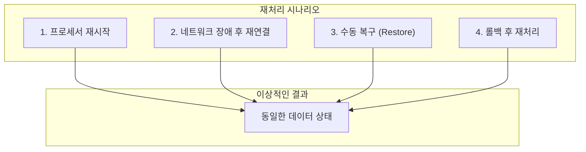

## 시리즈 목차

1. [블록체인 인덱서란?](/blog/blockchain/indexer/indexer-01-introduction)
2. [인덱서 아키텍처 Deep Dive](/blog/blockchain/indexer/indexer-02-architecture)
3. [이력 테이블 vs 스냅샷 테이블](/blog/blockchain/indexer/indexer-03-database-design)
4. [Rust로 인덱서 SDK 만들기](/blog/blockchain/indexer/indexer-04-rust-sdk)
5. [Diesel ORM 실전 활용](/blog/blockchain/indexer/indexer-05-diesel-orm)
6. **멱등성 있는 인덱서 핸들러 설계** (현재 글)

---

## 멱등성(Idempotency)이란?

> **같은 연산을 여러 번 수행해도 결과가 동일한 성질**

```
f(x) = f(f(x)) = f(f(f(x))) = ...
```

### 예시

| 연산 | 멱등성 |
|------|--------|
| `x = 5` | ✅ 멱등 (몇 번 해도 x=5) |
| `x = x + 1` | ❌ 비멱등 (할 때마다 증가) |
| `INSERT ON CONFLICT UPDATE` | ✅ 멱등 |
| `INSERT` (중복 시 에러) | ❌ 비멱등 |

---

## 왜 인덱서에서 멱등성이 중요한가?

인덱서는 **여러 상황에서 동일 트랜잭션을 재처리**할 수 있습니다:

### 재처리가 발생하는 상황



### 멱등성 없는 핸들러의 문제

```sql
-- ❌ 비멱등 쿼리: 같은 트랜잭션 재처리 시
INSERT INTO balances (address, amount) VALUES ('0x123', 100);
INSERT INTO balances (address, amount) VALUES ('0x123', 100);  -- 중복 에러!

-- 또는 잔액 증가 방식
UPDATE balances SET amount = amount + 100 WHERE address = '0x123';
UPDATE balances SET amount = amount + 100 WHERE address = '0x123';  -- 200이 됨!
```

---

## 멱등 쿼리 작성법

### 1. Upsert + 버전 체크

5편에서 다룬 패턴의 핵심:

```sql
INSERT INTO current_nft_owners (nft_id, owner_address, last_version)
VALUES ('nft#1', 'addr_C', 300)
ON CONFLICT (nft_id) 
DO UPDATE SET 
    owner_address = EXCLUDED.owner_address,
    last_version = EXCLUDED.last_version
WHERE current_nft_owners.last_version < EXCLUDED.last_version;
```

**핵심**: `WHERE` 조건으로 **더 오래된 버전은 무시**

### 2. 이력 테이블의 복합 PK

```sql
CREATE TABLE nft_transfers (
    nft_id TEXT,
    transaction_version BIGINT,
    -- 복합 PK로 중복 방지
    PRIMARY KEY (nft_id, transaction_version),
    ...
);

-- 동일 트랜잭션 재처리해도 안전
INSERT INTO nft_transfers (nft_id, transaction_version, ...)
VALUES ('nft#1', 300, ...)
ON CONFLICT (nft_id, transaction_version) DO NOTHING;
```

### 3. 절대값 저장 vs 상대값 저장

```
❌ 상대값 (비멱등)
"잔액을 100 증가시킨다" → UPDATE SET balance = balance + 100

✅ 절대값 (멱등)
"잔액을 500으로 설정한다" → UPDATE SET balance = 500
```

---

## 핸들러 설계 패턴

### 멱등 핸들러 구조

```rust
#[async_trait]
impl TransactionHandler for NftHandler {
    async fn process(&self, ctx: TransactionContext) -> Result<Option<TransactionContext>> {
        for tx in &ctx.transactions {
            let events = self.parse_events(tx)?;
            
            for event in events {
                // 멱등한 저장 로직
                self.store_idempotent(&event).await?;
            }
        }
        
        Ok(Some(ctx))
    }
}

impl NftHandler {
    async fn store_idempotent(&self, event: &TransferEvent) -> Result<()> {
        let mut conn = self.pool.get().await?;
        
        // 1. 이력 테이블: INSERT ... ON CONFLICT DO NOTHING
        diesel::insert_into(transfer_history::table)
            .values(HistoryRow::from(event))
            .on_conflict((transfer_history::nft_id, transfer_history::tx_version))
            .do_nothing()
            .execute(&mut conn)
            .await?;
        
        // 2. 스냅샷 테이블: UPSERT with version check
        diesel::insert_into(current_owners::table)
            .values(CurrentRow::from(event))
            .on_conflict(current_owners::nft_id)
            .do_update()
            .set((
                current_owners::owner.eq(excluded(current_owners::owner)),
                current_owners::version.eq(excluded(current_owners::version)),
            ))
            .filter(current_owners::version.lt(excluded(current_owners::version)))
            .execute(&mut conn)
            .await?;
        
        Ok(())
    }
}
```

---

## 복구(Restore) API 설계

### 왜 필요한가?

- 인덱싱 버그 발견 후 **과거 데이터 수정**
- 일부 트랜잭션 **누락** 발생 시 재처리
- 새로운 테이블 추가 후 **과거 데이터 백필**

### API 설계

```rust
#[derive(Deserialize)]
pub struct RestoreRequest {
    pub start_version: u64,
    pub end_version: u64,
}

#[derive(Serialize)]
pub struct RestoreResponse {
    pub status: String,
    pub processed_count: u64,
}

// POST /restore
pub async fn restore_handler(
    State(state): State<AppState>,
    Json(req): Json<RestoreRequest>,
) -> Result<Json<RestoreResponse>, AppError> {
    // 백그라운드 태스크로 처리
    tokio::spawn(async move {
        state.indexer
            .process_range(req.start_version, req.end_version)
            .await
    });
    
    Ok(Json(RestoreResponse {
        status: "accepted".to_string(),
        processed_count: req.end_version - req.start_version + 1,
    }))
}
```

### 범위 재처리 구현

```rust
impl Indexer {
    pub async fn process_range(
        &self,
        start: u64,
        end: u64,
    ) -> Result<()> {
        tracing::info!(start, end, "Starting restore process");
        
        // gRPC 스트림을 특정 범위로 요청
        let stream = self.client
            .get_transactions(start, Some(end))
            .await?;
        
        while let Some(batch) = stream.next().await {
            let batch = batch?;
            
            // 멱등 핸들러로 처리 (재처리해도 안전!)
            self.handler.process(batch).await?;
            
            tracing::debug!(version = batch.last_version, "Processed batch");
        }
        
        tracing::info!(start, end, "Restore completed");
        Ok(())
    }
}
```

---

## 버전 트래킹과 재시작

### 처리 상태 테이블

```sql
CREATE TABLE processor_status (
    processor_name TEXT PRIMARY KEY,
    last_processed_version BIGINT NOT NULL,
    last_updated_at TIMESTAMP DEFAULT NOW()
);
```

### 버전 트래커 구현

```rust
pub struct VersionTracker {
    processor_name: String,
    pool: Pool<AsyncPgConnection>,
    update_interval: u64,  // N개 배치마다 업데이트
}

impl VersionTracker {
    pub async fn record(&self, version: u64) -> Result<()> {
        diesel::insert_into(processor_status::table)
            .values((
                processor_status::processor_name.eq(&self.processor_name),
                processor_status::last_processed_version.eq(version as i64),
            ))
            .on_conflict(processor_status::processor_name)
            .do_update()
            .set((
                processor_status::last_processed_version.eq(version as i64),
                processor_status::last_updated_at.eq(diesel::dsl::now),
            ))
            .execute(&mut self.pool.get().await?)
            .await?;
        
        Ok(())
    }
    
    pub async fn get_last_version(&self) -> Result<Option<u64>> {
        processor_status::table
            .filter(processor_status::processor_name.eq(&self.processor_name))
            .select(processor_status::last_processed_version)
            .first::<i64>(&mut self.pool.get().await?)
            .await
            .optional()?
            .map(|v| v as u64)
    }
}
```

---

## 멱등성 체크리스트

인덱서 핸들러를 구현할 때 확인할 사항:

| 항목 | 체크 |
|------|------|
| 이력 테이블에 복합 PK 사용? | ☐ |
| `ON CONFLICT DO NOTHING` 또는 `DO UPDATE` 사용? | ☐ |
| 스냅샷 테이블에 버전 체크 조건 추가? | ☐ |
| 상대값(+/-) 대신 절대값 저장? | ☐ |
| 복구 API 구현? | ☐ |
| 버전 트래커로 진행률 기록? | ☐ |

---

## 시리즈 마무리

6편에 걸쳐 블록체인 인덱서의 A to Z를 다뤘습니다:

| 편 | 주제 | 핵심 |
|----|------|------|
| 1편 | 인덱서 개념 | 왜 필요한가 |
| 2편 | ETL 아키텍처 | 어떻게 동작하는가 |
| 3편 | DB 설계 | 이중 테이블 패턴 |
| 4편 | SDK 설계 | Trait, 채널, 어댑터 |
| 5편 | Diesel ORM | 배치 처리, Upsert |
| 6편 | 멱등성 | 재처리 안전성 |

이 시리즈가 블록체인 인덱서를 개발하거나 이해하는 데 도움이 되길 바랍니다.

---

## 참고 자료

- [Aptos Indexer SDK Documentation](https://aptos.dev/build/indexer/indexer-sdk/documentation)
- [Diesel - Getting Started](https://diesel.rs/guides/getting-started)
- [PostgreSQL UPSERT](https://www.postgresql.org/docs/current/sql-insert.html#SQL-ON-CONFLICT)
