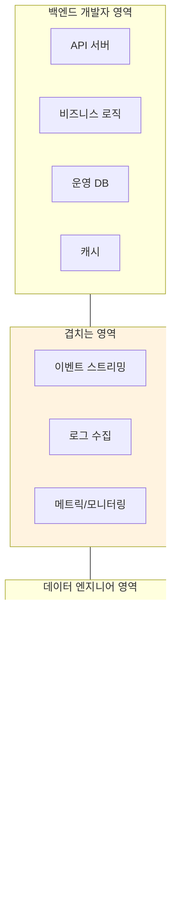

# 데이터 엔지니어링 시리즈 #1: 백엔드 개발자가 데이터 엔지니어링을 배워야 하는 이유

> **대상 독자**: 6년 이상의 경험을 가진 백엔드/풀스택 엔지니어로, Spark, Airflow 등 데이터 엔지니어링 기술에 처음 접근하는 분

## 시리즈 소개

| # | 주제 | 익숙한 개념과의 연결 |
|---|------|---------------------|
| **1** | 왜 데이터 엔지니어링인가 | 슬로우 쿼리, DB 부하 |
| 2 | 데이터 아키텍처 101 | 마이크로서비스 아키텍처 |
| 3 | Spark 핵심 개념 | Goroutine, ThreadPoolExecutor |
| 4 | Spark 내부 동작 | Task Queue, Worker Pool |
| 5 | PySpark 실전 | ORM, Query Optimization |
| 6 | Airflow 핵심 개념 | CI/CD Pipeline, cron |
| 7 | Airflow 실전 | GitHub Actions, ArgoCD |
| 8 | Kafka 핵심 | Redis Streams |
| 9 | Spark Streaming | Event-Driven Architecture |
| 10 | 레이크하우스 | PostgreSQL ACID |
| 11 | 데이터 모델링 | ERD, 정규화 |
| 12 | 데이터 품질 | 테스트 자동화, 모니터링 |

---

## 새벽 3시의 슬로우 쿼리

어느 날 새벽, 당신에게 알림이 옵니다.

> "프로덕션 DB CPU 100%, 응답 시간 30초 초과"

원인을 찾아보니, 마케팅팀이 요청한 대시보드 쿼리였습니다:

```sql
SELECT 
    DATE_TRUNC('month', created_at) AS month,
    COUNT(*) AS user_count,
    AVG(lifetime_value) AS avg_ltv,
    SUM(purchase_amount) AS total_revenue
FROM users u
JOIN orders o ON u.id = o.user_id
WHERE created_at >= '2024-01-01'
GROUP BY DATE_TRUNC('month', created_at)
ORDER BY month;
```

이 쿼리 하나가 프로덕션 서비스를 마비시켰습니다. **왜일까요?**

---

## OLTP의 한계: 설계 목적이 다르다

우리가 익숙한 PostgreSQL, MySQL 같은 데이터베이스는 **OLTP(Online Transaction Processing)**에 최적화되어 있습니다.


### OLTP vs OLAP: 근본적 차이

| 특성 | OLTP | OLAP |
|------|------|------|
| **목적** | 트랜잭션 처리 | 분석/리포팅 |
| **쿼리 패턴** | 단건 조회/수정 | 대량 집계 |
| **데이터 저장** | Row-based | Column-based |
| **인덱스** | B-Tree (특정 행 찾기) | 컬럼 스캔에 최적화 |
| **동시성** | 높은 동시성, 짧은 트랜잭션 | 낮은 동시성, 긴 쿼리 |
| **예시 DB** | PostgreSQL, MySQL | BigQuery, Snowflake |

### Row-based vs Column-based 저장


**핵심 인사이트**: OLTP 데이터베이스로 분석 쿼리를 돌리는 것은, 스포츠카로 이사짐을 나르는 것과 같습니다. 가능은 하지만, 적합한 도구가 아닙니다.

---

## 데이터 파이프라인의 등장

그렇다면 어떻게 해야 할까요? **데이터를 분석에 적합한 형태로 복사해 두는 것**입니다.


### 왜 그냥 "복사"가 아닌가?

단순히 `pg_dump`로 복사하면 안 될까요? 실제로는 이런 문제들이 있습니다:

1. **스키마 불일치**: 운영 DB 스키마가 분석에 적합하지 않음
2. **데이터 정제**: NULL 처리, 타입 변환, 중복 제거 필요
3. **증분 처리**: 매번 전체를 복사하면 비효율적
4. **의존성 관리**: 테이블 A → B → C 순서대로 처리해야 함
5. **실패 복구**: 중간에 실패하면 어디서부터 다시?
6. **모니터링**: 파이프라인이 제대로 동작하는지 확인

이 모든 것을 해결하는 것이 바로 **데이터 엔지니어링**입니다.

---

## 백엔드 개발자에게 익숙한 개념과의 연결

데이터 엔지니어링의 개념들은 백엔드 개발에서 이미 접해본 것들의 확장입니다.

### 병렬 처리: Goroutine / ThreadPoolExecutor → Spark

백엔드에서 성능을 위해 병렬 처리를 하는 것처럼, 데이터 처리도 병렬화합니다.


**핵심 차이**:

- Goroutine/ThreadPoolExecutor: **단일 서버** 내에서 CPU 코어를 활용
- Spark: **여러 서버**에 걸쳐 데이터와 연산을 분산

### 스케줄링: cron / GitHub Actions → Airflow

정기적인 작업 실행을 관리하는 것도 비슷합니다.


### 메시지 스트리밍: Redis Streams → Kafka

Redis Streams를 사용해 봤다면, Kafka의 개념이 익숙할 것입니다.


| 특성 | Redis Streams | Kafka |
|------|---------------|-------|
| **설계 목적** | 캐시 + 가벼운 스트리밍 | 대용량 이벤트 스트리밍 |
| **데이터 보존** | 메모리 기반 (제한적) | 디스크 기반 (무제한) |
| **확장성** | 수직 확장 위주 | 수평 확장 (파티셔닝) |
| **처리량** | 수만 TPS | 수백만 TPS |
| **복제** | Master-Replica | Multi-broker 복제 |

---

## 데이터 엔지니어 vs 백엔드 개발자



### 왜 백엔드 개발자도 알아야 하는가?

1. **협업**: 데이터 팀과 효과적으로 소통하려면 그들의 언어를 알아야 합니다
2. **설계**: 데이터 추출이 용이한 API와 이벤트 설계를 할 수 있습니다
3. **문제 해결**: "왜 대시보드 숫자가 다르죠?" 같은 질문에 함께 답할 수 있습니다
4. **커리어**: Full-stack Data Engineer의 가치가 높아지고 있습니다

---

## 이 시리즈에서 배울 것들


각 편에서는:

- **"왜?"**에서 시작합니다 - 기술이 해결하는 문제
- **시각화**로 구조를 보여줍니다 - Mermaid 다이어그램
- **익숙한 개념과 연결**합니다 - Go, Python 경험 활용
- **실전 예제**로 마무리합니다 - 바로 적용 가능한 코드

---

## 정리

| 개념 | 설명 |
|------|------|
| **OLTP** | 트랜잭션 처리에 최적화 (PostgreSQL, MySQL) |
| **OLAP** | 분석 처리에 최적화 (BigQuery, Snowflake) |
| **데이터 파이프라인** | 데이터를 추출 → 변환 → 적재하는 자동화된 흐름 |
| **ETL** | Extract, Transform, Load |
| **Row vs Column Storage** | 행 기반(단건 조회) vs 열 기반(집계 분석) |

---

## 다음 편 예고

**2편: 데이터 아키텍처 101**에서는 데이터 파이프라인의 전체 구조를 다룹니다:

- ETL vs ELT 패러다임
- 배치 vs 스트리밍
- Lambda vs Kappa 아키텍처
- Modern Data Stack 소개

---

## 참고 자료

- Martin Kleppmann, "Designing Data-Intensive Applications" (O'Reilly)
- Maxime Beauchemin, "The Rise of the Data Engineer" (Airbnb Engineering Blog)
- [OLTP vs OLAP: What's the Difference?](https://www.ibm.com/topics/oltp)
