# 데이터 엔지니어링 시리즈 #2: 데이터 아키텍처 101 - 전체 그림 이해하기

> **대상 독자**: 충분한 경험을 가진 백엔드/풀스택 엔지니어로, 데이터 파이프라인 아키텍처를 처음 접하는 분

## 이 편에서 다루는 것

1편에서 **왜** 데이터 엔지니어링이 필요한지 알았다면, 이제 **어떻게** 구성되는지 전체 그림을 봅니다.

---

## 데이터 파이프라인의 5단계

데이터는 생성부터 소비까지 5단계를 거칩니다.

```mermaid
flowchart LR
    subgraph Stage1 ["1️⃣ Sources"]
        S1[(PostgreSQL)]
        S2[(MongoDB)]
        S3[REST APIs]
        S4[로그 파일]
        S5[IoT 센서]
    end
    
    subgraph Stage2 ["2️⃣ Ingestion"]
        I1[Kafka]
        I2[Debezium]
        I3[Airbyte]
        I4[Fivetran]
    end
    
    subgraph Stage3 ["3️⃣ Processing"]
        P1[Spark]
        P2[Flink]
        P3[dbt]
    end
    
    subgraph Stage4 ["4️⃣ Storage"]
        ST1[(Data Lake<br/>S3, GCS)]
        ST2[(Data Warehouse<br/>BigQuery)]
        ST3[(Lakehouse<br/>Delta Lake)]
    end
    
    subgraph Stage5 ["5️⃣ Serving"]
        SV1[Metabase]
        SV2[Looker]
        SV3[ML Models]
        SV4[Reverse ETL]
    end
    
    Stage1 --> Stage2 --> Stage3 --> Stage4 --> Stage5
```

### 각 단계별 역할

| 단계 | 역할 | 백엔드 개발자에게 익숙한 비유 |
|------|------|---------------------------|
| **Sources** | 데이터 원천 | 운영 DB, 외부 API |
| **Ingestion** | 데이터 수집/전송 | 메시지 큐, 웹훅 |
| **Processing** | 변환/정제/집계 | 배치 작업, Worker |
| **Storage** | 처리된 데이터 저장 | 캐시, Read Replica |
| **Serving** | 최종 사용자에게 제공 | API Gateway, CDN |

---

## ETL vs ELT: 패러다임의 변화

데이터를 옮기는 방식에는 두 가지 패러다임이 있습니다.

### ETL (Extract → Transform → Load)

**전통적 방식**: 데이터를 가져와서, 변환한 후, 저장합니다.

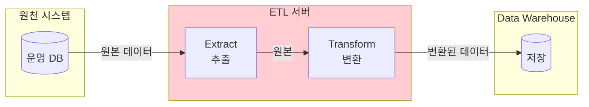

**특징**:

- 변환 로직이 **ETL 서버**에 있음
- Informatica, Talend 같은 전용 도구 사용
- 저장 전에 데이터 품질 보장

### ELT (Extract → Load → Transform)

**현대적 방식**: 데이터를 먼저 저장하고, 저장소 내에서 변환합니다.

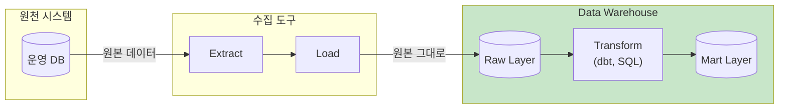

**특징**:

- 변환 로직이 **웨어하우스 내부**에 있음 (SQL 기반)
- dbt, BigQuery, Snowflake 활용
- 원본 데이터 보존 (언제든 재변환 가능)

### 언제 무엇을 선택할까?

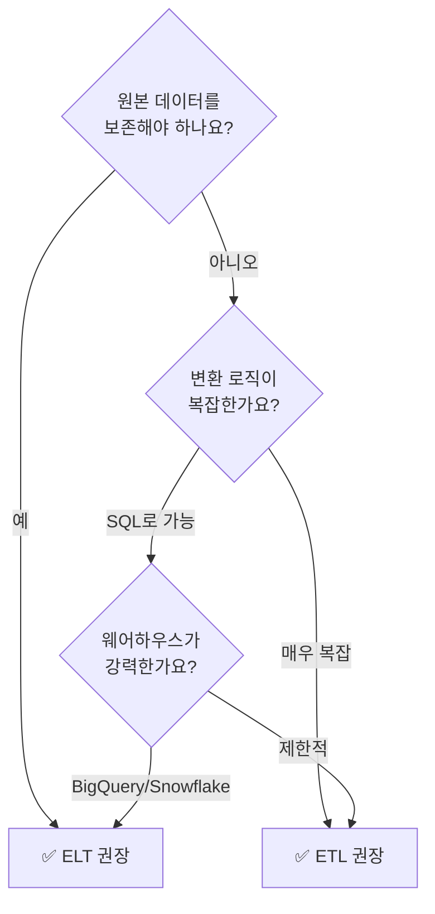

> **현대 트렌드**: 클라우드 웨어하우스(BigQuery, Snowflake)의 컴퓨팅 파워가 강력해지면서 **ELT가 표준**이 되어가고 있습니다.

---

## 배치 vs 스트리밍

데이터 처리 주기에 따라 두 가지 방식이 있습니다.

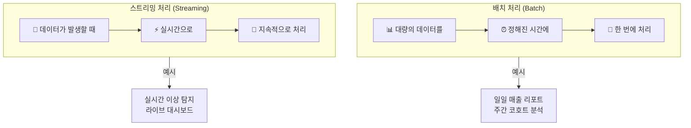

### 비교

| 특성 | 배치 | 스트리밍 |
|------|------|---------|
| **처리 주기** | 분/시간/일 단위 | 밀리초~초 단위 |
| **지연 시간** | 높음 (분~시간) | 낮음 (초 이내) |
| **구현 복잡도** | 상대적으로 단순 | 복잡 (상태 관리, 순서 보장) |
| **리소스 사용** | 피크 타임에 집중 | 지속적으로 사용 |
| **도구** | Spark, Airflow | Kafka, Flink, Spark Streaming |
| **적합한 경우** | 리포팅, ML 학습 | 실시간 알림, 추천 |

### 실제로는 둘 다 필요

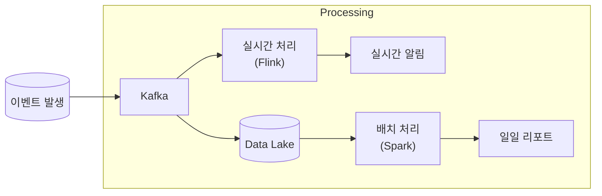

대부분의 시스템은 **배치와 스트리밍을 함께 사용**합니다. 이를 어떻게 조합할지가 바로 다음에 다룰 아키텍처 패턴입니다.

---

## Lambda Architecture vs Kappa Architecture

### Lambda Architecture (람다 아키텍처)

**배치 + 스트리밍 이중 파이프라인**을 운영하는 패턴입니다.

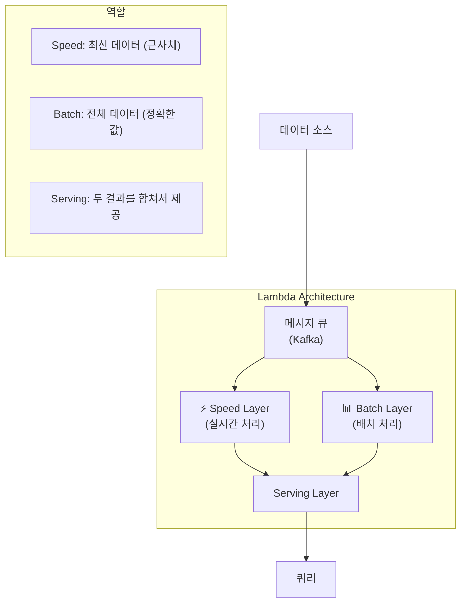

**장점**:

- 실시간성 + 정확성 모두 확보
- 배치가 정확한 결과로 보정

**단점**:

- **동일한 로직을 두 번 구현** (배치 코드 + 스트리밍 코드)
- 복잡한 운영
- 결과 합치는 로직 필요

### Kappa Architecture (카파 아키텍처)

**스트리밍 단일 파이프라인**으로 모든 것을 처리하는 패턴입니다.

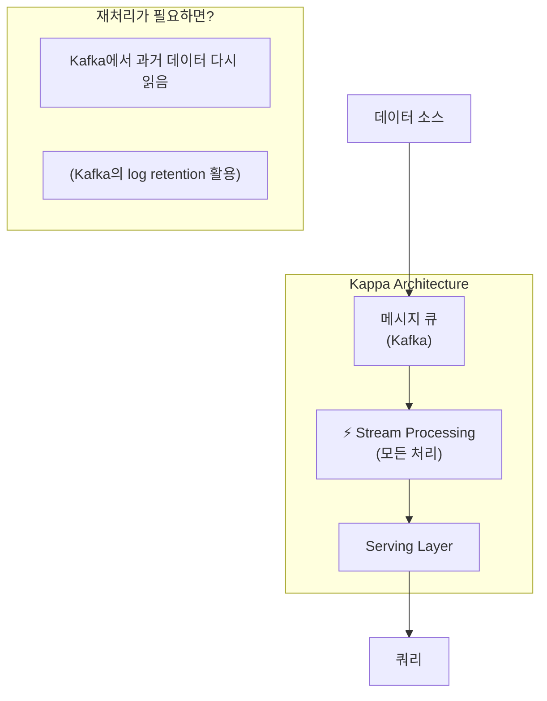

**장점**:

- 단일 코드베이스
- 단순한 아키텍처
- 유지보수 용이

**단점**:

- 모든 것을 스트리밍으로 처리하기 어려울 수 있음
- 과거 데이터 재처리 시 시간 소요

### 현대적 관점에서의 선택

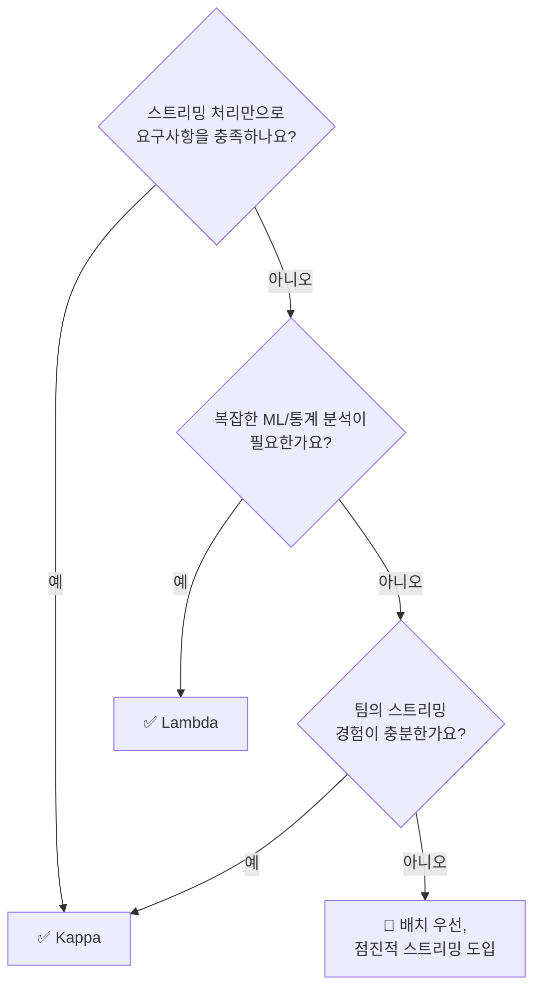

> **현실적 조언**: 처음부터 Lambda를 구축하려 하지 마세요. **배치로 시작**하고, 정말 실시간이 필요한 부분만 스트리밍으로 확장하세요.

---

## Modern Data Stack

최근 몇 년간 데이터 도구 생태계가 급격히 발전했습니다. 이를 **Modern Data Stack**이라 부릅니다.

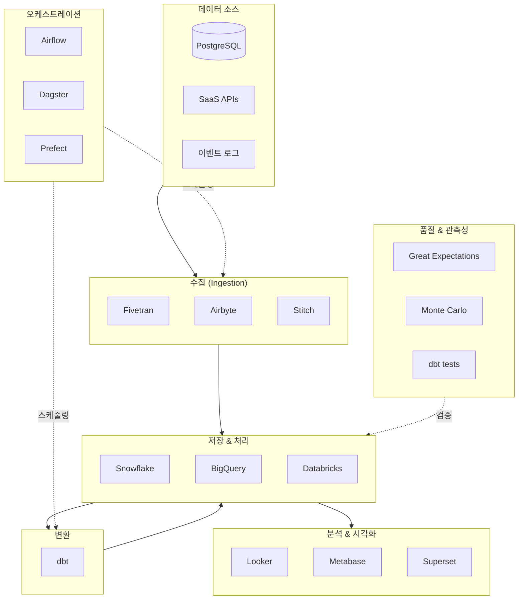

### 핵심 도구들

| 카테고리 | 도구 | 설명 |
|---------|------|------|
| **수집** | Airbyte, Fivetran | SaaS/DB에서 데이터 추출 |
| **저장소** | Snowflake, BigQuery | 클라우드 네이티브 웨어하우스 |
| **변환** | dbt | SQL 기반 변환, 테스트, 문서화 |
| **오케스트레이션** | Airflow, Dagster | 워크플로우 스케줄링 |
| **시각화** | Metabase, Looker | 대시보드, 리포팅 |
| **품질** | Great Expectations | 데이터 테스트 자동화 |

### 왜 "Modern"인가?

1. **클라우드 네이티브**: 직접 인프라 관리 X, 사용량 기반 과금
2. **분리된 컴퓨팅/스토리지**: 저장은 S3, 처리는 필요할 때만
3. **SQL 중심**: 복잡한 코드 대신 SQL로 변환
4. **Git 기반 워크플로우**: dbt는 코드처럼 버전 관리
5. **API 우선**: 모든 도구가 API로 연결

---

## 백엔드 개발자로서 기억할 것

### 1. 전체 파이프라인에서 내 시스템의 위치

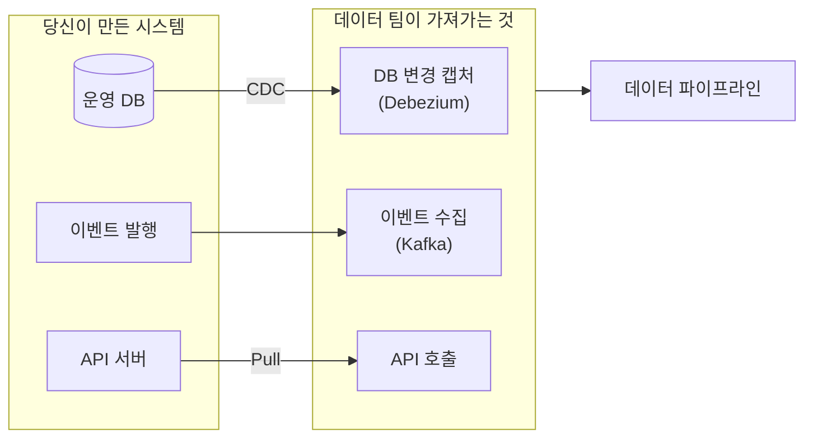

### 2. 데이터 추출을 고려한 설계

**좋은 설계**:

- 이벤트에 **타임스탬프** 포함
- 레코드에 **created_at, updated_at** 컬럼
- **Soft delete** 적용 (deleted_at)
- 변경 이력 추적 가능한 설계

**피해야 할 설계**:

- Hard delete로 데이터 증발
- 상태 변경 시 덮어쓰기
- 타임스탬프 없는 레코드

### 3. 협업 포인트

| 상황 | 백엔드가 할 일 |
|------|--------------|
| CDC 도입 시 | 운영 DB 부하 모니터링 |
| 이벤트 스키마 변경 | 데이터 팀과 사전 협의 |
| API 변경 | 역호환성 유지 또는 버저닝 |
| 장애 발생 | 데이터 파이프라인 영향도 확인 |

---

## 정리

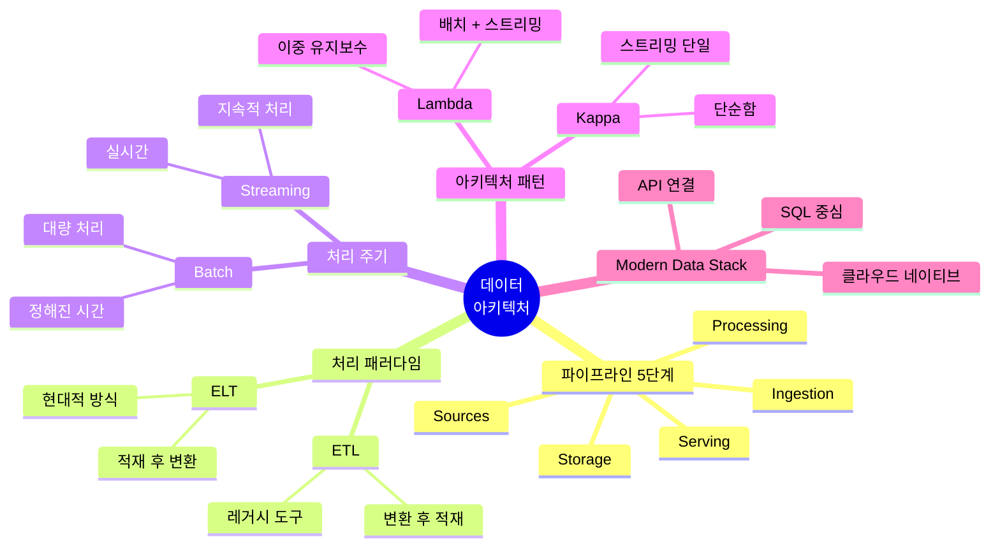

---

## 다음 편 예고

**3편: Spark 핵심 개념**에서는 분산 처리의 핵심을 다룹니다:

- 왜 분산 처리가 필요한가?
- RDD, DataFrame의 개념
- Lazy Evaluation의 의미
- Goroutine/ThreadPoolExecutor와 Spark의 차이

---

## 참고 자료

- Databricks, "The Data Lakehouse"
- Maxime Beauchemin, "Functional Data Engineering" (Medium)
- Martin Kleppmann, "Designing Data-Intensive Applications" - Chapter 10, 11
- [Kappa Architecture](https://www.oreilly.com/radar/questioning-the-lambda-architecture/)
