# 데이터 엔지니어링 시리즈 #3: Spark 핵심 개념 - RDD에서 DataFrame까지

> **대상 독자**: 충분한 경험을 가진 백엔드/풀스택 엔지니어로, Go의 Goroutine이나 Python의 ThreadPoolExecutor에 익숙하지만 Spark는 처음인 분

## 이 편에서 다루는 것

"Spark가 빠르다"는 말은 많이 들어봤을 겁니다. 하지만 **왜 빠른지**, **기존 병렬 처리와 무엇이 다른지** 이해하는 것이 먼저입니다.

---

## 왜 분산 처리가 필요한가?

### 단일 서버의 한계

백엔드 개발에서 성능을 높이려면 어떻게 하나요?

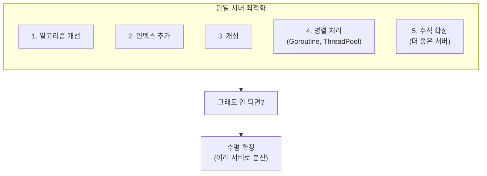

언젠가는 **단일 서버로는 불가능한 순간**이 옵니다:

| 상황 | 예시 |
|------|------|
| **데이터가 메모리에 안 들어감** | 1TB 데이터를 32GB 서버에서 처리 |
| **처리 시간이 너무 김** | 단일 코어로 10억 건 처리에 10시간 |
| **디스크 I/O 병목** | 초당 읽기 한계 도달 |

### 분산 처리의 핵심 아이디어

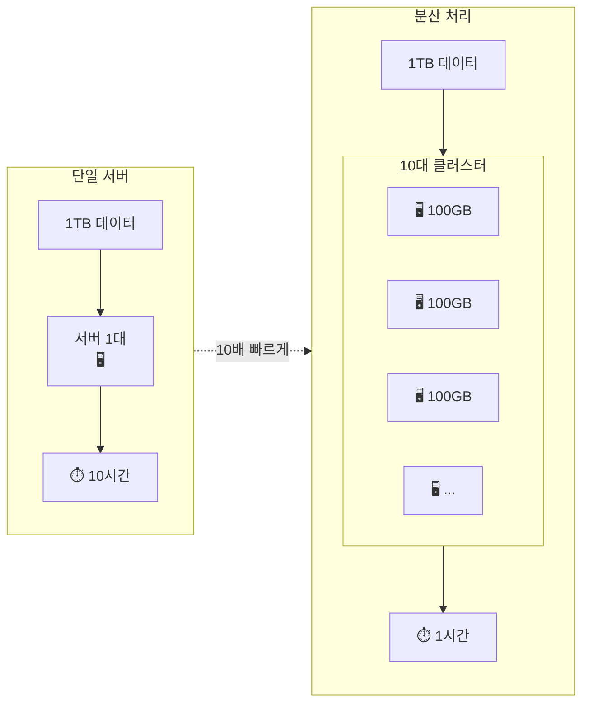

**핵심**: 데이터와 연산을 여러 서버에 **나눠서** 동시에 처리

---

## Goroutine/ThreadPoolExecutor와 Spark의 차이

### 기존 병렬 처리: 단일 서버 내

Go와 Python에서의 병렬 처리는 **단일 서버의 CPU 코어를 활용**합니다.

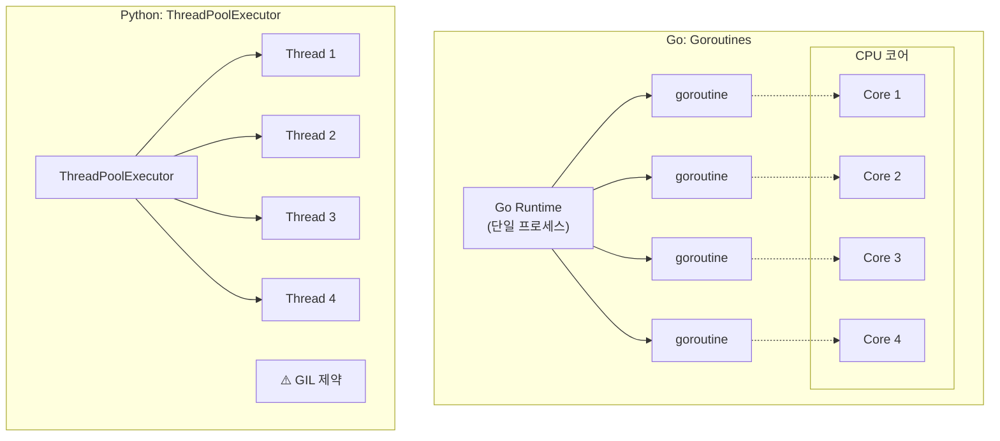

**한계**:

- **메모리 한계**: 서버 RAM 크기를 초과하는 데이터 처리 불가
- **CPU 한계**: 코어 수 이상의 병렬성 불가
- **GIL (Python)**: CPU-bound 작업 시 진정한 병렬성 어려움

### Spark: 여러 서버에 분산

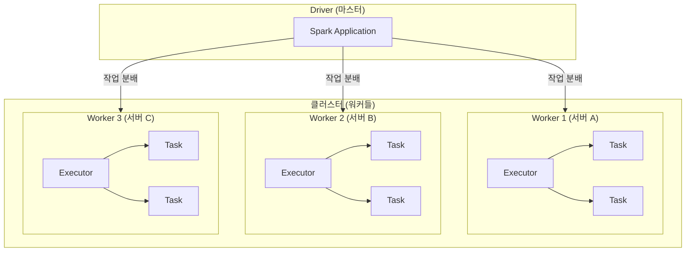

**Spark의 해결책**:

- **메모리 분산**: 각 서버가 데이터 일부만 처리
- **CPU 분산**: 총 CPU = 서버 수 × 서버당 코어
- **장애 복구**: 한 서버가 죽어도 다른 서버가 재처리

### 비교 정리

| 특성 | Goroutine / ThreadPool | Spark |
|------|----------------------|-------|
| **범위** | 단일 서버 | 여러 서버 클러스터 |
| **스케일링** | 수직 (더 좋은 서버) | 수평 (서버 추가) |
| **메모리** | 서버 RAM 한계 | 클러스터 합산 RAM |
| **장애 처리** | 프로세스 재시작 | 다른 노드가 재처리 |
| **데이터 공유** | 메모리 직접 공유 | 네트워크 통신 |
| **적합한 데이터** | GB 이하 | TB ~ PB |

---

## MapReduce 패러다임

Spark를 이해하려면 먼저 **MapReduce**를 알아야 합니다.

### 클래식 예제: Word Count

"Hello World Hello" 라는 텍스트에서 단어별 개수를 세는 문제입니다.

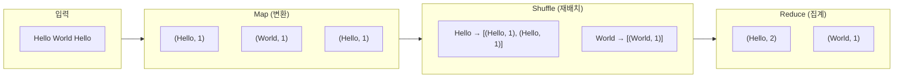

### 분산 환경에서의 MapReduce

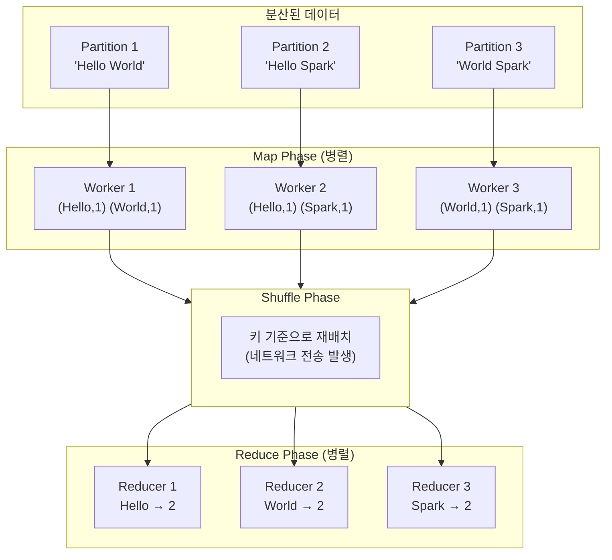

**핵심 인사이트**:

- **Map**: 각 서버가 자기 파티션만 처리 (병렬, 빠름)
- **Shuffle**: 키 기준으로 데이터 재배치 (네트워크 통신, 느림 ⚠️)
- **Reduce**: 같은 키끼리 모여서 집계 (병렬)

---

## RDD (Resilient Distributed Dataset)

Spark의 핵심 추상화입니다.

### RDD란?

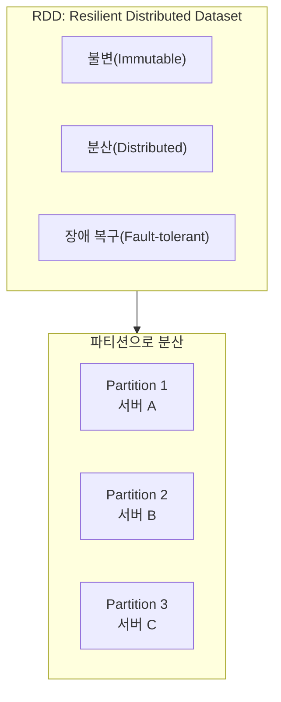

**핵심 특성**:

| 특성 | 의미 | 왜 중요한가? |
|------|------|------------|
| **Resilient** | 장애 복구 가능 | 노드가 죽어도 데이터 복구 |
| **Distributed** | 클러스터에 분산 | 여러 서버에서 병렬 처리 |
| **Immutable** | 변경 불가 | 연산 결과는 새 RDD 생성 |

### Transformations vs Actions

RDD 연산은 두 종류로 나뉩니다.

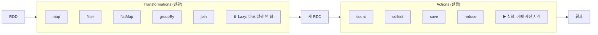

### Lazy Evaluation의 힘

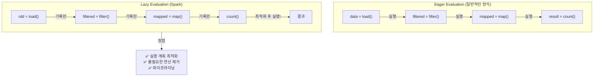

**실제 예시**:

```python
# Spark는 이 시점에 아무것도 실행하지 않음
rdd = spark.read.text("huge_file.txt")  # 기록만
filtered = rdd.filter(lambda x: "error" in x)  # 기록만
mapped = filtered.map(lambda x: (x, 1))  # 기록만

# 이 시점에 최적화된 계획으로 한 번에 실행
count = mapped.count()  # 실행!
```

---

## DataFrame: RDD의 진화

### RDD의 한계

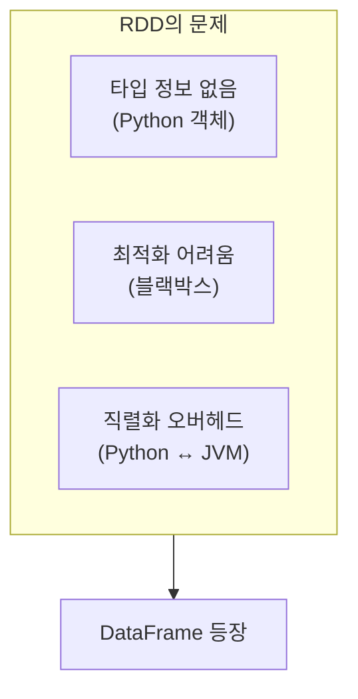

### DataFrame이란?

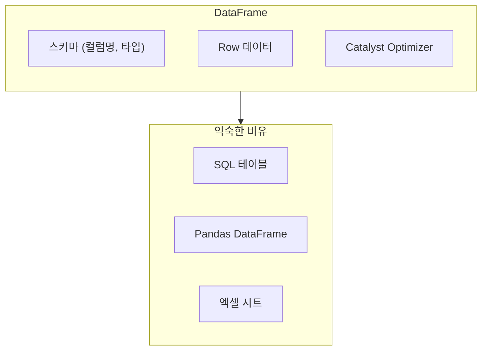

**DataFrame vs RDD**:

| 특성 | RDD | DataFrame |
|------|-----|-----------|
| **스키마** | 없음 (Python 객체) | 있음 (컬럼명, 타입) |
| **최적화** | 수동 (개발자가) | 자동 (Catalyst) |
| **API** | map, filter (함수형) | select, where (SQL형) |
| **성능** | 느림 (직렬화) | 빠름 (최적화) |
| **언어** | 언어별 차이 큼 | 언어별 차이 적음 |

### 왜 DataFrame이 더 빠른가?

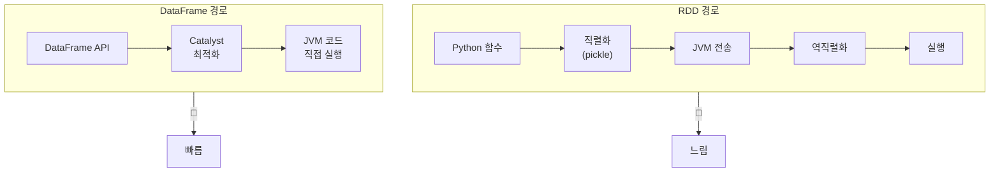

---

## Spark Connect (4.0+)

Spark 4.0의 새로운 아키텍처입니다.

### 기존 방식 vs Spark Connect

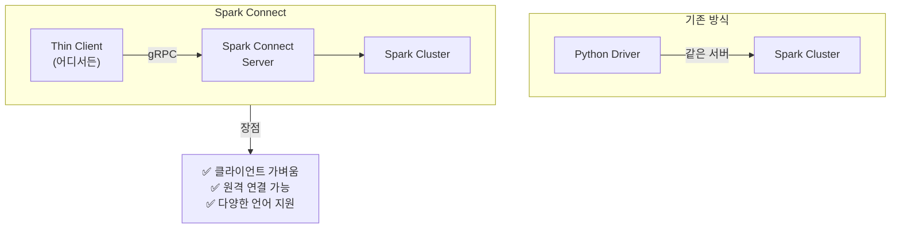

```python
# Spark Connect 사용 예
from pyspark.sql import SparkSession

# 원격 클러스터에 연결
spark = SparkSession.builder \
    .remote("sc://spark-server:15002") \
    .getOrCreate()

# 나머지는 동일하게 사용
df = spark.range(1000000)
result = df.groupBy((df.id % 10).alias("group")).count()
result.show()
```

---

## 실전 코드: Word Count 비교

### Python (ThreadPoolExecutor)

```python
from concurrent.futures import ThreadPoolExecutor
from collections import Counter

def count_words_in_chunk(text_chunk):
    words = text_chunk.lower().split()
    return Counter(words)

def word_count_threaded(text, num_workers=4):
    # 텍스트를 청크로 분할
    chunks = [text[i::num_workers] for i in range(num_workers)]
    
    with ThreadPoolExecutor(max_workers=num_workers) as executor:
        results = list(executor.map(count_words_in_chunk, chunks))
    
    # 결과 합치기
    total = Counter()
    for result in results:
        total.update(result)
    
    return total

# 한계: 메모리에 전체 텍스트가 올라와야 함
```

### Go (Goroutines)

```go
func wordCount(texts []string) map[string]int {
    results := make(chan map[string]int, len(texts))
    
    // 각 청크를 goroutine으로 처리
    for _, text := range texts {
        go func(t string) {
            counts := make(map[string]int)
            for _, word := range strings.Fields(strings.ToLower(t)) {
                counts[word]++
            }
            results <- counts
        }(text)
    }
    
    // 결과 합치기
    total := make(map[string]int)
    for i := 0; i < len(texts); i++ {
        for word, count := range <-results {
            total[word] += count
        }
    }
    
    return total
}

// 한계: 단일 서버 메모리 한계
```

### PySpark (분산 처리)

```python
from pyspark.sql import SparkSession
from pyspark.sql.functions import explode, split, lower, col

spark = SparkSession.builder.appName("WordCount").getOrCreate()

# TB 단위 파일도 처리 가능
df = spark.read.text("hdfs://path/to/huge_files/*.txt")

word_counts = df \
    .select(explode(split(lower(col("value")), "\\s+")).alias("word")) \
    .groupBy("word") \
    .count() \
    .orderBy(col("count").desc())

word_counts.show(20)

# 장점: 자동으로 클러스터 전체에 분산 처리
```

---

## 정리

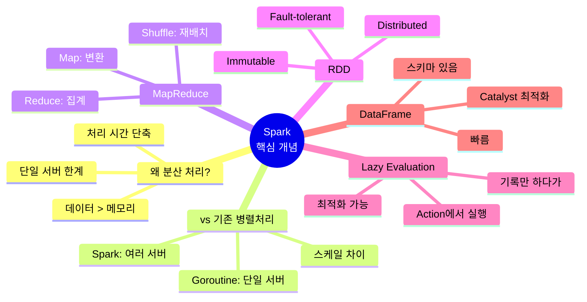

---

## 다음 편 예고

**4편: Spark 내부 동작 원리**에서는 더 깊이 들어갑니다:

- Job → Stage → Task 계층
- Shuffle이 느린 이유
- 파티셔닝 전략
- 메모리 관리와 Spill
- Spark UI 읽는 법

---

## 참고 자료

- [Apache Spark Documentation](https://spark.apache.org/docs/latest/)
- [Spark: The Definitive Guide](https://www.oreilly.com/library/view/spark-the-definitive/9781491912201/) (O'Reilly)
- [Spark Connect Overview](https://spark.apache.org/docs/latest/spark-connect-overview.html)
- [Learning Spark, 2nd Edition](https://www.oreilly.com/library/view/learning-spark-2nd/9781492050032/)
