# 데이터 엔지니어링 시리즈 #4: Spark 내부 동작 원리 - Job, Stage, Task

> **대상 독자**: 충분한 경험을 가진 백엔드/풀스택 엔지니어로, Spark의 기본 개념을 알고 성능 튜닝에 관심 있는 분

## 이 편에서 다루는 것

Spark 코드를 작성할 때 **왜 어떤 코드는 느리고 어떤 코드는 빠른지** 이해하려면, 내부 실행 모델을 알아야 합니다.

---

## 실행 계층 구조: Application → Job → Stage → Task

### 전체 구조

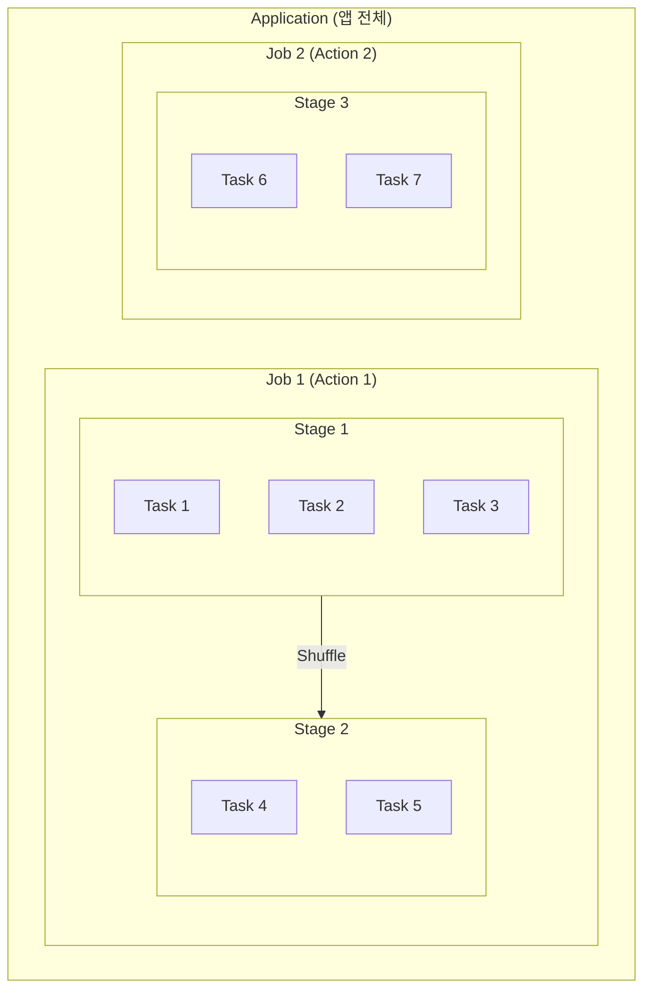

### 각 계층의 역할

| 계층 | 무엇 | 언제 생성 | 병렬성 |
|------|------|---------|--------|
| **Application** | 전체 Spark 프로그램 | spark-submit 시 | 1개 |
| **Job** | 하나의 Action 실행 단위 | count(), save() 호출 | 순차 |
| **Stage** | Shuffle 기준 분리 | 자동 분리 | 순차 |
| **Task** | 파티션당 실행 단위 | 파티션 수만큼 | **병렬** |

### 코드 예시와 실행 흐름

```python
# 이 코드가 어떻게 실행될까?
df = spark.read.parquet("data/")  # Transformation
filtered = df.filter(df.age > 20)  # Transformation
grouped = filtered.groupBy("city").count()  # Transformation
grouped.show()  # Action → Job 생성!
```

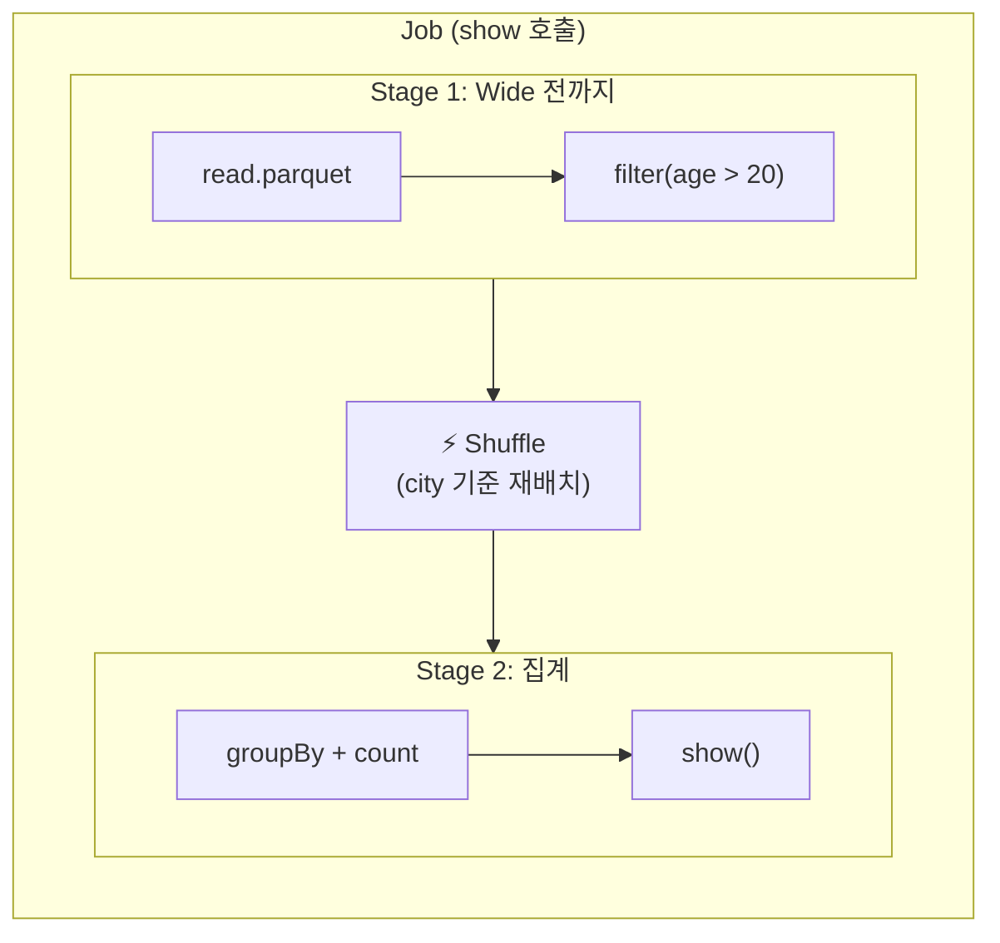

---

## Narrow vs Wide Transformations

### 이것이 성능의 핵심

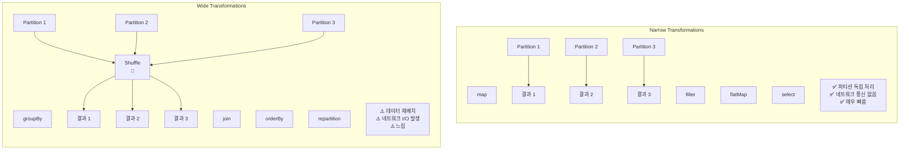

### Shuffle이 비싼 이유

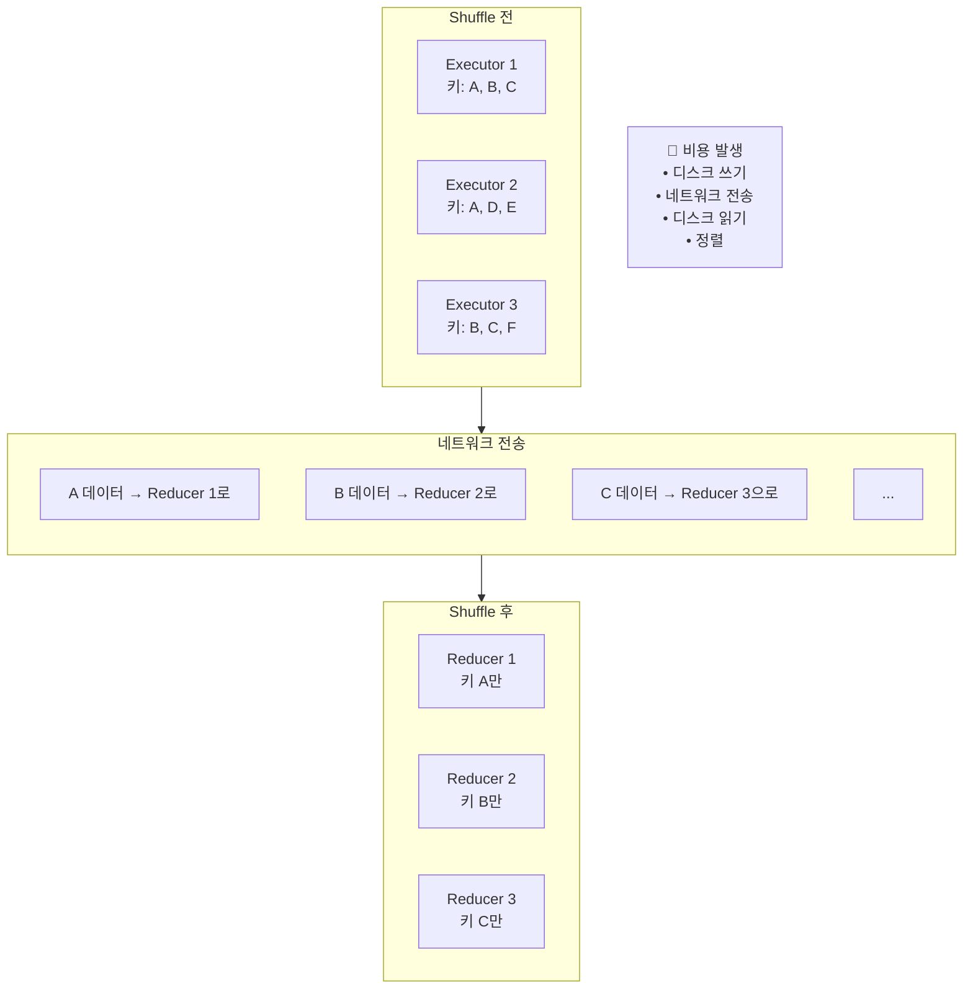

**Shuffle이 발생하면**:

1. 각 Executor가 결과를 **디스크에 저장**
2. 키 기준으로 **네트워크로 전송**
3. 받는 쪽에서 **디스크에 저장**
4. 키 기준 **정렬**
5. 메모리로 **읽어서 처리**

---

## 파티셔닝 전략

### 파티션이란?

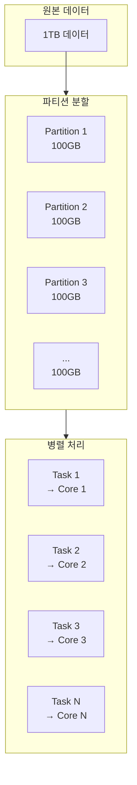

### 파티션 수와 병렬성

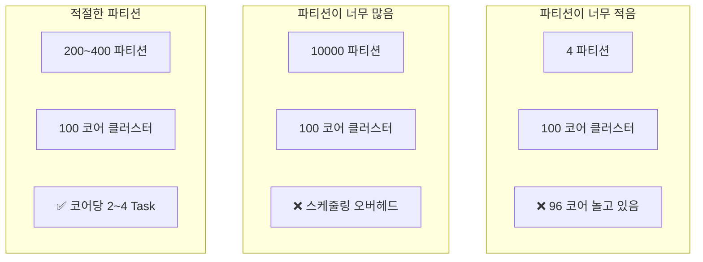

**경험칙**:

- 파티션 수 = 코어 수 × 2~4
- 파티션당 크기 = 100MB ~ 1GB

### 데이터 스큐(Skew) 문제

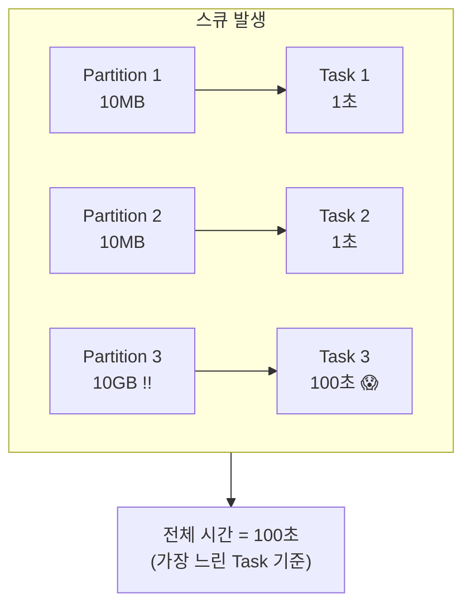

**해결책**:

1. **Salting**: 핫 키에 랜덤 접두사 추가
2. **Broadcast Join**: 작은 테이블은 전체 복사
3. **Adaptive Query Execution (AQE)**: Spark 3.0+ 자동 최적화

---

## 메모리 관리

### Executor 메모리 구조

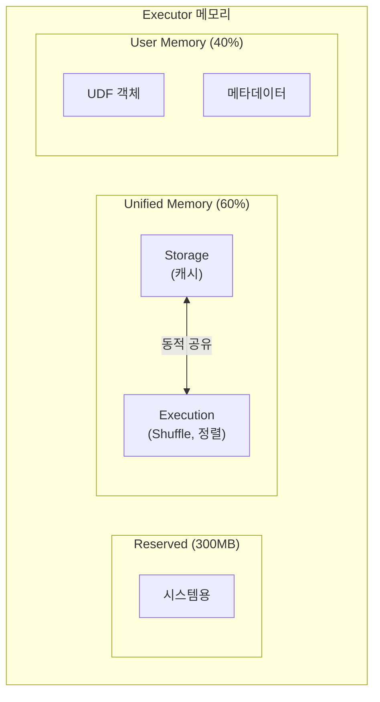

### 메모리 부족 시: Spill to Disk

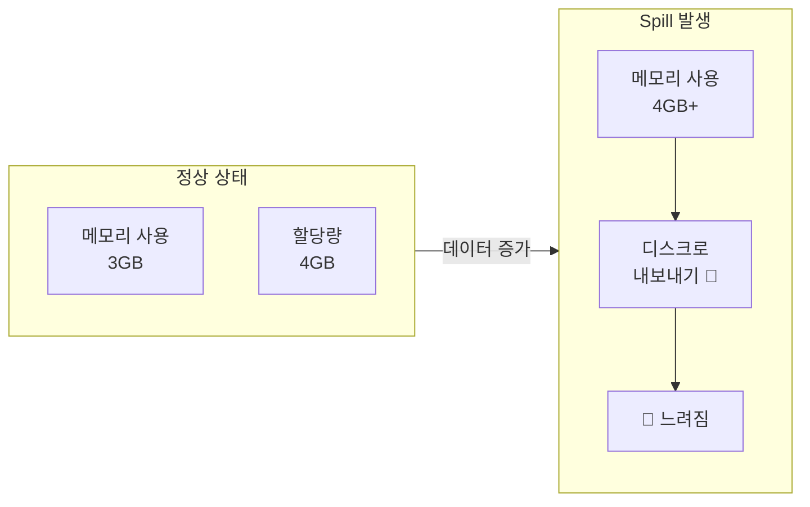

**Spill 감지 방법**: Spark UI에서 "Spill (Memory)" / "Spill (Disk)" 확인

---

## Spark UI 읽는 법

### 핵심 지표들

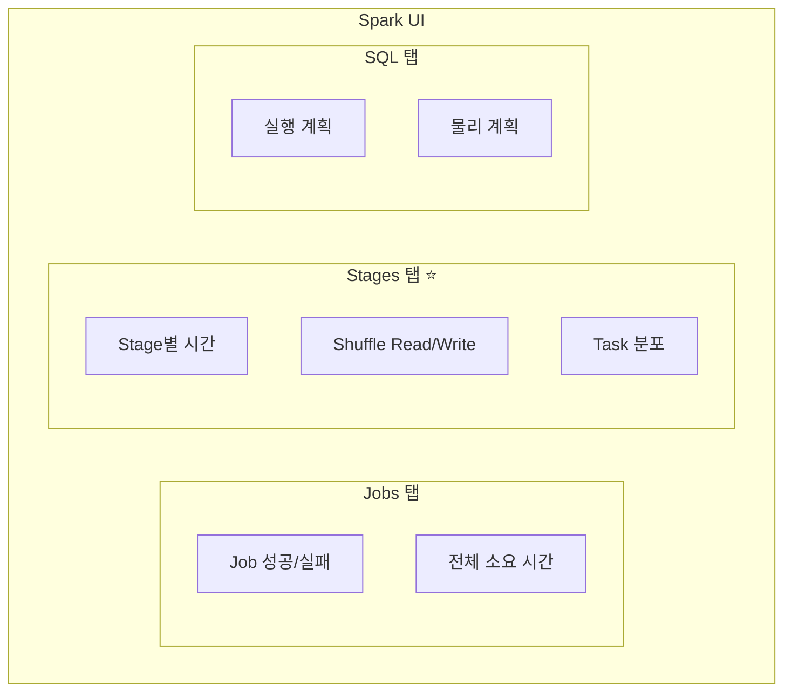

### Stages 탭 해석

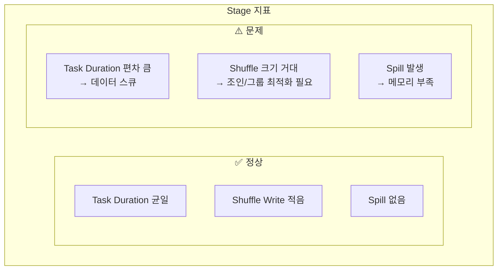

### 실전 디버깅 플로우

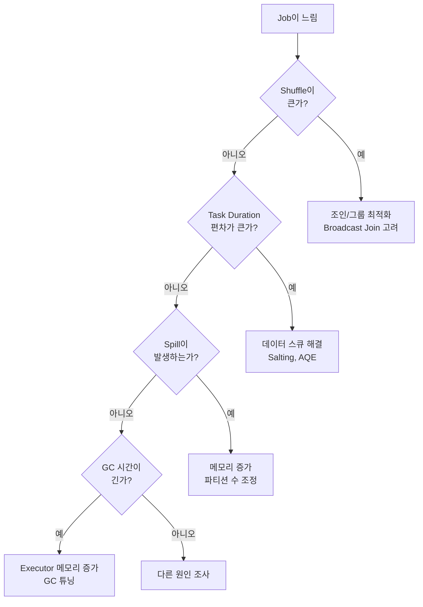

---

## 실전 최적화 체크리스트

### 코드 레벨

| 항목 | 좋은 예 | 나쁜 예 |
|------|--------|--------|
| **조인** | Broadcast Join (작은 테이블) | 양쪽 다 큰 Shuffle Join |
| **필터** | 조인 전에 filter | 조인 후에 filter |
| **컬럼 선택** | 필요한 컬럼만 select | SELECT * |
| **UDF** | Built-in 함수 사용 | Python UDF 남용 |
| **collect** | 집계 후 collect | 큰 데이터 collect |

### 설정 레벨

```python
# 권장 설정
spark.conf.set("spark.sql.adaptive.enabled", "true")  # AQE
spark.conf.set("spark.sql.adaptive.coalescePartitions.enabled", "true")
spark.conf.set("spark.sql.adaptive.skewJoin.enabled", "true")
spark.conf.set("spark.sql.shuffle.partitions", "200")  # 기본 200
```

---

## 정리

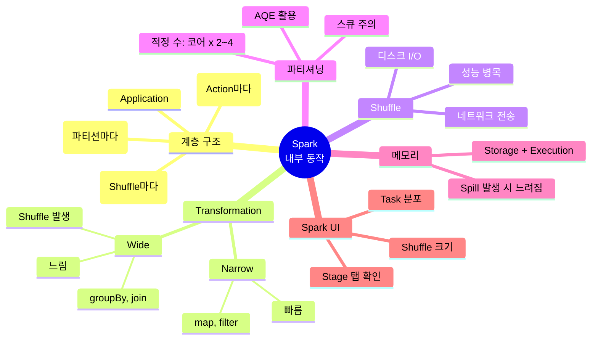

---

## 다음 편 예고

**5편: PySpark 실전**에서는 실무 패턴을 다룹니다:

- 자주 쓰는 DataFrame 연산
- UDF vs Built-in Functions
- 조인 최적화 기법
- 캐싱과 체크포인팅
- 안티패턴 피하기

---

## 참고 자료

- [Spark Web UI](https://spark.apache.org/docs/latest/web-ui.html)
- [Tuning Spark](https://spark.apache.org/docs/latest/tuning.html)
- [Adaptive Query Execution](https://spark.apache.org/docs/latest/sql-performance-tuning.html#adaptive-query-execution)
- Jacek Laskowski, "The Internals of Apache Spark"
