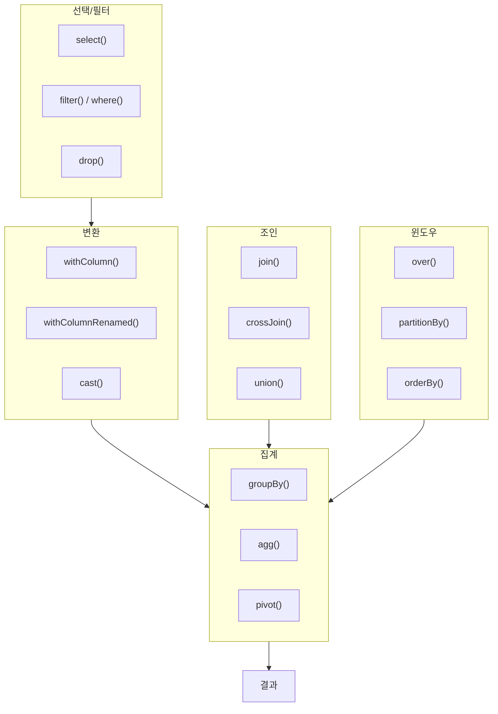
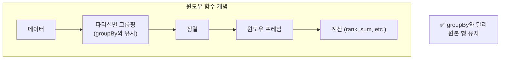
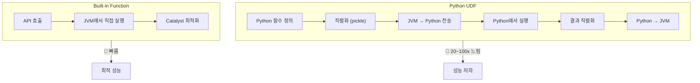
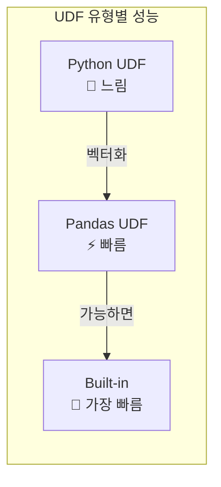
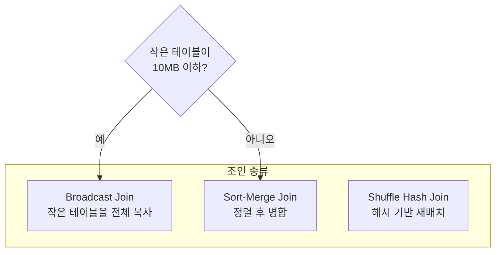
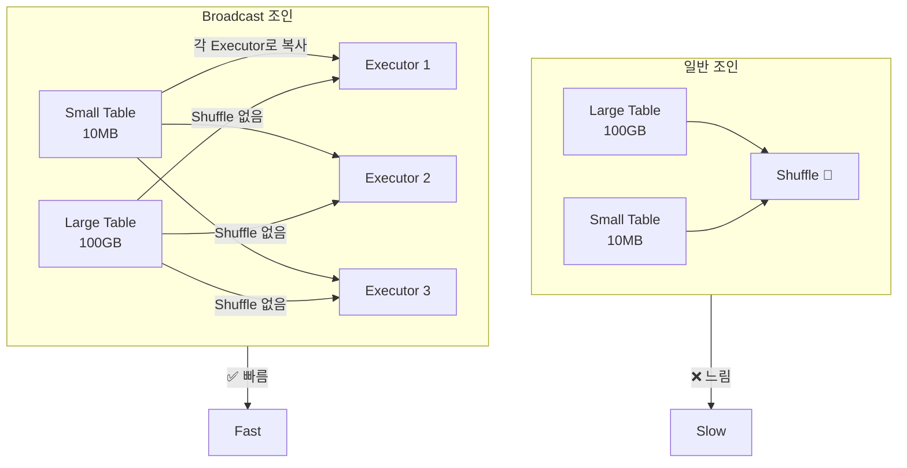
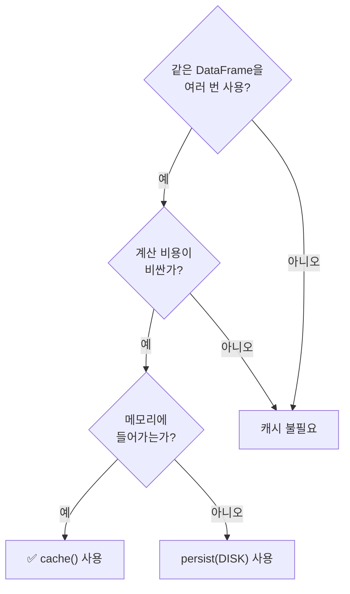
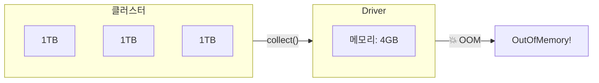
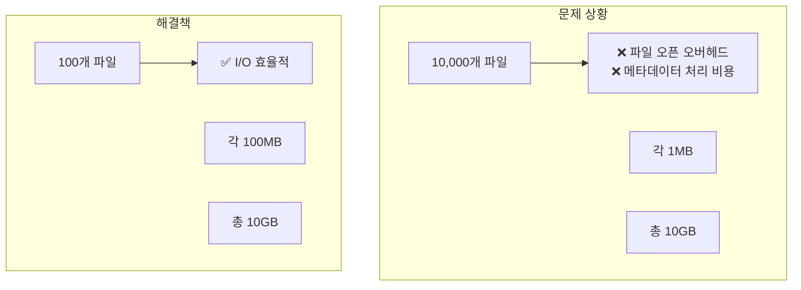
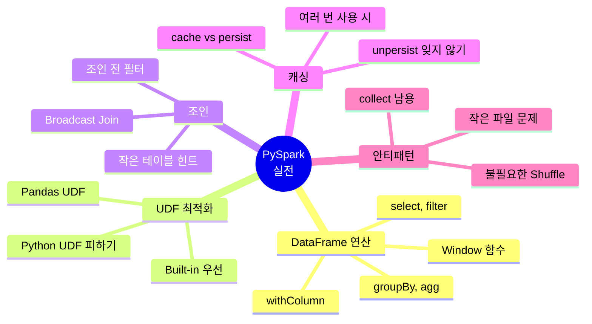

# 데이터 엔지니어링 시리즈 #5: PySpark 실전 - 데이터 처리 패턴과 최적화

> **대상 독자**: 충분한 경험을 가진 백엔드/풀스택 엔지니어로, Spark 개념을 익히고 실전 코드를 작성하려는 분

## 이 편에서 다루는 것

4편에서 Spark 내부를 이해했다면, 이제 **실제로 코드를 어떻게 작성해야 하는지** 패턴과 최적화 기법을 배웁니다.

---

## 자주 사용하는 DataFrame 연산

### 기본 연산 맵



### 선택과 필터링

```python
from pyspark.sql import functions as F

# 컬럼 선택 - 필요한 것만!
df.select("user_id", "name", "email")

# 여러 방식의 컬럼 참조
df.select(
    F.col("user_id"),
    df.name,
    df["email"]
)

# 필터링
df.filter(F.col("age") > 20)
df.filter((F.col("age") > 20) & (F.col("city") == "Seoul"))

# SQL 표현식도 가능
df.filter("age > 20 AND city = 'Seoul'")
```

### 컬럼 변환

```python
# 새 컬럼 추가
df.withColumn("age_group", 
    F.when(F.col("age") < 20, "teen")
     .when(F.col("age") < 30, "20s")
     .when(F.col("age") < 40, "30s")
     .otherwise("40+")
)

# 타입 변환
df.withColumn("amount", F.col("amount").cast("double"))

# 문자열 처리
df.withColumn("email_domain", 
    F.split(F.col("email"), "@").getItem(1)
)

# 날짜 처리
df.withColumn("year", F.year("created_at"))
df.withColumn("month", F.month("created_at"))
df.withColumn("date_str", F.date_format("created_at", "yyyy-MM-dd"))
```

### 집계 연산

```python
# 기본 집계
df.groupBy("city").agg(
    F.count("*").alias("user_count"),
    F.avg("age").alias("avg_age"),
    F.sum("purchase_amount").alias("total_purchase"),
    F.max("last_login").alias("last_activity")
)

# 여러 그룹 기준
df.groupBy("city", "gender").count()

# Pivot (행→열)
df.groupBy("year").pivot("quarter", ["Q1", "Q2", "Q3", "Q4"]).sum("revenue")
```

### 윈도우 함수



```python
from pyspark.sql.window import Window

# 윈도우 정의
window_spec = Window.partitionBy("user_id").orderBy("timestamp")

# 순위 (파티션 내 순서)
df.withColumn("row_num", F.row_number().over(window_spec))
df.withColumn("rank", F.rank().over(window_spec))

# 이전/다음 값
df.withColumn("prev_value", F.lag("value", 1).over(window_spec))
df.withColumn("next_value", F.lead("value", 1).over(window_spec))

# 누적 합계
df.withColumn("cumsum", F.sum("amount").over(window_spec))

# 파티션 전체 기준 (정렬 없이)
unbounded = Window.partitionBy("user_id")
df.withColumn("user_total", F.sum("amount").over(unbounded))
```

---

## UDF vs Built-in Functions

### 왜 Built-in을 써야 하는가?



### 비교 예시

```python
# ❌ 나쁜 예: UDF 사용
from pyspark.sql.functions import udf
from pyspark.sql.types import StringType

@udf(returnType=StringType())
def extract_domain(email):
    if email:
        return email.split("@")[-1]
    return None

df.withColumn("domain", extract_domain(F.col("email")))

# ✅ 좋은 예: Built-in 함수 사용
df.withColumn("domain", 
    F.split(F.col("email"), "@").getItem(1)
)
```

### 정말 UDF가 필요한 경우: Pandas UDF



```python
import pandas as pd
from pyspark.sql.functions import pandas_udf

# Pandas UDF - Series → Series (벡터화)
@pandas_udf("double")
def calculate_zscore(values: pd.Series) -> pd.Series:
    return (values - values.mean()) / values.std()

df.withColumn("zscore", calculate_zscore(F.col("value")))

# Pandas UDF - GroupBy Aggregate
@pandas_udf("double")
def median_value(v: pd.Series) -> float:
    return v.median()

df.groupBy("category").agg(median_value(F.col("price")))
```

---

## 조인 최적화

### 조인 종류와 선택



### Broadcast Join (필수!)



```python
from pyspark.sql.functions import broadcast

# 작은 테이블에 broadcast 힌트
result = large_df.join(
    broadcast(small_df), 
    "join_key"
)

# 또는 설정으로 자동 적용
spark.conf.set("spark.sql.autoBroadcastJoinThreshold", 10 * 1024 * 1024)  # 10MB
```

### 조인 순서 최적화

```python
# ❌ 나쁜 예: 필터 후조인이 아님
result = df1.join(df2, "key").filter(df1.status == "active")

# ✅ 좋은 예: 조인 전에 필터
df1_filtered = df1.filter(df1.status == "active")
result = df1_filtered.join(df2, "key")
```

---

## 캐싱과 체크포인팅

### 언제 캐시하는가?



```python
# 기본 캐시 (메모리)
expensive_df = df.groupBy("category").agg(...)
expensive_df.cache()

# 첫 번째 Action에서 캐시됨
expensive_df.count()  

# 이후 재사용 시 캐시에서 읽음
expensive_df.filter(...).show()
expensive_df.select(...).write.parquet(...)

# 캐시 해제
expensive_df.unpersist()
```

### cache() vs persist()

```python
from pyspark import StorageLevel

# cache() = persist(MEMORY_AND_DISK)
df.cache()

# 명시적 스토리지 레벨
df.persist(StorageLevel.MEMORY_ONLY)
df.persist(StorageLevel.MEMORY_AND_DISK)
df.persist(StorageLevel.DISK_ONLY)
df.persist(StorageLevel.MEMORY_AND_DISK_SER)  # 직렬화하여 저장
```

### 체크포인팅

```python
# checkpoint는 계보(lineage)를 끊음
spark.sparkContext.setCheckpointDir("hdfs://path/checkpoints")

# 복잡한 변환 후
result = complex_transformations(df)
result.checkpoint()

# 이후 장애 시 체크포인트에서 복구
```

---

## 안티패턴 피하기

### ❌ collect() 남용



```python
# ❌ 나쁜 예
all_data = df.collect()  # 전체를 Driver로!
for row in all_data:
    process(row)

# ✅ 좋은 예: 집계 후 collect
summary = df.groupBy("category").count().collect()

# ✅ 좋은 예: limit 사용
sample = df.limit(1000).collect()

# ✅ 좋은 예: Iterator 사용
for row in df.toLocalIterator():
    process(row)  # 한 번에 하나씩
```

### ❌ 작은 파일 문제



```python
# ❌ 나쁜 예: 파티션마다 파일 생성
df.write.parquet("output/")  # 파티션 수만큼 파일

# ✅ 좋은 예: coalesce로 파일 수 조절
df.coalesce(10).write.parquet("output/")  # 10개 파일

# ✅ 좋은 예: 적정 크기로 분할
df.repartition(100).write.parquet("output/")  # 100개 파일
```

### ❌ 불필요한 Shuffle

```python
# ❌ 나쁜 예: groupBy 두 번
result = df.groupBy("a").count() \
           .groupBy("a").agg(F.sum("count"))

# ✅ 좋은 예: 한 번에 처리
result = df.groupBy("a").agg(F.count("*").alias("count"))
```

---

## 실전 예제: 로그 분석 파이프라인

```python
from pyspark.sql import SparkSession
from pyspark.sql import functions as F
from pyspark.sql.window import Window

spark = SparkSession.builder \
    .appName("LogAnalysis") \
    .config("spark.sql.adaptive.enabled", "true") \
    .getOrCreate()

# 1. 데이터 로드 (필요한 컬럼만)
logs = spark.read.json("logs/*.json").select(
    "timestamp", "user_id", "event_type", "page", "duration"
)

# 2. 데이터 정제
cleaned = logs \
    .filter(F.col("user_id").isNotNull()) \
    .withColumn("event_date", F.to_date("timestamp")) \
    .withColumn("event_hour", F.hour("timestamp"))

# 3. 여러 번 사용할 것이므로 캐시
cleaned.cache()

# 4. 일별 집계
daily_stats = cleaned.groupBy("event_date").agg(
    F.countDistinct("user_id").alias("dau"),
    F.count("*").alias("total_events"),
    F.avg("duration").alias("avg_duration")
)

# 5. 시간대별 패턴
hourly_pattern = cleaned.groupBy("event_hour").agg(
    F.count("*").alias("events")
).orderBy("event_hour")

# 6. 유저별 세션 분석 (윈도우 함수)
user_window = Window.partitionBy("user_id").orderBy("timestamp")

sessions = cleaned \
    .withColumn("prev_timestamp", F.lag("timestamp").over(user_window)) \
    .withColumn("time_gap", 
        F.unix_timestamp("timestamp") - F.unix_timestamp("prev_timestamp")) \
    .withColumn("new_session", 
        F.when(F.col("time_gap") > 1800, 1).otherwise(0)) \
    .withColumn("session_id", 
        F.sum("new_session").over(user_window))

# 7. 저장
daily_stats.write.mode("overwrite").parquet("output/daily_stats")
hourly_pattern.write.mode("overwrite").parquet("output/hourly_pattern")

# 8. 캐시 해제
cleaned.unpersist()
```

---

## 정리



---

## 다음 편 예고

**6편: Airflow 핵심 개념**에서는 워크플로우 오케스트레이션을 다룹니다:

- 왜 cron으로는 부족한가?
- DAG, Operator, Task 이해
- TaskFlow API (Airflow 2.0+)
- 스케줄링과 Backfill

---

## 참고 자료

- [PySpark API Reference](https://spark.apache.org/docs/latest/api/python/)
- [Spark SQL Built-in Functions](https://spark.apache.org/docs/latest/api/sql/)
- Databricks, "PySpark Best Practices"
- [Window Functions Guide](https://spark.apache.org/docs/latest/sql-ref-syntax-qry-select-window.html)
