# 데이터 엔지니어링 시리즈 #6: Airflow 핵심 개념 - DAG, Operator, Task

> **대상 독자**: 충분한 가진 백엔드/풀스택 엔지니어로, CI/CD 파이프라인이나 cron job에 익숙하지만 Airflow는 처음인 분

## 이 편에서 다루는 것

GitHub Actions나 cron으로 배치 작업을 돌려본 경험이 있다면, **왜 데이터 팀은 Airflow를 쓰는지** 궁금했을 겁니다. 그 이유와 핵심 개념을 배웁니다.

---

## 왜 cron job으로는 부족한가?

### cron의 한계

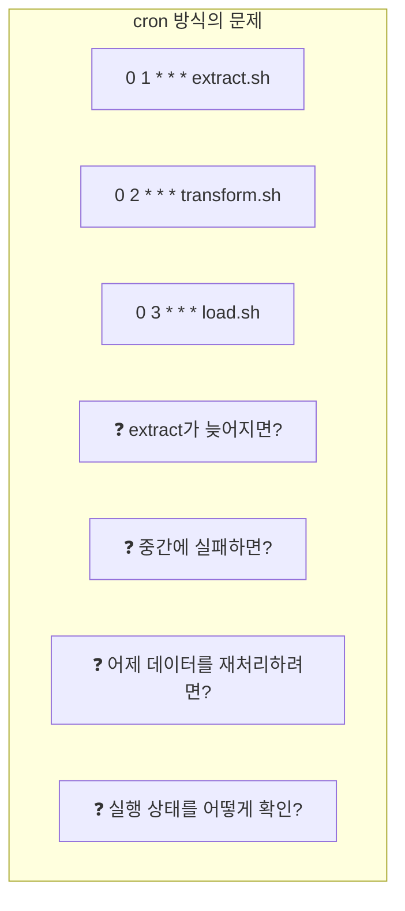

| 문제 | cron | Airflow |
|------|------|---------|
| **의존성 관리** | 시간으로만 (불확실) | 명시적 의존성 ✅ |
| **실패 처리** | 수동 확인/재실행 | 자동 재시도 ✅ |
| **백필** | 스크립트 수동 수정 | 날짜 지정 재실행 ✅ |
| **모니터링** | 로그 파일 뒤지기 | 웹 UI ✅ |
| **알림** | 직접 구현 | Slack/Email 연동 ✅ |

### 실제 시나리오

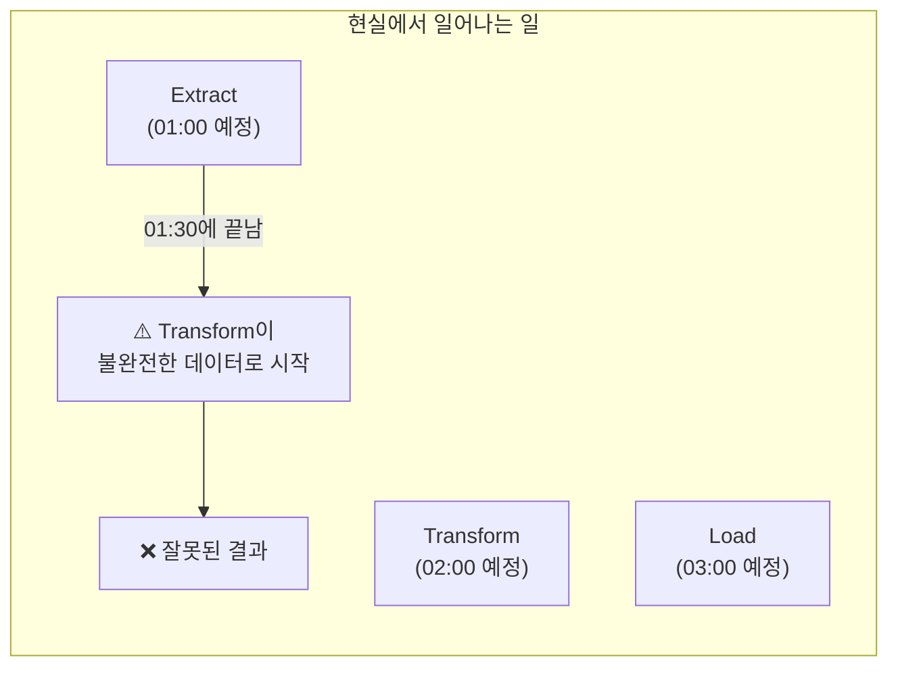

**Airflow의 해결책**: Task 간 **의존성**을 정의하여 이전 Task가 완료되어야 다음이 시작

---

## Airflow 아키텍처

### 구성 요소

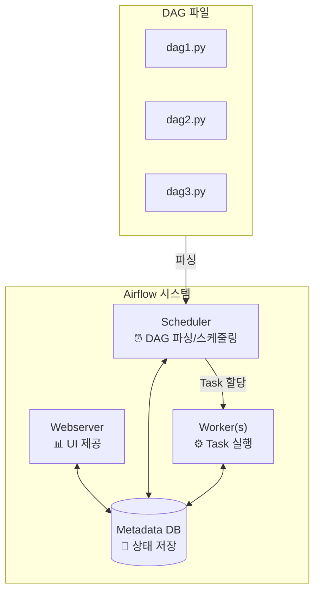

### Executor 종류

| Executor | 특징 | 적합한 환경 |
|----------|------|------------|
| **LocalExecutor** | 단일 머신, 멀티 프로세스 | 개발, 소규모 |
| **CeleryExecutor** | 분산 워커 (Redis/RabbitMQ) | 중규모 프로덕션 |
| **KubernetesExecutor** | 각 Task를 Pod로 | 대규모, 클라우드 |

---

## DAG (Directed Acyclic Graph)

### DAG란?

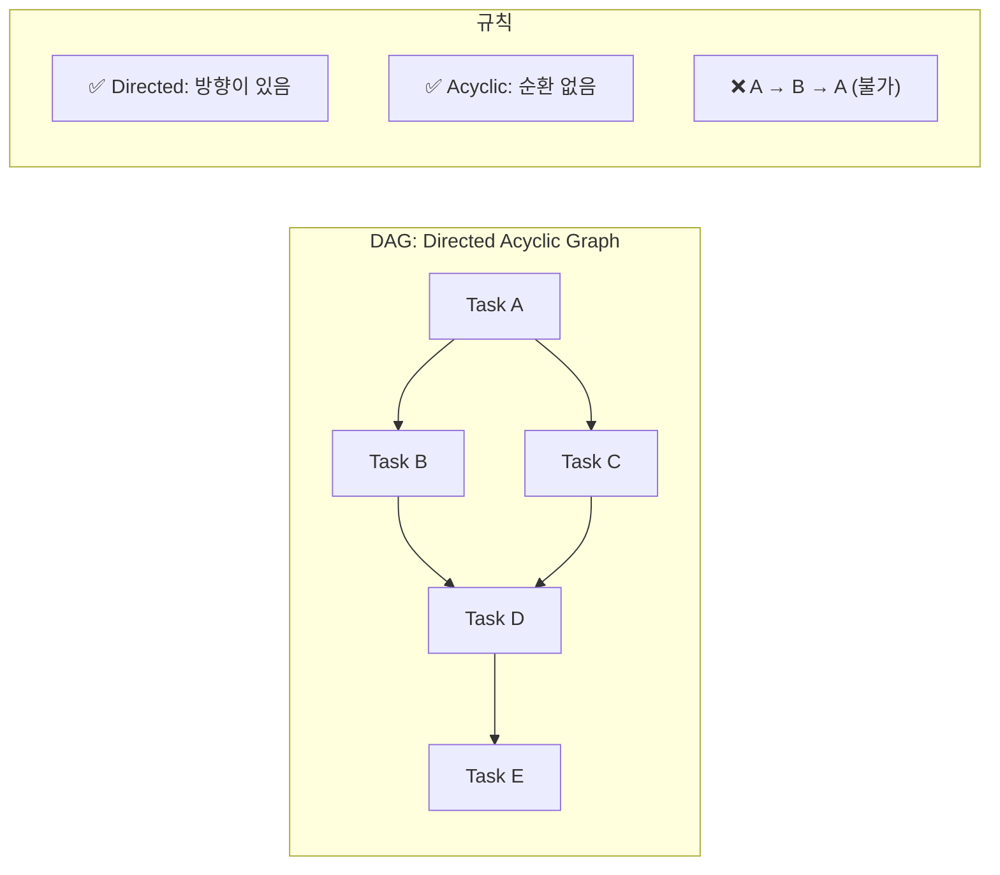

**왜 그래프인가?**

- 순차 실행만 있는 게 아님
- 병렬 실행 가능 (B와 C 동시 실행)
- 의존성 명확히 표현

### DAG 정의 예시

```python
from airflow import DAG
from datetime import datetime

# DAG 정의
dag = DAG(
    dag_id="my_etl_pipeline",
    start_date=datetime(2024, 1, 1),
    schedule="@daily",  # 매일 실행
    catchup=False,
    tags=["etl", "production"]
)
```

---

## Operator와 Task

### Operator: 무엇을 할 것인가?

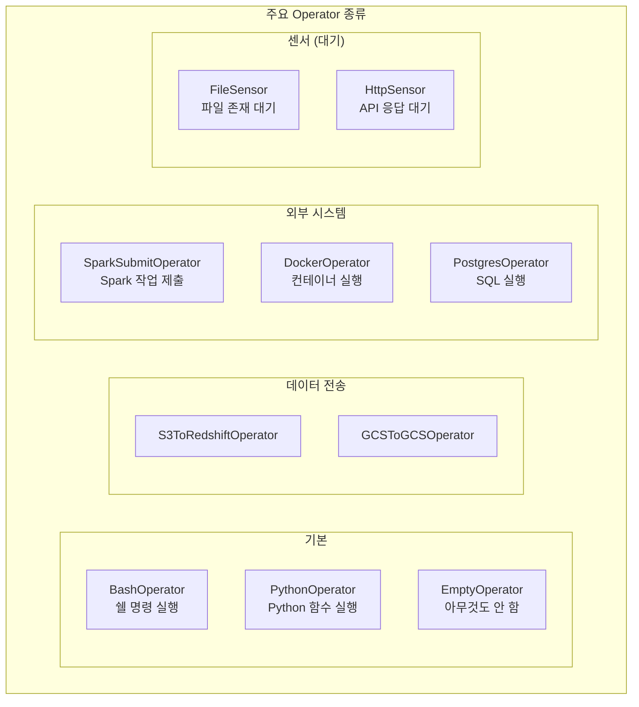

### Task: Operator의 인스턴스

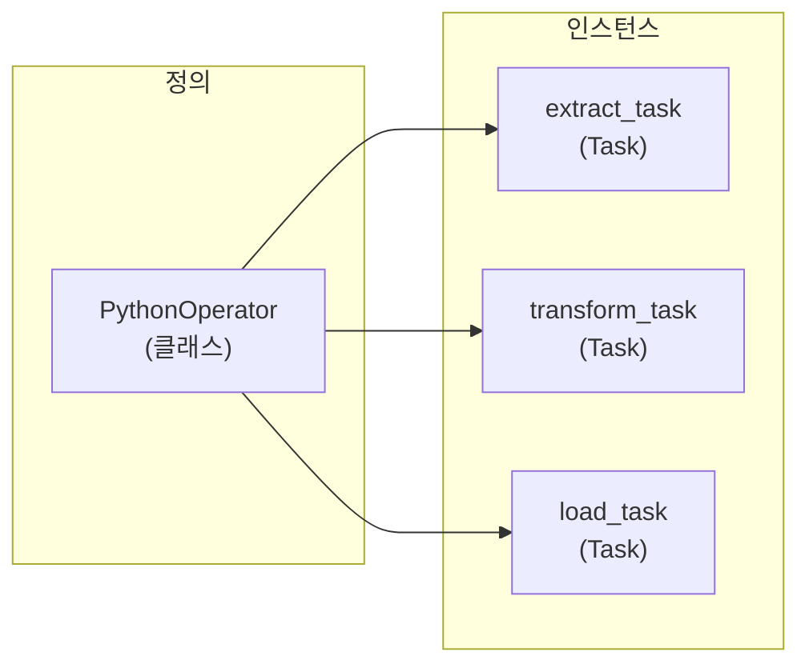

```python
from airflow.operators.python import PythonOperator

def extract_data():
    # 데이터 추출 로직
    return {"records": 1000}

def transform_data(**context):
    # 이전 Task 결과 가져오기
    data = context["ti"].xcom_pull(task_ids="extract")
    # 변환 로직
    return {"processed": data["records"]}

# Task 정의
extract_task = PythonOperator(
    task_id="extract",
    python_callable=extract_data,
    dag=dag
)

transform_task = PythonOperator(
    task_id="transform",
    python_callable=transform_data,
    dag=dag
)

# 의존성 정의
extract_task >> transform_task
```

---

## TaskFlow API (Airflow 2.0+)

### 전통적 방식 vs TaskFlow

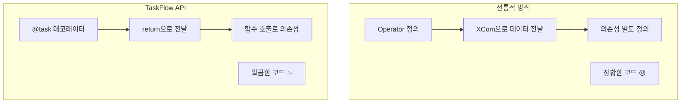

### TaskFlow 예시

```python
from airflow.decorators import dag, task
from datetime import datetime

@dag(
    dag_id="taskflow_etl",
    start_date=datetime(2024, 1, 1),
    schedule="@daily",
    catchup=False
)
def my_etl_pipeline():
    """TaskFlow API를 사용한 ETL 파이프라인"""
    
    @task
    def extract():
        """데이터 추출"""
        return {"data": [1, 2, 3, 4, 5]}
    
    @task
    def transform(raw_data: dict):
        """데이터 변환"""
        return {
            "data": [x * 2 for x in raw_data["data"]],
            "count": len(raw_data["data"])
        }
    
    @task
    def load(processed_data: dict):
        """데이터 적재"""
        print(f"Loaded {processed_data['count']} records")
    
    # 의존성이 자연스럽게 정의됨
    raw = extract()
    processed = transform(raw)
    load(processed)

# DAG 인스턴스 생성
my_etl_pipeline()
```

### XCom 자동 처리

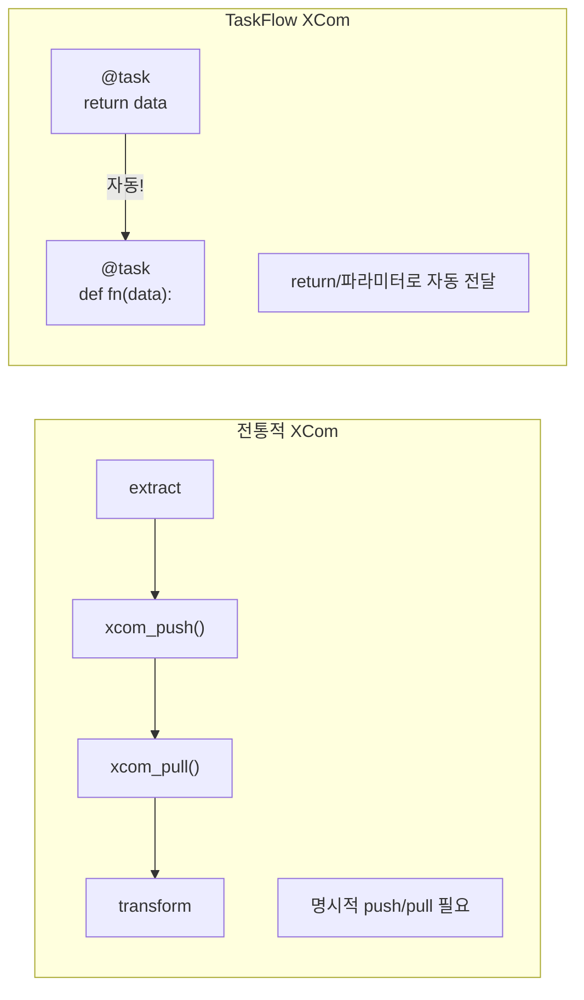

---

## 스케줄링과 Data Interval

### schedule 표현식

| 표현식 | 의미 | cron 표현 |
|--------|------|----------|
| `@once` | 한 번만 | - |
| `@hourly` | 매시 | `0 * * * *` |
| `@daily` | 매일 | `0 0 * * *` |
| `@weekly` | 매주 | `0 0 * * 0` |
| `@monthly` | 매월 | `0 0 1 * *` |
| `0 6 * * *` | 매일 6시 | - |
| `None` | 수동 트리거만 | - |

### Data Interval 개념 (중요!)

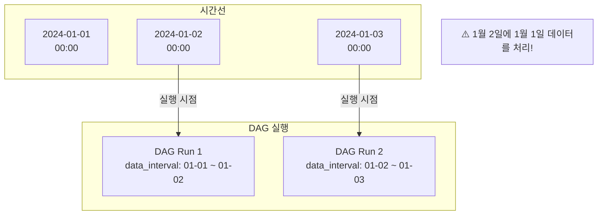

```python
@task
def process_data(**context):
    # 처리할 데이터의 날짜 범위
    data_interval_start = context["data_interval_start"]
    data_interval_end = context["data_interval_end"]
    
    # 예: 2024-01-01 00:00 ~ 2024-01-02 00:00
    print(f"Processing data from {data_interval_start} to {data_interval_end}")
```

### Catchup과 Backfill

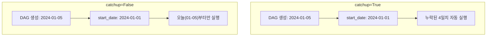

```bash
# 수동 Backfill
airflow dags backfill \
    --start-date 2024-01-01 \
    --end-date 2024-01-10 \
    my_etl_pipeline
```

---

## Task 의존성 패턴

### 기본 패턴

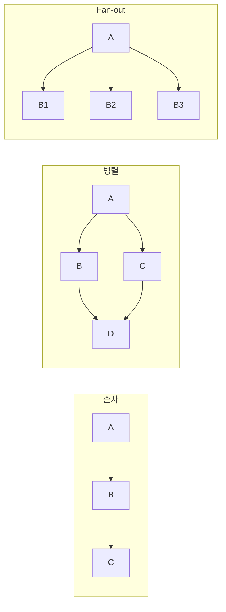

### 코드에서 의존성 정의

```python
# 방법 1: >> 연산자
task_a >> task_b >> task_c

# 방법 2: << 연산자 (역방향)
task_c << task_b << task_a

# 방법 3: 리스트로 병렬
task_a >> [task_b, task_c] >> task_d

# 방법 4: set_downstream/set_upstream
task_a.set_downstream(task_b)
task_b.set_upstream(task_a)
```

### TaskFlow에서는 더 자연스럽게

```python
@dag(...)
def pipeline():
    @task
    def start(): pass
    
    @task
    def process_a(data): pass
    
    @task
    def process_b(data): pass
    
    @task
    def end(a, b): pass
    
    data = start()
    result_a = process_a(data)
    result_b = process_b(data)
    end(result_a, result_b)  # 자동으로 의존성 생성
```

---

## 실전 예제: 데이터 파이프라인

```python
from airflow.decorators import dag, task
from airflow.providers.postgres.operators.postgres import PostgresOperator
from datetime import datetime, timedelta

default_args = {
    "owner": "data-team",
    "retries": 3,
    "retry_delay": timedelta(minutes=5),
}

@dag(
    dag_id="daily_user_analytics",
    start_date=datetime(2024, 1, 1),
    schedule="@daily",
    catchup=False,
    default_args=default_args,
    tags=["analytics", "production"]
)
def daily_user_analytics():
    """일일 사용자 분석 파이프라인"""
    
    @task
    def extract_users(**context):
        """PostgreSQL에서 사용자 데이터 추출"""
        from airflow.providers.postgres.hooks.postgres import PostgresHook
        
        date = context["data_interval_start"].strftime("%Y-%m-%d")
        hook = PostgresHook(postgres_conn_id="production_db")
        
        sql = f"""
            SELECT user_id, event_type, created_at
            FROM user_events
            WHERE DATE(created_at) = '{date}'
        """
        
        df = hook.get_pandas_df(sql)
        return df.to_dict("records")
    
    @task
    def calculate_metrics(events: list):
        """사용자 메트릭 계산"""
        from collections import Counter
        
        user_events = Counter(e["user_id"] for e in events)
        
        return {
            "total_events": len(events),
            "unique_users": len(user_events),
            "events_per_user": len(events) / len(user_events) if user_events else 0
        }
    
    @task
    def save_to_warehouse(metrics: dict, **context):
        """결과를 데이터 웨어하우스에 저장"""
        from airflow.providers.postgres.hooks.postgres import PostgresHook
        
        date = context["data_interval_start"].strftime("%Y-%m-%d")
        hook = PostgresHook(postgres_conn_id="analytics_db")
        
        hook.run(f"""
            INSERT INTO daily_metrics (date, total_events, unique_users, events_per_user)
            VALUES ('{date}', {metrics['total_events']}, {metrics['unique_users']}, {metrics['events_per_user']})
            ON CONFLICT (date) DO UPDATE SET
                total_events = EXCLUDED.total_events,
                unique_users = EXCLUDED.unique_users,
                events_per_user = EXCLUDED.events_per_user
        """)
    
    @task
    def notify_slack(metrics: dict):
        """Slack 알림 전송"""
        from airflow.providers.slack.hooks.slack import SlackHook
        
        hook = SlackHook(slack_conn_id="slack")
        hook.send(
            channel="#data-alerts",
            text=f"📊 Daily Metrics: {metrics['unique_users']} users, {metrics['total_events']} events"
        )
    
    # 의존성 정의
    events = extract_users()
    metrics = calculate_metrics(events)
    save_to_warehouse(metrics)
    notify_slack(metrics)

daily_user_analytics()
```

---

## 정리

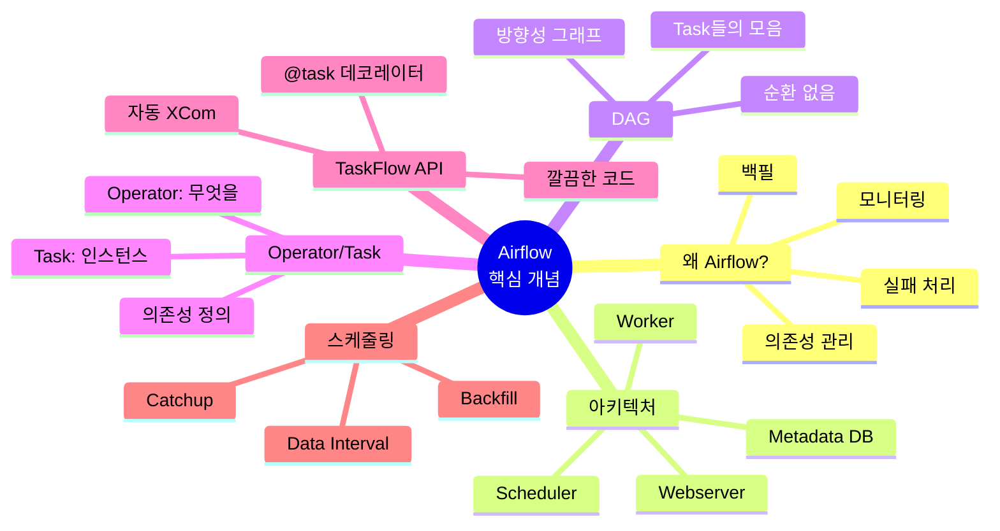

---

## 다음 편 예고

**7편: Airflow 실전**에서는 프로덕션 운영을 다룹니다:

- DAG 모듈화 전략
- 동적 Task 생성
- 테스트 방법
- 에러 처리와 알림
- 모니터링

---

## 참고 자료

- [Apache Airflow Documentation](https://airflow.apache.org/docs/)
- [TaskFlow API Tutorial](https://airflow.apache.org/docs/apache-airflow/stable/tutorial/taskflow.html)
- Astronomer, "Airflow Best Practices"
- "Data Pipelines with Apache Airflow" (Manning)
