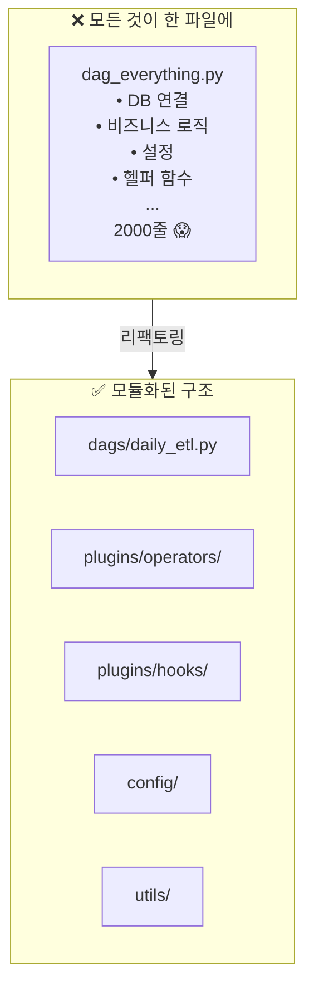
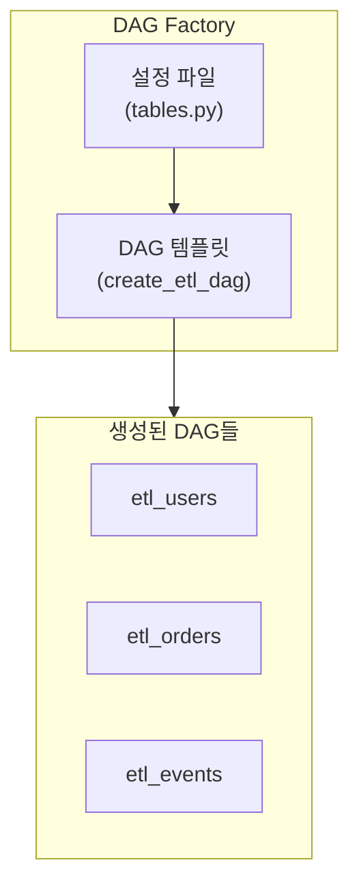
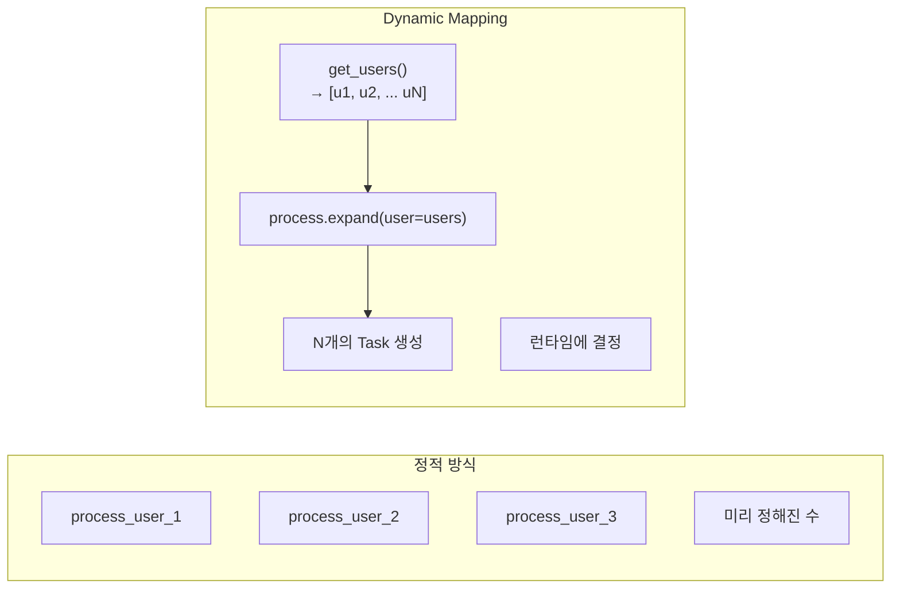
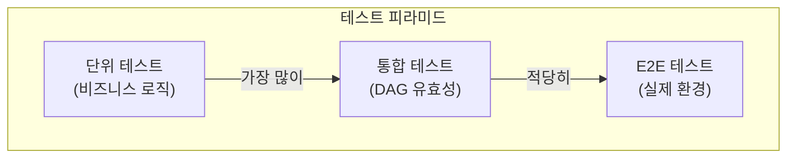
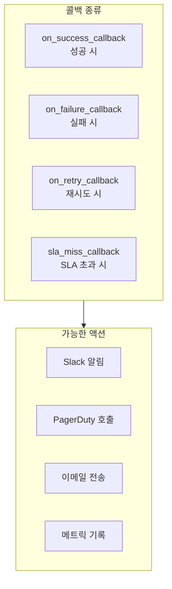
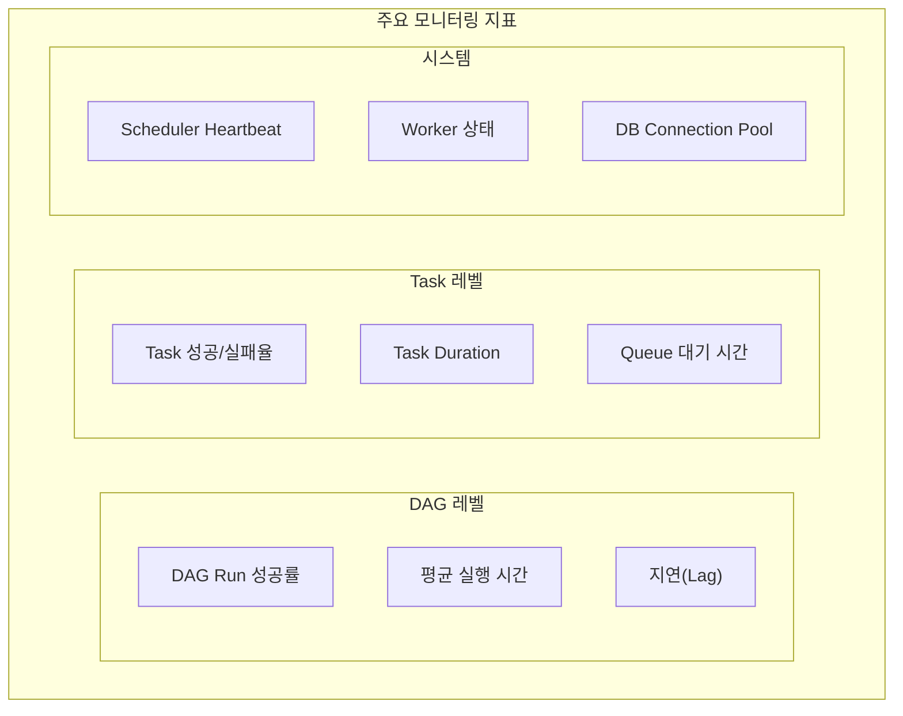
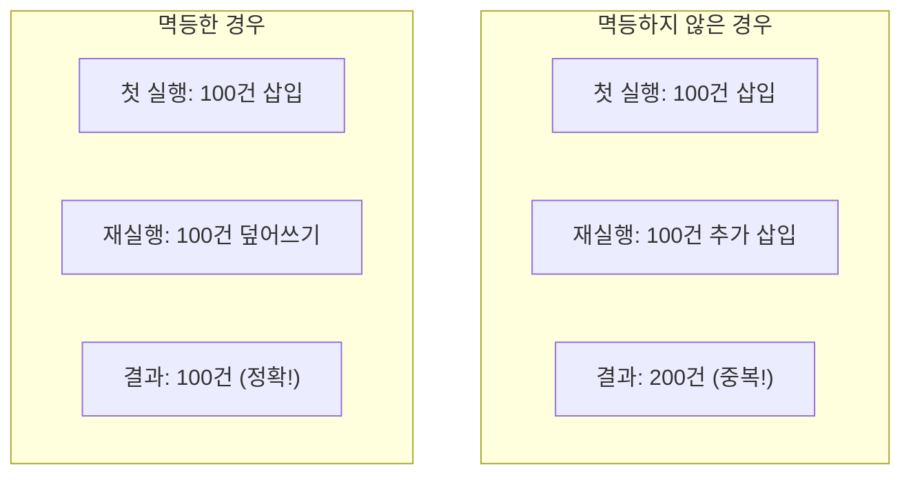
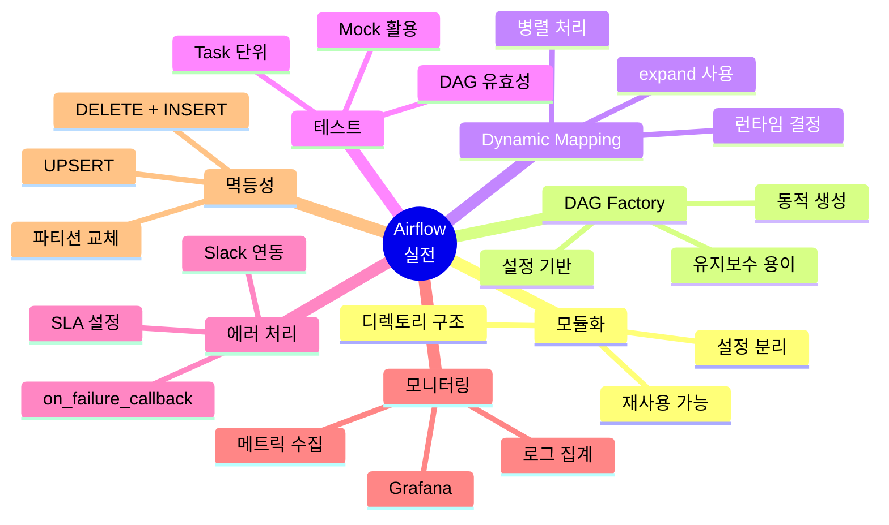

# 데이터 엔지니어링 시리즈 #7: Airflow 실전 - 프로덕션급 파이프라인 구축

> **대상 독자**: 6년 이상의 경험을 가진 백엔드/풀스택 엔지니어로, Airflow 기본 개념을 익히고 프로덕션 운영에 관심 있는 분

## 이 편에서 다루는 것

6편에서 Airflow 개념을 배웠다면, 이제 **실제 프로덕션에서 어떻게 운영하는지** 실전 패턴을 배웁니다.

---

## DAG 모듈화 전략

### 왜 모듈화가 필요한가?



### 권장 디렉토리 구조

```
airflow/
├── dags/
│   ├── __init__.py
│   ├── daily_etl.py
│   ├── hourly_metrics.py
│   └── config/
│       ├── __init__.py
│       ├── daily_etl_config.py
│       └── tables.py
│
├── plugins/
│   ├── __init__.py
│   ├── operators/
│   │   ├── __init__.py
│   │   └── custom_operators.py
│   └── hooks/
│       ├── __init__.py
│       └── custom_hooks.py
│
├── tests/
│   ├── dags/
│   │   └── test_daily_etl.py
│   └── plugins/
│       └── test_operators.py
│
└── requirements.txt
```

### 공통 설정 추출

```python
# config/daily_etl_config.py
from dataclasses import dataclass
from datetime import timedelta

@dataclass
class ETLConfig:
    source_conn_id: str = "production_db"
    target_conn_id: str = "warehouse_db"
    retries: int = 3
    retry_delay: timedelta = timedelta(minutes=5)
    
    @property
    def default_args(self):
        return {
            "owner": "data-team",
            "retries": self.retries,
            "retry_delay": self.retry_delay,
        }

# 테이블별 설정
TABLES = {
    "users": {"schedule": "@daily", "partition_key": "created_at"},
    "orders": {"schedule": "@hourly", "partition_key": "order_date"},
    "events": {"schedule": "*/15 * * * *", "partition_key": "event_time"},
}
```

---

## DAG Factory 패턴

### 동적 DAG 생성



```python
# dags/etl_factory.py
from airflow.decorators import dag, task
from datetime import datetime
from config.daily_etl_config import ETLConfig, TABLES

def create_etl_dag(table_name: str, table_config: dict):
    """테이블별 ETL DAG를 동적으로 생성"""
    
    config = ETLConfig()
    
    @dag(
        dag_id=f"etl_{table_name}",
        schedule=table_config["schedule"],
        start_date=datetime(2024, 1, 1),
        catchup=False,
        default_args=config.default_args,
        tags=["etl", "generated"]
    )
    def etl_pipeline():
        
        @task
        def extract(**context):
            from airflow.providers.postgres.hooks.postgres import PostgresHook
            
            hook = PostgresHook(postgres_conn_id=config.source_conn_id)
            date = context["data_interval_start"].strftime("%Y-%m-%d")
            partition_key = table_config["partition_key"]
            
            sql = f"""
                SELECT * FROM {table_name}
                WHERE DATE({partition_key}) = '{date}'
            """
            return hook.get_records(sql)
        
        @task
        def transform(raw_data):
            # 변환 로직
            return raw_data
        
        @task
        def load(data, **context):
            from airflow.providers.postgres.hooks.postgres import PostgresHook
            
            hook = PostgresHook(postgres_conn_id=config.target_conn_id)
            # 로드 로직
            print(f"Loaded {len(data)} records to warehouse.{table_name}")
        
        raw = extract()
        transformed = transform(raw)
        load(transformed)
    
    return etl_pipeline()

# 모든 테이블에 대해 DAG 생성
for table_name, table_config in TABLES.items():
    globals()[f"etl_{table_name}"] = create_etl_dag(table_name, table_config)
```

---

## Dynamic Task Mapping (Airflow 2.3+)

### 런타임에 Task 개수 결정



```python
from airflow.decorators import dag, task
from datetime import datetime

@dag(
    dag_id="dynamic_processing",
    schedule="@daily",
    start_date=datetime(2024, 1, 1),
    catchup=False
)
def dynamic_processing():
    
    @task
    def get_partitions(**context):
        """처리할 파티션 목록 동적 반환"""
        date = context["data_interval_start"]
        # 예: 날짜에 따라 다른 개수
        return [f"partition_{i}" for i in range(10)]  # 10개 파티션
    
    @task
    def process_partition(partition: str):
        """각 파티션 병렬 처리"""
        print(f"Processing {partition}")
        return {"partition": partition, "count": 1000}
    
    @task
    def aggregate(results: list):
        """모든 결과 집계"""
        total = sum(r["count"] for r in results)
        print(f"Total: {total} records from {len(results)} partitions")
    
    # Dynamic Task Mapping
    partitions = get_partitions()
    results = process_partition.expand(partition=partitions)  # N개 Task 생성
    aggregate(results)

dynamic_processing()
```

---

## 테스트 전략

### 테스트 피라미드



### DAG 유효성 테스트

```python
# tests/dags/test_dag_validity.py
import pytest
from airflow.models import DagBag

class TestDAGValidity:
    """모든 DAG의 기본 유효성 검사"""
    
    @pytest.fixture
    def dagbag(self):
        return DagBag(include_examples=False)
    
    def test_no_import_errors(self, dagbag):
        """DAG import 오류 없음"""
        assert dagbag.import_errors == {}, f"Import errors: {dagbag.import_errors}"
    
    def test_all_dags_have_tags(self, dagbag):
        """모든 DAG에 태그 있음"""
        for dag_id, dag in dagbag.dags.items():
            assert dag.tags, f"DAG {dag_id} has no tags"
    
    def test_no_cycles(self, dagbag):
        """순환 의존성 없음"""
        for dag_id, dag in dagbag.dags.items():
            # Airflow가 자동으로 검사하지만 명시적으로
            assert not dag.test_cycle(), f"DAG {dag_id} has a cycle"
    
    def test_default_args(self, dagbag):
        """필수 default_args 존재"""
        required_keys = ["owner", "retries"]
        for dag_id, dag in dagbag.dags.items():
            for key in required_keys:
                assert key in dag.default_args, f"DAG {dag_id} missing {key}"
```

### 개별 Task 테스트

```python
# tests/dags/test_daily_etl.py
import pytest
from unittest.mock import patch, MagicMock
from dags.daily_etl import calculate_metrics

class TestDailyETL:
    
    def test_calculate_metrics(self):
        """메트릭 계산 로직 테스트"""
        events = [
            {"user_id": 1, "event": "click"},
            {"user_id": 1, "event": "view"},
            {"user_id": 2, "event": "click"},
        ]
        
        result = calculate_metrics.function(events)
        
        assert result["total_events"] == 3
        assert result["unique_users"] == 2
        assert result["events_per_user"] == 1.5
    
    @patch("dags.daily_etl.PostgresHook")
    def test_extract_users(self, mock_hook):
        """추출 Task 테스트 (Mock 사용)"""
        mock_hook.return_value.get_pandas_df.return_value = pd.DataFrame({
            "user_id": [1, 2],
            "event_type": ["click", "view"]
        })
        
        # Task 실행
        result = extract_users.function(data_interval_start=datetime(2024, 1, 1))
        
        assert len(result) == 2
        mock_hook.assert_called_once()
```

---

## 에러 처리와 알림

### 콜백 함수



```python
from airflow.decorators import dag, task
from datetime import datetime, timedelta

def send_slack_alert(context):
    """실패 시 Slack 알림"""
    from airflow.providers.slack.hooks.slack_webhook import SlackWebhookHook
    
    task_instance = context["task_instance"]
    dag_id = context["dag"].dag_id
    task_id = task_instance.task_id
    execution_date = context["execution_date"]
    log_url = task_instance.log_url
    
    message = f"""
    🚨 *Task Failed*
    • DAG: `{dag_id}`
    • Task: `{task_id}`
    • Execution: {execution_date}
    • <{log_url}|View Logs>
    """
    
    hook = SlackWebhookHook(slack_webhook_conn_id="slack_webhook")
    hook.send(text=message)

def send_success_notification(context):
    """성공 시 알림 (선택적)"""
    # 중요한 DAG만 성공 알림
    pass

@dag(
    dag_id="monitored_pipeline",
    schedule="@daily",
    start_date=datetime(2024, 1, 1),
    catchup=False,
    default_args={
        "retries": 3,
        "retry_delay": timedelta(minutes=5),
        "on_failure_callback": send_slack_alert,
    },
    on_success_callback=send_success_notification
)
def monitored_pipeline():
    
    @task(
        retries=5,  # Task 개별 설정도 가능
        retry_delay=timedelta(minutes=2)
    )
    def critical_task():
        # 중요 로직
        pass
    
    critical_task()

monitored_pipeline()
```

### SLA (Service Level Agreement)

```python
from airflow.decorators import dag, task
from datetime import datetime, timedelta

@dag(
    dag_id="sla_monitored",
    schedule="@hourly",
    start_date=datetime(2024, 1, 1),
    sla_miss_callback=send_sla_alert
)
def sla_monitored():
    
    @task(
        sla=timedelta(minutes=30)  # 30분 내 완료되어야 함
    )
    def time_sensitive_task():
        # SLA를 초과하면 sla_miss_callback 호출
        pass
```

---

## 모니터링과 관측성

### Airflow 메트릭



### StatsD + Grafana 연동

```python
# airflow.cfg
[metrics]
statsd_on = True
statsd_host = statsd-exporter
statsd_port = 9125
statsd_prefix = airflow
```

### 유용한 대시보드 쿼리

```python
# 실패한 DAG Run 조회
from airflow.models import DagRun

failed_runs = DagRun.find(
    state="failed",
    execution_start_date=datetime.now() - timedelta(days=1)
)

for run in failed_runs:
    print(f"{run.dag_id}: {run.execution_date}")
```

---

## 멱등성 보장

### 왜 멱등성이 중요한가?



### 멱등성 확보 패턴

```python
@task
def load_idempotent(data, **context):
    """멱등한 로드"""
    from airflow.providers.postgres.hooks.postgres import PostgresHook
    
    hook = PostgresHook(postgres_conn_id="warehouse")
    date = context["data_interval_start"].strftime("%Y-%m-%d")
    table = "daily_metrics"
    
    # 패턴 1: DELETE + INSERT
    hook.run(f"DELETE FROM {table} WHERE date = '{date}'")
    hook.insert_rows(table, data)
    
    # 패턴 2: UPSERT (PostgreSQL)
    hook.run(f"""
        INSERT INTO {table} (date, value)
        VALUES ('{date}', {data['value']})
        ON CONFLICT (date) DO UPDATE SET
            value = EXCLUDED.value,
            updated_at = NOW()
    """)
    
    # 패턴 3: Partition 교체 (S3/GCS)
    # s3://bucket/table/date=2024-01-01/ 전체 교체
```

---

## 정리



---

## 다음 편 예고

**8편: Kafka 핵심**에서는 이벤트 스트리밍을 다룹니다:

- Redis Streams와의 비교
- Topic, Partition, Consumer Group
- Exactly-Once Semantics
- KRaft 모드

---

## 참고 자료

- [Airflow Best Practices](https://airflow.apache.org/docs/apache-airflow/stable/best-practices.html)
- [Testing Airflow DAGs](https://airflow.apache.org/docs/apache-airflow/stable/best-practices.html#testing-a-dag)
- [Dynamic Task Mapping](https://airflow.apache.org/docs/apache-airflow/stable/concepts/dynamic-task-mapping.html)
- Astronomer, "Airflow in Production"
