# 데이터 엔지니어링 시리즈 #8: Kafka 핵심 - 메시지 큐를 넘어 이벤트 스트리밍으로

> **대상 독자**: 충분한 경험을 가진 백엔드/풀스택 엔지니어로, Redis Streams나 RabbitMQ에 익숙하지만 Kafka는 처음인 분

## 이 편에서 다루는 것

Redis Streams를 써봤다면 "Kafka가 뭐가 다르지?"라는 의문이 있을 겁니다. **왜 대규모 시스템에서 Kafka를 선택하는지**, 핵심 개념을 배웁니다.

---

## Redis Streams vs Kafka

### 친숙한 Redis Streams와 비교

```mermaid
flowchart TB
    subgraph Redis ["Redis Streams"]
        RS_Stream["Stream: orders"]
        RS_Group1["Consumer Group A"]
        RS_Group2["Consumer Group B"]
        RS_C1["Consumer 1"]
        RS_C2["Consumer 2"]
        
        RS_Stream --> RS_Group1 --> RS_C1
        RS_Stream --> RS_Group2 --> RS_C2
    end
    
    subgraph Kafka ["Apache Kafka"]
        K_Topic["Topic: orders<br/>(Partitioned)"]
        K_Group1["Consumer Group A"]
        K_Group2["Consumer Group B"]
        K_C1["Consumer 1"]
        K_C2["Consumer 2"]
        
        K_Topic --> K_Group1 --> K_C1
        K_Topic --> K_Group2 --> K_C2
    end
    
    Similar["유사한 개념!"]
```

### 주요 차이점

| 특성 | Redis Streams | Kafka |
|------|--------------|-------|
| **설계 목적** | 캐시 + 가벼운 스트리밍 | 대용량 이벤트 스트리밍 전용 |
| **데이터 저장** | 메모리 (제한적 보존) | 디스크 (장기 보존 가능) |
| **스케일링** | 수직 확장 위주 | 수평 확장 (Partition) |
| **처리량** | 수만 TPS | **수백만 TPS** |
| **복제** | Master-Replica | Multi-broker 복제 |
| **순서 보장** | Stream 내 보장 | Partition 내 보장 |
| **Consumer 관리** | 자체 관리 필요 | Coordinator 자동 관리 |

### 스케일 비교

```mermaid
flowchart TB
    subgraph RedisScale ["Redis Streams 스케일링"]
        RS1["단일 인스턴스<br/>100K TPS"]
        RS2["Cluster Sharding<br/>복잡한 관리"]
    end
    
    subgraph KafkaScale ["Kafka 스케일링"]
        K1["Partition 추가"]
        K2["Broker 추가"]
        K3["Consumer 추가"]
        
        K1 --> K2 --> K3
        Result["선형 확장 가능<br/>수백만 TPS"]
    end
```

---

## Kafka 핵심 개념

### 전체 구조


### Topic

```mermaid
flowchart LR
    subgraph Topic ["Topic: user_events"]
        direction TB
        Desc["• 이벤트의 카테고리/채널<br/>• N개의 Partition으로 구성<br/>• 설정된 기간만큼 보존"]
    end
    
    Examples["예시:<br/>• orders<br/>• user_signups<br/>• page_views"]
    
    Topic --- Examples
```

### Partition

```mermaid
flowchart TB
    subgraph Topic ["Topic: orders"]
        subgraph P0 ["Partition 0"]
            M0_0["offset 0"] --> M0_1["offset 1"] --> M0_2["offset 2"]
        end
        
        subgraph P1 ["Partition 1"]
            M1_0["offset 0"] --> M1_1["offset 1"] --> M1_2["offset 2"]
        end
        
        subgraph P2 ["Partition 2"]
            M2_0["offset 0"] --> M2_1["offset 1"]
        end
    end
    
    Features["• 순서 보장 단위<br/>• 병렬 처리 단위<br/>• 파티션 키로 분배"]
```

**핵심 인사이트**:

- **순서 보장은 Partition 내에서만!**
- Partition 수 = 병렬 처리 수준
- 같은 키는 같은 Partition으로

### Offset

```mermaid
flowchart LR
    subgraph Partition ["Partition 0"]
        O0["offset 0<br/>msg_a"]
        O1["offset 1<br/>msg_b"]
        O2["offset 2<br/>msg_c"]
        O3["offset 3<br/>msg_d"]
        O4["offset 4<br/>msg_e"]
        
        O0 --> O1 --> O2 --> O3 --> O4
    end
    
    subgraph Consumers ["Consumer 위치"]
        C1["Group A<br/>offset: 3"]
        C2["Group B<br/>offset: 1"]
    end
    
    O3 -.->|"읽는 중"| C1
    O1 -.->|"읽는 중"| C2
```

**Offset의 역할**:

- 각 Consumer Group이 어디까지 읽었는지 추적
- 재시작 시 이어서 읽기 가능
- 과거 데이터 다시 읽기 가능 (rewind)

### Consumer Group

```mermaid
flowchart TB
    subgraph Topic ["Topic: orders (3 partitions)"]
        P0["Partition 0"]
        P1["Partition 1"]
        P2["Partition 2"]
    end
    
    subgraph Group1 ["Consumer Group A (3 consumers)"]
        C1["Consumer 1"]
        C2["Consumer 2"]
        C3["Consumer 3"]
    end
    
    subgraph Group2 ["Consumer Group B (1 consumer)"]
        C4["Consumer 4"]
    end
    
    P0 --> C1
    P1 --> C2
    P2 --> C3
    
    P0 --> C4
    P1 --> C4
    P2 --> C4
    
    Note1["Group A: 각 Consumer가<br/>1개 Partition 담당"]
    Note2["Group B: 1 Consumer가<br/>모든 Partition 담당"]
```

**핵심 규칙**:

- 한 Partition은 Group 내 **하나의 Consumer**만 읽을 수 있음
- Consumer 수 > Partition 수 → 일부 Consumer 유휴
- Consumer 수 < Partition 수 → 일부 Consumer가 여러 Partition 담당

---

## Producer: 메시지 보내기

### 파티션 결정 전략

```mermaid
flowchart TB
    Message["메시지 전송"]
    
    HasKey{"키가<br/>있는가?"}
    
    Hash["hash(key) % partition_count<br/>→ 같은 키 = 같은 Partition"]
    RoundRobin["라운드 로빈<br/>→ 고르게 분배"]
    Sticky["Sticky Partitioner<br/>→ 배치 최적화"]
    
    Message --> HasKey
    HasKey -->|"예"| Hash
    HasKey -->|"아니오 (2.4+)"| Sticky
    HasKey -->|"아니오 (구버전)"| RoundRobin
```

### Python Producer 예시

```python
from confluent_kafka import Producer

def delivery_callback(err, msg):
    if err:
        print(f"Delivery failed: {err}")
    else:
        print(f"Delivered to {msg.topic()} [{msg.partition()}] @ {msg.offset()}")

# Producer 설정
producer = Producer({
    'bootstrap.servers': 'localhost:9092',
    'acks': 'all',  # 모든 replica 확인
    'enable.idempotence': True,  # 중복 방지
})

# 키가 있는 메시지 (같은 user_id = 같은 Partition)
producer.produce(
    topic='user_events',
    key='user_123',
    value='{"event": "purchase", "amount": 100}',
    callback=delivery_callback
)

# 키가 없는 메시지 (자동 분배)
producer.produce(
    topic='logs',
    value='{"level": "info", "message": "hello"}',
    callback=delivery_callback
)

producer.flush()
```

---

## Consumer: 메시지 읽기

### Consumer 라이프사이클

```mermaid
flowchart TB
    subgraph Lifecycle ["Consumer 라이프사이클"]
        Subscribe["Subscribe<br/>Topic 구독"]
        Poll["Poll<br/>메시지 가져오기"]
        Process["Process<br/>비즈니스 로직"]
        Commit["Commit<br/>Offset 저장"]
        
        Subscribe --> Poll --> Process --> Commit --> Poll
    end
```

### Python Consumer 예시

```python
from confluent_kafka import Consumer, KafkaError

# Consumer 설정
consumer = Consumer({
    'bootstrap.servers': 'localhost:9092',
    'group.id': 'my-consumer-group',
    'auto.offset.reset': 'earliest',  # 처음부터 읽기
    'enable.auto.commit': False,  # 수동 커밋
})

consumer.subscribe(['user_events'])

try:
    while True:
        msg = consumer.poll(timeout=1.0)
        
        if msg is None:
            continue
        if msg.error():
            if msg.error().code() == KafkaError._PARTITION_EOF:
                continue
            raise KafkaException(msg.error())
        
        # 메시지 처리
        key = msg.key().decode('utf-8') if msg.key() else None
        value = msg.value().decode('utf-8')
        
        print(f"Received: key={key}, value={value}")
        
        # 처리 완료 후 커밋
        consumer.commit(asynchronous=False)
        
finally:
    consumer.close()
```

---

## Exactly-Once Semantics

> ⚠️ **주의**: Kafka의 Exactly-Once는 **"Kafka 내부"**에서의 보장입니다. 외부 DB/API로의 End-to-End Exactly-Once는 **애플리케이션 레벨에서 추가 처리**가 필요합니다.

### 메시지 전달 보장 수준

```mermaid
flowchart TB
    subgraph Levels ["전달 보장 수준"]
        AtMost["At-Most-Once<br/>최대 1번"]
        AtLeast["At-Least-Once<br/>최소 1번"]
        Exactly["Exactly-Once<br/>정확히 1번"]
    end
    
    AtMost -->|"메시지 유실 가능"| L1["❌ 데이터 손실"]
    AtLeast -->|"중복 가능"| L2["⚠️ 중복 처리"]
    Exactly -->|"정확함"| L3["✅ 완벽"]
    
    Difficulty["구현 난이도: At-Most < At-Least < Exactly"]
```

### Idempotent Producer

```mermaid
flowchart LR
    subgraph Problem ["문제 상황"]
        P1["Producer 전송"]
        P2["Broker 저장"]
        P3["ACK 유실"]
        P4["Producer 재전송"]
        P5["중복 저장!"]
        
        P1 --> P2 --> P3 --> P4 --> P5
    end
    
    subgraph Solution ["Idempotent Producer"]
        S1["Producer 전송<br/>(PID + SeqNum)"]
        S2["Broker 저장<br/>(SeqNum 기록)"]
        S3["ACK 유실"]
        S4["재전송 시<br/>중복 감지"]
        S5["무시됨 ✅"]
        
        S1 --> S2 --> S3 --> S4 --> S5
    end
```

```python
# Idempotent Producer 설정
producer = Producer({
    'bootstrap.servers': 'localhost:9092',
    'enable.idempotence': True,  # 핵심 설정!
    'acks': 'all',
    'retries': 5,
})
```

### Transactional Producer

```mermaid
flowchart TB
    subgraph Transaction ["트랜잭션"]
        Begin["begin_transaction()"]
        Send1["produce(topic_a)"]
        Send2["produce(topic_b)"]
        Commit["commit_transaction()"]
        
        Begin --> Send1 --> Send2 --> Commit
    end
    
    Result["모두 성공 또는 모두 실패<br/>→ Atomic"]
```

```python
from confluent_kafka import Producer

producer = Producer({
    'bootstrap.servers': 'localhost:9092',
    'enable.idempotence': True,
    'transactional.id': 'my-transactional-producer',
})

# 트랜잭션 초기화 (한 번만)
producer.init_transactions()

try:
    producer.begin_transaction()
    
    producer.produce('orders', key='order_1', value='...')
    producer.produce('payments', key='order_1', value='...')
    
    producer.commit_transaction()
except Exception as e:
    producer.abort_transaction()
    raise
```

### Consumer 측 Exactly-Once

```python
consumer = Consumer({
    'bootstrap.servers': 'localhost:9092',
    'group.id': 'exactly-once-group',
    'isolation.level': 'read_committed',  # 커밋된 메시지만 읽기
    'enable.auto.commit': False,
})
```

---

## KRaft: Zookeeper 없는 Kafka

### 기존 아키텍처의 문제

```mermaid
flowchart TB
    subgraph Old ["기존 (Zookeeper 기반)"]
        ZK["Zookeeper Cluster"]
        B1["Broker 1"]
        B2["Broker 2"]
        B3["Broker 3"]
        
        ZK <-->|"메타데이터"| B1
        ZK <-->|"메타데이터"| B2
        ZK <-->|"메타데이터"| B3
        
        Problems["문제점:<br/>• 별도 클러스터 관리<br/>• 메타데이터 동기화 지연<br/>• 운영 복잡도"]
    end
```

### KRaft 아키텍처

```mermaid
flowchart TB
    subgraph New ["KRaft (Kafka 3.0+)"]
        subgraph Controllers ["Controller 역할"]
            C1["Controller 1"]
            C2["Controller 2"]
            C3["Controller 3"]
        end
        
        subgraph Brokers ["Broker 역할"]
            B1["Broker 1"]
            B2["Broker 2"]
            B3["Broker 3"]
        end
        
        Controllers <-->|"Raft 합의"| Controllers
        Controllers -->|"메타데이터"| Brokers
        
        Benefits["장점:<br/>• 단일 시스템<br/>• 빠른 메타데이터 전파<br/>• 쉬운 운영"]
    end
```

---

## Schema Registry: 스키마 버전 관리

프로덕션 Kafka에서 **스키마 진화(Schema Evolution)**를 안전하게 관리하기 위한 필수 컴포넌트입니다.

> **출처**: [Confluent Schema Registry Documentation](https://docs.confluent.io/platform/current/schema-registry/), Kleppmann, "Designing Data-Intensive Applications" Chapter 4

### 왜 필요한가?

```mermaid
flowchart TB
    subgraph Problem ["스키마 없이 운영"]
        P1["Producer: {name, age}"]
        P2["Consumer: {name, age, email} 기대"]
        P3["💥 파싱 실패"]
        
        P1 --> P3
        P2 --> P3
    end
    
    subgraph Solution ["Schema Registry 사용"]
        S1["스키마 중앙 저장"]
        S2["버전 관리"]
        S3["호환성 검증"]
        S4["✅ 안전한 진화"]
        
        S1 --> S2 --> S3 --> S4
    end
```

### 지원 포맷

| 포맷 | 특징 | 사용 사례 |
|------|------|----------|
| **Avro** | 스키마 진화 우수, 압축 효율 | 가장 널리 사용 |
| **Protobuf** | gRPC 호환, 강타입 | 마이크로서비스 |
| **JSON Schema** | 읽기 쉬움 | 디버깅, 호환성 |

### 호환성 모드

```mermaid
flowchart TB
    subgraph Modes ["호환성 모드"]
        BACKWARD["BACKWARD<br/>새 스키마가 이전 데이터 읽기 가능"]
        FORWARD["FORWARD<br/>이전 스키마가 새 데이터 읽기 가능"]
        FULL["FULL<br/>양방향 호환"]
        NONE["NONE<br/>검증 없음 (비권장)"]
    end
    
    Recommend["권장: BACKWARD 또는 FULL"]
```

| 모드 | 허용 변경 | 예시 |
|------|----------|------|
| **BACKWARD** | 필드 삭제, 기본값 있는 필드 추가 | 새 Consumer가 이전 데이터 읽음 |
| **FORWARD** | 필드 추가, 기본값 있는 필드 삭제 | 이전 Consumer가 새 데이터 읽음 |
| **FULL** | 기본값 있는 필드만 추가/삭제 | 가장 안전 |

### Python 사용 예시

```python
from confluent_kafka import SerializingProducer
from confluent_kafka.schema_registry import SchemaRegistryClient
from confluent_kafka.schema_registry.avro import AvroSerializer

# Schema Registry 연결
schema_registry = SchemaRegistryClient({
    'url': 'http://schema-registry:8081'
})

# Avro 스키마 정의
user_schema = """
{
    "type": "record",
    "name": "User",
    "fields": [
        {"name": "name", "type": "string"},
        {"name": "age", "type": "int"},
        {"name": "email", "type": ["null", "string"], "default": null}
    ]
}
"""

# Serializer 생성 (스키마 자동 등록)
avro_serializer = AvroSerializer(
    schema_registry,
    user_schema,
    to_dict=lambda user, ctx: user
)

# Producer 설정
producer = SerializingProducer({
    'bootstrap.servers': 'localhost:9092',
    'value.serializer': avro_serializer
})

# 메시지 전송
producer.produce(
    topic='users',
    value={'name': 'Kim', 'age': 30, 'email': 'kim@example.com'}
)
producer.flush()
```

---

## 사용 사례

```mermaid
flowchart TB
    subgraph UseCases ["Kafka 사용 사례"]
        subgraph Logging ["로그 수집"]
            L1["App Logs"]
            L2["Kafka"]
            L3["Elasticsearch"]
            L1 --> L2 --> L3
        end
        
        subgraph Events ["이벤트 소싱"]
            E1["User Actions"]
            E2["Kafka<br/>(Event Store)"]
            E3["State 재구성"]
            E1 --> E2 --> E3
        end
        
        subgraph CDC ["Change Data Capture"]
            D1[(DB)]
            D2["Debezium"]
            D3["Kafka"]
            D4["Data Lake"]
            D1 --> D2 --> D3 --> D4
        end
        
        subgraph Stream ["실시간 분석"]
            S1["Click Stream"]
            S2["Kafka"]
            S3["Flink/Spark"]
            S4["Dashboard"]
            S1 --> S2 --> S3 --> S4
        end
    end
```

---

## 정리

```mermaid
mindmap
  root((Kafka<br/>핵심))
    vs Redis Streams
      더 큰 스케일
      더 긴 보존
      더 나은 복제
    구성 요소
      Topic
      Partition
      Offset
      Consumer Group
    Producer
      파티션 결정
      키 기반 분배
      Idempotent
    Consumer
      Group 관리
      Offset 커밋
      Rebalancing
    Exactly-Once
      Idempotent Producer
      Transactional
      read_committed
    KRaft
      Zookeeper 제거
      단순한 운영
      빠른 메타데이터
    Schema Registry
      스키마 버전 관리
      호환성 검증
      Avro/Protobuf
```

---

## 다음 편 예고

**9편: Spark Structured Streaming**에서는 실시간 처리를 다룹니다:

- Kafka + Spark 연동
- Watermark와 Late Data
- Window 연산
- 체크포인팅

---

## 참고 자료

- [Apache Kafka Documentation](https://kafka.apache.org/documentation/)
- [Confluent Schema Registry](https://docs.confluent.io/platform/current/schema-registry/)
- [Confluent Developer](https://developer.confluent.io/)
- "Kafka: The Definitive Guide" (O'Reilly)
- Martin Kleppmann, "Designing Data-Intensive Applications" - Chapter 4
- [KRaft Overview](https://kafka.apache.org/documentation/#kraft)
