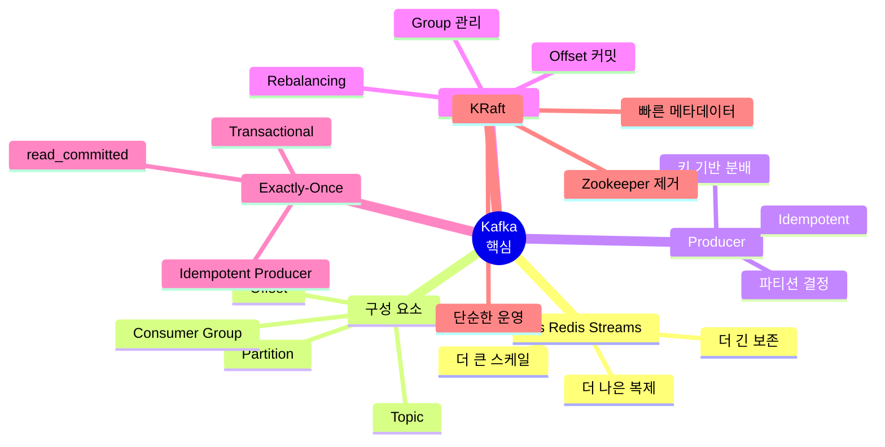

# 데이터 엔지니어링 시리즈 #8: Kafka 핵심 - 메시지 큐를 넘어 이벤트 스트리밍으로

> **대상 독자**: 충분한 경험을 가진 백엔드/풀스택 엔지니어로, Redis Streams나 RabbitMQ에 익숙하지만 Kafka는 처음인 분

## 이 편에서 다루는 것

Redis Streams를 써봤다면 "Kafka가 뭐가 다르지?"라는 의문이 있을 겁니다. **왜 대규모 시스템에서 Kafka를 선택하는지**, 핵심 개념을 배웁니다.

---

## Redis Streams vs Kafka

### 친숙한 Redis Streams와 비교


### 주요 차이점

| 특성 | Redis Streams | Kafka |
|------|--------------|-------|
| **설계 목적** | 캐시 + 가벼운 스트리밍 | 대용량 이벤트 스트리밍 전용 |
| **데이터 저장** | 메모리 (제한적 보존) | 디스크 (장기 보존 가능) |
| **스케일링** | 수직 확장 위주 | 수평 확장 (Partition) |
| **처리량** | 수만 TPS | **수백만 TPS** |
| **복제** | Master-Replica | Multi-broker 복제 |
| **순서 보장** | Stream 내 보장 | Partition 내 보장 |
| **Consumer 관리** | 자체 관리 필요 | Coordinator 자동 관리 |

### 스케일 비교


---

## Kafka 핵심 개념

### 전체 구조


### Topic


### Partition


**핵심 인사이트**:

- **순서 보장은 Partition 내에서만!**
- Partition 수 = 병렬 처리 수준
- 같은 키는 같은 Partition으로

### Offset


**Offset의 역할**:

- 각 Consumer Group이 어디까지 읽었는지 추적
- 재시작 시 이어서 읽기 가능
- 과거 데이터 다시 읽기 가능 (rewind)

### Consumer Group


**핵심 규칙**:

- 한 Partition은 Group 내 **하나의 Consumer**만 읽을 수 있음
- Consumer 수 > Partition 수 → 일부 Consumer 유휴
- Consumer 수 < Partition 수 → 일부 Consumer가 여러 Partition 담당

---

## Producer: 메시지 보내기

### 파티션 결정 전략


### Python Producer 예시

```python
from confluent_kafka import Producer

def delivery_callback(err, msg):
    if err:
        print(f"Delivery failed: {err}")
    else:
        print(f"Delivered to {msg.topic()} [{msg.partition()}] @ {msg.offset()}")

# Producer 설정
producer = Producer({
    'bootstrap.servers': 'localhost:9092',
    'acks': 'all',  # 모든 replica 확인
    'enable.idempotence': True,  # 중복 방지
})

# 키가 있는 메시지 (같은 user_id = 같은 Partition)
producer.produce(
    topic='user_events',
    key='user_123',
    value='{"event": "purchase", "amount": 100}',
    callback=delivery_callback
)

# 키가 없는 메시지 (자동 분배)
producer.produce(
    topic='logs',
    value='{"level": "info", "message": "hello"}',
    callback=delivery_callback
)

producer.flush()
```

---

## Consumer: 메시지 읽기

### Consumer 라이프사이클


### Python Consumer 예시

```python
from confluent_kafka import Consumer, KafkaError

# Consumer 설정
consumer = Consumer({
    'bootstrap.servers': 'localhost:9092',
    'group.id': 'my-consumer-group',
    'auto.offset.reset': 'earliest',  # 처음부터 읽기
    'enable.auto.commit': False,  # 수동 커밋
})

consumer.subscribe(['user_events'])

try:
    while True:
        msg = consumer.poll(timeout=1.0)
        
        if msg is None:
            continue
        if msg.error():
            if msg.error().code() == KafkaError._PARTITION_EOF:
                continue
            raise KafkaException(msg.error())
        
        # 메시지 처리
        key = msg.key().decode('utf-8') if msg.key() else None
        value = msg.value().decode('utf-8')
        
        print(f"Received: key={key}, value={value}")
        
        # 처리 완료 후 커밋
        consumer.commit(asynchronous=False)
        
finally:
    consumer.close()
```

---

## Exactly-Once Semantics

> ⚠️ **주의**: Kafka의 Exactly-Once는 **"Kafka 내부"**에서의 보장입니다. 외부 DB/API로의 End-to-End Exactly-Once는 **애플리케이션 레벨에서 추가 처리**가 필요합니다.

### 메시지 전달 보장 수준


### Idempotent Producer


```python
# Idempotent Producer 설정
producer = Producer({
    'bootstrap.servers': 'localhost:9092',
    'enable.idempotence': True,  # 핵심 설정!
    'acks': 'all',
    'retries': 5,
})
```

### Transactional Producer


```python
from confluent_kafka import Producer

producer = Producer({
    'bootstrap.servers': 'localhost:9092',
    'enable.idempotence': True,
    'transactional.id': 'my-transactional-producer',
})

# 트랜잭션 초기화 (한 번만)
producer.init_transactions()

try:
    producer.begin_transaction()
    
    producer.produce('orders', key='order_1', value='...')
    producer.produce('payments', key='order_1', value='...')
    
    producer.commit_transaction()
except Exception as e:
    producer.abort_transaction()
    raise
```

### Consumer 측 Exactly-Once

```python
consumer = Consumer({
    'bootstrap.servers': 'localhost:9092',
    'group.id': 'exactly-once-group',
    'isolation.level': 'read_committed',  # 커밋된 메시지만 읽기
    'enable.auto.commit': False,
})
```

---

## KRaft: Zookeeper 없는 Kafka

### 기존 아키텍처의 문제


### KRaft 아키텍처


---

## 사용 사례


---

## 정리



---

## 다음 편 예고

**9편: Spark Structured Streaming**에서는 실시간 처리를 다룹니다:

- Kafka + Spark 연동
- Watermark와 Late Data
- Window 연산
- 체크포인팅

---

## 참고 자료

- [Apache Kafka Documentation](https://kafka.apache.org/documentation/)
- [Confluent Developer](https://developer.confluent.io/)
- "Kafka: The Definitive Guide" (O'Reilly)
- [KRaft Overview](https://kafka.apache.org/documentation/#kraft)
