# 데이터 엔지니어링 시리즈 #9: Spark Structured Streaming - 실시간 데이터 처리

> **대상 독자**: 6년 이상의 경험을 가진 백엔드/풀스택 엔지니어로, Spark과 Kafka 기본 개념을 익히고 실시간 처리를 배우려는 분

## 이 편에서 다루는 것

배치 처리와 스트리밍 처리를 **같은 API로** 다루는 Spark Structured Streaming의 핵심을 배웁니다.

---

## 배치와 스트리밍의 통합

### Structured Streaming의 철학

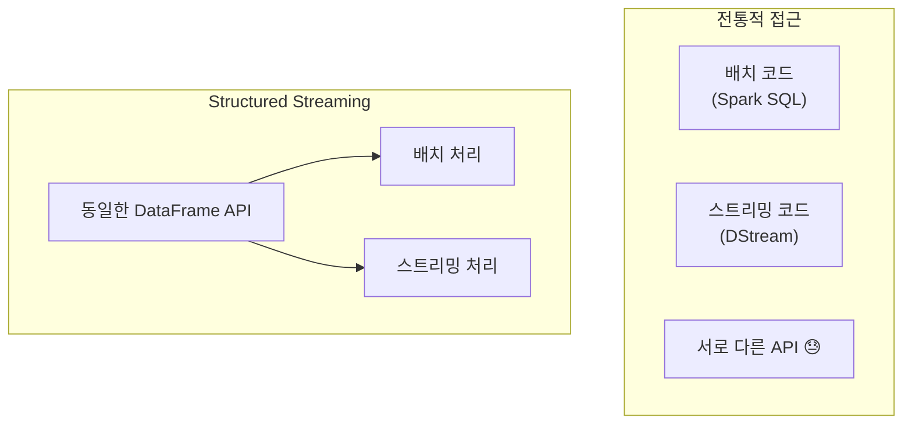

### 무한 테이블 개념

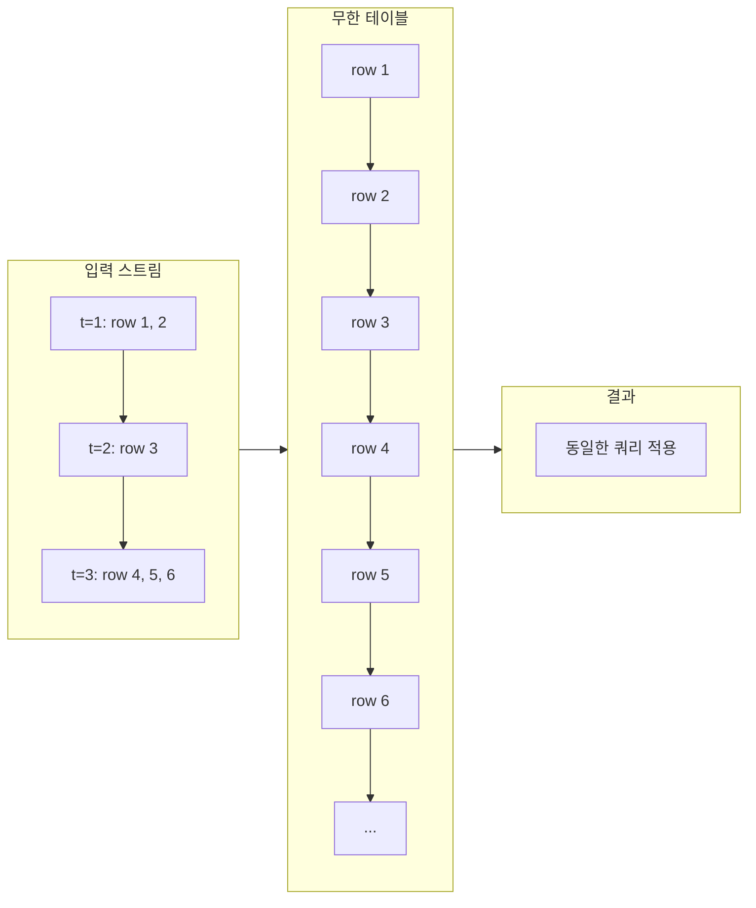

**핵심 아이디어**: 스트림을 "계속 추가되는 테이블"로 생각

---

## Source와 Sink

### 지원되는 Source

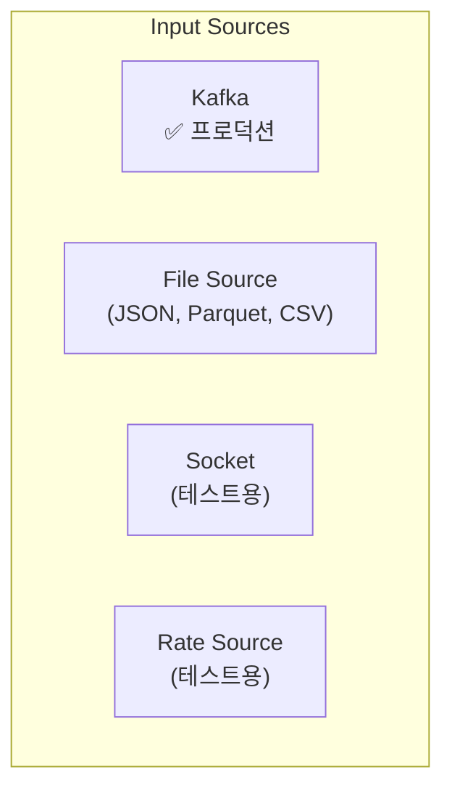

### 지원되는 Sink

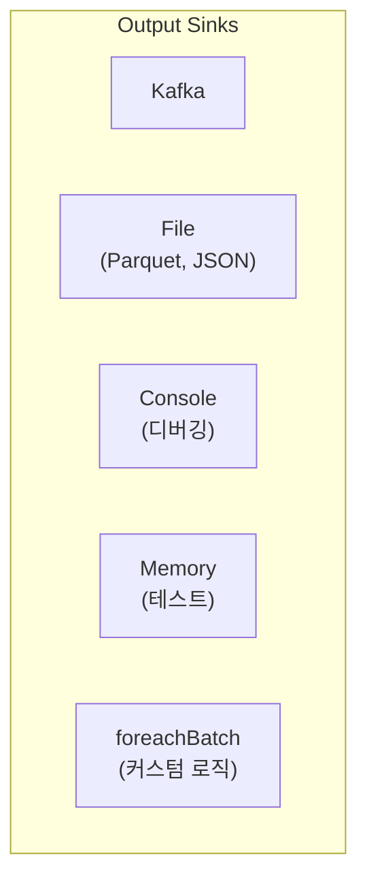

---

## Kafka → Spark Streaming 연동

### 기본 구조

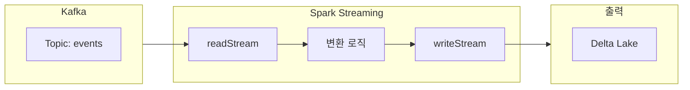

### 코드 예시

```python
from pyspark.sql import SparkSession
from pyspark.sql.functions import from_json, col
from pyspark.sql.types import StructType, StringType, TimestampType, DoubleType

spark = SparkSession.builder \
    .appName("StreamingApp") \
    .getOrCreate()

# 스키마 정의
event_schema = StructType() \
    .add("user_id", StringType()) \
    .add("event_type", StringType()) \
    .add("timestamp", TimestampType()) \
    .add("amount", DoubleType())

# Kafka에서 읽기
df = spark.readStream \
    .format("kafka") \
    .option("kafka.bootstrap.servers", "localhost:9092") \
    .option("subscribe", "user_events") \
    .option("startingOffsets", "latest") \
    .load()

# value 파싱 (Kafka 메시지는 binary)
parsed = df.select(
    from_json(col("value").cast("string"), event_schema).alias("data")
).select("data.*")

# 변환 로직 (배치와 동일!)
result = parsed.filter(col("amount") > 0)

# 출력
query = result.writeStream \
    .format("delta") \
    .option("checkpointLocation", "/checkpoints/events") \
    .outputMode("append") \
    .start("/delta/events")

query.awaitTermination()
```

---

## Output Modes

### 세 가지 모드

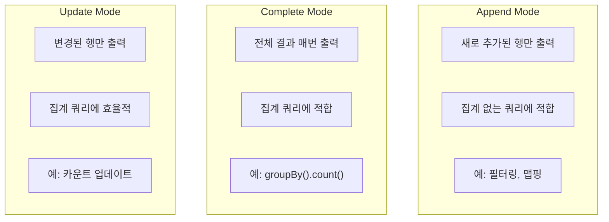

### 언제 어떤 모드?

| 쿼리 유형 | Append | Complete | Update |
|----------|--------|----------|--------|
| **SELECT, WHERE** | ✅ | ❌ | ✅ |
| **집계 (groupBy)** | ❌* | ✅ | ✅ |
| **워터마크 + 집계** | ✅ | ✅ | ✅ |

*워터마크 없는 집계는 Append 불가

---

## Event Time vs Processing Time

### 두 시간의 차이

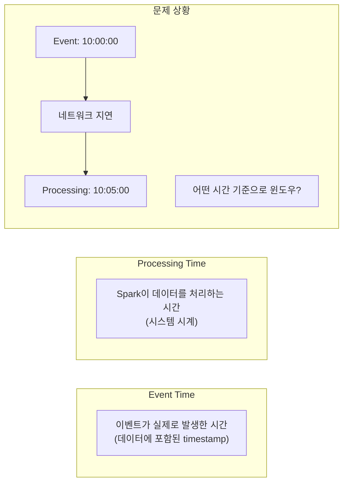

### Event Time 처리

```python
# timestamp 컬럼을 Event Time으로 사용
parsed = df.select(
    from_json(col("value").cast("string"), event_schema).alias("data")
).select("data.*")

# Event Time 기준 윈도우 집계
result = parsed \
    .groupBy(
        window(col("timestamp"), "5 minutes"),
        col("event_type")
    ) \
    .count()
```

---

## Watermark와 Late Data

### 왜 Watermark가 필요한가?

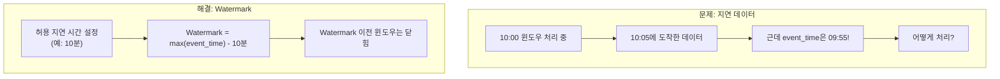

### Watermark 동작 방식

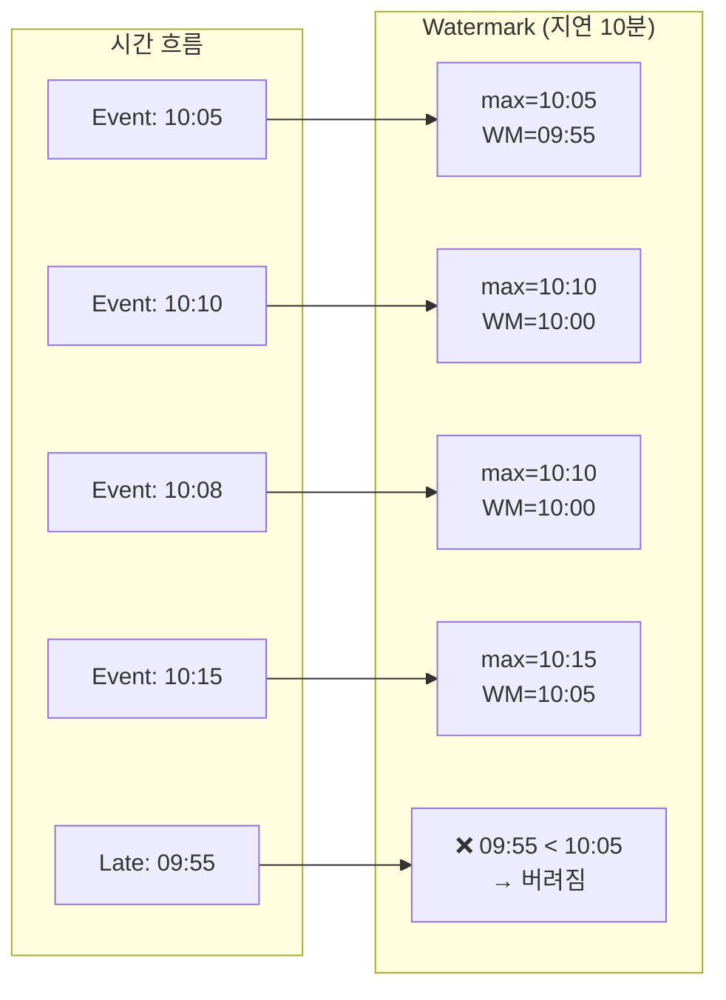

### 코드 예시

```python
from pyspark.sql.functions import window, col

# Watermark 설정: 10분 지연 허용
result = parsed \
    .withWatermark("timestamp", "10 minutes") \
    .groupBy(
        window(col("timestamp"), "5 minutes"),
        col("page")
    ) \
    .agg(count("*").alias("views"))

# Watermark 덕분에 Append 모드 가능
query = result.writeStream \
    .format("delta") \
    .outputMode("append") \
    .option("checkpointLocation", "/checkpoints/views") \
    .start("/delta/page_views")
```

---

## Window 연산

### Window 종류

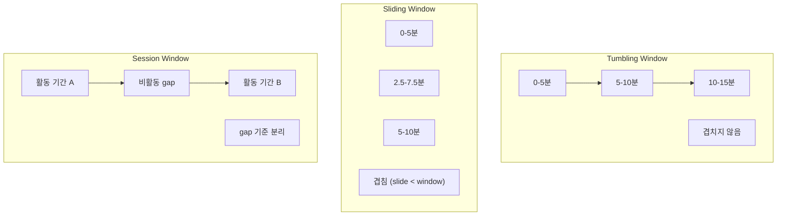

### Window 함수 사용

```python
from pyspark.sql.functions import window, sum, avg

# Tumbling Window: 5분 윈도우
tumbling = parsed \
    .groupBy(window("timestamp", "5 minutes")) \
    .agg(sum("amount").alias("total"))

# Sliding Window: 10분 윈도우, 5분 슬라이드
sliding = parsed \
    .groupBy(window("timestamp", "10 minutes", "5 minutes")) \
    .agg(avg("amount").alias("avg_amount"))

# Session Window (Spark 3.2+)
session = parsed \
    .groupBy(
        session_window("timestamp", "10 minutes"),
        col("user_id")
    ) \
    .agg(count("*").alias("session_events"))
```

---

## 체크포인팅과 장애 복구

### 체크포인트 구조

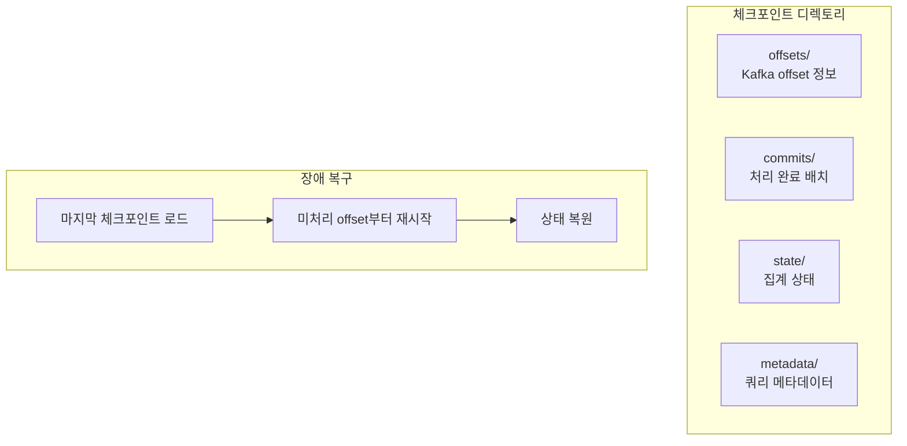

### Exactly-Once 보장

```python
# 체크포인트 필수 설정
query = result.writeStream \
    .format("delta") \
    .outputMode("append") \
    .option("checkpointLocation", "hdfs://path/checkpoints/my_query") \
    .trigger(processingTime="1 minute") \
    .start("/delta/output")
```

**체크포인트가 보장하는 것**:

- Kafka offset 추적 → 중복 읽기 방지
- 상태 저장 → 집계 결과 유지
- Atomic 커밋 → Exactly-Once

---

## 실전 예제: 실시간 클릭스트림 분석

```python
from pyspark.sql import SparkSession
from pyspark.sql.functions import (
    from_json, col, window, count, sum, avg,
    current_timestamp, expr
)
from pyspark.sql.types import StructType, StringType, TimestampType

spark = SparkSession.builder \
    .appName("ClickstreamAnalysis") \
    .config("spark.sql.adaptive.enabled", "true") \
    .getOrCreate()

# 스키마
click_schema = StructType() \
    .add("user_id", StringType()) \
    .add("page", StringType()) \
    .add("action", StringType()) \
    .add("timestamp", TimestampType())

# Kafka에서 읽기
clicks = spark.readStream \
    .format("kafka") \
    .option("kafka.bootstrap.servers", "kafka:9092") \
    .option("subscribe", "clickstream") \
    .option("startingOffsets", "latest") \
    .load() \
    .select(
        from_json(col("value").cast("string"), click_schema).alias("click")
    ).select("click.*")

# 5분 윈도우로 페이지별 통계
page_stats = clicks \
    .withWatermark("timestamp", "10 minutes") \
    .groupBy(
        window(col("timestamp"), "5 minutes"),
        col("page")
    ) \
    .agg(
        count("*").alias("view_count"),
        count("user_id").alias("unique_users")
    )

# Delta Lake에 저장
query = page_stats.writeStream \
    .format("delta") \
    .outputMode("append") \
    .option("checkpointLocation", "/checkpoints/clickstream") \
    .trigger(processingTime="1 minute") \
    .start("/delta/page_stats")

# 콘솔에도 출력 (디버깅용)
debug_query = page_stats.writeStream \
    .format("console") \
    .outputMode("update") \
    .trigger(processingTime="30 seconds") \
    .start()

query.awaitTermination()
```

---

## 모니터링

### Streaming Query 상태 확인

```python
# 쿼리 진행 상황
print(query.status)
# {'message': 'Processing new data', 'isActive': True, ...}

# 최근 진행 상황
for progress in query.recentProgress:
    print(f"Batch {progress['batchId']}")
    print(f"  Input rows: {progress['numInputRows']}")
    print(f"  Processing time: {progress['batchDuration']} ms")
```

### Spark UI에서 확인

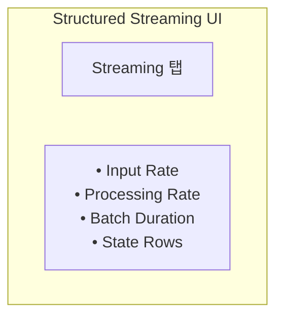

---

## 정리

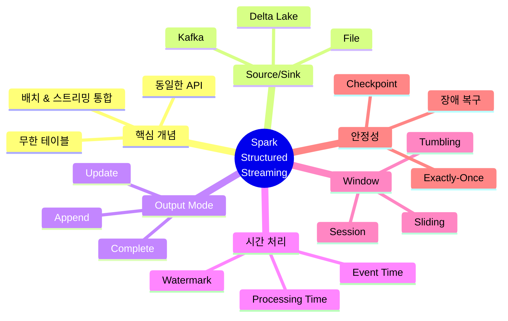

---

## 다음 편 예고

**10편: 레이크하우스 아키텍처**에서는 데이터 저장소를 다룹니다:

- Data Lake vs Data Warehouse
- Delta Lake 심층 분석
- ACID, Time Travel, Schema Evolution
- Apache Iceberg 비교

---

## 참고 자료

- [Structured Streaming Programming Guide](https://spark.apache.org/docs/latest/structured-streaming-programming-guide.html)
- [Kafka Integration](https://spark.apache.org/docs/latest/structured-streaming-kafka-integration.html)
- Databricks, "Real-time Streaming with Spark 3.0"
