# 데이터 엔지니어링 시리즈 #10: 데이터 레이크 vs 웨어하우스 - 레이크하우스 아키텍처

> **대상 독자**: 충분한 경험을 가진 백엔드/풀스택 엔지니어로, PostgreSQL ACID에 익숙하지만 데이터 레이크/웨어하우스는 처음인 분

## 이 편에서 다루는 것

"S3에 Parquet 올려두면 되는 거 아닌가요?" 라는 질문에서 시작합니다. **왜 Delta Lake 같은 테이블 포맷이 필요한지**, 그리고 **레이크하우스가 무엇인지** 배웁니다.

---

## 데이터 저장소의 진화

### 세대별 변화

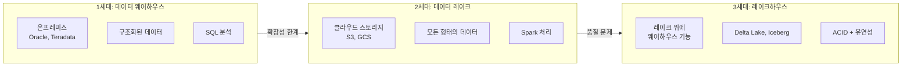

---

## 데이터 웨어하우스 (Data Warehouse)

### 특징

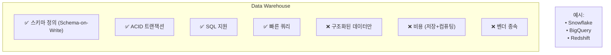

### PostgreSQL과의 비교

| 특성 | PostgreSQL (OLTP) | BigQuery (DW) |
|------|-------------------|---------------|
| **목적** | 트랜잭션 처리 | 분석 쿼리 |
| **스토리지** | Row-based | Column-based |
| **스케일** | 수직 확장 | 무한 수평 확장 |
| **비용** | 서버 비용 | 쿼리당 비용 |
| **쿼리 속도** | 단건 빠름 | 집계 빠름 |

---

## 데이터 레이크 (Data Lake)

### 특징

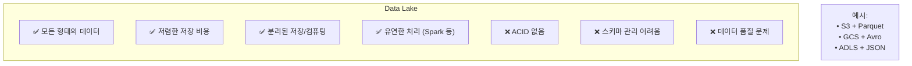

### 데이터 레이크의 문제점

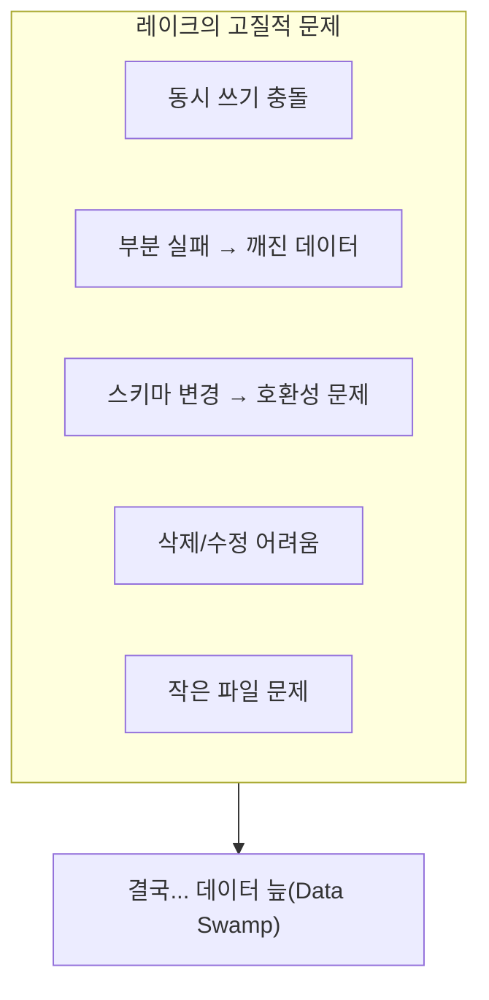

---

## 레이크하우스 (Lakehouse)

### 두 세계의 통합

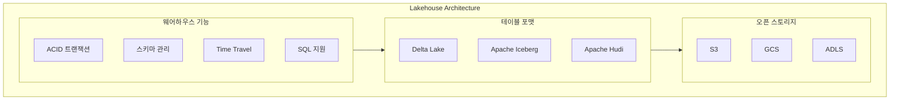

### 핵심 가치

| 특성 | 레이크 | 웨어하우스 | 레이크하우스 |
|------|--------|-----------|-------------|
| **저장 비용** | 저렴 ✅ | 비쌈 | 저렴 ✅ |
| **ACID** | ❌ | ✅ | ✅ |
| **오픈 포맷** | ✅ | ❌ (벤더) | ✅ |
| **ML 지원** | ✅ | 제한적 | ✅ |
| **SQL 분석** | 제한적 | ✅ | ✅ |

---

## Delta Lake 심층 분석

### ACID 트랜잭션

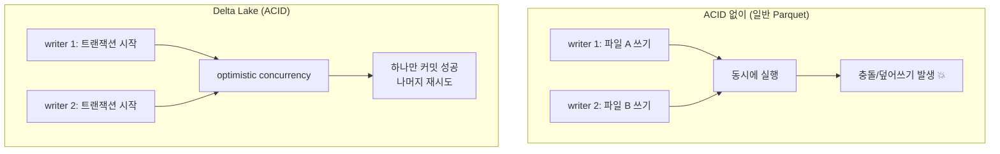

**Delta Lake의 방법**: 트랜잭션 로그 (`_delta_log/`)

```
table/
├── _delta_log/
│   ├── 00000000000000000000.json  # 첫 트랜잭션
│   ├── 00000000000000000001.json  # 두 번째
│   └── 00000000000000000002.json  # 세 번째
├── part-00000.parquet
├── part-00001.parquet
└── part-00002.parquet
```

### Time Travel

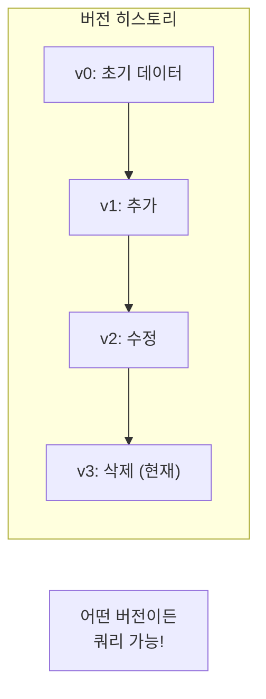

```python
# 특정 버전으로 읽기
df = spark.read.format("delta") \
    .option("versionAsOf", 2) \
    .load("/delta/users")

# 특정 시점으로 읽기
df = spark.read.format("delta") \
    .option("timestampAsOf", "2024-01-01") \
    .load("/delta/users")

# 히스토리 조회
from delta.tables import DeltaTable

dt = DeltaTable.forPath(spark, "/delta/users")
dt.history().show()
```

### Schema Evolution

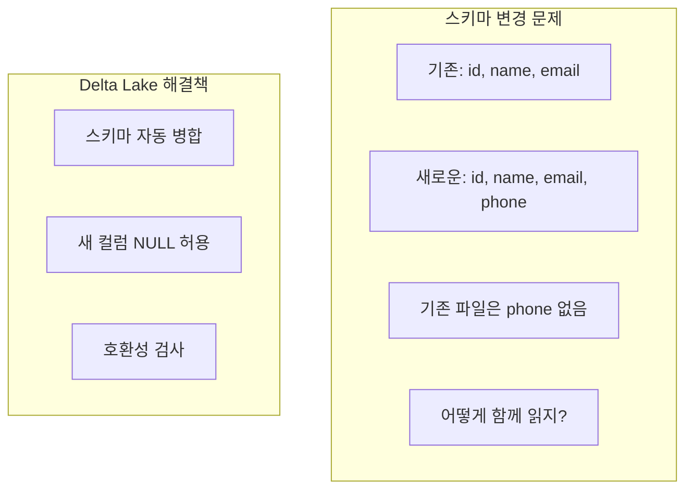

```python
# 자동 스키마 병합
df_new.write.format("delta") \
    .mode("append") \
    .option("mergeSchema", "true") \
    .save("/delta/users")

# 스키마 덮어쓰기 (주의!)
df_new.write.format("delta") \
    .mode("overwrite") \
    .option("overwriteSchema", "true") \
    .save("/delta/users")
```

### MERGE (Upsert)

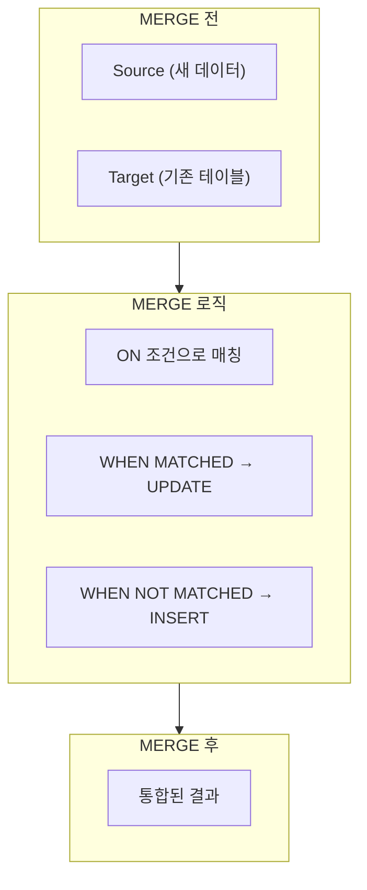

```python
from delta.tables import DeltaTable

# 타겟 테이블
target = DeltaTable.forPath(spark, "/delta/users")

# 소스 데이터 (업데이트할 데이터)
source = spark.read.parquet("/staging/users")

# MERGE 실행
target.alias("t").merge(
    source.alias("s"),
    "t.user_id = s.user_id"
).whenMatchedUpdate(
    set={
        "name": "s.name",
        "email": "s.email",
        "updated_at": "current_timestamp()"
    }
).whenNotMatchedInsert(
    values={
        "user_id": "s.user_id",
        "name": "s.name",
        "email": "s.email",
        "created_at": "current_timestamp()"
    }
).execute()
```

---

## Delta Lake vs Apache Iceberg

### 비교

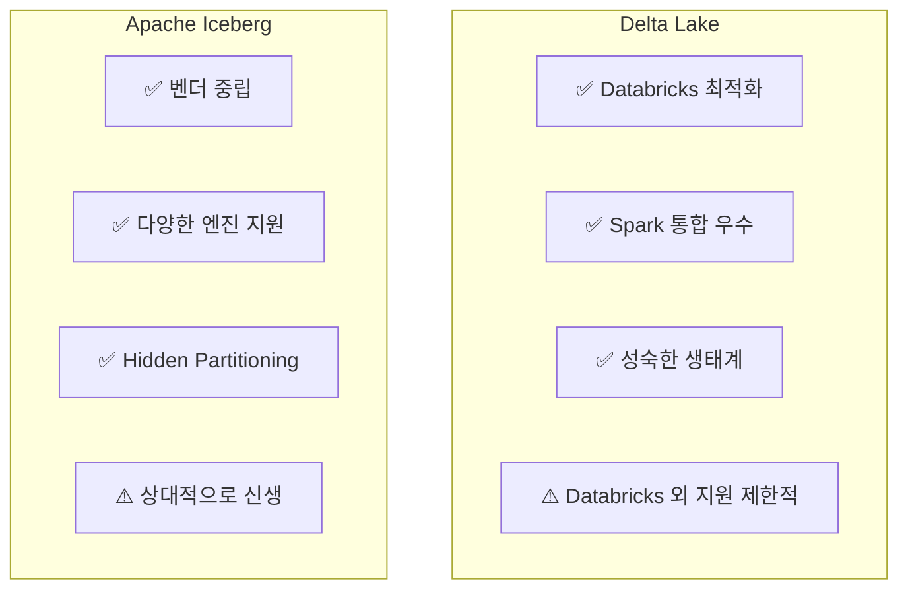

| 특성 | Delta Lake | Apache Iceberg |
|------|-----------|----------------|
| **개발사** | Databricks | Netflix→Apache |
| **Spark 지원** | 최고 | 좋음 |
| **Flink 지원** | 제한적 | 좋음 |
| **Trino 지원** | 좋음 | 좋음 |
| **파티셔닝** | 명시적 | Hidden (투명) |
| **채택율** | 높음 | 증가 중 |

### 선택 가이드

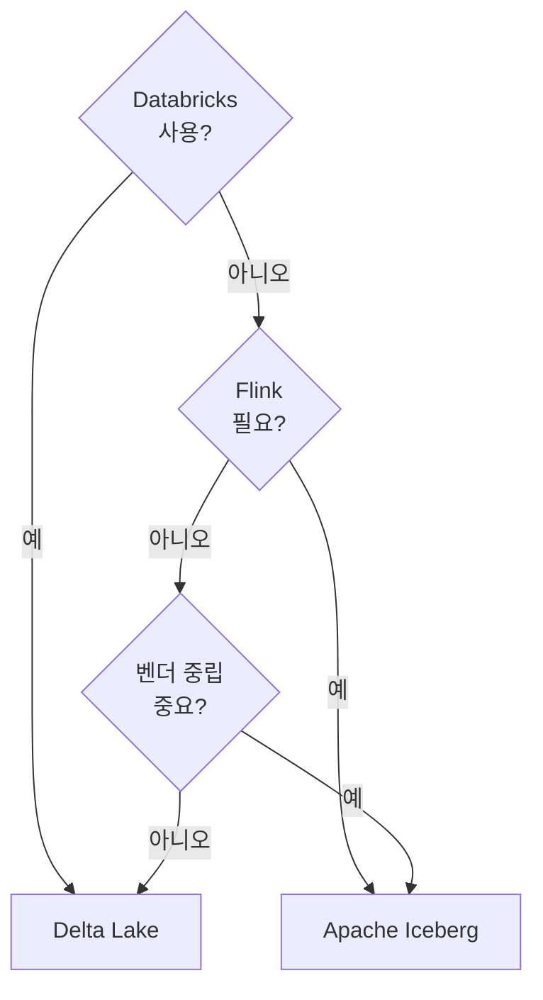

---

## 아키텍처 결정 가이드

### 언제 무엇을 선택하나?

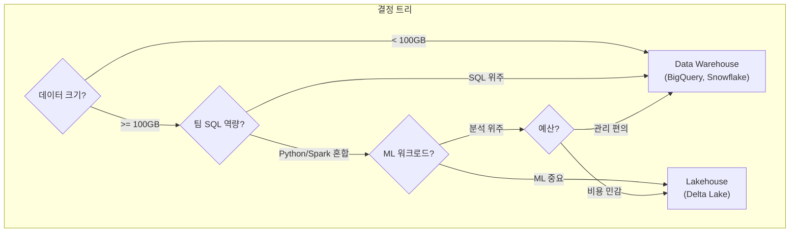

---

## 정리

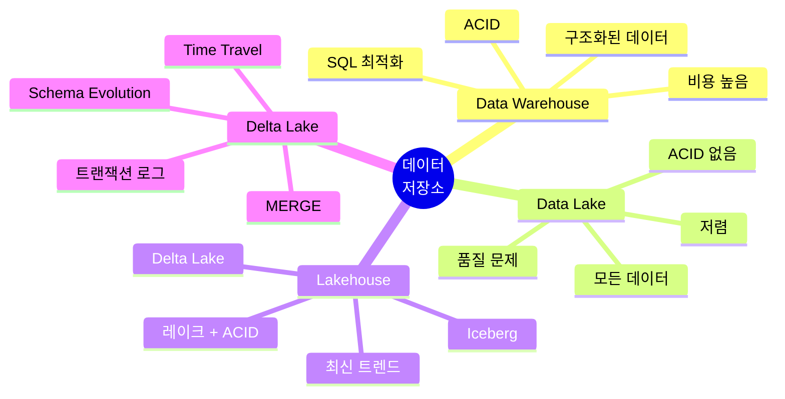

---

## 다음 편 예고

**11편: 데이터 모델링**에서는 분석용 모델링을 다룹니다:

- Star Schema vs Snowflake Schema
- Fact Table vs Dimension Table
- Slowly Changing Dimensions (SCD)

---

## 참고 자료

- [Delta Lake Documentation](https://docs.delta.io/)
- [Apache Iceberg Documentation](https://iceberg.apache.org/docs/latest/)
- Databricks, "The Data Lakehouse" White Paper
- Martin Kleppmann, "Designing Data-Intensive Applications" - Chapter 3
