# 데이터 엔지니어링 시리즈 #11: 데이터 모델링 - Star Schema와 Slowly Changing Dimensions

> **대상 독자**: 충분한 경험을 가진 백엔드/풀스택 엔지니어로, RDBMS 정규화에 익숙하지만 분석용 모델링은 처음인 분

## 이 편에서 다루는 것

백엔드에서의 DB 설계와 **분석용 데이터 모델링은 완전히 다릅니다**. 왜 다른지, 어떻게 설계하는지 배웁니다.

---

## OLTP vs OLAP 모델링의 차이

### 설계 목표가 다르다

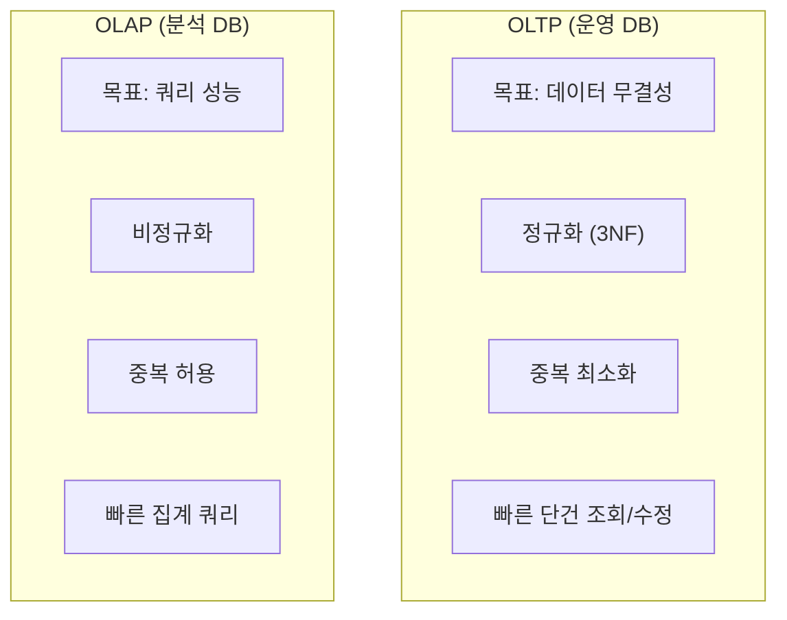

### 예시로 비교

**OLTP (정규화)**:

```sql
-- 주문 조회: 3개 테이블 조인 필요
SELECT o.id, c.name, p.product_name
FROM orders o
JOIN customers c ON o.customer_id = c.id
JOIN products p ON o.product_id = p.id
WHERE o.id = 12345;
```

**OLAP (비정규화)**:

```sql
-- 이미 조인된 상태로 저장
SELECT order_id, customer_name, product_name
FROM fact_orders
WHERE order_id = 12345;
```

### 왜 비정규화하는가?

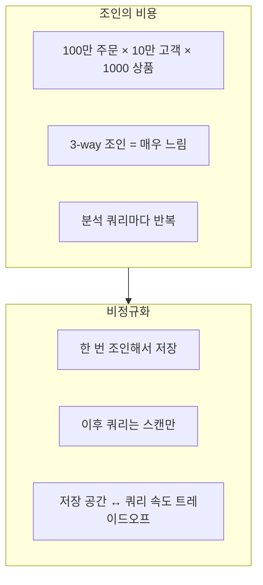

---

## Kimball vs Inmon

### 두 가지 방법론

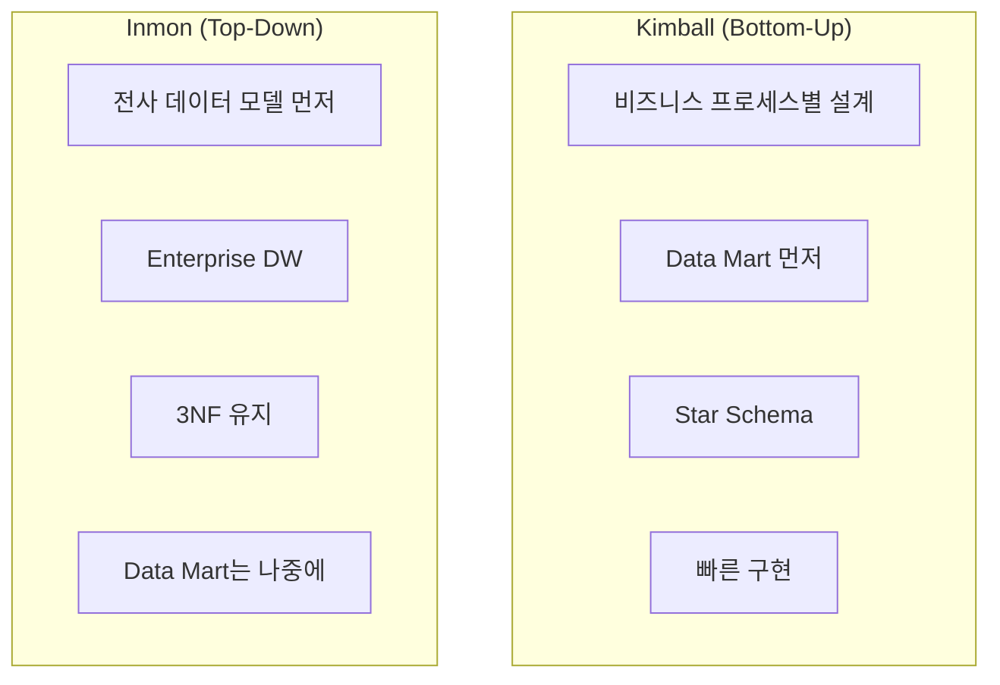

| 특성 | Kimball | Inmon |
|------|---------|-------|
| **접근** | Bottom-Up | Top-Down |
| **시작점** | 비즈니스 요구 | 전사 모델 |
| **구현 속도** | 빠름 | 느림 |
| **일관성** | Mart별 다를 수 있음 | 높음 |
| **복잡도** | 낮음 | 높음 |
| **현대 트렌드** | ✅ 선호 | 일부 채택 |

> **현대 트렌드**: Kimball 방식이 **더 실용적**으로 평가. 빠르게 가치 제공 후 점진적 확장.

---

## Star Schema

### 구조

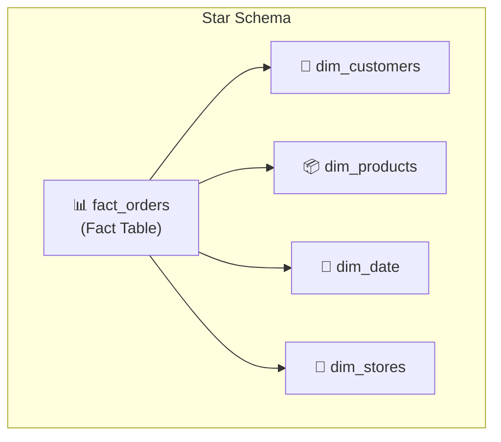

### Fact Table (사실 테이블)

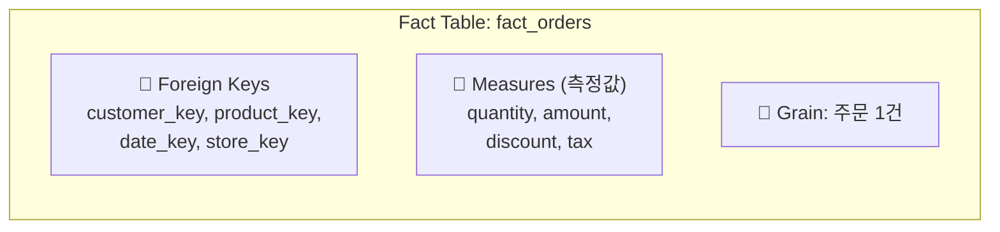

```sql
CREATE TABLE fact_orders (
    -- Surrogate Keys (FK)
    order_key       BIGINT,
    customer_key    BIGINT,
    product_key     BIGINT,
    date_key        INT,
    store_key       BIGINT,
    
    -- Measures
    quantity        INT,
    unit_price      DECIMAL(10,2),
    discount        DECIMAL(5,2),
    total_amount    DECIMAL(12,2),
    
    -- Degenerate Dimension (원본 키)
    order_id        VARCHAR(50)
);
```

### Dimension Table (차원 테이블)

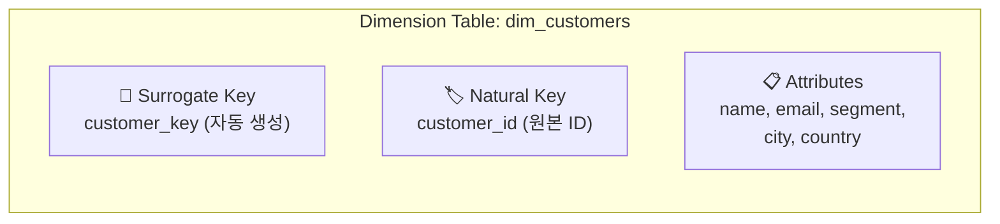

```sql
CREATE TABLE dim_customers (
    -- Surrogate Key
    customer_key    BIGINT PRIMARY KEY,
    
    -- Natural Key
    customer_id     VARCHAR(50),
    
    -- Attributes
    name            VARCHAR(200),
    email           VARCHAR(200),
    segment         VARCHAR(50),
    city            VARCHAR(100),
    country         VARCHAR(50),
    
    -- Metadata
    created_at      TIMESTAMP,
    updated_at      TIMESTAMP
);
```

### 왜 Surrogate Key인가?

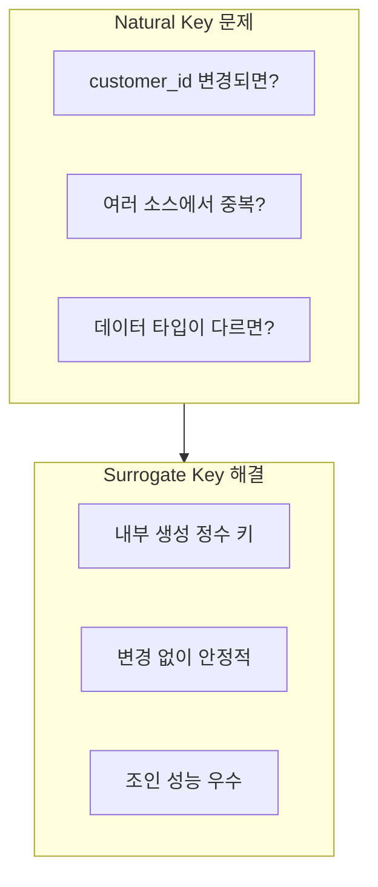

---

## Slowly Changing Dimensions (SCD)

### 문제 상황

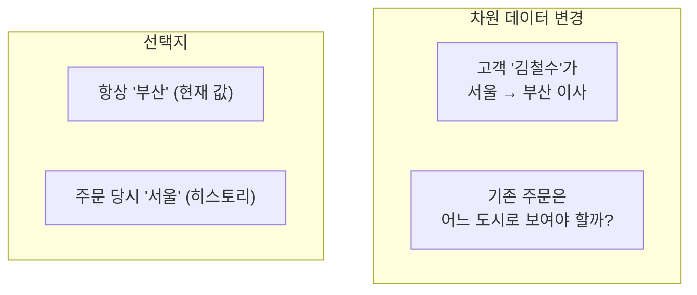

### SCD 유형

| Type | 전략 | 설명 | 히스토리 |
|------|------|------|----------|
| **Type 0** | 유지 | 변경하지 않음 | ❌ |
| **Type 1** | 덮어쓰기 | 최신 값으로 교체 | ❌ |
| **Type 2** | 히스토리 | 새 행 추가 | ✅ |
| **Type 3** | 이전값 컬럼 | 현재 + 이전 값 | 제한적 |

### SCD Type 2 상세

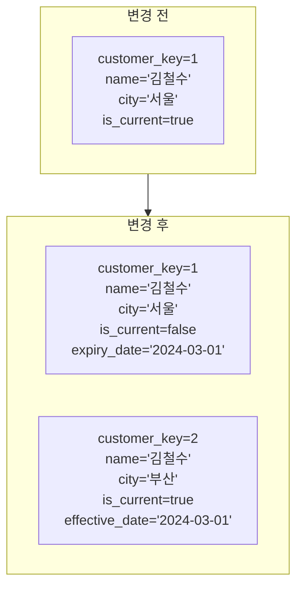

### SCD Type 2 스키마

```sql
CREATE TABLE dim_customers (
    -- Surrogate Key (각 버전마다 다름)
    customer_key    BIGINT PRIMARY KEY,
    
    -- Natural Key (동일)
    customer_id     VARCHAR(50),
    
    -- Attributes
    name            VARCHAR(200),
    email           VARCHAR(200),
    city            VARCHAR(100),
    country         VARCHAR(50),
    
    -- SCD Type 2 Tracking
    effective_date  DATE,
    expiry_date     DATE,        -- NULL = 현재 레코드
    is_current      BOOLEAN
);
```

### Delta Lake MERGE로 SCD Type 2 구현

```python
from delta.tables import DeltaTable
from pyspark.sql.functions import current_date, lit, col

# 기존 차원 테이블
dim_customers = DeltaTable.forPath(spark, "/delta/dim_customers")

# 새로운/변경된 데이터
staging = spark.read.parquet("/staging/customers")

# Step 1: 변경된 레코드 찾기 (기존 current 레코드와 비교)
changes = dim_customers.toDF().alias("dim") \
    .join(staging.alias("stg"), 
          (col("dim.customer_id") == col("stg.customer_id")) & 
          col("dim.is_current")) \
    .filter(
        (col("dim.name") != col("stg.name")) | 
        (col("dim.city") != col("stg.city"))
    ) \
    .select("dim.customer_key")

# Step 2: 기존 레코드 만료 처리
dim_customers.alias("dim").merge(
    changes.alias("chg"),
    "dim.customer_key = chg.customer_key"
).whenMatched().update(
    set={
        "is_current": lit(False),
        "expiry_date": current_date()
    }
).execute()

# Step 3: 새 버전 삽입
new_records = staging.withColumn("effective_date", current_date()) \
    .withColumn("expiry_date", lit(None)) \
    .withColumn("is_current", lit(True)) \
    .withColumn("customer_key", monotonically_increasing_id())

new_records.write.format("delta") \
    .mode("append") \
    .save("/delta/dim_customers")
```

---

## 실전 예제: 이커머스 데이터 모델

### 전체 스키마

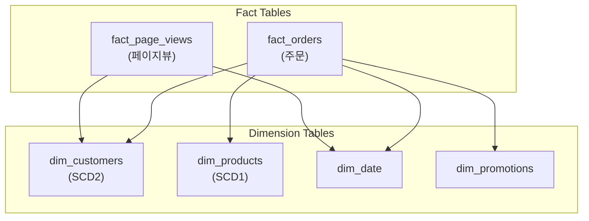

### 분석 쿼리 예시

```sql
-- 월별/세그먼트별 매출
SELECT 
    d.year,
    d.month,
    c.segment,
    SUM(f.total_amount) AS revenue,
    COUNT(DISTINCT c.customer_key) AS customers
FROM fact_orders f
JOIN dim_date d ON f.date_key = d.date_key
JOIN dim_customers c ON f.customer_key = c.customer_key
    AND c.is_current = TRUE  -- 현재 세그먼트 기준
WHERE d.year = 2024
GROUP BY d.year, d.month, c.segment
ORDER BY d.year, d.month;

-- 주문 당시 고객 정보로 분석 (히스토리)
SELECT 
    d.year,
    d.month,
    c.city,  -- 주문 당시 거주 도시
    SUM(f.total_amount) AS revenue
FROM fact_orders f
JOIN dim_date d ON f.date_key = d.date_key
JOIN dim_customers c ON f.customer_key = c.customer_key
    -- SCD2: 주문 날짜가 유효 기간 내
    AND d.full_date >= c.effective_date
    AND (d.full_date < c.expiry_date OR c.expiry_date IS NULL)
GROUP BY d.year, d.month, c.city;
```

---

## Date Dimension

### 필수 패턴

```sql
CREATE TABLE dim_date (
    date_key        INT PRIMARY KEY,    -- YYYYMMDD
    full_date       DATE,
    year            INT,
    quarter         INT,
    month           INT,
    month_name      VARCHAR(20),
    week            INT,
    day_of_week     INT,
    day_name        VARCHAR(20),
    is_weekend      BOOLEAN,
    is_holiday      BOOLEAN,
    fiscal_year     INT,
    fiscal_quarter  INT
);
```

### 미리 채우기

```python
import pandas as pd
from pyspark.sql import SparkSession

# 10년치 날짜 생성
dates = pd.date_range('2020-01-01', '2030-12-31')

dim_date = pd.DataFrame({
    'date_key': dates.strftime('%Y%m%d').astype(int),
    'full_date': dates,
    'year': dates.year,
    'quarter': dates.quarter,
    'month': dates.month,
    'month_name': dates.strftime('%B'),
    'week': dates.isocalendar().week,
    'day_of_week': dates.dayofweek,
    'day_name': dates.strftime('%A'),
    'is_weekend': dates.dayofweek >= 5,
})

spark.createDataFrame(dim_date).write.format("delta") \
    .mode("overwrite") \
    .save("/delta/dim_date")
```

---

## 정리

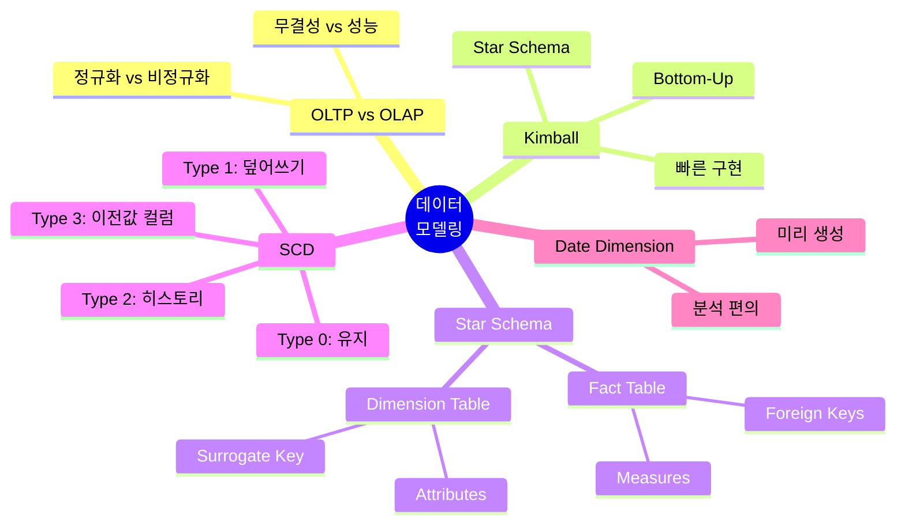

---

## 다음 편 예고

**12편: 데이터 품질**에서는 운영을 다룹니다:

- dbt를 이용한 변환과 테스트
- Great Expectations
- 데이터 계보 (Lineage)
- 모니터링과 관측성

---

## 참고 자료

- Ralph Kimball, "The Data Warehouse Toolkit"
- dbt Labs, "Building Slowly Changing Dimensions"
- Databricks, "Data Modeling Best Practices"
