# 데이터 엔지니어링 시리즈 #12: 데이터 품질 - 테스트, 모니터링, 관측성

> **대상 독자**: 충분한 경험을 가진 백엔드/풀스택 엔지니어로, 소프트웨어 테스트에 익숙하지만 데이터 테스트는 처음인 분

## 이 편에서 다루는 것

"대시보드 숫자가 왜 어제와 달라요?" 이런 질문에 체계적으로 답할 수 있는 **데이터 품질 관리 체계**를 배웁니다.

---

## 데이터 품질이란?

### 품질의 다섯 가지 차원

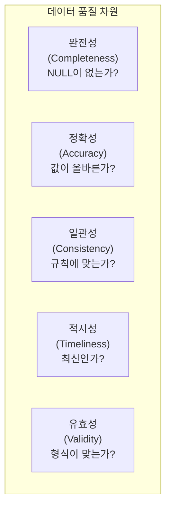

### 소프트웨어 테스트와의 비교

| 특성 | 소프트웨어 테스트 | 데이터 테스트 |
|------|------------------|--------------|
| **대상** | 코드 | 데이터 |
| **시점** | 배포 전 | 파이프라인 실행 중/후 |
| **입력** | 고정 (mock) | 변동 (실제 데이터) |
| **실패 대응** | 배포 중단 | 알림/재처리/격리 |
| **도구** | JUnit, Jest | dbt, Great Expectations |

---

## dbt: 변환과 테스트의 통합

### dbt란?

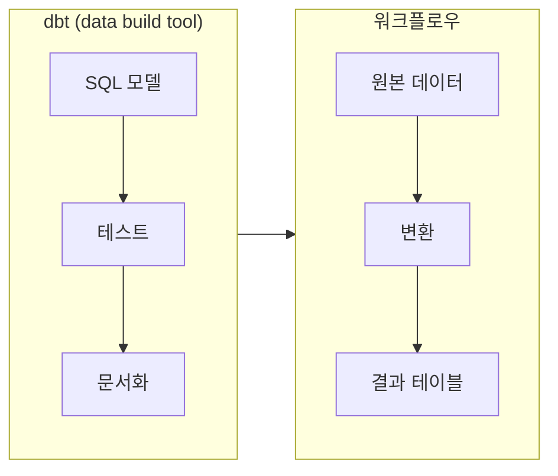

### 핵심 철학

1. **SQL 기반**: 복잡한 코드 없이 SQL만으로 변환
2. **버전 관리**: Git으로 모델 관리
3. **테스트 내장**: 스키마에 테스트 정의
4. **문서 자동화**: 모델 정보 자동 생성
5. **의존성 관리**: ref() 함수로 모델 간 의존성

### 프로젝트 구조

```
my_dbt_project/
├── models/
│   ├── staging/
│   │   ├── stg_orders.sql
│   │   └── schema.yml
│   ├── marts/
│   │   ├── fct_orders.sql
│   │   └── dim_customers.sql
│   └── schema.yml
├── tests/
│   └── custom_tests.sql
├── macros/
├── dbt_project.yml
└── profiles.yml
```

---

## dbt 테스트

### 테스트 종류

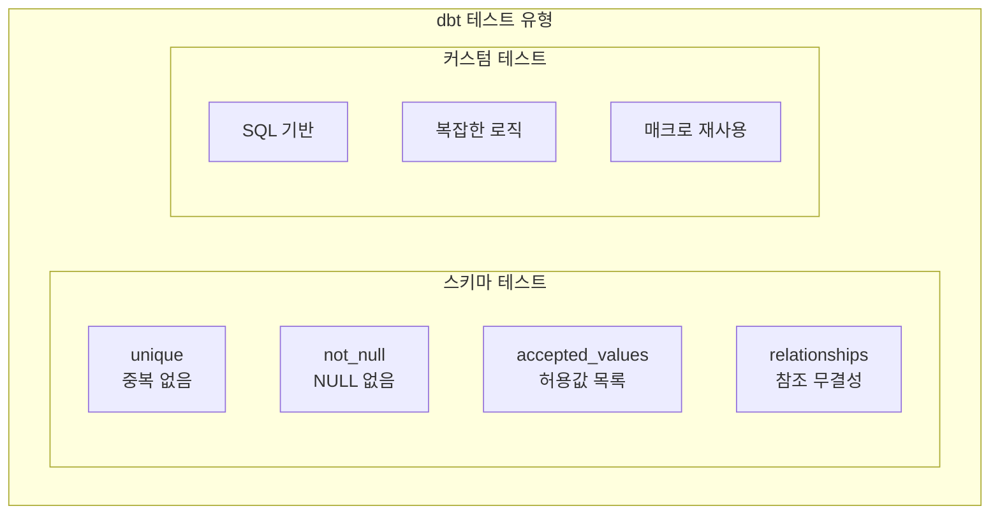

### schema.yml 작성

```yaml
# models/marts/schema.yml
version: 2

models:
  - name: fct_orders
    description: "주문 Fact 테이블"
    columns:
      - name: order_id
        description: "주문 고유 ID"
        data_tests:
          - unique
          - not_null
      
      - name: customer_id
        description: "고객 ID"
        data_tests:
          - not_null
          - relationships:
              to: ref('dim_customers')
              field: customer_id
      
      - name: order_status
        description: "주문 상태"
        data_tests:
          - accepted_values:
              values: ['pending', 'shipped', 'delivered', 'cancelled']
      
      - name: total_amount
        description: "주문 총액"
        data_tests:
          - not_null
          # dbt_utils 패키지 사용
          - dbt_utils.expression_is_true:
              expression: ">= 0"
```

### 커스텀 테스트

```sql
-- tests/assert_positive_revenue.sql
-- 총 매출이 양수인지 확인

SELECT 
    order_date,
    SUM(total_amount) as daily_revenue
FROM {{ ref('fct_orders') }}
GROUP BY order_date
HAVING SUM(total_amount) < 0
```

### 테스트 실행

```bash
# 모든 테스트 실행
dbt test

# 특정 모델 테스트
dbt test --select fct_orders

# 실패 시 상세 정보
dbt test --store-failures
```

---

## 데이터 Freshness

### Source Freshness

```yaml
# models/staging/sources.yml
version: 2

sources:
  - name: raw
    database: production
    schema: public
    freshness:
      warn_after: {count: 12, period: hour}
      error_after: {count: 24, period: hour}
    
    tables:
      - name: orders
        loaded_at_field: _etl_loaded_at
        
      - name: customers
        loaded_at_field: updated_at
```

```bash
# Freshness 체크
dbt source freshness
```

### Freshness 결과

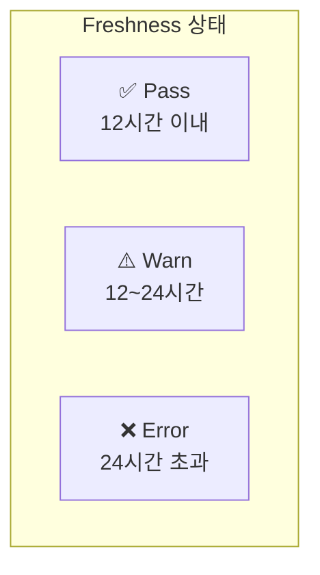

---

## Great Expectations

### dbt와의 비교

| 특성 | dbt | Great Expectations |
|------|-----|-------------------|
| **언어** | SQL | Python |
| **적합한 경우** | SQL 변환 후 테스트 | 원본 데이터 검증 |
| **학습 곡선** | 낮음 | 중간 |
| **유연성** | 제한적 | 높음 |
| **문서화** | 자동 | 자동 (Data Docs) |

### 기본 사용법

```python
import great_expectations as gx

# Context 생성
context = gx.get_context()

# 데이터 소스 연결
datasource = context.sources.add_pandas("my_datasource")
data_asset = datasource.add_dataframe_asset("orders")

# Expectation Suite 정의
suite = context.add_expectation_suite("orders_suite")

# Expectations 추가
suite.add_expectation(
    gx.expectations.ExpectColumnValuesToBeUnique(column="order_id")
)
suite.add_expectation(
    gx.expectations.ExpectColumnValuesToNotBeNull(column="customer_id")
)
suite.add_expectation(
    gx.expectations.ExpectColumnValuesToBeBetween(
        column="total_amount",
        min_value=0,
        max_value=1000000
    )
)
suite.add_expectation(
    gx.expectations.ExpectColumnValuesToMatchRegex(
        column="email",
        regex=r"^[a-zA-Z0-9_.+-]+@[a-zA-Z0-9-]+\.[a-zA-Z0-9-.]+$"
    )
)

# Validation 실행
batch = data_asset.build_batch_request()
results = context.run_checkpoint(
    checkpoint_name="orders_checkpoint",
    batch_request=batch,
    expectation_suite_name="orders_suite"
)

# 결과 확인
print(f"Success: {results.success}")
```

### Airflow 연동

```python
from airflow.decorators import dag, task
from datetime import datetime

@dag(
    dag_id="data_quality_pipeline",
    schedule="@daily",
    start_date=datetime(2024, 1, 1)
)
def quality_pipeline():
    
    @task
    def run_great_expectations(**context):
        import great_expectations as gx
        
        gx_context = gx.get_context()
        results = gx_context.run_checkpoint(
            checkpoint_name="orders_checkpoint"
        )
        
        if not results.success:
            raise ValueError("Data quality check failed!")
        
        return {"success": True, "statistics": results.statistics}
    
    @task
    def run_dbt_tests():
        import subprocess
        result = subprocess.run(["dbt", "test"], capture_output=True)
        
        if result.returncode != 0:
            raise ValueError(f"dbt tests failed: {result.stderr}")
    
    @task
    def load_to_warehouse(quality_result):
        # 품질 검증 통과 후에만 로드
        print("Loading data to warehouse...")
    
    quality = run_great_expectations()
    dbt = run_dbt_tests()
    load_to_warehouse(quality)
    
    # dbt도 통과해야 함
    dbt >> load_to_warehouse

quality_pipeline()
```

---

## 데이터 계보 (Lineage)

### 왜 계보가 중요한가?

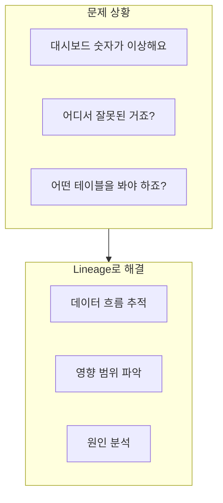

### dbt의 자동 Lineage

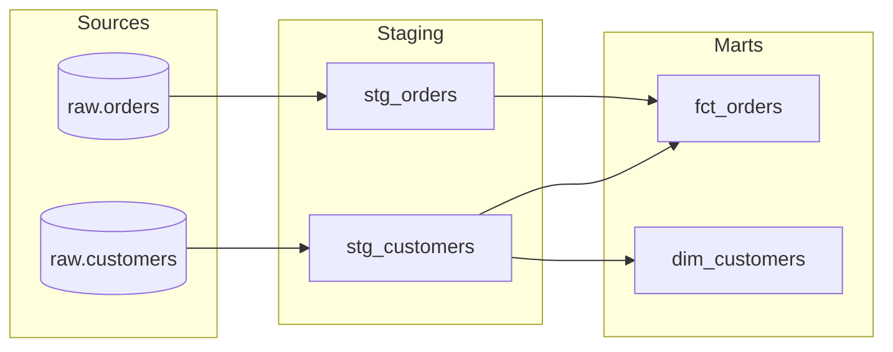

```bash
# Lineage 문서 생성
dbt docs generate
dbt docs serve
```

### OpenLineage 표준

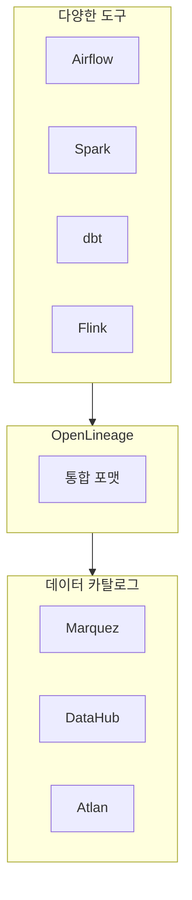

---

## 모니터링과 관측성

### 핵심 지표

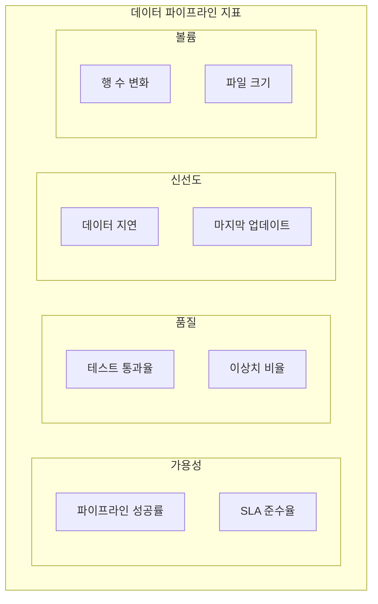

### 이상 탐지

```python
from pyspark.sql import SparkSession
from pyspark.sql.functions import count, avg, stddev

spark = SparkSession.builder.getOrCreate()

# 오늘 데이터
today = spark.read.parquet("/data/today")
today_stats = today.agg(
    count("*").alias("row_count"),
    avg("amount").alias("avg_amount")
).collect()[0]

# 히스토리 (최근 30일 평균)
history = spark.read.parquet("/data/history_30d")
history_stats = history.agg(
    avg("daily_count").alias("avg_count"),
    stddev("daily_count").alias("std_count"),
    avg("daily_avg_amount").alias("avg_amount")
).collect()[0]

# 이상 탐지 (3-sigma)
if abs(today_stats["row_count"] - history_stats["avg_count"]) > 3 * history_stats["std_count"]:
    alert("Row count anomaly detected!")
```

### 대시보드 구성

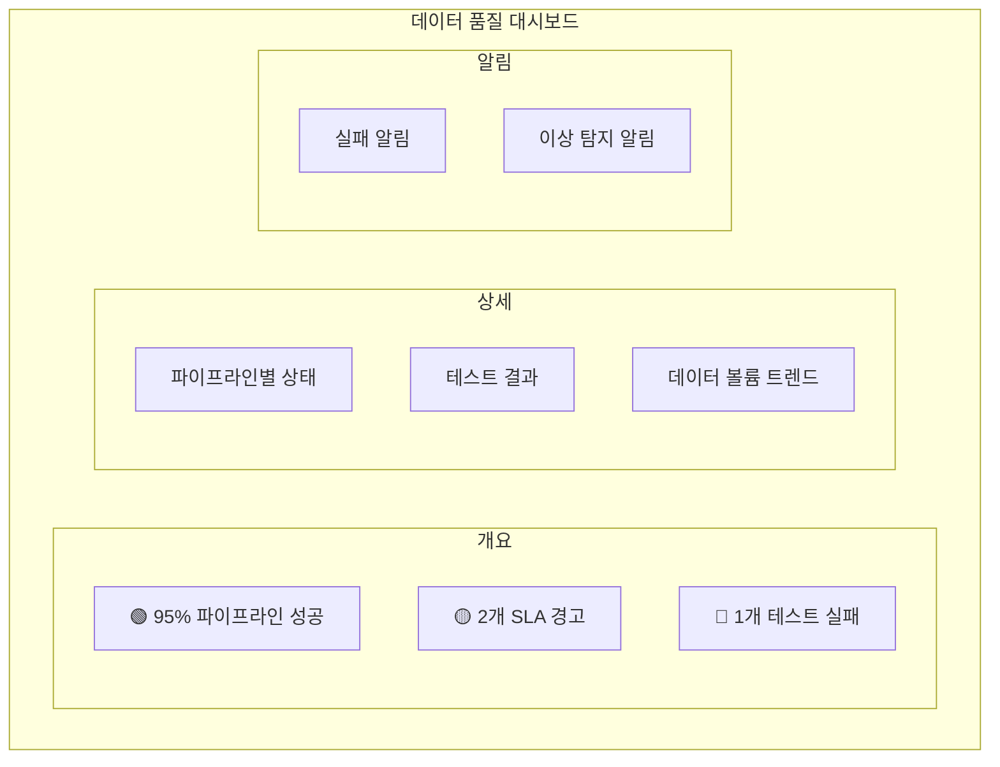

---

## 프로덕션 체크리스트

### 배포 전 확인

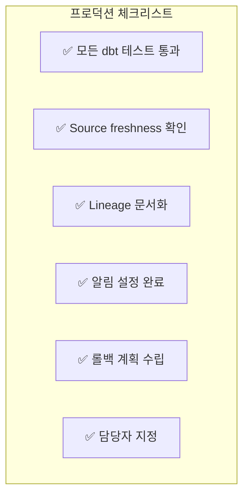

### 일일 운영

| 시간 | 작업 | 담당 |
|------|------|------|
| 09:00 | 야간 배치 결과 확인 | 온콜 |
| 09:30 | 테스트 실패 검토 | 데이터 팀 |
| 10:00 | 이상 알림 처리 | 해당 담당자 |
| 매시 | 자동 freshness 체크 | 자동화 |

---

## 정리

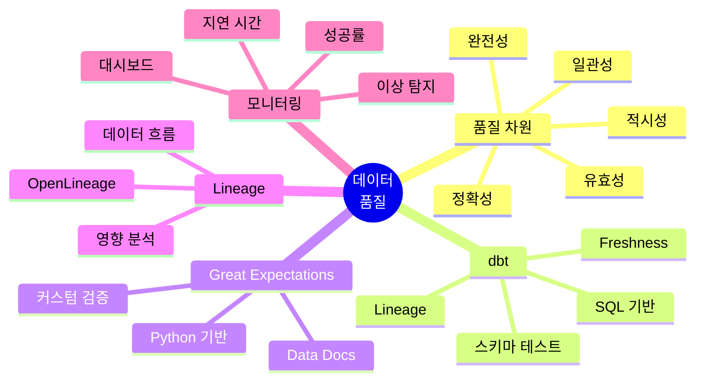

---

## 시리즈 마무리

12편에 걸쳐 데이터 엔지니어링의 핵심을 다뤘습니다:

| Part | 주제 | 핵심 기술 |
|------|------|----------|
| 1-2 | 개념 | OLTP/OLAP, 아키텍처 |
| 3-5 | Spark | RDD, DataFrame, 최적화 |
| 6-7 | Airflow | DAG, TaskFlow, 운영 |
| 8-9 | 스트리밍 | Kafka, Spark Streaming |
| 10-11 | 저장소 | Lakehouse, 모델링 |
| 12 | 품질 | 테스트, 모니터링 |

이제 데이터 파이프라인의 전체 그림을 이해하셨을 겁니다. 실제 프로젝트에 적용하면서 깊이를 더해 가시길 바랍니다!

---

## 참고 자료

- [dbt Documentation](https://docs.getdbt.com/)
- [Great Expectations Documentation](https://docs.greatexpectations.io/)
- [OpenLineage](https://openlineage.io/)
- Monte Carlo, "Data Observability Explained"
- "Fundamentals of Data Engineering" (O'Reilly)
