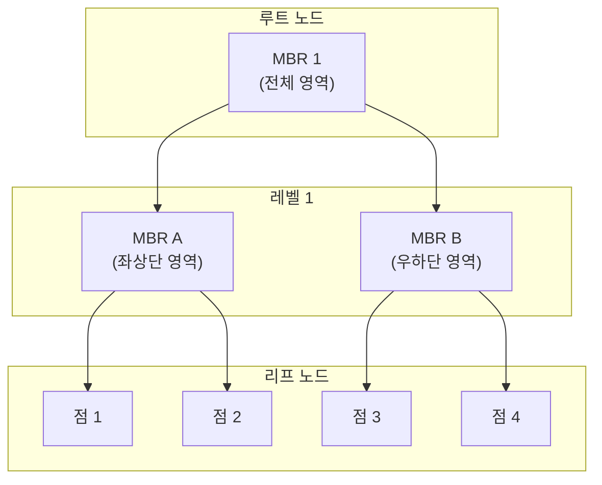
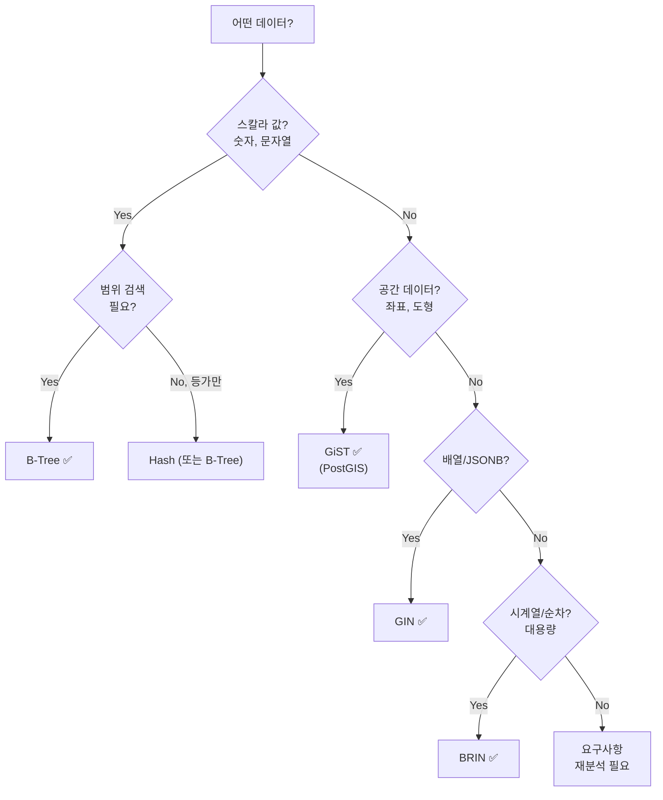

# PostgreSQL 인덱스 Deep Dive: B-Tree부터 GiST까지

## 개요

PostgreSQL은 다양한 인덱스 유형을 제공합니다. 대부분의 경우 **B-Tree**로 충분하지만, 지리 정보, 전문 검색, 범위 데이터 등 특수한 데이터 타입에는 **GiST**, **GIN**, **BRIN** 같은 인덱스가 더 적합합니다.

이 글에서는 각 인덱스 유형의 **내부 구조**, **작동 원리**, 그리고 **실전 활용 시나리오**를 깊이 있게 다룹니다.

---

## 인덱스 유형 한눈에 보기

| 인덱스 유형 | 최적 사용처 | 지원 연산자 | 특징 |
|------------|-----------|-----------|------|
| **B-Tree** | 스칼라 값 (숫자, 문자열) | `=`, `<`, `>`, `BETWEEN`, `ORDER BY` | 기본값, 범용적 |
| **Hash** | 등가 비교만 필요할 때 | `=` | B-Tree보다 약간 빠름, 범위 검색 불가 |
| **GiST** | 공간, 범위, 전문 검색 | `@>`, `<@`, `&&`, `<->` (거리) | 프레임워크형, 확장 가능 |
| **GIN** | 배열, JSONB, 전문 검색 | `@>`, `?`, `@@` | 역인덱스, 읽기 최적화 |
| **BRIN** | 시계열/순차 데이터 | 범위 기반 | 초소형, 대용량 테이블 |

---

## B-Tree: 기본이자 핵심

### 구조

B-Tree는 **균형 이진 검색 트리**의 확장판입니다. 각 노드는 여러 키를 가지며, 키들은 **정렬된 순서**를 유지합니다.

```
           [50]
       /         \
    [20, 30]    [70, 80]
    /   |   \     /   |   \
 [...] [...] [...]  [...] [...]
```

### 작동 원리

1. **검색**: 루트에서 시작해 대소 비교로 내려감 → O(log n)
2. **삽입**: 적절한 리프에 삽입 → 오버플로우 시 페이지 분할
3. **삭제**: 리프에서 제거 → 언더플로우 시 병합

### B-Tree가 좋은 경우

```sql
-- 등가 조건
WHERE email = 'user@example.com'

-- 범위 조건
WHERE created_at BETWEEN '2025-01-01' AND '2025-12-31'

-- 정렬
ORDER BY score DESC

-- 범위 + 정렬 복합
WHERE user_id = 123 ORDER BY created_at DESC
```

### B-Tree의 한계

B-Tree는 **"왼쪽이 작고, 오른쪽이 크다"**라는 순서 관계에 의존합니다. 그런데 다음과 같은 질문에는 답할 수 없습니다:

- "서울역에서 반경 1km 내의 카페는?"
- "이 문서에서 'PostgreSQL'과 'index'가 모두 등장하는가?"
- "이 시간대와 겹치는 예약이 있는가?"

이러한 질문들은 **서로 다른 차원**의 비교가 필요하며, 단순 대소 비교로는 해결되지 않습니다.

---

## GiST: 일반화된 검색 트리

### GiST란?

**GiST(Generalized Search Tree)**는 '일반화된 검색 트리'로, B-Tree처럼 균형 잡힌 트리 구조를 가지지만 **임의의 데이터 타입에 대한 인덱싱**을 지원하는 **프레임워크**입니다.

> [!TIP]
> GiST는 인덱스 자체가 아니라, **새로운 인덱스 유형을 쉽게 만들 수 있는 템플릿**입니다. PostgreSQL에서 새로운 인덱스를 바닥부터 구현하려면 락(Lock), WAL(Write-Ahead Log), 버퍼 관리 등 저수준 처리가 필요하지만, GiST는 이를 대신 처리해 개발자가 **도메인 로직**에만 집중할 수 있게 합니다.

### GiST의 핵심 아이디어: 조건식(Predicate)

B-Tree에서는 "30보다 크고 50보다 작은 값"처럼 **값의 순서**로 자식을 찾습니다.

GiST에서는 각 노드가 **조건식(Predicate)**을 가집니다:

- **리프 노드**: "이 행의 데이터는 조건 P를 만족한다"
- **내부 노드**: "내 자식들의 모든 데이터는 조건 P를 만족한다"

즉, 내부 노드의 조건식은 **자식들의 조건을 모두 포함하는 가장 작은 범위**를 가집니다.

### 구조 시각화: R-Tree (공간 인덱스)

GiST 위에 구현된 대표적인 예가 **R-Tree**입니다. 평면의 점(Point)이나 다각형을 인덱싱합니다.



**MBR(Minimum Bounding Rectangle)**은 자식들을 모두 포함하는 **최소 사각형**입니다.

> [!NOTE]
> 점 데이터조차 내부적으로는 "하나의 점으로 축소된 사각형"으로 저장됩니다. 이렇게 해야 점, 선, 다각형을 동일한 구조로 처리할 수 있습니다.

### 검색 작동 방식

GiST 검색은 `consistency` 함수를 사용합니다:

1. **루트 노드에서 시작**
2. **깊이 우선 탐색(DFS)**: 각 노드에서 `consistency` 함수로 "이 노드를 탐색해야 하는가?" 판단
3. **여러 경로 탐색 가능**: B-Tree와 달리, 검색 조건에 부합하는 노드가 여러 개일 수 있음

예를 들어, "반경 1km 내 점 찾기" 쿼리에서:

- MBR이 원과 **전혀 겹치지 않으면** → 해당 서브트리 스킵
- MBR이 원과 **겹치면** → 자식 노드 탐색

### 삽입과 삭제: 성능 특성

**삽입 시**:

- 부모 노드의 MBR 확장을 **최소화**하는 위치 선택
- 페이지 오버플로우 시 분할

**삭제 시**:

- 리프에서 데이터 삭제
- ⚠️ **부모의 MBR은 자동으로 줄어들지 않음**
- 이로 인해 데이터 변경이 잦으면 **인덱스 효율 저하**

> [!CAUTION]
> 데이터 변경이 빈번한 테이블에서 GiST 인덱스를 사용하면, 정기적인 `REINDEX` 또는 `VACUUM FULL`이 필요할 수 있습니다.

### GiST 실전 활용

#### 1. 공간 데이터 (PostGIS)

```sql
-- 공간 인덱스 생성
CREATE INDEX idx_locations_geom ON locations USING GIST(geom);

-- 반경 검색 (k-NN)
SELECT name, ST_Distance(geom, ST_MakePoint(127.0, 37.5))
FROM locations
ORDER BY geom <-> ST_MakePoint(127.0, 37.5)
LIMIT 10;
```

`<->` 연산자는 **거리 기반 정렬**을 지원합니다. 이것이 GiST의 강력한 기능인 **k-NN(k-Nearest Neighbor) 검색**입니다.

#### 2. 범위 데이터 (시간, 숫자 범위)

```sql
-- 예약 시간대 테이블
CREATE TABLE reservations (
    id SERIAL PRIMARY KEY,
    room_id INT,
    time_range TSRANGE
);

-- 범위 인덱스
CREATE INDEX idx_reservations_time ON reservations USING GIST(time_range);

-- 겹치는 예약 찾기
SELECT * FROM reservations
WHERE time_range && '[2025-01-15 14:00, 2025-01-15 16:00)'::tsrange;
```

#### 3. 배타적 제약 조건 (Exclusion Constraint)

GiST는 **UNIQUE 제약의 일반화**인 배타적 제약 조건을 지원합니다:

```sql
-- btree_gist 확장 필요 (스칼라 타입에 GiST 적용)
CREATE EXTENSION btree_gist;

-- 같은 방에 겹치는 예약 금지
ALTER TABLE reservations ADD CONSTRAINT no_overlapping_reservations
    EXCLUDE USING GIST (room_id WITH =, time_range WITH &&);
```

이제 같은 `room_id`에 대해 `time_range`가 겹치는 행을 삽입하려 하면 자동으로 거부됩니다.

#### 4. 전문 검색 (tsvector)

```sql
CREATE INDEX idx_documents_fts ON documents USING GIST(to_tsvector('english', content));

SELECT * FROM documents
WHERE to_tsvector('english', content) @@ to_tsquery('postgresql & index');
```

> [!NOTE]
> 전문 검색에서는 일반적으로 **GIN 인덱스**가 더 정밀하고 빠릅니다. GiST는 시그니처 기반으로 동작해 false positive가 발생할 수 있습니다. 다만 **삽입 속도**는 GiST가 더 빠를 수 있어, 쓰기가 많은 워크로드에서 고려할 수 있습니다.

---

## GiST vs 다른 인덱스

### GiST vs B-Tree

| 특성 | B-Tree | GiST |
|-----|--------|------|
| **원리** | 값의 순서 비교 | 조건식(Predicate) 기반 |
| **정렬** | 자연스러운 정렬 지원 | 정렬 보장 없음 (거리 정렬은 지원) |
| **최적 대상** | 스칼라 값 | 공간, 범위, 복합 조건 |
| **유니크 제약** | ✅ 지원 | ❌ 미지원 (배타적 제약 사용) |
| **다중 컬럼** | ✅ 지원 | ✅ 지원 |

### GiST vs GIN

| 특성 | GiST | GIN |
|-----|------|-----|
| **구조** | 트리 | 역인덱스 |
| **전문 검색 정밀도** | 낮음 (시그니처 손실) | 높음 |
| **읽기 성능** | 보통 | 빠름 |
| **쓰기 성능** | 빠름 | 느림 (pending list 사용 가능) |
| **k-NN 검색** | ✅ 지원 | ❌ 미지원 |

---

## 인덱스 내부 확인하기

### pageinspect (B-Tree, Hash 등)

```sql
CREATE EXTENSION pageinspect;

-- B-Tree 메타페이지
SELECT * FROM bt_metap('idx_users_email');

-- 특정 페이지 내용
SELECT * FROM bt_page_items('idx_users_email', 1);
```

### gevel (GiST 전용)

표준 도구로는 GiST 내부를 보기 어렵습니다. `gevel` 확장을 사용합니다:

```sql
-- 설치 후
SELECT * FROM gist_stat('idx_locations_geom');
-- level | 페이지 수 | 튜플 수 등 통계

SELECT * FROM gist_tree('idx_locations_geom');
-- 트리 구조 시각화
```

---

## 인덱스 선택 가이드



---

## 성능 최적화 체크리스트

1. ✅ **기본은 B-Tree** - 특별한 이유 없이 다른 인덱스 사용하지 않기
2. ✅ **공간 데이터는 GiST** - PostGIS와 함께 사용
3. ✅ **범위 겹침 검사는 GiST** - 배타적 제약 조건 활용
4. ✅ **전문 검색은 GIN** - 정밀도와 성능 우선
5. ✅ **GiST 인덱스 정기 재구성** - 데이터 변경 잦으면 `REINDEX`

---

## 마무리

PostgreSQL의 인덱스 시스템은 단순한 B-Tree를 넘어 **다양한 데이터 모델을 지원하는 확장 가능한 아키텍처**를 가지고 있습니다. GiST는 이 아키텍처의 핵심으로, 공간 데이터, 범위 데이터, 전문 검색 등 복잡한 쿼리를 효율적으로 처리할 수 있게 합니다.

핵심은 **데이터의 특성을 이해하고 적절한 인덱스를 선택**하는 것입니다:

- 단순 비교 → B-Tree
- 공간/거리/겹침 → GiST
- 포함 관계/역인덱스 → GIN
- 순차/대용량 → BRIN

---

## 참고 자료

- [PostgreSQL Index Types 공식 문서](https://www.postgresql.org/docs/current/indexes-types.html)
- [PostgreSQL GiST 공식 문서](https://www.postgresql.org/docs/current/gist.html)
- [Indexes in PostgreSQL — GiST (Postgres Professional)](https://medium.com/postgres-professional/indexes-in-postgresql-5-gist-86e19781b5db)
- [PostGIS 공식 문서](https://postgis.net/docs/)
- [btree_gist 확장](https://www.postgresql.org/docs/current/btree-gist.html)
