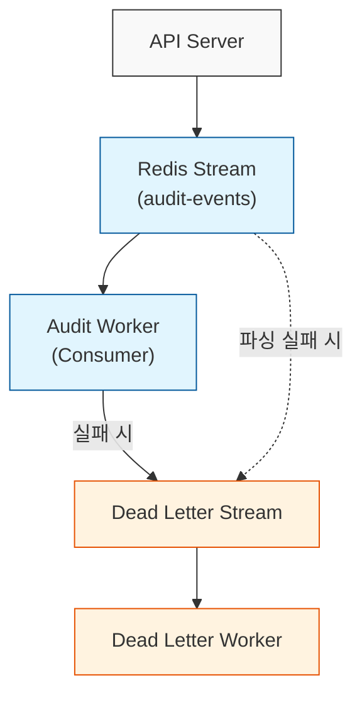

# Redis Streams 기반 비동기 감사 파이프라인 구축

## 개요

데이터 변경 이벤트를 안정적으로 처리해야 하는 감사(Audit) 시스템에서 **Redis Streams**는 강력한 선택입니다. 이 글에서는 메시지 유실 없는 감사 파이프라인을 설계하고, 특히 처리 실패 시의 복구 메커니즘을 포함한 구현 방법을 다룹니다.

## 왜 Redis Streams인가?

### 장점

| 특성 | 설명 |
|------|------|
| **At-least-once 전달** | ACK 메커니즘과 PEL을 통한 메시지 유실 방지 |
| **순서 보장** | 스트림 내 메시지 인입 순서 유지 |
| **고성능** | 인메모리 기반 높은 처리량 |
| **영속성** | AOF/RDB 설정으로 데이터 지속성 보장 |
| **Consumer Group** | 여러 워커 간 수평 확장 및 부하 분산 |

### 단점

| 특성 | 설명 |
|------|------|
| **메모리 압박** | 데이터가 누적되므로 `XTRIM` 등을 통한 관리가 필수적임 |
| **상태 관리 복잡성** | Pending 메시지(PEL) 및 재시도 로직을 직접 제어해야 함 |

## 아키텍처 설계

### 파이프라인 흐름



### 메시지 구조

Redis Streams의 메시지는 불변(Immutable)입니다. 따라서 재시도 횟수 같은 상태값은 메시지 내부에 담기보다 Redis가 제공하는 metadata(delivery count)를 활용하는 것이 효율적입니다.

```go
package audit

import "time"

// EventMessage는 감사 이벤트 메시지입니다.
type EventMessage struct {
    ID            string                 `json:"id"`
    Collection    string                 `json:"collection"`
    DocumentURI   string                 `json:"document_uri"`
    Action        string                 `json:"action"` // CREATE, UPDATE, DELETE
    Version       int32                  `json:"version"`
    Payload       map[string]interface{} `json:"payload"`
    Timestamp     time.Time              `json:"timestamp"`
}

```

## 핵심 구현

### 메시지 발행자 (Producer)

```go
package audit

import (
    "context"
    "encoding/json"
    "fmt"
    
    "[github.com/redis/go-redis/v9](https://github.com/redis/go-redis/v9)"
)

const (
    AuditStreamKey = "audit-events-stream"
)

type EventProducer struct {
    client redis.UniversalClient
}

func NewEventProducer(client redis.UniversalClient) *EventProducer {
    return &EventProducer{client: client}
}

// Publish는 이벤트를 스트림에 발행합니다.
func (p *EventProducer) Publish(ctx context.Context, event *EventMessage) (string, error) {
    payload, err := json.Marshal(event)
    if err != nil {
        return "", fmt.Errorf("marshal event: %w", err)
    }
    
    messageID, err := p.client.XAdd(ctx, &redis.XAddArgs{
        Stream: AuditStreamKey,
        Values: map[string]interface{}{
            "payload": payload,
        },
    }).Result()
    
    if err != nil {
        return "", fmt.Errorf("xadd: %w", err)
    }
    
    return messageID, nil
}

```

### 워커 (Consumer)

Redis Streams에서 `>` ID는 새 메시지만을 의미합니다. 프로세스 재시작 시 처리되지 못한 메시지를 복구하려면 `0` ID를 통해 PEL(Pending Entries List)을 먼저 확인해야 합니다.

```go
// processMessages는 새 메시지와 Pending 메시지를 함께 처리합니다.
func (w *StreamWorker) processMessages(ctx context.Context) {
    // 전략: PEL(Pending Entries List)이 비워질 때까지 우선 처리한 후 새 메시지로 이동
    
    for {
        // 1. 본인의 Pending 메시지("0") 확인
        msgs, err := w.readBatch(ctx, "0")
        if err != nil || len(msgs) == 0 {
            break // 더 이상 처리할 Pending 메시지가 없으면 탈출
        }
        
        for _, m := range msgs {
            w.handleMessage(ctx, m)
        }
        
        // BatchSize보다 적게 가져왔다면 PEL이 거의 비어있다는 뜻이므로 다음으로 진행
        if int64(len(msgs)) < w.config.BatchSize {
            break
        }
    }

    // 2. 이제 새 메시지(">") 처리
    msgs, _ := w.readBatch(ctx, ">")
    for _, m := range msgs {
        w.handleMessage(ctx, m)
    }
}

// 공통 읽기 로직 분리
func (w *StreamWorker) readBatch(ctx context.Context, id string) ([]redis.XMessage, error) {
    streams, err := w.client.XReadGroup(ctx, &redis.XReadGroupArgs{
        Group:    w.config.Group,
        Consumer: w.config.Consumer,
        Streams:  []string{w.config.Stream, id},
        Count:    w.config.BatchSize,
        Block:    w.config.PollInterval,
    }).Result()
    
    if err != nil || len(streams) == 0 {
        return nil, err
    }
    return streams[0].Messages, nil
}

func (w *StreamWorker) handleMessage(ctx context.Context, msg redis.XMessage) {
    var event EventMessage
    
    // 안전한 타입 단언
    payloadRaw, ok := msg.Values["payload"].(string)
    if !ok {
        w.moveToDeadLetter(ctx, msg, fmt.Errorf("invalid payload type"))
        return
    }

    if err := json.Unmarshal([]byte(payloadRaw), &event); err != nil {
        w.moveToDeadLetter(ctx, msg, err)
        return
    }

    // 핸들러 호출
    errs := w.handler.Handle(ctx, []*EventMessage{&event})
    
    if len(errs) > 0 && errs[0] != nil {
        w.handleFailure(ctx, msg, errs[0])
        return
    }
    
    // 성공 시 ACK를 보내 PEL에서 제거
    w.client.XAck(ctx, w.config.Stream, w.config.Group, msg.ID)
}

func (w *StreamWorker) handleFailure(ctx context.Context, msg redis.XMessage, err error) {
    // XPENDING으로 현재 메시지의 전달 횟수(delivery count) 확인
    pends, _ := w.client.XPendingExt(ctx, &redis.XPendingExtArgs{
        Stream: w.config.Stream,
        Group:  w.config.Group,
        Start:  msg.ID,
        End:    msg.ID,
        Count:  1,
    }).Result()

    if len(pends) > 0 && int(pends[0].Count) >= w.config.MaxRetries {
        // 최대 재시도 초과 시 Dead Letter 이동 후 ACK
        w.moveToDeadLetter(ctx, msg, err)
        w.client.XAck(ctx, w.config.Stream, w.config.Group, msg.ID)
        return
    }
    
    // ACK를 하지 않으면 다음 "0" ID 조회 시 재전달됨
}

func (w *StreamWorker) moveToDeadLetter(ctx context.Context, msg redis.XMessage, reason error) {
    w.client.XAdd(ctx, &redis.XAddArgs{
        Stream: w.config.DeadLetterStream,
        Values: map[string]interface{}{
            "original_id": msg.ID,
            "payload":     msg.Values["payload"],
            "error":       reason.Error(),
            "failed_at":   time.Now().Format(time.RFC3339),
        },
    })
}

```

## 모범 사례

1. **ID "0"과 ">"의 조합**: `>`만 사용하면 장애 발생 시 처리 중이던 메시지가 영원히 Pending 상태로 남게 됩니다. 반드시 `0` ID 조회를 병행하세요.
2. **ACK 신중히**: 로직이 완전히 성공한 후에만 `XACK`를 호출해야 At-least-once를 보장할 수 있습니다.
3. **타입 안전성**: Redis 데이터 유효성을 믿지 마세요. 타입 단언 시 반드시 `ok` 패턴을 사용해 패닉을 방지해야 합니다.
4. **XTRIM 정기 실행**: 감사 로그는 양이 매우 많으므로 스트림 생성 시 혹은 주기적으로 `XTRIM`을 수행해 메모리를 관리하세요.

## 참고 자료

* [Redis Streams 공식 문서](https://redis.io/docs/data-types/streams/)
* [go-redis 라이브러리](https://github.com/redis/go-redis)
