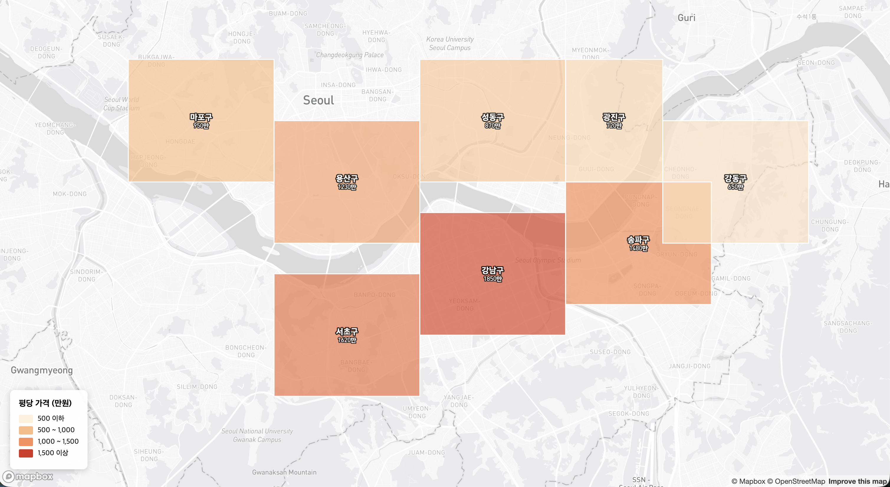

# Mapbox GL JS로 인터랙티브 지도 구현하기

## 개요

**Mapbox GL JS**는 WebGL 기반 벡터 타일 지도 라이브러리입니다. 이 글에서는 두 가지 실용적인 패턴을 다룹니다:

1. **격자 그리드 레이어**: Earth2 스타일의 바둑판 오버레이
2. **영역 폴리곤 레이어**: 네이버부동산 스타일의 지역 표시

## 설치 및 초기화

```bash
npm install mapbox-gl @turf/turf
```

```javascript
import mapboxgl from 'mapbox-gl';
import 'mapbox-gl/dist/mapbox-gl.css';

mapboxgl.accessToken = 'YOUR_ACCESS_TOKEN';

const map = new mapboxgl.Map({
    container: 'map',
    style: 'mapbox://styles/mapbox/dark-v11',  // 격자가 잘 보이는 다크 테마
    center: [127.0, 37.5],
    zoom: 12
});
```

---

## 예시 1: Earth2 스타일 격자 그리드

전 세계를 일정한 크기의 셀로 나누어 바둑판처럼 표시합니다.


### 격자 생성 (Turf.js)

```javascript
import { squareGrid, bboxPolygon } from '@turf/turf';

// 현재 뷰포트 기준 격자 생성
function createGrid(bounds, cellSize = 0.01) {
    const bbox = [bounds.getWest(), bounds.getSouth(), bounds.getEast(), bounds.getNorth()];
    
    // cellSize: 도 단위 (0.01도 ≈ 약 1km)
    const grid = squareGrid(bbox, cellSize, { units: 'degrees' });
    
    // 각 셀에 고유 ID 부여
    grid.features.forEach((cell, i) => {
        cell.id = i;
        cell.properties.cellId = `cell_${i}`;
    });
    
    return grid;
}
```

### 격자 레이어 추가

```javascript
map.on('load', () => {
    const grid = createGrid(map.getBounds(), 0.005);
    
    // 소스 추가
    map.addSource('grid', {
        type: 'geojson',
        data: grid,
        generateId: true
    });
    
    // 격자 면 (Fill)
    map.addLayer({
        id: 'grid-fill',
        type: 'fill',
        source: 'grid',
        paint: {
            'fill-color': [
                'case',
                ['boolean', ['feature-state', 'selected'], false], '#00ff88',
                ['boolean', ['feature-state', 'hover'], false], '#ffffff',
                'transparent'
            ],
            'fill-opacity': [
                'case',
                ['boolean', ['feature-state', 'selected'], false], 0.6,
                ['boolean', ['feature-state', 'hover'], false], 0.2,
                0
            ]
        }
    });
    
    // 격자 선 (Line)
    map.addLayer({
        id: 'grid-line',
        type: 'line',
        source: 'grid',
        paint: {
            'line-color': '#00ff88',
            'line-width': 0.5,
            'line-opacity': 0.5
        }
    });
});
```

### 격자 인터랙션

```javascript
let hoveredCellId = null;
const selectedCells = new Set();

// 호버
map.on('mousemove', 'grid-fill', (e) => {
    if (e.features.length > 0) {
        if (hoveredCellId !== null) {
            map.setFeatureState({ source: 'grid', id: hoveredCellId }, { hover: false });
        }
        hoveredCellId = e.features[0].id;
        map.setFeatureState({ source: 'grid', id: hoveredCellId }, { hover: true });
    }
});

map.on('mouseleave', 'grid-fill', () => {
    if (hoveredCellId !== null) {
        map.setFeatureState({ source: 'grid', id: hoveredCellId }, { hover: false });
    }
    hoveredCellId = null;
});

// 클릭으로 셀 선택/해제
map.on('click', 'grid-fill', (e) => {
    const cellId = e.features[0].id;
    const isSelected = selectedCells.has(cellId);
    
    if (isSelected) {
        selectedCells.delete(cellId);
        map.setFeatureState({ source: 'grid', id: cellId }, { selected: false });
    } else {
        selectedCells.add(cellId);
        map.setFeatureState({ source: 'grid', id: cellId }, { selected: true });
    }
    
    console.log('선택된 셀:', [...selectedCells]);
});
```

### 뷰포트 변경 시 격자 갱신

```javascript
map.on('moveend', () => {
    const newGrid = createGrid(map.getBounds(), 0.005);
    map.getSource('grid').setData(newGrid);
});
```

---

## 예시 2: 네이버부동산 스타일 영역 레이어

행정구역별로 색상과 라벨을 표시하고, 클릭 시 상세 정보를 보여줍니다.



### GeoJSON 데이터 구조

```javascript
const districtsData = {
    type: 'FeatureCollection',
    features: [
        {
            type: 'Feature',
            id: 1,
            properties: {
                name: '강남구',
                avgPrice: 15000000,  // 평당 가격
                changeRate: 2.5      // 변동률 %
            },
            geometry: {
                type: 'Polygon',
                coordinates: [[[127.0, 37.5], [127.1, 37.5], [127.1, 37.52], [127.0, 37.52], [127.0, 37.5]]]
            }
        },
        // ...
    ]
};
```

### 영역 레이어 추가

```javascript
map.on('load', () => {
    map.addSource('districts', {
        type: 'geojson',
        data: districtsData,
        generateId: true
    });
    
    // 영역 면 - 가격에 따른 색상
    map.addLayer({
        id: 'districts-fill',
        type: 'fill',
        source: 'districts',
        paint: {
            'fill-color': [
                'interpolate',
                ['linear'],
                ['get', 'avgPrice'],
                5000000, '#fef0d9',    // 낮은 가격: 연한 색
                10000000, '#fdbb84',
                15000000, '#fc8d59',
                20000000, '#d7301f'    // 높은 가격: 진한 색
            ],
            'fill-opacity': [
                'case',
                ['boolean', ['feature-state', 'hover'], false], 0.9,
                0.6
            ]
        }
    });
    
    // 영역 경계선
    map.addLayer({
        id: 'districts-outline',
        type: 'line',
        source: 'districts',
        paint: {
            'line-color': '#ffffff',
            'line-width': [
                'case',
                ['boolean', ['feature-state', 'hover'], false], 3,
                1
            ]
        }
    });
    
    // 라벨 (구 이름 + 가격)
    map.addLayer({
        id: 'districts-label',
        type: 'symbol',
        source: 'districts',
        layout: {
            'text-field': [
                'format',
                ['get', 'name'], { 'font-scale': 1.2 },
                '\n', {},
                ['concat', ['to-string', ['/', ['get', 'avgPrice'], 10000]], '만원'], { 'font-scale': 0.9 }
            ],
            'text-font': ['DIN Pro Medium', 'Arial Unicode MS Bold'],
            'text-size': 12,
            'text-anchor': 'center'
        },
        paint: {
            'text-color': '#ffffff',
            'text-halo-color': '#000000',
            'text-halo-width': 1
        }
    });
});
```

### 호버 및 팝업

```javascript
let hoveredDistrictId = null;

map.on('mousemove', 'districts-fill', (e) => {
    map.getCanvas().style.cursor = 'pointer';
    
    if (e.features.length > 0) {
        if (hoveredDistrictId !== null) {
            map.setFeatureState({ source: 'districts', id: hoveredDistrictId }, { hover: false });
        }
        hoveredDistrictId = e.features[0].id;
        map.setFeatureState({ source: 'districts', id: hoveredDistrictId }, { hover: true });
    }
});

map.on('mouseleave', 'districts-fill', () => {
    map.getCanvas().style.cursor = '';
    if (hoveredDistrictId !== null) {
        map.setFeatureState({ source: 'districts', id: hoveredDistrictId }, { hover: false });
    }
    hoveredDistrictId = null;
});

// 클릭 시 상세 팝업
map.on('click', 'districts-fill', (e) => {
    const props = e.features[0].properties;
    const changeColor = props.changeRate >= 0 ? '#ff4444' : '#4444ff';
    const changeSign = props.changeRate >= 0 ? '+' : '';
    
    new mapboxgl.Popup()
        .setLngLat(e.lngLat)
        .setHTML(`
            <div style="padding: 8px;">
                <h3 style="margin: 0 0 8px 0;">${props.name}</h3>
                <p style="margin: 4px 0;">평당 가격: <b>${(props.avgPrice / 10000).toFixed(0)}만원</b></p>
                <p style="margin: 4px 0; color: ${changeColor};">
                    변동률: ${changeSign}${props.changeRate}%
                </p>
            </div>
        `)
        .addTo(map);
});
```

### 범례 추가

```html
<div id="legend" style="position: absolute; bottom: 20px; left: 20px; background: white; padding: 10px; border-radius: 4px;">
    <h4>평당 가격</h4>
    <div><span style="background: #fef0d9; width: 20px; height: 10px; display: inline-block;"></span> 500만 이하</div>
    <div><span style="background: #fdbb84; width: 20px; height: 10px; display: inline-block;"></span> 500-1000만</div>
    <div><span style="background: #fc8d59; width: 20px; height: 10px; display: inline-block;"></span> 1000-1500만</div>
    <div><span style="background: #d7301f; width: 20px; height: 10px; display: inline-block;"></span> 1500만 이상</div>
</div>
```

---

## 공통: 동적 데이터 로드

### API에서 GeoJSON 로드

```javascript
async function loadDistricts() {
    const response = await fetch('/api/districts?city=seoul');
    const geojson = await response.json();
    
    if (map.getSource('districts')) {
        map.getSource('districts').setData(geojson);
    } else {
        map.addSource('districts', { type: 'geojson', data: geojson, generateId: true });
        // 레이어 추가...
    }
}
```

### 필터링

```javascript
// 특정 조건만 표시
map.setFilter('districts-fill', ['>', ['get', 'avgPrice'], 10000000]);

// 필터 해제
map.setFilter('districts-fill', null);
```

## 모범 사례

1. **generateId 필수**: Feature State 활용 시 필요
2. **load 이벤트 후 작업**: 소스/레이어는 반드시 `map.on('load', ...)` 내에서
3. **호버 상태 정리**: `mouseleave`에서 상태 초기화 필수
4. **성능**: 격자는 뷰포트 범위로 제한, 전체 로드 금지
5. **메모리**: 컴포넌트 언마운트 시 `map.remove()` 호출

## 참고 자료

- [Mapbox GL JS v3 Documentation](https://docs.mapbox.com/mapbox-gl-js/)
- [Turf.js squareGrid](https://turfjs.org/docs/#squareGrid)
