==⚠  Switch to EXCALIDRAW VIEW in the MORE OPTIONS menu of this document. ⚠== You can decompress Drawing data with the command palette: 'Decompress current Excalidraw file'. For more info check in plugin settings under 'Saving'

# ERD

```mermaid
erDiagram
    PROJECT {
        int project_id PK "프로젝트 ID"
        string name "프로젝트명"
        string language "개발 언어"
        float risk_score "리스크 점수"
        float security_score "보안 점수"
        string current_version "현재 버전"
        string main_branch "메인 브랜치"
        string last_commit_hash "마지막 커밋 해시"
        datetime last_scan_time "마지막 스캔 시간"
    }

    ANALYSIS {
        int analysis_id PK "분석 ID"
        int project_id FK "프로젝트 ID"
        string component_name FK "컴포넌트 이름"
        string status "상태 (Pending, Running, Completed, Failed)"
        string branch "브랜치"
        string result_summary "결과 요약"
        text detail_log_url "상세 로그 URL"
        int duration_seconds "소요 시간(초)"
        datetime start_time "시작 시간"
    }

    ANALYSIS_EVENTS {
        int event_id PK "이벤트 ID"
        int analysis_id FK "분석 ID"
        string component_name FK "컴포넌트 이름"
        string status "상태 (Pending, Running, Completed, Failed)"
        string result_summary "결과 요약"
    }

    VULNERABILITY {
        int vulnerability_id PK "취약점 ID"
        string cve_id "CVE ID"
        string title "제목"
        text description "설명"
        string severity "심각도 (Low, Medium, High)"
        string status "상태 (Backlog, Assigned, In Progress, Resolved)"
        string affected_versions "영향받는 버전"
        string fixed_version "수정된 버전"
        float cvss_score "CVSS 점수"
        text references "참조 URL"
        date due_date "해결 기한"
    }

    PACKAGE {
        int package_id PK "패키지 ID"
        string name "패키지명"
        string version "버전"
        string license "라이선스"
        string homepage_url "홈페이지 URL"
        string repository_url "저장소 URL"
    }

    SCHEDULE {
        int schedule_id PK "스케줄 ID"
        string name "스케줄명"
        string cron_expression "실행 주기 (Cron)"
        string report_type "리포트 타입"
        bool is_active "활성화 여부"
        datetime start_time "시작 시간"
        datetime end_time "종료 시간"
    }

    PERIODIC_REPORT {
        int report_id PK "리포트 ID"
        int schedule_id FK "스케줄 ID (선택)"
        string type "리포트 종류 (시스템)"
        string file_path "파일 경로"
        datetime generated_at "생성일"
    }

    SYSTEM_COMPONENT {
        string component_name PK "컴포넌트명"
        string status "상태"
        float uptime_percentage "가동률"
    }


    PROJECT_PACKAGE {
        int project_id FK "프로젝트 ID"
        int package_id FK "패키지 ID"
    }

    PACKAGE_VULNERABILITY {
        int package_id FK "패키지 ID"
        int vulnerability_id FK "취약점 ID"
    }

    ANALYSIS_VULNERABILITY {
        int analysis_id FK "분석 ID"
        int vulnerability_id FK "취약점 ID"
    }

    %% --- 관계 정의 (Relationships) ---

    %% 핵심 분석 흐름
    PROJECT ||--o{ ANALYSIS : "has"
    ANALYSIS ||--o{ ANALYSIS_EVENTS : "has"
    SYSTEM_COMPONENT ||--o{ ANALYSIS : "is type of"
    SYSTEM_COMPONENT ||--o{ ANALYSIS_EVENTS : "is type of"

    %% 분석과 취약점 (N:M)
    ANALYSIS ||--|{ ANALYSIS_VULNERABILITY : "has"
    VULNERABILITY ||--|{ ANALYSIS_VULNERABILITY : "has"

    %% 프로젝트와 패키지 (N:M)
    PROJECT ||--|{ PROJECT_PACKAGE : "has"
    PACKAGE ||--|{ PROJECT_PACKAGE : "has"

    %% 패키지와 취약점 (N:M)
    PACKAGE ||--|{ PACKAGE_VULNERABILITY : "has"
    VULNERABILITY ||--|{ PACKAGE_VULNERABILITY : "has"

    %% 리포트 스케줄링
    SCHEDULE ||--o{ PERIODIC_REPORT : "generates"
```



# ㅁㅁ

```mermaid
erDiagram
    PROJECT {
        int project_id PK "프로젝트 ID"
        string name "프로젝트명"
        string language "개발 언어"
        float risk_score "리스크 점수"
        float security_score "보안 점수"
        string current_version "현재 버전"
        string main_branch "메인 브랜치"
        string last_commit_hash "마지막 커밋 해시"
        datetime last_scan_time "마지막 스캔 시간"
    }

    ANALYSIS {
        int analysis_id PK "분석 ID"
        int project_id FK "프로젝트 ID"
        string component_name FK "컴포넌트 이름"
        string status "상태 (Pending, Running, Completed, Failed)"
        string branch "브랜치"
        string result_summary "결과 요약"
        text detail_log_url "상세 로그 URL"
        int duration_seconds "소요 시간(초)"
        datetime start_time "시작 시간"
    }

    ANALYSIS_EVENTS {
        int event_id PK "이벤트 ID"
        int analysis_id FK "분석 ID"
        string component_name FK "컴포넌트 이름"
        string status "상태 (Pending, Running, Completed, Failed)"
        string result_summary "결과 요약"
    }

    VULNERABILITY {
        int vulnerability_id PK "취약점 ID"
        string cve_id "CVE ID"
        string title "제목"
        text description "설명"
        string severity "심각도 (Low, Medium, High)"
        string status "상태 (Backlog, Assigned, In Progress, Resolved)"
        string affected_versions "영향받는 버전"
        string fixed_version "수정된 버전"
        float cvss_score "CVSS 점수"
        text references "참조 URL"
        date due_date "해결 기한"
    }

    PACKAGE {
        int package_id PK "패키지 ID"
        string name "패키지명"
        string version "버전"
        string license "라이선스"
        string homepage_url "홈페이지 URL"
        string repository_url "저장소 URL"
    }

    SCHEDULE {
        int schedule_id PK "스케줄 ID"
        string name "스케줄명"
        string cron_expression "실행 주기 (Cron)"
        string report_type "리포트 타입"
        bool is_active "활성화 여부"
        datetime start_time "시작 시간"
        datetime end_time "종료 시간"
    }

    PERIODIC_REPORT {
        int report_id PK "리포트 ID"
        int schedule_id FK "스케줄 ID (선택)"
        string type "리포트 종류 (시스템)"
        string file_path "파일 경로"
        datetime generated_at "생성일"
    }

    SYSTEM_COMPONENT {
        string component_name PK "컴포넌트명"
        string status "상태"
        float uptime_percentage "가동률"
    }

    %% --- 관계 정의 (Relationships) ---

    %% 1:N 관계
    PROJECT ||--o{ ANALYSIS : "triggers"
    ANALYSIS ||--o{ ANALYSIS_EVENTS : "contains"
    SYSTEM_COMPONENT ||--o{ ANALYSIS : "discovers"
    SCHEDULE ||--o{ PERIODIC_REPORT : "generates"

    %% N:M 관계 (직접 표현)
    ANALYSIS }o--o{ VULNERABILITY : "discovers"
    PROJECT }o--o{ PACKAGE : "uses"
    PACKAGE }o--o{ VULNERABILITY : "has"
```



# ss

```mermaid
erDiagram
    PROJECT {
        int project_id PK "프로젝트 ID"
        string name "프로젝트명"
        string language "개발 언어"
        float risk_score "리스크 점수"
        float security_score "보안 점수"
        string current_version "현재 버전"
        string main_branch "메인 브랜치"
        string last_commit_hash "마지막 커밋 해시"
        datetime last_scan_time "마지막 스캔 시간"
    }

    ANALYSIS {
        int analysis_id PK "분석 ID"
        int project_id FK "프로젝트 ID"
        string component_name FK "컴포넌트 이름"
        string status "상태 (Pending, Running, Completed, Failed)"
        string branch "브랜치"
        string result_summary "결과 요약"
        text detail_log_url "상세 로그 URL"
        int duration_seconds "소요 시간(초)"
        datetime start_time "시작 시간"
    }

    ANALYSIS_EVENTS {
        int event_id PK "이벤트 ID"
        int analysis_id FK "분석 ID"
        string component_name FK "컴포넌트 이름"
        string status "상태 (Pending, Running, Completed, Failed)"
        string result_summary "결과 요약"
    }

    VULNERABILITY {
        int vulnerability_id PK "취약점 ID"
        string cve_id "CVE ID"
        string title "제목"
        text description "설명"
        string severity "심각도 (Low, Medium, High)"
        string status "상태 (Backlog, Assigned, In Progress, Resolved)"
        string affected_versions "영향받는 버전"
        string fixed_version "수정된 버전"
        float cvss_score "CVSS 점수"
        text references "참조 URL"
        date due_date "해결 기한"
    }

    PACKAGE {
        int package_id PK "패키지 ID"
        string name "패키지명"
        string version "버전"
        string license "라이선스"
        string homepage_url "홈페이지 URL"
        string repository_url "저장소 URL"
    }

    SCHEDULE {
        int schedule_id PK "스케줄 ID"
        string name "스케줄명"
        string cron_expression "실행 주기 (Cron)"
        string report_type "리포트 타입"
        bool is_active "활성화 여부"
        datetime start_time "시작 시간"
        datetime end_time "종료 시간"
    }

    PERIODIC_REPORT {
        int report_id PK "리포트 ID"
        int schedule_id FK "스케줄 ID (선택)"
        string type "리포트 종류 (시스템)"
        string file_path "파일 경로"
        datetime generated_at "생성일"
    }

    SYSTEM_COMPONENT {
        string component_name PK "컴포넌트명"
        string status "상태"
        float uptime_percentage "가동률"
    }

    %% --- 관계 정의 (Relationships) ---

    %% 1:N 관계
    PROJECT ||--o{ ANALYSIS : "has"
    ANALYSIS ||--o{ ANALYSIS_EVENTS : "has"
    SYSTEM_COMPONENT ||--o{ ANALYSIS : "has"
    SCHEDULE ||--o{ PERIODIC_REPORT : "has"

    %% N:M 관계 (직접 표현)
    ANALYSIS }o--o{ VULNERABILITY : "discovers"
    PROJECT }o--o{ PACKAGE : "discovers"
    PACKAGE }o--o{ VULNERABILITY : "discovers"
```



# aaz

```mermaid
erDiagram
    PROJECT {
        int project_id PK "프로젝트 ID"
        string name "프로젝트명"
        string language "개발 언어"
        float risk_score "리스크 점수"
        float security_score "보안 점수"
        string current_version "현재 버전"
        string main_branch "메인 브랜치"
        string last_commit_hash "마지막 커밋 해시"
        datetime last_scan_time "마지막 스캔 시간"
    }

    ANALYSIS {
        int analysis_id PK "분석 ID"
        int project_id FK "프로젝트 ID"
        string component_name FK "컴포넌트 이름"
        string status "상태 (Pending, Running, Completed, Failed)"
        string branch "브랜치"
        string result_summary "결과 요약"
        text detail_log_url "상세 로그 URL"
        int duration_seconds "소요 시간(초)"
        datetime start_time "시작 시간"
    }

    ANALYSIS_EVENTS {
        int event_id PK "이벤트 ID"
        int analysis_id FK "분석 ID"
        string component_name FK "컴포넌트 이름"
        string status "상태 (Pending, Running, Completed, Failed)"
        string result_summary "결과 요약"
    }

    VULNERABILITY {
        int vulnerability_id PK "취약점 ID"
        string cve_id "CVE ID"
        string title "제목"
        text description "설명"
        string severity "심각도 (Low, Medium, High)"
        string status "상태 (Backlog, Assigned, In Progress, Resolved)"
        string affected_versions "영향받는 버전"
        string fixed_version "수정된 버전"
        float cvss_score "CVSS 점수"
        text references "참조 URL"
        date due_date "해결 기한"
    }

    PACKAGE {
        int package_id PK "패키지 ID"
        string name "패키지명"
        string version "버전"
        string license "라이선스"
        string homepage_url "홈페이지 URL"
        string repository_url "저장소 URL"
    }

    SCHEDULE {
        int schedule_id PK "스케줄 ID"
        string name "스케줄명"
        string cron_expression "실행 주기 (Cron)"
        string report_type "리포트 타입"
        bool is_active "활성화 여부"
        datetime start_time "시작 시간"
        datetime end_time "종료 시간"
    }

    PERIODIC_REPORT {
        int report_id PK "리포트 ID"
        int schedule_id FK "스케줄 ID (선택)"
        string type "리포트 종류 (시스템)"
        string file_path "파일 경로"
        datetime generated_at "생성일"
    }

    SYSTEM_COMPONENT {
        string component_name PK "컴포넌트명"
        string status "상태"
        float uptime_percentage "가동률"
    }

    %% --- 관계 정의 (Relationships) ---

    %% 1:N 관계
    PROJECT ||--o{ ANALYSIS : "Has"
    ANALYSIS ||--o{ ANALYSIS_EVENTS : "Has"
    SYSTEM_COMPONENT ||--o{ ANALYSIS : "Has"
    SCHEDULE ||--o{ PERIODIC_REPORT : "Has"

    %% N:M 관계 (직접 표현)
    ANALYSIS }o--o{ VULNERABILITY : "Many to Many"
    PROJECT }o--o{ PACKAGE : "Many to Many"
    PACKAGE }o--o{ VULNERABILITY : "Many to Many"
```



# zzzzz

```mermaid
erDiagram
    PROJECT {
        int project_id PK "프로젝트 ID"
        string name "프로젝트명"
        string language "개발 언어"
        string current_version "현재 버전"
        string main_branch "메인 브랜치"
        string last_commit_hash "마지막 커밋 해시"
        datetime last_scan_time "마지막 스캔 시간"
    }

    ANALYSIS {
        int analysis_id PK "분석 ID"
        int project_id FK "프로젝트 ID"
        string component_name FK "컴포넌트 이름"
        string status "상태 (Pending, Running, Completed, Failed)"
        string branch "브랜치"
        string result_summary "결과 요약"
        text detail_log_url "상세 로그 URL"
        int duration_seconds "소요 시간(초)"
        datetime start_time "시작 시간"
    }

    ANALYSIS_EVENTS {
        int event_id PK "이벤트 ID"
        int analysis_id FK "분석 ID"
        string component_name FK "컴포넌트 이름"
        string status "상태 (Pending, Running, Completed, Failed)"
        string result_summary "결과 요약"
    }

    VULNERABILITY {
        int vulnerability_id PK "취약점 ID"
        string cve_id "CVE ID"
        string title "제목"
        text description "설명"
        string severity "심각도 (Low, Medium, High)"
        string status "상태 (Backlog, Assigned, In Progress, Resolved)"
        string affected_versions "영향받는 버전"
        string fixed_version "수정된 버전"
        float cvss_score "CVSS 점수"
        text references "참조 URL"
        date due_date "해결 기한"
    }

    PACKAGE {
        int package_id PK "패키지 ID"
        string name "패키지명"
        string version "버전"
        string license "라이선스"
        string homepage_url "홈페이지 URL"
        string repository_url "저장소 URL"
    }

    SCHEDULE {
        int schedule_id PK "스케줄 ID"
        string name "스케줄명"
        string cron_expression "실행 주기 (Cron)"
        string report_type "리포트 타입"
        bool is_active "활성화 여부"
        datetime start_time "시작 시간"
        datetime end_time "종료 시간"
    }

    PERIODIC_REPORT {
        int report_id PK "리포트 ID"
        int schedule_id FK "스케줄 ID (선택)"
        string type "리포트 종류 (시스템)"
        string file_path "파일 경로"
        datetime generated_at "생성일"
    }

    SYSTEM_COMPONENT {
        string component_name PK "컴포넌트명"
        string status "상태"
        float uptime_percentage "가동률"
        float risk_score "리스크 점수"
        float security_score "보안 점수"
    }

    %% --- 관계 정의 (Relationships) ---

    %% 1:N 관계
    PROJECT ||--o{ ANALYSIS : "Has"
    ANALYSIS ||--o{ ANALYSIS_EVENTS : "Has"
    SYSTEM_COMPONENT ||--o{ ANALYSIS : "Has"
    SCHEDULE ||--o{ PERIODIC_REPORT : "Has"

    %% N:M 관계 (직접 표현)
    ANALYSIS }o--o{ VULNERABILITY : "Many to Many"
    PROJECT }o--o{ PACKAGE : "Many to Many"
    PACKAGE }o--o{ VULNERABILITY : "Many to Many"
```



# ㅋㄹㅁㄴㄹ

```mermaid
erDiagram
    PROJECT {
        int project_id PK "프로젝트 ID"
        string name "프로젝트명"
        string language "개발 언어"
        string current_version "현재 버전"
        string main_branch "메인 브랜치"
        string last_commit_hash "마지막 커밋 해시"
        datetime last_scan_time "마지막 스캔 시간"
    }

    ANALYSIS {
        int analysis_id PK "분석 ID"
        int project_id FK "프로젝트 ID"
        string component_name FK "컴포넌트 이름"
        string status "상태 (Pending, Running, Completed, Failed)"
        string branch "브랜치"
        string result_summary "결과 요약"
        text detail_log_url "상세 로그 URL"
        int duration_seconds "소요 시간(초)"
        datetime start_time "시작 시간"
    }

    ANALYSIS_EVENTS {
        int event_id PK "이벤트 ID"
        int analysis_id FK "분석 ID"
        string component_name FK "컴포넌트 이름"
        string status "상태 (Pending, Running, Completed, Failed)"
        string result_summary "결과 요약"
    }

    VULNERABILITY {
        int vulnerability_id PK "취약점 ID"
        string cve_id "CVE ID"
        string title "제목"
        text description "설명"
        string severity "심각도 (Low, Medium, High)"
        string affected_versions "영향받는 버전"
        string fixed_version "수정된 버전"
        float cvss_score "CVSS 점수"
        text references "참조 URL"
        date due_date "해결 기한"
    }

    VULNERABILITY_REMEDIATION {
        int remediation_id PK "수정 아이디"
        int vulnerability_id FK "취약점 ID"
        string status "상태 (Backlog, Assigned, In Progress, Resolved)"
        string remediation_details "수정 세부 사항"
    }

    PACKAGE {
        int package_id PK "패키지 ID"
        string name "패키지명"
        string version "버전"
        string license "라이선스"
        string homepage_url "홈페이지 URL"
        string repository_url "저장소 URL"
    }

    SCHEDULE {
        int schedule_id PK "스케줄 ID"
        string name "스케줄명"
        string cron_expression "실행 주기 (Cron)"
        string report_type "리포트 타입"
        bool is_active "활성화 여부"
        datetime start_time "시작 시간"
        datetime end_time "종료 시간"
    }

    PERIODIC_REPORT {
        int report_id PK "리포트 ID"
        int schedule_id FK "스케줄 ID (선택)"
        string type "리포트 종류 (시스템)"
        string file_path "파일 경로"
        datetime generated_at "생성일"
    }

    SYSTEM_COMPONENT {
        string component_name PK "컴포넌트명"
        string status "상태"
        float uptime_percentage "가동률"
        float risk_score "리스크 점수"
        float security_score "보안 점수"
    }

    %% --- 관계 정의 (Relationships) ---

    %% 1:N 관계
    PROJECT ||--o{ ANALYSIS : "Has"
    ANALYSIS ||--o{ ANALYSIS_EVENTS : "Has"
    SYSTEM_COMPONENT ||--o{ ANALYSIS : "Has"
    SCHEDULE ||--o{ PERIODIC_REPORT : "Has"
    VULNERABILITY ||--o{ VULNERABILITY_REMEDIATION : "Has"

    %% N:M 관계 (직접 표현)
    ANALYSIS }o--o{ VULNERABILITY : "Many to Many"
    PROJECT }o--o{ PACKAGE : "Many to Many"
    PACKAGE }o--o{ VULNERABILITY : "Many to Many"
```



# axwbdsd

```mermaid
erDiagram
    PROJECT {
        int project_id PK "프로젝트 ID"
        string name "프로젝트명"
        string language "개발 언어"
        string current_version "현재 버전"
        string main_branch "메인 브랜치"
        string last_commit_hash "마지막 커밋 해시"
        datetime last_analysis_time "마지막 분석 시간"
    }

    ANALYSIS {
        int analysis_id PK "분석 ID"
        int project_id FK "프로젝트 ID"
        string component_name FK "컴포넌트 이름"
        string status "상태 (Pending, Running, Completed, Failed)"
        string branch "브랜치"
        string result_summary "결과 요약"
        text detail_log_url "상세 로그 URL"
        int duration_seconds "소요 시간(초)"
        datetime start_time "시작 시간"
    }

    ANALYSIS_EVENTS {
        int event_id PK "이벤트 ID"
        int event_idx "이벤트 인덱스 (순서)"
        int analysis_id FK "분석 ID"
        string component_name FK "컴포넌트 이름"
        string status "상태 (Pending, Running, Completed, Failed)"
        string result_summary "결과 요약"
        int duration_seconds "소요 시간(초)"
        datetime start_time "시작 시간"
    }

    VULNERABILITY {
        int vulnerability_id PK "취약점 ID"
        string cve_id "CVE ID"
        string title "제목"
        text description "설명"
        string severity "심각도 (Low, Medium, High)"
        string affected_versions "영향받는 버전"
        string fixed_version "수정된 버전"
        text references "참조 URL"
    }

    VULNERABILITY_REMEDIATION {
        int remediation_id PK "수정 아이디"
        int vulnerability_id FK "취약점 ID"
        string status "상태 (Backlog, Assigned, In Progress, Resolved)"
        string remediation_details "수정 세부 사항"
    }

    PACKAGE {
        int package_id PK "패키지 ID"
        string name "패키지명"
        string version "버전"
        string license "라이선스"
        string homepage_url "홈페이지 URL"
        string repository_url "저장소 URL"
    }

    SCHEDULE {
        int schedule_id PK "스케줄 ID"
        string name "스케줄명"
        string cron_expression "실행 주기 (Cron)"
        string report_type "리포트 타입"
        bool is_active "활성화 여부"
    }

    PERIODIC_REPORT {
        int report_id PK "리포트 ID"
        string report_type "리포트 타입"
        string file_path "파일 경로"
        datetime generated_at "생성일"
    }

    SYSTEM_COMPONENT {
        string component_name PK "컴포넌트명"
        string status "상태"
        float uptime_percentage "가동률"
        float risk_score "리스크 점수"
        float security_score "보안 점수"
    }

    %% --- 관계 정의 (Relationships) ---

    %% 1:N 관계
    PROJECT ||--o{ ANALYSIS : "Has"
    ANALYSIS ||--o{ ANALYSIS_EVENTS : "Has"
    SYSTEM_COMPONENT ||--o{ ANALYSIS : "Has"
    SCHEDULE ||--o{ PERIODIC_REPORT : "Has"
    VULNERABILITY ||--o{ VULNERABILITY_REMEDIATION : "Has"

    %% N:M 관계 (직접 표현)
    ANALYSIS }o--o{ VULNERABILITY : "Many to Many"
    PROJECT }o--o{ PACKAGE : "Many to Many"
    PACKAGE }o--o{ VULNERABILITY : "Many to Many"
```



# ㅋㅌ퓭유ㅗ

```mermaid
erDiagram
    PROJECT {
        int project_id PK "프로젝트 ID"
        string name "프로젝트명"
        string language "개발 언어"
        string current_version "현재 버전"
        string main_branch "메인 브랜치"
        string last_commit_hash "마지막 커밋 해시"
        datetime last_analysis_time "마지막 분석 시간"
    }

    ANALYSIS {
        int analysis_id PK "분석 ID"
        int project_id FK "프로젝트 ID"
        string component_name FK "컴포넌트 이름"
        string status "상태 (Pending, Running, Completed, Failed)"
        string branch "브랜치"
        string result_summary "결과 요약"
        text detail_log_url "상세 로그 URL"
        int duration_seconds "소요 시간(초)"
        datetime start_time "시작 시간"
    }

    ANALYSIS_EVENTS {
        int event_id PK "이벤트 ID"
        int event_idx "이벤트 인덱스 (순서)"
        int analysis_id FK "분석 ID"
        string component_name FK "컴포넌트 이름"
        string status "상태 (Pending, Running, Completed, Failed)"
        string result_summary "결과 요약"
        int duration_seconds "소요 시간(초)"
        datetime start_time "시작 시간"
    }

    VULNERABILITY {
        int vulnerability_id PK "취약점 ID"
        string cve_id "CVE ID"
        string title "제목"
        text description "설명"
        string severity "심각도 (Low, Medium, High)"
        string affected_versions "영향받는 버전"
        string fixed_version "수정된 버전"
        text references "참조 URL"
    }

    VULNERABILITY_REMEDIATION {
        int remediation_id PK "수정 아이디"
        int vulnerability_id FK "취약점 ID"
        string status "상태 (Backlog, Assigned, In Progress, Resolved)"
        string remediation_details "수정 세부 사항"
    }

    PACKAGE {
        int package_id PK "패키지 ID"
        string name "패키지명"
        string license "라이선스"
        string homepage_url "홈페이지 URL"
        string repository_url "저장소 URL"
    }

    PACKAGE_VERSION {
        int package_version_id PK "패키지 버전 ID"
        int package_id FK "패키지 ID"
        string version "버전"
    }

    SCHEDULE {
        int schedule_id PK "스케줄 ID"
        string name "스케줄명"
        string cron_expression "실행 주기 (Cron)"
        string report_type "리포트 타입"
        bool is_active "활성화 여부"
    }

    PERIODIC_REPORT {
        int report_id PK "리포트 ID"
        string report_type "리포트 타입"
        string file_path "파일 경로"
        datetime generated_at "생성일"
    }

    SYSTEM_COMPONENT {
        string component_name PK "컴포넌트명"
        string status "상태"
        float uptime_percentage "가동률"
        float risk_score "리스크 점수"
        float security_score "보안 점수"
    }

    %% --- 관계 정의 (Relationships) ---

    %% 1:N 관계
    PROJECT ||--o{ ANALYSIS : "Has"
    ANALYSIS ||--o{ ANALYSIS_EVENTS : "Has"
    SYSTEM_COMPONENT ||--o{ ANALYSIS : "Has"
    SCHEDULE ||--o{ PERIODIC_REPORT : "Has"
    VULNERABILITY ||--o{ VULNERABILITY_REMEDIATION : "Has"
    PACKAGE ||--o{ PACKAGE_VERSION : "Has"

    %% N:M 관계 (직접 표현)
    ANALYSIS }o--o{ VULNERABILITY : "Many to Many"
    PROJECT }o--o{ PACKAGE_VERSION : "Many to Many"
    PACKAGE_VERSION }o--o{ VULNERABILITY : "Many to Many"
```



# ㅁㄴㄹㅂㄷㅈㄹ

```mermaid
erDiagram
    PROJECT {
        int project_id PK "프로젝트 ID"
        string name "프로젝트명"
        string language "개발 언어"
        string current_version "현재 버전"
        string main_branch "메인 브랜치"
        float risk_score "리스크 점수"
        float security_score "보안 점수"
        string last_commit_hash "마지막 커밋 해시"
        datetime last_analysis_time "마지막 분석 시간"
    }

    ANALYSIS {
        int analysis_id PK "분석 ID"
        int project_id FK "프로젝트 ID"
        string component_name FK "컴포넌트 이름"
        string status "상태 (Pending, Running, Completed, Failed)"
        string branch "브랜치"
        string result_summary "결과 요약"
        text detail_log_url "상세 로그 URL"
        int duration_seconds "소요 시간(초)"
        datetime start_time "시작 시간"
    }

    ANALYSIS_EVENTS {
        int event_id PK "이벤트 ID"
        int event_idx "이벤트 인덱스 (순서)"
        int analysis_id FK "분석 ID"
        string component_name FK "컴포넌트 이름"
        string status "상태 (Pending, Running, Completed, Failed)"
        string result_summary "결과 요약"
        int duration_seconds "소요 시간(초)"
        datetime start_time "시작 시간"
    }

    VULNERABILITY {
        int vulnerability_id PK "취약점 ID"
        string cve_id "CVE ID"
        string title "제목"
        text description "설명"
        string severity "심각도 (Low, Medium, High)"
        string affected_versions "영향받는 버전"
        string fixed_version "수정된 버전"
        text references "참조 URL"
    }

    VULNERABILITY_REMEDIATION {
        int remediation_id PK "수정 아이디"
        int vulnerability_id FK "취약점 ID"
        string status "상태 (Backlog, Assigned, In Progress, Resolved)"
        string remediation_details "수정 세부 사항"
    }

    PACKAGE {
        int package_id PK "패키지 ID"
        string name "패키지명"
        string license "라이선스"
        string homepage_url "홈페이지 URL"
        string repository_url "저장소 URL"
    }

    PACKAGE_VERSION {
        int package_version_id PK "패키지 버전 ID"
        int package_id FK "패키지 ID"
        string version "버전"
    }

    SCHEDULE {
        int schedule_id PK "스케줄 ID"
        string name "스케줄명"
        string cron_expression "실행 주기 (Cron)"
        string report_type "리포트 타입"
        bool is_active "활성화 여부"
    }

    PERIODIC_REPORT {
        int report_id PK "리포트 ID"
        string report_type "리포트 타입"
        string file_path "파일 경로"
        datetime generated_at "생성일"
    }

    SYSTEM_COMPONENT {
        string component_name PK "컴포넌트명"
        string status "상태"
        float uptime_percentage "가동률"
    }

    %% --- 관계 정의 (Relationships) ---

    %% 1:N 관계
    PROJECT ||--o{ ANALYSIS : "Has"
    ANALYSIS ||--o{ ANALYSIS_EVENTS : "Has"
    SYSTEM_COMPONENT ||--o{ ANALYSIS : "Has"
    SCHEDULE ||--o{ PERIODIC_REPORT : "Has"
    VULNERABILITY ||--o{ VULNERABILITY_REMEDIATION : "Has"
    PACKAGE ||--o{ PACKAGE_VERSION : "Has"

    %% N:M 관계 (직접 표현)
    ANALYSIS }o--o{ VULNERABILITY : "Many to Many"
    PROJECT }o--o{ PACKAGE_VERSION : "Many to Many"
    PACKAGE_VERSION }o--o{ VULNERABILITY : "Many to Many"
```



# adgwerwbon

```mermaid
erDiagram
    PROJECT {
        int project_id PK "프로젝트 ID"
        string name "프로젝트명"
        string language "개발 언어"
        string current_version "현재 버전"
        string main_branch "메인 브랜치"
        float risk_score "리스크 점수"
        float security_score "보안 점수"
        string last_commit_hash "마지막 커밋 해시"
        datetime last_analysis_time "마지막 분석 시간"
    }

    ANALYSIS {
        int analysis_id PK "분석 ID"
        int project_id FK "프로젝트 ID"
        string component_name FK "컴포넌트 이름"
        string status "상태 (Pending, Running, Completed, Failed)"
        string branch "브랜치"
        string result_summary "결과 요약"
        text detail_log_url "상세 로그 URL"
        text report_url "리포트 URL"
        int duration_seconds "소요 시간(초)"
        datetime start_time "시작 시간"
    }

    ANALYSIS_EVENTS {
        int event_id PK "이벤트 ID"
        int event_idx "이벤트 인덱스 (순서)"
        int analysis_id FK "분석 ID"
        string component_name FK "컴포넌트 이름"
        string status "상태 (Pending, Running, Completed, Failed)"
        string result_summary "결과 요약"
        int duration_seconds "소요 시간(초)"
        datetime start_time "시작 시간"
    }

    VULNERABILITY {
        int vulnerability_id PK "취약점 ID"
        string cve_id "CVE ID"
        string title "제목"
        text description "설명"
        string severity "심각도 (Low, Medium, High)"
        string affected_versions "영향받는 버전"
        string fixed_version "수정된 버전"
        text references "참조 URL"
    }

    VULNERABILITY_REMEDIATION {
        int remediation_id PK "수정 아이디"
        int vulnerability_id FK "취약점 ID"
        string status "상태 (Backlog, Assigned, In Progress, Resolved)"
        string remediation_details "수정 세부 사항"
    }

    PACKAGE {
        int package_id PK "패키지 ID"
        string name "패키지명"
        string license "라이선스"
        string homepage_url "홈페이지 URL"
        string repository_url "저장소 URL"
    }

    PACKAGE_VERSION {
        int package_version_id PK "패키지 버전 ID"
        int package_id FK "패키지 ID"
        string version "버전"
    }

    SCHEDULE {
        int schedule_id PK "스케줄 ID"
        string name "스케줄명"
        string cron_expression "실행 주기 (Cron)"
        string report_type "리포트 타입"
        bool is_active "활성화 여부"
    }

    PERIODIC_REPORT {
        int report_id PK "리포트 ID"
        string report_type "리포트 타입"
        string file_path "파일 경로"
        datetime generated_at "생성일"
    }

    SYSTEM_COMPONENT {
        string component_name PK "컴포넌트명"
        string status "상태"
        float uptime_percentage "가동률"
    }

    %% --- 관계 정의 (Relationships) ---

    %% 1:N 관계
    PROJECT ||--o{ ANALYSIS : "Has"
    ANALYSIS ||--o{ ANALYSIS_EVENTS : "Has"
    SYSTEM_COMPONENT ||--o{ ANALYSIS : "Has"
    SCHEDULE ||--o{ PERIODIC_REPORT : "Has"
    VULNERABILITY ||--o{ VULNERABILITY_REMEDIATION : "Has"
    PACKAGE ||--o{ PACKAGE_VERSION : "Has"

    %% N:M 관계 (직접 표현)
    ANALYSIS }o--o{ VULNERABILITY : "Many to Many"
    PROJECT }o--o{ PACKAGE_VERSION : "Many to Many"
    PACKAGE_VERSION }o--o{ VULNERABILITY : "Many to Many"
```



# Excalidraw Data

## Text Elements

No ^sv7xqXph

Yes ^ymnagIRh

Admin ^f5kRjMeR

Dev/PM ^Vdfphnh6

트리거 ^4tFDMzRT

신규 취약점 감지 ^dpdfG96v

티켓 생성 ^2T8Nco8N

리포트 링크 ^4Ms4iJ2N

영역 4: Kubernetes 클러스터 (운영 환경) ^ncY8WlP4

Deployed Services ^dnjWh4rn

GitOps Controller ^nU7oZuZQ

영역 3: AWS 클라우드 ^stKspJLW

AWS Services ^7WsZBKck

영역 2: CI/CD 자동화 ^CroDF72X

영역 1: 개발 및 Git 관리 ^O0jgwgY5

Git 리포지토리 (Source of Truth) ^ASA3nA3e

영역 0: 개발자 포털 ^iq9dZGSl

Backstage Plugins ^5tVONS8P

🏛️ Backstage<br>(Developer Portal) ^eX3RIoUP

🔌 AWS Resource Plugin ^L8dNujP4

🔌 ArgoCD Plugin ^EjdaCFui

🔌 Helm CI/CD Plugin ^Sl7LKHaM

🔌 Service Catalog ^eXTD2BRe

👨‍💻 개발자/운영자 ^P0JQyMnX

🚀 Application Code Repo<br>(LangGraph API Server) ^QBNo3BN1

🏗️ IaC & GitOps Repo<br>(Terraform, Helm, Argo CD) ^SiynreZ5

📋 Backstage Catalog<br>(catalog-info.yaml) ^QysOmIaz

🤖 GitHub Actions (CI) ^TKzleCWA

📦 Container Registry<br>(Docker Image) ^Qi3ebcON

📦 Helm Chart Repository ^TLeOnUYM

☁️ Amazon EKS ^v2gAL6GS

🗄️ Amazon RDS ^YZYtVKZI

📦 Amazon S3 ^2JN5uMQH

📦 Amazon ECR ^kBuFGwzG

🏗️ CloudFormation ^4DVO8UOf

🔄 Argo CD<br>(Sync & Deploy) ^kiImuEv8

API Server<br>(LangGraph, Langfuse) ^qHgKRf2D

Redis ^OlnEXyei

PostgreSQL ^eOJCKTxQ

ClickHouse ^HUgukXhe

MinIO ^Rbi5XXhZ

📊 Langfuse<br>(Observability) ^NDKmsNwE

🚪 Ingress ^GySgMoq4

👩‍💼 End User ^tDezqbWV

사용 ^1fYgXpUi

AWS 리소스 생성 ^r0fyrbUu

ArgoCD 앱 관리 ^bNhHEb4y

Helm 차트 생성 ^wH8tLscD

서비스 카탈로그 ^cm8MlUNc

프로비저닝 ^l60C35EX

생성 ^2EiTR09I

생성 ^ENY4oM2t

생성 ^rhngRiAM

① Code Push ^mKLSRTqi

인프라/배포 설정 ^bRmo1Rlr

서비스 메타데이터 ^kYF5x7y2

카탈로그 동기화 ^RGCWpZ6F

② CI 트리거 ^I7eIShH6

③ Docker 빌드 & Push ^FYZCI7PR

이미지 저장 ^XbzURO8X

Helm 차트 생성 ^NInfBjRB

④ Helm 차트 업데이트 ^QBHmRxTI

⑤ 변경 감지 ^2tuOlAOS

앱 관리 ^xcqRXUxJ

⑥ 자동 배포 ^n8ru6LUY

API 요청 ^oOclxDkW

추적 데이터 ^fWZcI3tH

호스팅 ^OQMSHepN

호스팅 ^L05ApNbh

데이터 저장 ^HiZREeAX

오브젝트 저장 ^CNLgGzZ3

## Element Links

7QYLXeux: [[Excalidraw/Demian dashboard 화면기획서.md#ss]]

kjBsU7v2: [[Excalidraw/Demian dashboard 화면기획서.md#ㅋㄹㅁㄴㄹ]]

6eh5K2vL: [[Excalidraw/Demian dashboard 화면기획서.md#axwbdsd]]

dHAmHsgK: [[Excalidraw/Demian dashboard 화면기획서.md#adgwerwbon]]

%%

## Drawing

```compressed-json
N4KAkARALgngDgUwgLgAQQQDwMYEMA2AlgCYBOuA7hADTgQBuCpAzoQPYB2KqATLZMzYBXUtiRoIACyhQ4zZAHoFAc0JRJQgEYA6bGwC2CgF7N6hbEcK4OCtptbErHALRY8RMpWdx8Q1TdIEfARcZgRmBShcZQUebQBObR4aOiCEfQQOKGZuAG1wMFAwYogSbghTAHZMAEcADThJFOLIWERyqCwoZpLMbh54xMr4gFYANkqeAEYADgAGKcrxgBZ+

EphuZwGR7QBmOZmR+N2ltcgKEnV+5e0x3cHB3Zn4seWZ5aezqQRCZWl+kZfazKYLcOZfZhQUhsADWCAAwmx8GxSOUAMRTBCYzE9SCaXDYGHKaFCDjERHI1ESKHWZhwXCBLK4iAAM0I+HwAGVYKCJIIPMzIdC4QB1S5NNB8AoCKGwhDcmC89D8spfEl/DjhHJoKZfNj07BqDY6ubg6UQYnCOAASWI2tQuQAul8WeQMrbuBwhByvoQyVhypopt01cI

yZrmPavT7zWEEMRuIspsseGM5qmzS0GExWJxuGMvowWOwOAA5ThiAEjZavMZTKVZwjMAAiaU6CbQLIIYS+mjDxAAosEMll7U6vkI4MRcO3E0t9pUJkceDWvkQODDPd78Gu2IT49wu/ge+bOphuhJy8zyBQACpdcpXl2cKCcwhGcS8TMlFkvgBiuD6OyxqoICp5dAAgkQyhcBIYhZEwzJFlA5gEFBvywegQHEMQoJfHoWS4H6TAemg0Y7uaKK/H6B

D3uej5sMyuBCFAbAAErhO+n5QkICBrsRAASPx/BeqBTEkIwFAAvmsRQlGUEgwPoHDRNabFNF8bSftAD5fH0kqVDMCS7FMYwzCZYxjCMcwnF8IHOMslTaAcozHEspoeXMBbmhcxBXGgJm3MM8SVJUyymYM0wzDMXySMJ/ySmBWbAkq34ysKCJIii6LYliSC9gSRIkmSFLZdS5AcHSDKZCG5pshyCpKhUSKqrGsqiuK/QQu18o8tpKoJqGfiSBG9q6

pRBpGomppfJak62mOzp1W6CCkag5G+v6+noEGQjXv2o1bjGWZxh2YlzCFTwjPWqzmkWuaYd5Wb3SW5YcJWaBmVMizxDZT3yS2bYHp23Z8eafakoOw41YtE5TjOwNifOcyLks8Qrv9kDrpuZHbru+5nUeJ5ZmeokQAAmuE16UHRZOUzkz5ZG+H79GlrL/oBwHcElJSk+hMHlPBnSooWTAoe4/OYRA2G4fl5oEVExGkGtG2UaQ1EqfgtPlPTTEsexn

Es2gPFg1m64IEJvwJWJEnSbJ5oKegLIjDCbEAFYALIIGxzJaR0unmttzj7BMQXHHMNapjWjl2dwJniSjyzLF5PDWZ5t1Zr5/mgTcPDBSM+zpujLzxLF8WianQIcCCn5s0KcqlVS6AYnlOIFYSc0lVlTfQBVVWMrVWb1VyfXlANgo9WKfkSrw3UZY1/UtYN5rqiNWqJnqk2wNNbNzTadp5EtQ8rSreMO1tgZTPQ+2Q4duPHSUp3cOFKYrimbMvXmn

2i8WnBvR951KjfXrDwHgMUHaA2CLOEGx5TYlAhmSIc6QYaHzhtOaBSMC4oyXOjVc5psZHQombPccJCag00g+CQEFiBAS4GqGmlD0DUNocyX8TMuKs0ZlAACQF8AgR5q0SC0EpZC0Qj/cWaFhHlBlnheWL4iKamVmdVWWYqL+FoowiAzC/R61YhxVgRtUAm34pqS2IlEy22KDJAoclICOwgAANWICyRoHBJBjF9vAbSpNmTbW+ocbQYVxgvCOCmJ4

uxY4BW+s5MKycxip08hHL4WcZ6hT2PcUYcxxhTBGDwXYScy5WwrgIiAKVa5zwbt3HKrc5ZZnxB3Yq5IqnlVpPSAerD2Qj0VIvAUFSOrTy6m1eeo8+RLxvhqdeOpN4EimiaXeJJ96w2WoBVayiz6NgvhIIMVAhrhkmetdZj8ECIxySmWsYx0Y/wevmK5r0KyfneDwCOhxk6+kgQgDBRM4F4n7Egkc2RUHmknOgk5yNUbLjwWbP0OMDkPyxiQxGXyK

H0QkK2egCgAAKHtqZ3k0WizF2KuHM0/E8rhPCuZoBKXzKRcEapiLumLVC+BJbSJILLZkCsFEkTWXCiAaiaJazxQgdFWLdEGwMdxUgvETEW3LhY1OdsbEOzOhAZY3DmweyMGxW8nj2jUgDlmbauxlyBMshMQ40UZgTEiageOMSk4pzTh5DOJQUncxuCMYKVrPWgKsvEkpcUikAirjXMEfTMqUmqblZk9Sir9kbh0PubSaodIaiM5UYzw1T2zg2R+P

UF5j0zSvYQEzIwbwmjM7eczZoLIWoC4+KzT68r9MQAMWyph9F2cQO+sKiFHJOQMfOIxxi3K/qgTG2Zf5lnuYmKY6YvJWoKRA1sUDEXkPBr86Go560lGBQjM6iwsHgtwROgh98+3woJoeddJNNGAA6lwANZ2AAcanF2sJCPpfUSjhko2ZsO4ZzPh3NkVQBZbShCIsGWkAkcymlWE2WyKzJypWTaL18vVuowVKL0AfrFfo79RipXfIgObMx1txIKqs

fbRsKriBThZAAcReNfTSXj/b0T0nHeIpltDDoismR1Nqk4J1iY6xJLrzidR1EnbQywjgvAuicANcrEohtSuGhNEgW7RvbnGyGGn0A0kqsmpkLpOkFtGb0oZcps0z1zelOU5mM2WazKvHt41VFbxAnO+ZVo61oHHMs90PLUMtrbTtKYGwu09pUf2s6LxU5vCeOA56OYSw3Mgw9f+n5li/RGFa1MyWAYro+Wu2BvZN3IO3f5o+u74YYMPQuHBGMTEw

pi5e0h16yvgSwxAQAB0OAB3a1AgAL2cAL6jgAECdQIABBrAADk6+zRA3hvjam7Nr9hjSV1Q5rw/hwHQPoFERBlLUGmW7elvB2pJQkOKJQ3qdDAq33oAW6NibM3cOG0ldK/BgllM2wo2AaxxRbGlBVTwW8MxSx6DB7q7xBrejPzzjsFGi4ZhgLrLsAYNrPXCYdf65JknUDzB4xkwy6ZKj5MU4U8xKnzRlLDVZuE+mIBabyjGwqncmmRpaUZ6qJm6p

mfTc1ZzeaMo2cGSdfN/Px5DVLWNaZhoq3nR8/NA+1WXQn2C5tVt20IBBiMDfPZZbz0QmOWdQyqdniOQnZ/R6o7p3vU/IZJY2S0dvOK58m98CKv/KWVmPd9WwVNchSUM9vb8YdZgcTXmmjAAPS4AZHnUCAF2BwAjINzZ67HhPyfVskt/ZtiloEduwYgPtpCjKJYF5kedyAl3uWEJuxrDRqe49J9exK7gxjPumO++RySlGlXUfKMsD2zBliEAAFI8F

LFDtjg9YcGXTIErjZkwpPBCRjoB9q4mVx8njwYgS5PDBXPMGs0UKfW038lauam6cRrKs3XKbdwas8aQzwz/cU2mbTd0wtgv7P9JzeGxzAurULmJaa8BuYksusyCuNavmyuDoNWkAroja6u58mugYTyeu3a+ybWFQxu3Av0ww+S30luqWY6lQNuWWiYZupkFyryy6QMZCXWdSnuKCKuQKdWoKR6Ewgwsmp60KNe+CCKDBEegiPWD6gAN8t3qoCACD

nYADYLKeZM4hkhshrCL4xKnCG2WQ5KgGlK+eGEgsdKB2JQyEx2ZeZ2HK8iyGyBqit2ms92EAih0hchQI+seGhibeUKHeQaOolif2VG8kKqlQAAiuTAADJ1AIBCCdqnisYSDpCaDxjTiaAIYz6oDODJj5LaA5K7CWTxwmQmTiYQAgQXK7BJCTCTDTDhS/RWq44DI6hPBjBBT3CVAHAXSgLI4n6iSjA3A5bvDBL3CVF2alIX7lJX4M5oiJJzAs4NLx

rNIGZJrc7T4IF86f4SCSAEgaCBATzC547uZC4OYS5FrAHDRuYQHy7eZRZYGHICC4GfRJy5I27cCLjkEzo6ierRTzh5xoL7pzgFwTCWR5zAIu70GdbCEWi1qwEBZMGQx/IsFwEtblC5C5ADg4AEAkA3gKCthATWCoDTjMCSB9gMjECoCAAqa4AC5dgADHWACxa4ADiD2g+gxAaIkYjojozIyIV64eRGzA7gn4+QLQYAuxxQUw0o8BheQgkIBgzYM4

uA3AtikA9JGK0IcgMp0ou6YQAA8vYCQE4K2F2N6AChyWcPAo/v2B7DONgJIPCNYPQKECCd8kadMZDKaVAOaTCUyMbIRoaXiMaXprMYziyP6biPabpmSGqZ5vmGlB7qQK2qQE6S6VuqJO4XydriiNGWMf6SyIGT8lGUwKGZWiBBGUscECpBkA4k2IQEkZ+F8iqVJNKP9vJJsjtNMKwmroQoqgDsquUDCG7AAELMAACqlQ9AyQLGeq6AcRCRuAFZvi

mw30hkMmzRMwyYMwYUWSK4NqUwrkSQhwUwJwVqpkScgxbqOoCSewc6VqaYIU8wtk5ogalO50AS/GhwIcJkVqES1OwxtOYuGUYxExUxwZ7ON+vcrSCxqaXSTUax5pIgFeFQk8Ox/+Bx3+EArm+yApfKYZ1axat8lxvKT8AUkcJSVu/Q+wzxdu008QyOi5WSbMvuHB2Rhk0UFRhWdi7ybujBJQe8fmcJG60J8Z3uQefBEgiJyJ7gaJlAGJ6QTgOJoQ

+JbAhJJJFJNJdJDJgA0oyACcjIAIKMgALIyqXMmsmCG2kQjcl5AqkCn8nCn4RimsT6CSlRDKlJnymKn2iymQBikIAakODakIC6n4D6moBIoqlekOlkixkWlWk2kGkBXa7enBVmmSCukJkemRWxps5pkBmelRVBXEC5ly5FEFnJnZkxmxXxWt6JV8lZmpm+lojpmZn5XRnZWQF5X1SZArKlmsBTkcnVm1ka5hba6gLNlIGtk97tl94SBjAICSAjAA

DSPA9AIRk+sR+g8ROEk5yRkAfi0wJREcBchBQCG57R5oXm7wTkK4TwoCkwnqdFNR2c9Yzw8+ju9wdYiwpOHRs6WSMmyYv0LwycQCowqmIxX5lSHOzcv5OmKVvpL+xmixrIyx4F6xUFWx1mcFV+ABkumF0u5aHmeZO8FxYB2BuFtqZkzuGWaWiUb5h2mWLxtqpk1kFygxNFB684XBBci5xqQJq6QhRGHFEJIpCCUMlWvlkJ/FG4CJSJKJHg6JmJkl

uJMlclZJVJtJ9JaIuAmAFAmgdoxAuloepWoJXJBAPJJlhpQpLQIp2AllEpUpdlWYDl+oTlkVrl7lWp1gOpzEPl9o/lZVGV/5IVlpHA1pbt7udS0VxAIVxV7pH2HtyVT+lV1V6Vkd/Y9V8uaYsdKZTAId8ZJV4dSZfYBVqVGZydBVCd+Z6VTVxZCArV5ZSoVZfJNZLQdZdiDZvVuw/VQWg1vhve/h5QxAAkEE+gAkzAygk181Y5i1E5U5HGAUp1CQ

pOwwbwyO8SLwNqTyNkzkuWdYScrwhwV1M8O5dYgSzReWeS5kSwTF3wXhYkO5Nw8SJOXGN9KMf1n5ex9OlVIND+mVz+8x7S7+YF2kEFGx0F9cv+298FKxTmQBJQyFYBqF+oWNGFRx+uUYVxOBiMy5O5ZNRhJBmEYUJFACEUZ1+wO5Xxfuvxi5qYBcw6bNJWHN0BSufFPyPF/NtDxGAl6AQlYtolFA4lWJHAUleJBJUZ8l8tSlStxAygFATAqtnAmt

Ah7JflAdFQRl/mBtJl5l8sZt1lFtaAsp0sxACpNtltPu6pmpjgTtXlLtvl7tWdQd3tYV/tbFgdmVad/NGddpgV/5udNVcdkMhd4Z+d0Zjj/yzjvjTA7jQTpA3jaAjV7IzVJZZZ7VsjsCnVtd3VWumgK4zdqyrddZgO9ik1Iw3ZYwgRzgrskg9A2AzYzYcAk1HsA42At4NQmgQ9SFCA2AUQH549qRqccQsmCmhkxwy5wwJS/C8Sl9pOTw6YG5uw+S

W9iYdwcwtwWSR+pwN532qMPG99ET6mlVd+0FnjXcQNQFXOn9vOH+TUqNANgDouj9vUIDgBy8Rx6NUyFaOV2N5oXNY4KpEAPACpmAnIpARTF0P1hAGKHA9GxAIwB8KjDaLdhuKBPVqTIwGB0WiD+NOSeSc6cmxBU6QGxNf8lN69UcuSBRTYru2tRGvN8V7zfJzl0AMRBmMOI16A705MMwIo+AGKywEAiTxQIp9NPxF510pOdwJSwe2BbJYe8TYQbZ

hQHZEgDifZIwqTA4uwlphAAAWkIOTM2JIDAPiSMNaHUI04EC0zTu0zWJkTTRjF5CAhHAUblWFI0WM9MMcFM1vrUWJHnA0UnOjLMEs1mLeafujGs++aGhs6MVszUn+WDfsxDSBV/SjYcVcyLpKMA6cwm5ABAzLk85Aeca8+CZS1mJyGxM2PgMoN2foJNfQMwJNcQNyLsNaJOZNXUDqoaZ89878/8yFBuUCyC2CxC8bargNTCxsqgVsqmIi9hahvjf

MPEmFM8IMYRToTi7bgAr6tkTlqZBQ6xaCeS7xcZVS5FX7PquxpFfYt2m7CKJIMsKQFwFy2ADy+wQzeMBdAK9kaze3q1og2K6S1K9kyqn+N2ZIAAPoezwAwBCDB0siSDxB4DsuwCRbRGjlNPGttOBzPwNGTA9Nzp1igI2sY75aZGjPzBOuTMFFHnnTXT2pRS+slD+uiQ7lsw06hvnPX49xM7372NuPg0f1v7HPf1f5gM/4IBJuzzI0IUCdIUgEnFZ

tnEzS5swH5u9AexwAcBwDPA1BQB9lzDaocAzDdkwgQRwAQSEofNfOkA/N/MwgAtdvAugvgs5CQs/gtlDv1kjuNmVDju43Is3GoCk7WTXTTDzsYPYvk13KkVoDRxZLeuDHEvAkRVQmIK7uKP7se2Ht0vHse32IcADlsDququBGcvV0OcuUPt8vPuLCvvCvMOiv6UdVDXSsMsQB1AwDWiICBFsSqvKC3jkzOBGC4DWgCTLBuyEAZCGvNOtOhrtNbCy

biTWSjAWQfDLkn38LZFxDleOsTMuuZx47vBGSRQ+tKZn3hROQlKMeoB1w9RjHbORtR3Rvcc85Dww09LicANCd46DEvfxuIUZsY0lDQPPOwPsV5t7tZjTBuzxDOCEAhHWghEDgij0bwgYpYiciYAzAEAFfcsDvQsh6wspNgIecIM4Xefoy5Lz1rlLvBfoNToUE/pFwLCvCbukvlb0Ne7A/DVJmpc6TpdJn2KQiTV0gj4hEijo9WJFcQC8s6hLD8vl

dCvwnOftbft1e/vlCVAwgCSSCTWTVwBjB9mlgUAwi9dwB9lqlCAih9mMQjnaRGvjerUQBBwnUzfPvzdPCGQY7O8EeTNEcbekfbcHAJDevLkHd3l0VBvn4htnebP7Nsc7NB3v3AVHMPcnNPd3OJtvcptJ/jKgGZuY3/dQFyc0Os+QA1AhFqnWhqkQQwCaAwBqADhsACT0Cli3hjD0BwAGstug/g+Q/Q+w/w+I9TDI+o/4DC8imIFY/YGha4/xD4/8

EnTec7kDBZJ/EPGLshe4the8DGr1j5En0xfs0GXcUJcMMF/Usc8+LpX2KVAijMCqvdmTWEjC9/ai/i+YJS+CtvseEfu8pfsc0/syvoDNjYBOJNAmgBxONU5DdkfAIQTAMwH0C3hNAxnEmLSyQ7W9oKQcOdPWBkzw5TQ9wZ3kt25gXREg2Ra6FRVCimhfqrrbOKTkSAhQ/UZ+Gjt9jMgMcPyTHK5pdwjag0bugFGNvHx/CPd+OyfQTsJ3e7i4bmZz

cBpJxQqnEvMsnLMG8wL4QAZgf4EUMEVwAsgKAuAIwB7EkCMZmAt4SQGwECIg4h+mPDJnL1KAN1UmEEKfqYJRbRxgkBwJfuOmwafhFg67AEhuzoK784uHuZnrCV5ItBj+iA0/iexVTwhoQzYP8JMANa3t72IKR9lL1+j1hKuwtUwV/1tI/8GuI+GELgAcTNhNAcwZQA4lvC4A4A5MOAH4FVakAjAjkUbshwm6ocAouSW4KckJrZIcOgzZ+KTlW6Ed

xmzrb3m63iDhQMBLwAPi9TQCUV1m4fMNpHyu7sCZit3OPjxwT58cLMz3WCm6yEHDIRBabCTscQkHScpBiuRZHIMCKcgPYbsZgMmCgBGBmwk1ZYKWDGCqtNA3ZDgDADmCAcjBgWEwdj2HZwseA3ZKwd8NizTQ52w6E4IFyxbL9KeFNNfjdVmDWRt+LFRnvvz5os8ku/gg9oEPpYd0JAapOYG7FEbKByYCLaIYQw4Iv8KusvQEfL2/6K9f+EAbsiPn

owUBAiHAQIjUH0B9lAOMATICMBFCcgag4+fgTS0Q5W8TW9Q1ALJiMi5I5uBwVoU8naHhcuMXQj3j0JI7TMxhOSHjDkhxzLMz6aYE7kwMmHMdWB2mV+px3mGHNFhPAxPnwIRoXNk2onLYV93EGQNJBLzGQUDzRElByY5MPshqk5Bm9AOMwAcMwEwD6A+u1odQNr0DIQAThZwi4WqmuG3D7hjw54a8PeGi8R+XwsfuYJ4DwgAReNWfnTyOoDCT6C7P

PEu2p68ArUn1XDh4MoZ794uKI3wSqQCGIcghGXFVBBE5AQRdgHAXsUgBJFsFYhpXUYNLzf5C0P+qGVIbVzbps87EKqcmDUHgD0ZuyGKKGPRk5AtghAPANiJyDKZuwahyA6cmgC2DGopR8/eJM8BwGCZ3i7vdbr0PVFiQ0cDRNAeMFoGQBaOnGOIAaLD7ndvy4bU0RxyjacC7uUNYeJ91WHbF1hafW0VLkz4/dIAf3bNtIMB7yc5BmrHgIERCLLAa

gxAbACyH0BsRyYuwTAKqwcSTlMA9GD4VC2zGINx+aBZsAWK84nJRg5qFcgUXLEEUMGVYqOOFAuSTAGeVDZERSyP4Yj2xWIhceUEIA1B4gxAVVpuMH5DifcJXCXk+zHGv8khU4rWjSLnH1dsR6AVViESMACR9AxwGoFMCEDwgQiHATABwBGCYBSwzYLQEeLFGGpNgeSJ4DxkvFgI+mLvA6tzBugOtPej48gdvUWBxARhuou8vRwmH/jAagFKPtdzm

GgSFh93a0csNAZCiXugg2CSsKFHfdHm2fFCYcM4p+CSgdQHgHUHoz0BNAIwKAM2DYCLAOAk1GELZOWBsBAOkxFtphOwm4T8JhE4iaRPImUTqJmYpzlSLMGudeqA4ZiYT0RgL4bWV9BwdxKp6U1ZydwY1PkgREkthJTY0SV6P0kICJJXPBrvVIcRqlSwnIGYBinv410Mew474mpPJEy9320/IPDVwlYIB0hBk7XH8EqClhCAdQFEIERZBzBmA9GUs

JgAxRsAjAI+Q8Rb3KCiiUO7k08dTUSDhQ3i+5G8QFMVEnB7xIUtUWFP6BPJMiG+QPtbHmBxSI+iUhYJ6niANNZhPpSPliGdgshoKEEsTtlLWHZw0GgnSCQVJdFZ9fu6FXPh6PQmHSKYzYLCThLwkESiJJEsiRRM0BUSaJjnQdpNIYmjs/wc0ydt52mCepBWS6FfphG+hODKCZkdetWDZg78GxXguhgf1REOhWx4k6HKdN+kIA6guwNiNaDYB9lbp

1ZQ0tS3sRqlsAEQjFG7Aum4A2ILINWmX3owwAR8zAEYLdPSoc8GQ0IKgIHJdmdjygNwv4MwAoA7kfgLIMYCPgEj4Aag3Za0L1z7I1V05pATOXdKDnBDpE9AIQJNRHylhVWhAEUBin0CBE3YnIfQCMGcAOJdgqteuYgIzlsAs51dFubnIkBCAWQRgcmPQDmCSBLOIoQoWxB4CkAWQlQPsqqxhCqsp5iHGeXPKSY5zueKqDcmxBqBGSII9k+IIQEA7

MARQ5MNiGMCsClhNwac6eY3NnnNzr5DXW8H7ORBsBrQjIgSNvJGB9lGgffUGbrn/nnzAFl8kXv20elEMXpE4rGFV0/afSq6ekpXnyGYB/hmw8QGEH4DqBjBSwf4OADCGIBQK+y2Aa0FMFckoyUiZ45etKJTjXjFuGOamgkE8mEzNurqN7ksBD50DDux3amVMNpk5JhgjMs0SBNY6syRg7M0CgLLtGvc3WfMmCpsNTbOjdhro/Ye6LQn59JZlU6qb

VPqmNTmprU9qZ1O6kfNepssgaQrOGnKzVZ40jWTmOmmpNqJONAnnrMRi1gnkkvTiUFzQBkFKx60gYKZAX5EtERe07wY7JbHJd2emI92VJIkAhEZgxAUsEIDdjstgFmShrvnMkCFzi5hAUueXMrnVza5Z87SBfLKXojF5WEZYFD12CEApguAcmApI9j0BVWcAUOSKFwBTBrQzS8oK0uUm1YRxz0srppMpHVcZGRCrJnSMkB/h6MRgUgKPPCAwABw9

GOoH2VLmaAOApkZQBwrqGozUipkUnLcCfI3U/JuAylEIvRgqjiOYiiTOsLnxAIopfrb7I5CkWQBTu8Up+pHzplKLkpzMxKeos0VxsuZOi4Tvoo+5Ir4JUnYqTJ1KkQkPm1imqXVIalNTKgLUtqZgA6ldSYxbi/qfLKGlKzRpashAhNP8W/CBIuso3Cci8jJwskaOKJRCJ87mzKUrwYdI5FQnMVdpjYtJc2KqzOzylvMbJYsV+kDg3Y04eEH+CECE

A2l8436foHbmdzu5vc/uYPOHmjzx5k8lBS0rQVaqjpv0wgPCAGDwhCAQgRkSX0EAewR85cqACPigBsqLVMyq1XMuK4LLn+SyikW9JSGELQYP03JegAZmAc2FDiKALsAggQRbwYLBAIEV5H6A1SywOuYjIkDIyblXCjcnOVp5XiXlgiqyMIs+Ve8nxCWPYB8Go6figVsi4NpfmNHP1FFDMmFXszhVTA2ZHM3gflORV45UVwgoxeJ0KngEzFAPSALI

KsVVSCVdi4laSqcWUqep0svqXLMGmKyRpKssaZgtonXYceaBKZcEvenXETkJwA4FFDLHRKBVcStfoS32B5YbZKSyVQ7OlUC0QF8qk6YqpjUQBOQ+ASoCEUmoCRcA2KbOXKoA3LzV568zeXMG3m3hd5+8w+cfNPl+qJAsy+eT+oA0UAagmAGEJICLnXRrQfZXACPjVKFLC2Fw/4ZhvQDYba6j/VSSGo0lhr3+F64jJGoSa0iMh8IFkHUH0AwAlIcA

BhfUHozMAYQnIMYNgAoBN1816AQtTb1QHvwEglkd8fwv8lZh+E7ykRaqO+UQAyOOHU8h+NPp3lgVv49tSwM7X0zlFwEjgWov7UaLB1No4dVmlHV5SspGfTFSLJgZiyLFRwhdTYsJX2KSVji8lc4qpWbr3FtK3dd4oPUPSj1VhFzr8JHzsrYw+s7Ih8sODgjrk38R9Tg34y9NzIE6W2VuzJbMEZV5Um1a0AVU1V7Ens28NLO7IcRrVwc2+fEHvmPz

n5r89+Z/O/m4Bf50yrDQGsK6Hr5lT01jS+1ekcaI1ayqNbxo9nOBVxMAdVjMHJicg4AbEXYDUHCj0BKgbsa0tcuU2PEXgtwEKDlnkzYdBiIERyJ6gJn6a+h11X6DJgEzRTrYFmuRR2umFsCVFDmxNGlPAlDqvN7mmCY6InWCyTFwspCaLJzbizLFsqrMHGPOGXCkxdwh4U8JeFvDGVrIZlfRNzGD1z11g7zkcG2lotMWeW1AKXAK3OD5+jkU5G+o

lX2zkyPgqrbhuFFuz/1QOcoBijmAj5AiMAD2BwCiE4boN3OnEWHMqARyo5McuORBATlJyU5w2hjaNqvli77EIRKIAOD7KBF9AygNUjwGLZwzCAVfD2PoE5Dm9XZ/qpuVBvaU3zyggHejCMHJhdhwxpYSoM4ixTwgIIbAEDPRnc70bSkquurtqoA19llA8IPsvgEA4jAHEkgW8PkK6URFVWGKIkNKUD2MaMFiWibdgtDUzbJxnGmcV9OjXi70AygP

8CEVvBVTCAapEUIDMs7WhSABG5sLeHxHHaUBz8Y4N5JlGHBrtWSQTG5Ae1fKnttmciq9p1GAqz6VMttf9Ws2R9Jm8mv7SlNY4sh4gedXjtotB1/5wd6fDFXsKxUHDqGgWxHd6N9H+jAxwY0MeGOtCRj3Eeaj5sjoTFXCbh6O1MVjozHjamVfi/HQEp4BzUidk0lFj6zeAPAKdJNB9SbN4nHBpRh+ISR+pZ3pK2dYuk/pJNL2xjuy5YXYBgfYW27Q

9aBzXbgG12679dhu/AMbtN3m7LdKXABTbtF126GuygGoAgHozLiR8bECCN2RGC4ALJA4YjeTEgVRFqDqC2g0xs/1i8WNh6HBVpML3cbJWi2gDetqED0ZnAzYVVqq1wCchyYkgNUvoBCJsBkNGKSEO3pPFU7uM1Ya6MOl70gIMc4UZUQ+KJlbc9FoCEFWZspmMC/xNM1jgvp7UAUV9a+rReiqvy5Sd9cEtGghKKm+ac+cOgLWVNcVn6PYAYzqZfrD

ERiox9+pMo/tR0v6UxmO9MTjqzHHqfhuPeAWIKwqed5pZ0Jemjl8m5bwDd6taWvyeTw4Pg6YHabFy+lM9ED365A3VrP4qo3wMADgIEFVbEi6DeB+xI7ud2u7BtHulkF7p91+6A9VukbSIZD01a0DdgTADAFdAigYQzAGoHAF2DNh2u1oIQBihCLNhOQyuoPasb0njGVUvPKYA4gxRwBSw+Aa0GIGcDxBVWf4BACPisD8Df1lq24/dLvaki4hee3B

Uw2SGTSi96yvwjBo4DxBlAQ3PsvEHhAewII0gKYBigxTkLbwMAcmMYfabDBxI8SNHPMCsOgJBFOWYKY9rrUUckwAK6RXeU3oz6H6gnMYt4aZm9q/D6+pYZvqCOp8QjbmsIz5ph1+bojc6z0SfsgA+i/RCRi/SGJSM360jMYzI4mOyMY60x2O3xaPx/2/CJ8ABwsYjALjDBzIbwBwfUehErs50l0LyNkTgPM6d2h/Q6W2M531aVUAu5gDofra65cD

6x+xOHsj3R7Y98exPSEWT2p7lA6e5YyrpBMLz7dEgMBVHrYCQLoFsC+BZIEQUrzrjmeh/mIaf6SHIT0hubeK3hPt0ANLIGYHAEVDcjRgJk+IOp0mAexde2ANUsSfFHOBkcl9VMD9XSICLcZoEIRXWCIHWQSBz7OtWmF3yjCJRra0PlZs5OVVuTS+2Fax2wAESAjToqCYjTB3MdBT9zcI9OoP3mLpTEs2U/IMUHKDVB6gzQdoN0H6DDBepuic2lzE

dnjTLEs6OMHHOtE+VlO6nZAfWnEDKi9PeseVs6NfqFO6xlAzkrQO3hJqRgYIPCBFCWCAz7W8oIweYOsH2DnB7g1MF4MUB+D1oQQ1kuENAK0LrcqhNgE4MUAVwVwnZYEUmrqs1SlQTkIB2bDvCM9weu44GZVSbHtjpAXY/scOPHHVWpx845cbzPcXQTMQybcWbHEJDTNIrAhfNp43EK6RYwQDsQB4CSBCAcAREM4DVJfGagzABxKWDYgwgYAvqhDp

bzG5uSuFJAgju5BsgVqhzKwAgVZHRaI5SBJSIzQXCSD7dZzbJhc7PqXPz7JmPhsYhuf5MZSDzKfPc1czivpshZiEtCpKbFVglzz1Wy80oPJgqC1BGgrQfEB0F6CDBOqZ84UZS249U5mFeBpxvxoXJkwV4pOuTzGGCreAyYbJOjCeJgWkR+0xLrKfdNT5PT5QQIoQF2AIBNA7ZifBRY6WNcQiI+a0IRcA4UBrQMwbwAqV4h1ARgbAejMOTjM3HyLY

27PUGrkuS8yuil3gjCdWXlmFt6lhrqWDmDGTCRCAHazACtTeqjAt4ZgO9G3mdnblzgeircAuSL5NNrynOGAkyI5IvLE5sgY4ZzQ748kjaimaJE+3snmBYVxKSufs3L70Q0VrcxDpHUJX+ZgRw8+KbStRGMr86i8woNyv5XbzRVkq4+fKtiGCjyW+ur/vy4fmKj/QJYAMFky0ETZjxdq99ReBrsnTHRkSQNeq1DWj2XO+xLeEjNqksu5MSDWMd4vl

B8NhG4jdDbI0UaqNV0tiLRqksgnmNwa+S9dEusrKVLt1tSxsoa4CR4g1oP0HAHoD4ARgIgGEGMG127ABIxASapUGgoc8lNHe08dMDuDpJFw4wV4DjO03cx1N1a+wwZrI6zBhMJDFGx0JcNgrPD6IBAJ5dNCRXo6XYSYB4kRXbnuZ0E7ffudJulGHmx5yIyVKP2xGkyRfEvmXwr5V8oANfOvg3yb4t8Yx7fCHlDxh5w8EeSPFHmjwqvs2ppvwn2Nz

dCUM13iH1EdK1fxztWlyoUMyFZGi7vrnTlW7o/QaBPDW+j5QIcsoAgghExgm4trZRfQAwh6AA0wDlDxmAwg95VgEIpyE0BmceAVB0i8CaOtq7D7AG5YH+CMDxBSAA4CgP6RqB/gWQQgZefQA9hzBbwIwTiwdfzN10NbEgQIpIAgjMABIMwIwA4mwA8APY8QBxCKCAHdnlA/ck2wA6z1gmsFZIks9bc/6yHvp8htAwgF2AwhAiAkEfMHCgCVAIIFA

TAJgBCLMAhA9AeECPjoQ2WkZdlzhWtQ8kPUeMjvbGYObjtCqq1HypOyPsTDmQCOgV97ajfnMlBs78itRfnZcU421z6If0rgBLsE3d9Qp4mwYv2Ll3vN++hu9iqbu4qW7xfUvuX0r7V9a+9fRvs31b4mcpgYPIe131Hu99++k91m3jtfO/6rj89jlQekILfRsBtR0gu1YiWRR98ySpnZLf6uunBrB1jsUmfQADLyYUABxExamWzXanEAEyfoFIBwA

YygRGYJIHJjKB4gGKEUOaRmBQAeA1loQ//fQU8X0LEgUFmAiBbdkeAmgWs/fbgCchdg2xlkIwDoczOZL4J0cdNqhPKW2HqluQ/ddtVwAPYIRc+4cECLVNJqgRNgPEHwCTVlAA4SoM4H+vFrjgcQVOHNw0dab1g8dnR3puH1PjqC4+0zV+PC5mPQVho8FSx1zvWPC7kfBx047LuE2t9tmTzbcy8emKTzs6zKwjuyut2gnHd0Jz3Yif922+MTjvsPe

75j2++E9pSSk+/1pPfhzbWq5gXKML3Z0qOBcmAgcGxLALMIravsEoptHPB5TqVQdKqdTPj7t9z5l3I9sew+HN9uayEVVaTUYAYYmAGxBFCkA5gmAQIrsDoUIAweGKDDeg+kuJmGuqrc11sfJiYAxQUAMYOTE0D19HVcwfQBQD2hcXTbhZiQ+dbY3568F11m2wr0ucAaRgyqhxDuLgD0YMUk1BHjib/DomxgkY+DsdNsu1CTtaM94GSd84DCBzwLy

APwhTBGQwkejyF+8HNYT6WTH2+F0MQ8OWOUXRAmx0GVUX2Pi7Y7LFy4+Y7BHq7njvfYS58eH68+x+sl4E/bshOu7YT3u5E4Hv0u4nI9nvuPYH75HUnIWXMekdKN1XidYS1cpZEXB/nwDorqEaFwASkn3iVqRne0Ysafr5XMt6p6gfsQwhuyQgbZRQCMAJa1jczphNRZGC0XExDFpi0IBYtsWOLezzV207qALWlr5MFa2tY2uEZtru1/a4q5WP0OC

zJ18Q+bdDfHPSzsJ9hyXvsSwPiAywa0PRjVKchv3+AMYF/YgjNgjACrSQIPwU1ID7LyjsO3nCMiEENNrlrRxDerfgva1xMyUKnEyIwuW1WdxFznc0x53O3aLxKRi/7cb6a7Ag4UyO+xdinvHEpymziqgsQByXc7zu93fCd92onSZQe533XfMuknbL/D2zc41azGyDidLTP0RiORzTnQhwQBaver8AEgwYdJZAfcyun3CByC2JOw9pd5bKqZYM2Au

kzAjeGZVpw130BdLrQPSvpQMvoxDKRlYyiZWettcJn2dH7h+wRKftrXX76sXAB/a/uYAf7sHjL79I6ddOenfTgZ0M5GeSAxnEz1r+rcA8QBtXur/V4a+NemvzXvxq1za7i+HX9nZts6+pOI+sPpxZHzhzkwggIA5JcwQIs2DDFXtPXIwS9qWA/k7J5HBaxR0Wt485w5mKYYYC0Ou14dlyQ+iT/De3qBs3gyNoK+4cXPuOIVWNiKzyd8Pog1aMVws

plPxc4vLmJN0d/p/HeGfG7U75u4aiU4qc1OGnLTreB056cDORnAe22ws5WcX5NnXtvZ3Zf6nOXuPIXpk4y0+f5gJPWww4OTDr2GBlFY1KVt3uyvn30t9nTBYS+dlCA1ofQEIAHD0AZgcHhro8eeOvH3jnx7478f+O4BATtWsi/s/te2r7V6Jp1S6utBuqPVAkL1T6qG+AP7j5QEIpIF2D0YWQf4QbshpMhGAQif4ZOfRgcTDKzfAH5V61N2CqtnA

9AWQJs6sgQRlbywTAAm6mBBKyvuHzByN/ZZzApwI+XBxwD/CkBbwDiTQBx56Vya6fMfzXxV5VS8PnAfZegNaAcQCQjAzgUsKvqXGqsxgpktiPoC9+zPlX8QBAKWA9jl+KA8AEAd7BZBQBb+LIYgPRk1WBvY/WvgDd2Xoy4AZgEELCQU3o81BlAUAZQKwEqCkBVWcjhbxg8n9oGQHYDiB1A5ZAwO4HCDpByg7Qc7/pLy33PWG5Of4Kzntti5/bd+l

9l2DHAbskYDGC3hlgeJiCNNQUauABNZqkkPhzoKO+bqHYSimotdD3AWSFSbyiNqBeSJAEwDWqhSn3v0BmQMSOnZ/eX2nPrA+i+rY68m4Ps4jOOoRkO46eiVlp47CddlAyw6VNjKbZWhbMWyls5bJWzVstbPWyaAjbNy62exPh2yAs5PnZzbuHLru6/6Nnge68uISlk54Ea9FtKC2QXqbL6KVuFWIWQ5FH0zSudsrz7ReL7gL69GyrjUACQA9DHKG

60vr9JW+Nvnb4O+22lMDO+rviMDu+nvuP4F+6uiqgj4hFhQDxARgJICBE2AHUDG+zYCwDMAgRBigDggHO+b5+ZgQBoZAKILeCLgbAG8bwgDiDACTAAAqZIzAkzn/bW6E/oX7lAAkEDIOIkwJyAYomgPoBX8FwAOBSojwrsBq+4ATh4uBQDmgaaAf4LsBsGlDhBDwgTwLgAQQ8QPoCVASkNWBc6DcuV6uB5QCMAHGNQDCAJGQgKWACQIRE07dkmnJ

oAj4dQIH4t+cfsq4wAygJWwjAEEH+D0AbsNc4YGyJMm5XCkgF265u2QQ0EW+2Drg74OhDsQ6kO5DpQ6aA1DrQ7OBd0rf7MO9/iR43W0bq/6xuA4IEQ4mfZI05iO+ADWBTAmgIByqsnIP150aV3opo3eBbvjjiQOSCnA1gVrG0JIB/HhgJoBDhuIpusDysahuQGdnC7yebbt9oEBqnqxwQ+ZAaKYUBbjmioI+ZNgZ4U2KPvDrTuHzMwElsZbBWxVs

NbEmpcBPAUT5mc7bJZydsZPj2zCBU9m565iRJvT7eeZ0CSGowYIiK7tWF1JLxLkEtlF4umTsq+4LeNTg1xqk+ABwADgTXD8BRBaBr77++gfhs6ECofhwDh+kftH7X+IwY0H2IMQen7xBiQckGpBFfvoAZB6wV8EQmPwet46SaQlt4qoGBtwE0II+PoDYA6sPCBjA98jUBNaTFqXaIh3Hko628vNv85JwJwJiF96CouOi4hNbqIr6OdREZDNEJkLJ

4yKFIQD4vcXJiD6rmxAZph0hA7uQHxWVdlQEshtdkeZ0B6VsZ5yCPIawH8hHAUKENsTbKKHmcAgdZzShfbC547uyTGgTzekgUiw82x5Ilj5IT3labr25kMvjDoGVmVp9Wcrvz49Gf6iNaxEapCPjwgk1LeCmuVofYgJ+Sfin5p+Gfln74AOfrsB5+boTkGjBEgPkF1AhQTwDFBpQeUGEAlQUIDVBtQcMH/hHoSqgLOMwEs4rOazs3ybO2zrs4fBg

agR4reUhuGHSMz/hw4xuaBuTC/+pAAJBuwUGGL7YANfGbwYoEEA4jXSDMFmEh2JhtWANET5GFBXa1hkOYzsYnviHJ2OxNkS3A5MrOZo2IVhyaA+yLppjY23bv9rthpAZ2EMh3Ybi4imIOoj7Q67Ib46o+/jgWxFsvIWwEChnAVOG8BIPPwEShggQuGU+S4aIErho7LGZwMUgfVZE8dpmjhhe6oTTqcYy5GcjGyRWI+5yMeoRkqNBgvleHoAAkOHp

CAMIHUBxQT4UX6FMpfuX6V+1frX4PyDfkRLN+2EcN7KuzQa0GGumgB0FdBPQX0EDBaqMGHBuhHqt7jivwVG66SAIWgbPGNQCKDLy8IJVJsQfdGDi7aHAIByMRCoaxHIhUASFAYyy4LMBc+vESJ78ReIbW6SePnE5Bk4Taq4amODYaFbSRzYYQHyRuNopFgBnMn2HaeTIeOqDu/YeTbISOkZyFo+JQKOF8h7AYKF1spkTOHihpPt2y2ci4Yw5Jaco

b/p2a64ROwyBOoBMBAINkJK57hXkTqCjAoUNDaWmvVqkp8+lTgaFZBctmFEQAbEJoCEAIwHUAxRp8m14Aa7fp37d+vfscgxyg/gRIj+Y/pEGYxaBuMFwAkwdMGzB8wZNSLBcwMsGrBQwTQbwRNwYZJOuhJq65qAHrl66lgPrn64BupMcdavROet8Fre4aqR7nOxEfVH2ImACxAwAL8taCqsCAM2BQApYJIAewUwGqS4Af4P7JwAPznd7fQXkNoBE

cwwmNHUmfEamB2GFYXW5zMT3sybNqU+v94rRTYZVQ8ACAB7po4NIXjYzAedtgCT8ykRpGMhPYfD56erIUj7aRk7mdF6RF0QZFjh10SZHcB04W3wWRj0UIEvRw/MuEnqo7NgBeeQIiDHbAOWK8DnuBTsDH44l2vRRmQOoYFH72UFrLbxeCMU5KTUZQbryzSZMfYjT+s/vP6BEi/kIDL+q/uv6b+2/nDHxmrMVg7oAWwTsF7BBwUcGlgJwRihnBFwU

fb1BnwRVF4RLDhLF/BdUQiZoGkgNaDdkFAPgBsQRgLkwzACsSETwg+3vEBqkzAOcIGxuYWjLoCnqKTq9MzvAMwY4v0CUTlh9JjNFBSAwIvhkhc5stFSRrseFbrRrjD25bR9IUHGqRcPtJFJWNAQOFuixLtTbZWpnLOGWR84c9E2RIsV/rU+Ygb8KQ6h7oAb6y6RMcBwi+Tpgzs+1YI8izAmgeBZS2MMXoGXhJ9vM4wAnIMoAewbALtpxRYwa3p/g

apM5LOAIRBBBsK/dDUDmQdQIBzHI6wXv72I7geTCeB3gb4H+BDUkEEhBYQREF/hS3mvF3+4sbNqSxREeR4qoygCET9BBnCPj4A8IGqT5I+AJia3gf4IQCYASMffGoCeSEkADCoNn5Lvxblgna6ONsb/GyYgSPNGAJEkeY4Ke7bppgzCrYWD6c4r+OlJQ+CCTlKUBocYdHJWUOqlYnRUcTEYxxkAOgkPRkoU9EU+Igfgn2RjZNBSNIG4fy4gxN0Ev

hgGY6PUnLsn4H0ymgoCJciQx8BkFFIGIUfoFzWDUggBGA9TH9btxKqCMD8JgiUIDCJoiVMDiJkidIkV4y8aPE6J+HkWZEe1UQRHEIUscYnlAocuHKRy2sbLpZU8uonLJyNVpcErxJJqMDna3ETxGgIN2h0IDCgSIoqiqXkBdBWQdam0lBQ1kLWGAJiwEZBmQ4wJMwbUh9I6bo2RovgGsc0SUQGxJcxIDrQJMPq44hx8CdQFTqg4UZ5+OjDK56mC7

nr1RgBlSfshaMqXDwBdUDPgegTAALnWCCSq9oF6QAKgZTSTARcZMDvA1cXYw6B54T0ksJyrv2oDODQH2SaqOEaslVRzwKFD6Kpzht5SxXwHABsAfoAfbFA1WmAAFkcwCqTwEYAPKnBw92qZBXkN0A8CDAnpBRwRKm0sCknApOMqmGkaqcahOQmqTZDapOqZ6TfenqIalz8xqbsCmpKpOakapDArWGXaDwJ6SzkMmA6lApTqSKmupfJGql3JKAe5A

/JvqXOQApjqWjjhIYwMqmi8+AKEBQAiIPoBAQMgPGAwyMqfVZRAUGN2QtofoFcqaMHzGkD/Ia0BgDLa3ZKtpCA62ptrbau2lfAHaR2i2y/gptPaBzMnkFhwbkCwIMB82hYfEgtsMZvrE6gJKVmCZAxAIWlkgxafoyQA5aTVCVpmgP9KAywMqQCgy4MpDLQysMvDIxi7aWKRggzkJ5DmmaLNTQ+sc6DHAfMI6dzAeJi4AkiJIWROOl5oDICBhoKcU

Kr6cak6RBBvpIQCqitKXwEEB9gYjNvGVmaBpUrVKE1rUplyFclXI1yuAPu7q+0ziYZpE4Xu9RYyMdpo4guiolxgmxc/BuQFwniSfRkcfnHsB3AzlokiDEsLmJBYBlFIkpcE3qBDGSRGNqtGASzOKD6x8logknQ0rmjAl7RSKcyFhxR0WyFZJp5iS7TumcXZHZxjZFcoAGhKbSzEp5vkgwHozwC4KtEAXiLY5Iv0CmB+R4qgFGspXSbKnQWvSW07G

uLIDACkAmgH2R7QAqSG5CpIUFSkGJW8fAZSpMqVBbypiqSGktAaqSRmvsTasUCWQTQnTxeQ5plZA5YnmXKkBUzgD5lkZAiIKQowJsWmB0ZIWdWDxA4WaqmRZ0WeTgBUc/AllBZ9GVZDd4n+ulllUUWW9S+ZTqJ5B2YgpDRloCaYPlk0JSaWIYppkIOmmZp7YDmlukgBvmlQA06Y4DVwc6RgDxkS6SulAyIMmDIQyUMjDJwyCMh8z7p9oM4Bdp3aX

QlwB+WN9DDoz1FenFCiYE+nzpZIL1mzppaUmQLpWQJWmRg5CpQrUKtCvQqMKzCqwrsKbaXuAHpp4otkeQ+SLTxPAwCDZDWysWRaBbZlKHsATEExN9A7ZMFC+nfpmcu+nT2X6T+kfpFyeaCAZs8v8E7xnoXqpdyPcn3IDyQ8iPJjyE8p9GIZVwchnaiczKW7ZE8wCjDXQsmBjgLARkGtyiK+iinbiQTwJCH4MTRsmCzAs5smBdM3qTqkPA+1Exngp

mNpCm/a0KRxnxJQOjxkIpwcWpG6eaSYgnHR9AcOGsEb0dim5iGkDy49ocmaOQKZIekpnx2G5MnBVu6mWXH4ZGHKiylOemduy1xsXiPGc8QvlsjqxAkAOCaAywBsA2ZlUVLzCpDmQXplmp4ZAAuZ3SRFllUHmXyQqpaqdEhM5pkK+x3AdwEXGekycBJCA5HkFxhpZYeYzlFu0eVHn5IC9AFSLkajonmkCRtEVmp5ewOnmZ5MednllUWHHnn55yeSH

lmpkWeHnvAqOAsCs54UExSCkKYDJjc5POeRTa53LMmmpprWWoDtZ0qZ1l403Wftn9Zh2ROlDZKqMumSAAMqNnrp42VulTZu6Q9kdpmwC9lYCbSfMAX0oUOYbmQw6X9liQIOZOmT5JaagBaMx2VACVpWyjsp7KrgMwCHKxyqcpMeFymMAyZs2Y9mdpR6c6imge+WmBo4QCPxJ8yc6ifk7AhcPnkLAheXcag5UGODmzykOZ+lkgiBRQDIFcOTPlAZS

OaBn2IsGmvIbyW8jvJ7yB8kfInyjTP+ldm1BA96KKi5BhnluhRHgLxZc6PcBI2aYCpmQuL2kJg3JPeROhUZWRFqIDC4wMfQFh9gmClIuJomxkxJouZDTwpognxnS5vYYJnpJtAcgn+aZ5qS4SZpSVJm9UJMU5Ea5HzESkg5KLCuCfUhLCXGYQNKZOg2mtOsIU5YhuR0l72rOoZn1xtuQjEUABDlAASOZTKvErJtmR7n2ZgxGKkRhzOv7mGZ7mZ6R

KpdeW6kN5XBUdzd5oBnqmM5+ucIV5YBYWjgp5sRQ97xFPeYMCYwxQIGzBIPBCIUfAGRdEWhpWRV3kuCuRRXl8kfqUUWpF7wKUV95uCcVl8kaRHEXVFuRfkX8k/lpbbFFaRS0YzAjWfh7NZaaQYBtZ2aaPmiQ4+S+kX5A2TfnDZC+auljZm6ZNk7pM2UmRzZh6Yki8q/qM8jJwS5KWLH5o6afmKZ5+UWlT5V+WWmz55QHGoJqSaimppqIwBmpZqOa

ghkIEP+Vvl/5rSTWE2QvnjuT0UniScU3pUBfnnA5imZCBg5MOVDmoFMJQTkAZ+ANgUgZ84mgZ3yD8iIk9ab8h/JfyP8n/JZhlBQDYDmpRBYaWQC3AwX8IdMkenYcgwP4h5YkLnnAyY4ShVkeQl7o7ExSQSZSkJIC4BbgLRFjlSFC5QEhtF2OcSbIWBxkubAkOiMuV2EqFSCTOrqFYmWVJaFL5gQm48mxV9FgEmuSSjGF3nFdD9MG5I0l4EItiAbT

A2CCymW5zhXXFvusFvYjYAgYR7D4AOvLnFu568WOKe5oqY/7ipREZKnTFbmQFTB5RedlmMl0cMMzdFceV/ERS3yYnCLg+GZkWV5wZeEoJFtRS0D1up7tyXRl8SHGV1FCZZHBJlPRXabA251DZAZlLRaHlBlTkCGX3piSGyUd5OwFyVRlYUOCgjFuCcRiD5ExcPlTFuadYIT5lxZfnX5txVsgjZa6RukTZ26dNl7pXxc9k/FxZYTTpgsmPsBesiQi

CVjp5xXtm9lCxQOXoAt4QJpCaImmJrVSkmtJqya4CZ8Wb5U5Q+nkUeWETm3qnQjWW/ZpxZAXQFpoBCU65UJQgXwlpgtDkQ5v6QiXw5SJYjkolR0mgZZe3Sr0r9KgysMqjK2AOMqTKFBVaqTc4djsChQgLvQXg2uSMmBTRASRgHMZVGU8j/JNRbzmDE/JRClRoUhSLlcccKeKXyF0kcO5KFsuailqFUpoqXc0xgpVYc2vwviX6FBKYYXyZOpScg9m

2RPWDtJQtmgBWFdKTCJCYgwBagReWgbqFW5bptaV256AIx5zAnQXG4i6ohn4Xu5ZXJ7lsl0JtpKERvuRABhFfpUHmRFWZS0AFk8eb9gnWbRZZWekVajZWtFERdlnGxhWbZUuVlecCpLAFlcUAFkEUrvi+VCqZ6R4V52gRW95zZSKRjFQ+Vmk6M0xXmlzF65dPklAixQ8ZkKFClQrKANCnQoMKTCiPgsKbChOVnlZ3NOVvZ8/B9lGxxqMnA/Z16Su

U65FxTOlXF/ZfzSVplHtR60e9Hn+CMezHqx7senHt/nFVC2dOX8SHwAXA70J6FVn3lN6QMDhVXRO5V108Ba+nflsOZNJflSBT+WYFKVf+XAZkYSRGVej9s/Z1e79p/bf2v9vjmbVd3lsD0cewO5B5YC+HVk2Gi4InZYVhIdnD3aDqbkhlEecGAiXpk+jFKGOFyOFV854SZSEkVUScLnClbYbCmcZ4udD7UVySftGGK9FSlYRGyPqdE5JJnmZ7BOF

nou40uEgSUB2ejLgk6buyTrZHaFRRmgT9VXFZqU8VWuXxXKZsmJ/HI4H8PepiVPEniyyilKdPqNgPPnJWWl1ueckNxrCegA8AA4IQDIaF0C07CxslnomzA9mXpXBFhlVDHGVvpQXyeVfJFEWBlZVO9VR231V9VHUceXMxOVZZdrXHcutV9VMpv1XySOV7lc5UBUOtdvYW1P1TWX8kblUFUO1n1XrXO1vqd5W21JtXyQO1kojuTzAXREkjZZANbNX

I4kVWuBtlGaR2VxVXZV1mJVjVX2U3FLVX+zD+7VXR4MeTHqQAsebHp+FFVT2SVUPpkzCQLI4l5QxTPIy5WcX1Va5SnUbl6dXkFO2Ltm7Ye2pAF7Y+2ftgHYLJ7MMVUNEn8QCyLgVkJeTXQCAIDY11OwDNXhV5hsYXdZaBRgWrVcJctV/p8FX+XIlu1TLEqoHXt07qu3XoM7DOozuM6ZB51UsnIZoCLMCmo9YBekmQkSo9UD14nugGvVM8FaiZE5J

gFzX10wHpX8FEdUDVEVESQKWkV7HJDUwpBzGLlyF2wgjX8ZB0TKVy5wmQrkYpcgljWUuC7tS7WeK7rE72eTLok6suJSSqVlJvVJlHq53FSPF95C1Siwx29wOiyUJRpcblosVVVz7mlFWvzUKVhoe+4qoA4KWDkwHUh7A8A3QC6Wy1ulRskfSEqeaAmVatf6XmV5RV5mRZr9aZB5IH9R/WgpZVNZV+19eSVlyN79Z/XX1yjdbVT1ajTEUaNr4lo2K

NO9L6lu10jYHntFmjQo3aNG1PmW+1QVd2bGNtjaY0u1o0WFUEVUdSHkD5LWe2WxVHWTMXIsPZQ3XJV86ZuUQAbVTR7Z1XVbnX51fVUXW/5FGfWBb2w9YcC3l7eVNV1VcBQ1V9ZqdUdkRN3Drw78OgjsI6iO4jpI7SOsjok35gJsSuAbkh6LgjE4E1hPWbZD5R4mzVs9ZCXz1H5UvXEAC9RtVn1iJRvWziW9Zb46uerkJqTeJrma4Wuc3nBVNyCFa

uQBWNAmDaPVOwI5DyYpAlxg5Ivlm9zL0iStalVlCwBzkPkjanvms5yOJZouxF3KxnANECQpHQ14DVRWQNPMooWpJsDQxXylTFagkfMyDfO6WeS7rS7ROmDUTUbuLLlu6yhKub/rDx6ScQlal/QPTUdCqONdDuCIlVTrtWoNs0QtWPNWU581XRlaVsNNpSqikAI0MoBsQhAIT4CNYsXLWhQJ9IrWbJ3pWI2q1h0urWWVQVU8glEhzT8ndpceWSZuQ

FzeMwh1HLQc1pgRzRVmmUYAAFnFExOPWBCtsBXbVlUnLW/VYCiQry2uVTkAMK7kLefK0itXLWK08tHkJK0fUmRAK06tUUAq3+1LQMq3ctNqf2mxZ/JGc3atcrVFDG1vjeMVx1ATfFXdlydXk2N1FaRnVUe0TZ1XdVedb1WF1G+cXXb5S0talhIG1KuSmUWTbXU5N9dX61hNg2U3USAeljc53OIwA84DgTzi85vOHzl841N55d2nWQSNmFA/QINvR

ST1HTTPWyYc9dCUr1KBf029Ni3syAI5O1aM3I5KqAQZEGeugbpG6/xhQYW6CzUAqXJTkOmCotKMFeSE0t4m9SoBSdvTk7E1YB4lRwK4Fu2YhJ9PwWpgSQE+UbZ/ORIV3N0fG/QUVMNRA2IUUDe83Ipu0XA0RxImSgmMBypWxUz2uPGdU7C8LbTXalkJbPzNELwEAiS8RuWK4heB5M0QGlTDRBa6BF4R6bC10sJNQf22qDUD8p0tYc6LKbpfZkelk

bk/5GV4jay2SN/pU42nIG7a8DbtlrO3lgAqjdAW15Wte0UkdAwJu3aZFHZ6S55LJRMS0dHlQ3nrtjHWR3MdO7b6n7tS9PnkmpPjU1mx1kxQnVj5wTb60HZ1xQU2ZtY5NWm1p9aVto7ae2i2mORQ8JOWpEvZrTSmgcSD0Ro449XeW1VybQtW5Ncnc1UBtGFhXpV6dQDXp16hAA3pN6mAC3pt6kbfNnRtiQqe4XkX2QcDmQNVRAUA5T5S+VwFb5UtX

rVK1dgRrV6BYM2dtwzQBWb1fbQ7pO6LuoBAzGnuh7De6vuvLpLGgtQl3ii8WI8qTMbEmAhN54Nm8BLt3QhC6/xmot9ARKXte5B8F9AgsCmtQNXgGC5QDWe3miqUpe0vN17W81wJAmcjUZJqNZHGiZqCa+3T2OKakz6xsmT+2Itf7SchLgZkM8BiF6LWzUNGK7C5aWyDKVB2MJ+ocwlwdOUU35NSbEPgCog1LaGHXQnuQUQMtIjUy1Zg+HbKZstfl

UFVrZUNo10W1NNIbU+EXHZXn1dcrU7XNdrHTNwfdQPd9161v3a5UNEBjRUWA9OwA10owTXTD2V5a+PD0yNiPV90o9P3V5AhVjQj5WWNdlYKSQ9uPdD349AVPzYQ9SPcD2o9lPWVQmQqWcT3ypn3cj0g9aPXyRM5NPTj0c9DPXyResPPez309PRY5DLAQvXT149PRRYb/dirXUVk9fPdL3jAPGBL2LA5JiwXhQG3dbVtdG5EDXR1+CBJ3x1gTQlUF

pSVfJ0z5inVWkraa2htpqdTaftqHaWnT+A6d0bVbEhQaLIB1o4yYD1ZJkZnbAUWdqbVZ1p1NnRICKGyhqobqGmhtoa6G+hmxCGGiqn3VRt05RMzmmXrBTkC2k1WZ1T1s1XNXNt75a22fly9VF2r1izevVJdvbbgUqowZlHox6cegnrKASetBHRmTvXUFDNRXW11mmVzeQnH4Q5lV11lNXR97P1iYP337k5HSmCb8s5h7yeNNRSfTEVXXeDVClDzZ

tFPNYpZp73tN7cN0wNKkbKXy5Q4Yg1K56suTVVWaBDUAAiCLZKBItn0KSbAd1KevZnkswJZD1gB3RU5HdsHUq5zWMIOTB/gDkv0HJA13Uc60tWDJvG1RzmSy2vdhHUHkfdI/Xx3kdE/QFSqNUA0FCj9/HQFxgFYAGx2IDEwMgOwDeSOY1w9mA0AgwDzHXAPo94PSz3ZZ0AygPj9uA1T2E9mPVY0tAmolgNEDW7SQN8k1PeQOV5lA2P1/JVWWABT9

gNV4369ZsIb1etidbMWm9oTeb1bVlvePXW9dabb2NpGnY71ltqRNG3PxzRL57cEZDDQO+9J+f70AZgfU1XB9i6SqikgyJqibommJtia4m+JoSaqD3nYMBeQi+GCIXQaApk1Z9IXdAVhd5DT00F9fTQM0rVhXVgXl9xelGHlAKZhApQK9GDAoOIcCggqcgSChO2XeRJQtwkl2ovQUUlnemPqkmBwN9TmQAwh8krg8zG9p/VZGK/Wk4RcGvQKY55J1

0sZP2ov2e0kCSv2xsa/coU0VKSXe3tDXzUS4KlU3axUzduYoYRwtzkem1GFy3dk4s0kzJB239ZcRalVdgMY4XaBBmYS025Rob9JsQ8PCKBwA9fjrL/9GHbd32Z93Z6UhF2gS93Vab3QqlBVIcCXn/ECRX5lgARwLcDVGLwPxjHA7w9cPGx9RKGU85Dw95gmxyOP/FvD2Asz10dLQDcPfDphb8MOtiQgCNtJ1Q+8P3AHLaAiX0poI26MDFQ/sBAjy

cH0yWQwg0HiiDI+eIMydkg2m3SD4TZb3z5i+cOUr56xeOWedM5Lem5IfnJ0Ko4JnTXUGD8OUYP5NFvSH3oA5gyiaEAaJhiZYmUADiZ4mLevYMMjETM5Cd9AKaNU5EZkJn3Bdg6CQwJFrwHn2RdcXdF2IMsXYvXBDW1SM1hDe1SYlMGLBonI4WXBjwZ8GAhskMmGZHcEkYwgXddq2seApfW05P8dhXusbXSZC/JrwLcB5waIyXA7k1YAURz99Q4lJ

QpIDTIWtDAptQEb9UpXRWfNKNfXZo12SRoXiZAw+9G/CLEdTW20pDZf344R9Ki2GlJoOvaM1X1OLZLD+LTF6sNaw+w3lA1oIHbWgcIQJAeI+w1Nq9pS5cAO4dytecOGNGtVI1gjxQGkSZEpOYTShQ4dokotNBDPANG19AyT1gAo4zvRWoR9JMCmQ04+PWzjZVBgOcD9HWONb2a41ONAFW42gNV5C42HlPIyRTCP+jM7EGONWVVeL1idoxYSOdl0n

ThQhNZI9Z2mDtnZXrV6tevXpzAjes3qt6X+VsUu9yfanC+dF0P53RQuCuAWnFnIxOncj/rT+MSA1ZrWZ8Iu3iMCNmzZqQ5tmWidp2DV0bcUTODWSEcBitrkPW382wBj3kowmo4EOwl7bf4MGj4TUaMVmqJfYgQQwHqB70WRgIxbMWrFuxZX+iyaxMPxqRJLy5ZK4D6h5ItJRjgVEUNmObeWqFGRzPAkBUAhgII0Y5DLks5nkjE5bwPDic58acyni

FinrfgQ1S/SKUtD3AoknxjQ3YmMfN2/Q+1aRT7X0MvtWY9C2/CUNPik01BYxMNkU5FIQPCVigdNDr2QrtPQKBumZF41xLDQq71jxLeUB/gAyvCBNjGKD7AdjFtl2OpgwjdSKgDrmRI1mVRHXuMtAaRHPhHAFFFpO9MfA/HmWGhk3G0b8xHWVO95hwN6zaTwUy0BVqtU0sBGTeSNdCNTP4s1OVTc7HgMmxN6t1P1TfU8VMjjc6ANMVTrU1VM+1RkP

AF1TCjcaj9TPGINPzTw09lkPKy0+NOrTF47I1XJJwDdRDTLtXpMJABk/tPGTT48bTutMVUSPvjk7J+NB9CnXyOsgNZnWbYTuE0I74TFAO2aqDQ1Q+mhQ09PTKfVZkG5AcjZ+ShPptqVWMHxuibsm6puGKOm6Zu2boDPRtCQijBo46YDhzYC1ExahqtFGQxO9NMXUX3ajJfZO1l9PbcaNjNEgAh6LWy1qtbrWcAJtaeyO1ntZ2jk3NUUbToIkC5ZD

lKBbjPVno0P2iV9rPWDNEieahS4VEcIEhgIX2SDP6ikzHUOgJkYxZNNDjzWA2r9cY+v32TInNKVOTPQxO6Td7k58Jvts3TwCCxeYwNnjDr5bqVxIm0l7m0p96nOjr2ME1eIRSz/WeFMJb/fDHwddQJoBGA7/mqQzAGlQw4y1NLVbY9jXpXh1gDFwxAMa1Tjf87T0dFKGPxpTyGNRpEaAwgNTTS48nMnAqcwWEKNXkKeMOV+jUnOlEBc0uBFzOM5n

PbjdRRY3Djec5XOCsSwDXMZzpc9lmONucxdoyeggz3mUdTyDcBMpCs5vY8qLqc+Mtl0Vf42PTQTR+Oydxg29NoT6AHG6RyiMym5pueJmjPbw0o+OiBI+pa/Ck4NYKDHsjbTdtmrlU6Wb3fjJ2SqiaW2lrpb6WbAIZbGWpluZaWWJ9aeVJ9VFMFlpgnQtVWzAyo+00JK4rYkiJp3TS23F9bbYxO/lIQzTMcTQFfYha2RGiRqTK5GpRrUaRtlMAIhB

XYSXFqhwHMzpNY1ZkNoVCk9/G1dXo9fXiQTPrpO+8VDQynpN1cyrO3NDQ2RXRjF7c81tDsuQmP6zSY4bMpjaKRyEY1O6Hgn4NOhakzMYxDb5OC1ZDT9FiQNYMEhgIPvSFNljxuWLYmQCzDJUMJL/cFF4GoUfB2lg1oBwAsg3ZG7BsQ/whlNrJUc45kgDoRXHMDj9lUVNNzWwC3OFzHwMXN1z2c/OMVzecFXNtzbi7XOdzZVDbUfd0wFQsRwXjSNO

HT8ZdEiH4ES13NOQRPU3OULo00mVSV0aXECJLAPdmUxL4SzP0hVtC1xj0LDqW3P4jWMK+NSdc889MLzPIzIPvT9xU8aPFqaumqZqIoNmq5qDg9OWBj+wDuGaDZOORT5FSbUhMpVMM+SMZt7049bPWlMG9YfWVwt9a/WnnrvPOLAXTkSGQ45nljkpp83oNALOfV02vlfg5AuF9zEwctt9sCzgWcTfFirICWQlgcZHGJxmcYXGGTgSVr1ANkcAzcG4

+MAUUycMDUVu3MApNrZMNpLNw2os2JCVtpqP8S3d85TZC6T+wCbGRw107JOz9ADWDXmTjQ7sygNXAlaK2Tus5Xa3tI3cmNjdqYxN3PtWVtN3ZjuPCkMal+Y9IuFj2mS8CvASi87P8qrs3Q2osD/fQlGVKwwLWiT6wwBqBE3ZI36YAt4FLWaVLZYKnxCLeVdYGVjLbHP5TBHYVOQDuc5ql7AHEanCzAkK2i0C9czF1MU5CjQeQfdWAVVX+oaq1gga

rHUzsDarPU3quKrBqyqsQrJq/mXGxlJitO8qKYPqsCetq8av4MDjUtMH08K1atJLNq/hSerdPNGmbUvqzqsurpZeo11FoK8PVGrvRN0shVMK03nOrCK6UutlfjZ62zzJvT1lXzJgzfPlAGE19MNmjtnhOtm/04RPO9g1V0y61XPjWC1hmg+PUeD+g9DOXzUg9fO35KqGH0qGahhoZaGOhnoYGGRhosvRtTPq+rmQfaYCUpg1E4Rk8F/ad417LECx

TNQLHbbgtsToQ/AskKyoIP5PGLxm8YfG49Ur5/GAJlzPiic6GkgDMR+ObH3Jgs13oej5C8CuldokdAWUZQKhuTOQFYwPOB4CLqDXz9KK6wuWTUNVrOxjsVnZM4rm/UjX4rqhd80MBJKx5OayuYiRYjDBhX5N2zC0hSYx51puAZbdNhXHDJgdxHWK4tFucw0EtXK6fVuF8HXw2QezKHR6+Foq/4U6V9mfS0nDStXlMB5i4wGVZLJU/nOtzac+4uBL

7A7dNcbI4zxuuL6cyXNZzceaCPCbzcz4u8b7cxJv1zLQC9rG10a9xsuL1c/4sdzkm9lmBQUS+0Wibmm+JseLvqWdr6b6m3Jtib/GzptKtu9OZsibGm34vGbAm9a2v19m7JspzRm9ZtKbxQMAWBVuc84uWbXmwEs2bXPRchONT668AvrfLYkBbUM/TWDpr081mtvjlS91DVLqEwWuh95MEoY9rkff2sx9Q6wn3bF5bUa1uQ5FGn34b1YIAvnzddW2

tfj+a52vlAk1Dt57eB3kd6kAJ3md4XeGM50u+jzIyXBPIN9DSkIT01R8B2tOqRqPgL+fcctkzRy8usXVg2exN3WdM+gB2qDqnr60eBvmwDuqnqt6on1rfWJOoCPqHsAZgO4SDbahblqQuP1C+nWrnrPGEAjfJiQtPSzmjVs5AMCgOWbKmTkSf+v3NGs8v3AbNk9xlw1rzeBsOTXQ6N3QbvQz82mzyuQhu/6ObpSs2zvFf5PHkm9jOzJl1hdht39i

WFxgr2RG9FP6Z8lXFMFdPK2gY4ANQGxAnKmAGloWLdmXS05TXGqI3Pddiwj2DjjizJsvZj26nCtzO9HnAu11HTXmWtam35V/5XOxdRYDK3KFBlzCeYLsfdWmZdPohPya3ORLT5Zx1y9jA/LuluYu8rvxLu+DR1y7ss1rvitOu+j0ZL7HZ5DSb6u4KSa7mMsbuXUVPfjLkZgOZbtWt1u4bu27Su/buM9fyubtJ5BuzcBG7nu9agBUfm07scd/uwrv

a7Xu2FuxbquxHuB7T29HstAmvTLuJ5Lu8Lv8kNu4ruJ7weyo2SKxzeHuKrWe1Hu57AdQLtp78ex7s57Ltd+ap7zu5XvZ73O0nv+ZblXHtF77u43vi7LtfSt67NeRy13bmOFHvd7OGQuhSzlrfdMzzKWzmvzFsMxE335uyvsrP5RyicpnKH+WBNETxdUDPpwABUFkWQs3IehQzF8zPujLcMxIDNbu3sQD7eh3ll4dbdUl1uKJPW9WWa9F0CGWWQKD

MNtJtSPT2Yz9nHb4NLri9bNvQLC2921nLCC/23W+tvvb5uwjvrYEu+bvh75rh5G2uviTNBE0L9LzoyAg3roEMMLvezrHs1usEdi1Mz9DK4tGUEKAZ9S5FzwEwsASLC79torMY4Ds7R7Q9wsbCHjt0P8LjFbBuaF8Gyyq48yCpItUriyTIukpMzEB1hQ62Jt2Ytl5HqWaLHK0TuwxJOw2MSAOnFKhjAIRH2REmtOwEXIVDO3CZyM/Y6zsOLCq03OT

Mwippm5Fqy0mt+84VRdDXDJRN6xyYPeZYcBUjlaktOD6e/Yu+b9hwbI1Fzh5XnGxbh+4dJzVAuEiUH5FIJ3kH+AgPMu7E+8lsVL0+3mtLzmW+gDn7rW9fvHed+3cLdbI650tbUXrFawkcBIexQtrR+4ke8jy8xADv+T8l/4/+f/n+AABPAEAEgBkPp/NJNnkNgI5aQ0VaiCsibX72jTzwARXhbU21qMAHuo+TP6jyByAeAVW6xAA2hAfkH4OhYfh

H5CAUfqeu3KBGRgL2x16x/HSYEcBuRgIeRNjNPiBuWo5esuReQwmOccAMCwr5hr2nxIdYBOjhjqs4KUAbf21ZMA7mK0DtJJes6wdwgCCUbNpjJs3BtmzgwwEr7AZ/Yt0X9KO6iG5IL5BIfKLGLWXErgBwFnlE0+O7JUxTpGwf2nWgjfZlWFD3blO2Lsq+APyricwFt8785FZCJ51UzTn5EltinD6iQu54dLjYIjJjcEBFax0ECi5NNy/Q9x1khMn

hhyOOsnl2m4e+pMK3cCdWdxxmDubwcJMBsnAwhyfZZVyRKc8nDJ1kgRbcpyKeKnSrU9XRQkp7yfSnTjScfWQZxz3kXHjPdce9Eqp/cemQiW+UvG9PraSOvT5R8kezHLW5fttbN+51tZHD+zkfdpepaEjow5kKQyMZMgiUe1bx+x2uVpcbsCEYooIQ4jghkIdCGwh8IR0vdpCzIQI0EVJ8zRBdpxR6jZE0BXlgkz/g4Aerrzy4aMbry2yl0SAL4cQ

DJ+T8u+GZ+2foQC5+axykQOphOKbgYHbRB/FYB964P0/KOaNMClE0eYDnf132C+rzkL69c0gJzC2rOorMfOwvazoG9iu7m0DZBt8LBKwIvo1GY0qU8HBpikwmQEJ6hvhds/NuSRQhLCB2KBVYr5z5Ir6l7PQx+oRHM3dtLdzXe5hiTKvsblw5rUyb6qe10FnExA8MrgxHWdpzlAF4kieo0u6pvMnHRQ0RgXYrRBfuNjc7+cGlzkCdQIXnkJBc7TZ

A04uoX8F4DlYXSrXQNJzw5x6zgXx6Z6STnLydSd+1sR5J0OnSdU6eLzLp41tn77p1fvtb3p+d6+nA1cXV1lbwOhVWQH2aQy+xrTVss1bKbXVvOntSxUcxh1bPoDxhiYXaophNQGmE3C9fmmfdpzRMAuMd5RIkK5nz8HvSzVonYuvTb82wENlnpfacvTHdIsX6JRFflX41+8QHX7pRTfm2d3eozAkCb8pRXKIfxyvfDiUp/0fFiQujlQm2HoFdaGf

sl1sDjMAjScMfS7kp1NQcJSLx3QeLnFohws6zzBz8d4u1FQCdErbk8Cew7vB4GBexC3SefkNupajD8nGVuWI4b17tljl5mSOyvK1nK9ie4RuJ8Ti6H7Dj6XEn8c6Sfstiq++sKnRM+q2M9OwJ7n7FR9PhsQ9VAq4LsdkrWkje9d6fCInTScDNeXTSovNe+pl9U0TLXKJyAVCbVu/yRDXc10Dm+phjrteTXq14deu7x17NebXZ11T23jvnldcHXRp

/o3sFS4BFcgFlF6TLRQcV3lgJXC6/3nidma/RfetjF7mvtrDW5WmpHHp+ke37p3j6cUrVa1/P+njHScDvDdwPQ1gFgy62uRnMN4uLkRlEdRFCAtEX7JsADEUxEzAuYxvttHSeSdTvAYtuSl9mza+00bjep7SX70nksWczbYx3NsTH5Z+utwLVZ5X13FHfl34OIPfnAB9+BMUP7Ex7l+JOeXSomTjXrWB0cDWQsKyj1cYc5YgEzRJHCbGCVUIzqnj

nZ9PGnOQTeai18YV0EldA+KVz13NDHx1xlMHXC9lfqREpTv3wNe/bpGYpWcRTVbILYdbNjDyO2hsHoXrI7igWkh3Q0RwecCNUPnbKTDHPnAA8KlvnEblKuPdn5+EUJzA1wGuJAFFONs+p8A4zkviVtw+NrXucwbclaBdyFCsdP4nPSl3XGPkg3XGe5XdG39w4J0lEwZ55ZEEjd+XcmHGRFXfG3DwO43RQht6QzAIZd83fMnrd9hzt3VPc0QW349z

3cX0U94Kf8DbXYuQaTCRZR3m3eQ93fW3hwHadg3RvRDcSDUN/VtJHrFykfsXnpxkdI33FyjetHOxRbt3DhBIuTB1JdofsRnZRzJeunjUc1EsgrUbuIdRpYF1E9RDiH1HgTxVdvneY2M8Kp5YozPAE113RORTQFjkLzfmXpZyxOTH21aAczHncXP4L+Jwn3Er+a/oQAb+W/orfbQyt95eTMvl25YKnprU9SY4G40+Iy95FGqO5Fk/b7wFwmId0yTj

JkLbcyRP2w7eazGK87fA6Htx0OI1bBxDtylUO1weZjIJ2SslXHLGVfUr0J1W4XIak6WOInoHc4LFE5CdHnx3rV1xQqS2lZh2dX0c6cNReBh1j1s7xhzJty1dTTgHwDcQORSJK/D5MDZEYC03PsPep0PeF3O47nAWQW1Ijh5IeI7nP+PnDz3mCdGzXQVhPAj5E9+Pmohw/V3w25nsPeCT148RPvjzJvRP6TyFVr4pOJ4/jm3j8k8ybOWKtxJgBewv

yUXPD/khpgOTyZBH3HreDfEj880xc1LFI+9Nw3HF16eZHD95pesl5XUkrY35XMFZhniE/jc/3PTxUdyxsAIrHKxqserGax2sbrEvGj+55DM1gU/uSfxxRNVvhcXef3M850UNJt/7Zl6Me8oeo/F04PS23bbVnK8+MlCJIiWImMGcyTIlceyB0HCa3j3kQvkl8wHpX8IIBZhX6aq7W6ziQ4/bKL06uSPOgRwW4wUQ/1JRJLMid+ik8dzn9t97GilI

G1itZXoOzwuOTvGc5OZJCDT7dyC+SST6FJ6cTgmkrnk4ecIs6j0IeFj8onliY4NV6zWYthcE3fwnUUxieE7sUwofcrSh+gBsAocvgBudMIELxaHjG4ZCoUBJ4ztPdJQHY8MDflUOO/nlqQsw+LDqQsCtJW4w63l7zuwKf2PJUxq9VbvnIuA6v6YHq9QXvuwXlONpr494WpiWbq9pEMI63s0dRryq9LjDr1q8Wv3mO7GuvPtQku2vth7nM+v5r869

Wvgb+HXIvh7RPN3ToN208n3HT1UtdPGW1fcWgZiTAAWJViTYnLAdiamqOJziXjlP3Rz+V3DMC3HWBcqmIGJdTPElwH1SXzF7/cZve8QfFHxJ8Xljnxl8YETXxt8bTeo382QjhgIP1WtnPArwIMCbLdb/9nT1BFbsvhd+y5g/83QBycsVnItw89i3EgAolKJPgX4EBB6iaEHhBVD5sC/P8OE7yLcd9Aw8Uc/iSLODnM8GK0SQGSDUUc5ned0yovQj

5IWpX57elfLnuL67f4vvx9czsHW55weK5Zj4f2iL/tztDZEx5xo+h38dtWD4bJB7Vd39WI0GM72eLZie1jYHzic0tKd2zDyveh6ynKvHG2q9HXgNpkSavEb5a8BvOSH93QXa9/e+pwj71w855OFzJv3vSYPnkwjL7yG8mXINy+PH3Yg09Npbab7PuW9rb4fHHxp8V29XxN8XfG7zQ758ujvX1BO+1vxR9M+lH0N5feVpVR5/7f+v/v/6ABI+MAFu

ULR4n303PEeiyLgQZxfUzrnTU23DHy71g/HLYk1MfJdG71hAIAsQT6FWJfoTwBpBgYfttwRKN+JMp7L6letyi/enxFCKy5C0kPrt7/0Dfec67E+XHJoMdQOoieY8dIrf64zhRjgG+itgSV7Tub2iBL+DtQb8j8bPErpLtyFxxV0cZGThScWZEE1qcVS/WReDebPmCJwDB9Mv0J0fRUUPqFeeMruG5KBEEsL7TQmP8h0ncHDgA/icsb0q32Ms7xr6

q/s7ZH4x3zkbh5M8tAw6B+vcqae3k+rfSX4EfmN6X7t8TE+346B0Xyb8J9tQ6W2J/vTunzUcGf9R0Z8mfoAcM+mgJTwLajA0UCsAbU1E3kOFhPeQ5/f3WnyxfRnQISCFghmABCF1gyZ3CG6c73zHflTs3Cj0ZI1RGfPTvOy8D/zv/+7c9C3GAOMd4/Vl6u94PdIkBEgRYEWUGqsFQVUGaANQUe/hcneUuQRfj1OEfRfueQa0vVCX3MjBJuvU4eLk

s5jhmwn4JWGPZfEY5i/sZS5zi9fHYG2ue4rW/US95Xrk9DtZWNXywF1fE4bdGNf90ZS9WR2Ce1+gncLE8Ddfp9cIdKhMzK0JEEFhbQ36P3ADlrXQMebIctXk3+h2djeH11dM7Sr4t9evnG2R//DJT74cC/IewQJ6TfewFv/DDx74cXIdqTNyh/H2zdeXfQn6ls3fonyfsRND3/p91HDR00emfiP8jjyBwBSAW5IhzzbDowJzzzko9Mz6D/NvlaXJ

dxhCYUmEqXalxmFbPHkH8ShQQdX2Zi2dn423zVInyMdE/VM8hMC3g/yF9ufFfecuBgLQW0EFRnQajzFR/QSPJlRXz/j/bQKWTxhYIZuG5BAISAWqtT0gkeC/ZwHwBR8DC2meSbjmm36QdjCIfyi8PpbPl9uANC/a8f0HUv4weSP8NW7cGzivxwcwboH0wG1fRkU1+woWTiJnBa+ev2KSULTh2RvwDiAhyR2dNWhODWB4IZpVmGtv0lAFkCTAkU1K

AvNUw+L7im+bv0vI+Hzm+GdwW+vV2ZOvv1uuL2QPIkcA34TRlTAdwEouOwEyQNeWHQQVWP+dpioB5/znaDrVuowBTH2Cf0TeD0yn2jp3Pu0lzmerpwz+tR0M+jR2M+zR1b+WAkqGqcAQe/NgZSPm0/2DbVne2PwbeBN20+RNyvYJNygANEToilN0YizETkB/J03ssAXA67916OJ+RuAm/DQelQAwegt2J+u2RH+QQzuelZ3Xek/wkAFMSpi9Hhpi

CwSWCKwTWCK/xcBKB1Hu3JxZ+ICFQoRREjyu+FJwoignQZHEmYWqytqUVzo4F0FIy5f37S361bcjYQxe3XSxe1k0+OLt1gaLBxyu2wiV+pL2jiJnkuigAJuiwAKa+eSTABWCQgBVPgg+x/QDulgkZepv0LGuzWpyX1Gt+olUKc/GCzyJDAm+ArzwBmU3d+1j1Y2RJy/O2d3e6FdxhW1YBr2lqRHqlB3rA1w2uOSwFv+YmHMaHlmyBF2nO+if2zWw

gO0BYPyr6H/ke+Wfxe+sgL9OnkEpSacFkwCDwAKBl2neKI0UwZ33Oehg0be3TzGWFR3/uLUTaiIDzAevUXe++xxVuDAnXot9VxungwGAAx0D+TgNH+XbUJ+7gPx+4/1pmjz0KI2wWTk08UOCHsGOCVEgXi3gQuCB22+e+YHrcy4GLKCAV3+eWFlGexxyQBQ2nWM0R+8AIyXwYexa6Z9B3woZS3sW0nDgVhXReNB3nOz/zSufXQyuK5zxecvwg2sj

3K+u/XRSZL0lkdQPHCDQLuiKcTFCuv1aBMoXaBHXzBO2C0R2wd3gBcH0+g2CEPoJkyjuqAKRgQZxDGeO38iBOwtKWJ2J2QrwSm6ExFAqrFYUuwFN80r0seqd30qMhk9+fuW9+JHxW+t10hCfvBOoYeyi+QS0ikkwGGEQrDoWjgNzmbIPeIyNlAWdqRQCphT5BBGX2AMRwEBk+3iO5wNmeAIPEB1wMz+UgJz+b3weBSeWHQqD1eATIPTAEwHEwI22

yaWgKLBp+3QACzwViIvmWeasQ1iWsR1iesTkBQlX9QSOCOAkXFaSyDzZOZOUTy6D0c+pMyXellyH+JPxsuDXAP84Dkgc0Dlgc8Dh2cF/lQcDPw6Y/xSPSQZ19Gv0ARBq+AwqZCw24+BxzQwSAI4S4GhsFhl0GTbgrgpoFPIzHx5yov1/W4v0KBkv2/e0v1KBTk3KB7t1yuP/wUef/1peUAMPO+Yh6BrfTN++cRBW+GTOQYdQtB150poDwAM6dbWr

GOAPZSui2MyxoQecnICEgrxjo2UwLWSnuVm+OHRjmJAIWB/VyWBTcwjsBwEPQD4OhsTs2KA1lUCOob3ohm1E3uFhmYhrEKlaU9Q4hHhzXuFRDmYc/G6mvEIsMI00COn1H728eXEhkkIfBQb0CQgR09ei4ygmiQDV6EkIfBT4Otar4LyIBFX4BAnyTeSfwSO1fzEBGb0dszthU4bdU9s3tj7Ivtn9sgdlUGA9VQCDpl7SaMFJwk73U+9b1+BFwJr+

KqD6et90Ru9+0fu5n2fuSeTV61AicGY1VCQ1EyaeM/SsgyIJ1G1zzRBlMzH+uDxXBv0hwceDgIcRDhIcZDgocVDhmANDiIaOC1X+HklycmREeQ470nGT/TcsIL0vBT9W5+vAHNQPGDrA2p2fBccFzyUdkGO771PaRQKdusNW+O/7wqBxikh2lXwKu3B2UedLxKuTEhghts1POC0gNKET2FcKANQhMIk8szwGdGEwMdBgr3I2pOw10WSAM4pYCz8J

ENd+0wLxOHv0VegYNIBa93IBGe2cAVaj+idALNQ6mgyeOcycWz0MnGb0LNQRwBtecu1MOiwGxmC+gX0HwEiWgMK5azRFGYoMLJwykMyWR1w24BHBBhsMPBhVPXQECMNuuSMOBhMMNBhaMJ1Owbw5aeWCMgX9VxhYMLQGTPSJho91JhsMMKOlF2nM9HyW+YAFTA6An+uZMNBhlFx6hGwO6KrT0EBBYMhu/kIshlaSshrdXdsdkK7qTkN7qxWxLqlW

Rf2sYOnYv8xNOcIPDOkl0FhxYIzeEgKe+2fxkBufyrBz5QuQRCyyI8s2QqpnRPyX8QKGBFQieyUKYmy71c+mUPc+3gPQASERQiqzhgA6zgwi/pCwiTyzCBdvAXK1an+eb8QnQwLwvB122VmM0VTAaOHnwM71+Gs5hrBSQGROH21QoQoOSuP4OkKr/xKB7/xB20oLB2eK03OE0MBOVXyUeRVwPOJV1mkC0JDuS0IPQzNwD47L35UdV2C8zgnRguSw

G+WEP5ee0OO67/Tac+QVVYbEAHACAAggYczw89Gwsehwyse1i17GbGyzutEKuGucysq84w9eQVQLINtQXhuc0a685DPG7r1l2q8JR668PhhIb2EhTMLXhjkDQGAXF72Fe23hmpyPa7AwvW+8I5av8wwEfP14KlF3fWT5U4hMmwzAFZSdYNRR6KBZzr2heybmH8IfhfULce+jX12q8Pvh4/WAR2tU3h58IAR2NyjhBFRr2TwxRGY+15h+YIYuZ9zV

h7YIwAPDj4cAjk9BZTTEcEjikcMjlhapb1SInEXqahSwhQzTW8hzYPM6fkLbBETTr+Clwb+yl1TC6YQ0uu82jaQmFeW0MP/i9FCbBSbWHmFr3zyEwGthK62weGIPthE/zAO5QEdcUMk5ibrh5i3rkIAvrn9c+4LSITN1lGQlyBcl/2Dh3RFDhlYV4AdKxNi9xFS+oECeGjTziWx7TMmuX3VmL/z/Bb/wlyH/1GhwEMqBoEMmhKv2mhxcJp8JVx1k

5cKNBlcOmg4/W0y9UJQhQ33queBEpMb2V0avLy0W3s1f6HKRO6c1nhApYFucOykdc50KYcL5xmB48Kohk8NMqDjzJOTcw9QYvV84yy2jgNbx82VHS8WSYJ4w5SONQlSLrBLm38y5c1XhpiJy0EMI6RAWS6Ruu0xhGe3/inEXMRSrQxh7myGRZiL4GFJwGRzJ2HekUlmYieQphG5A5agIwSyYJV2K9MLqRACNWRr5Hzy2c2k8jMK9ecyLWReyL1Sy

FyOumk35aaAzjh1iJn6aCLiOGCJJGIgKbeQsJVQ2bVucEEHucjzmecrznecnzm+c3COT6lbR3CR3BLg5qDZuvkK5GfwPTelaSBBgDxBBzAE6iywG6i4IMBREFyasVzVBEZRBoSk4KEuL6wkRhy1thHgLXeL/mxBTLBZYbLDUeWYSNC4kw+ydTToSxPBeBowBLC74gjSgkWMRK3FlGHjzuIUaQsRpmmThdt1Th5FScRGcJcRWcJK+AH3+OniILhU0

K5CfAQ1Bc4SlC+v0gBxVwDuroQNBJCURgVsQUaVRCBiloL2o+BFu6zV06SLvxyRyd2ih10KMqPiAkAgAEAxwAC3oxKI0AJNQtAEwBNQJ0BmAKgBAAC4LgABv2wAAlQ4AAGRdQAAAApAAC1jNqNQAgAA01wAC9NQABKeQjlAe1GOo1ADOo+IjXsErAeon1EBo4NFhoyNGxolQjsINbDZ4TQgAYbbDdYEDAF4IvDiIEwh6EakD6gcwiEQSwhNbPJgF

MIpjqQUpjlMSpjVMWpj1MZkD8oWwiaIRNHLAJ1EuotNHuor1F+owNGho8NHRouNHOEPRBvYQJjt4WVBn0LvDbJCQBnsC9hXsWFoHbGlFr/EKABjTf7CqclLg2X+Zso6aIULB5SXafLATAFyBNFXSYznZjLPHIVFsLEVESPMVGDdNxFf/KR5VA7241AkcIAAlUGJxEULqgjBJpxNr4qokuEB3fbY+TaQIiHE0EDAC1K2gyJENJdewpZXtIW4XaFYf

QWg4fF87LKWYHzfeAzWov/gIAHwBsAbkREkTkBMAMwBiAft5IUBhA9YVsCkY8jGoASjGkAajFUwTPDqEbTrForbAU8EQjlomtF7YAwjF4I7Cl4QTHQAOtH4QCwhXYFVBysBVii1ZVhEQdViasbVi6sfVi9omwj14MmCMY5EDMY1jHsY2jHMQedEt4MOhEYEjCd4HwgrbCABZcSoA5caCJc2alH0sUL5veVoxvJaUSZIdW7dHXA5FHQzQ7EBe6M1R

EHpgEJL3o/qG0HUR7/bcR7DQ2X4SosaGTqaVH5XbxFyo9HzKcVThNmbHzacXTj6cQzglGZr4KozBJKotoFk1DoHsVQ86leIO6aog9D+cEOBnuBwSNJKsRCVB3CO/TDG4Ai6FrJPDH5Imx5yMIjEQAUfxQAUMgeoxEBZAaEAcgelAuYejFkwXrH9Y1ACDY2UAjY4YbswAtFZ4MlAlovjG25E7CVoyDDQYE7CsQebpyIBtEyYxKYAcYDigccDgewSD

jQcXACwcYTQaYuvCYYCbFqAKbEzY4bHBAebFGY8VD4YRMgRuZdExSSzHYg3nj88QXiNMXdGVQ9xLLtUGJPedW7B8fs7NQ3zEQvLvRM9XHZgxH7yfAPlEPogXLfgp/6fvXro9wSLFFfCuzZw0r65w7/7AfX/779C8yE1eJzgtJzwG/FR4B3NLSKheCEmnZHBowXR5YbBuGPEWmizsKuKtwh0FYY0iF07aP74Y4gGEYgdEOo3YBoACCB8iL1GAAH3b

AAA1jgAB2W+NG2osXES4qXGeouXGK4zjE/oZbG8YyET8Y9bHCYqtFiYgWC1o3bGIYaTHV4embNcVrjtcTrjdcXrj9cQbjDcaCh9orTEJolXGoASXGcgGXEK45vAfY0qhC0b7FkYX7EefCAAX8K/g38O/hceYHFh2NwYr0MuqrjezL0AtyysFbzFCRCF6Q2TTJ6nPhHDCXdrfYflFi/J9GY48LHvHXHEDdYr66Kdc6ygvOEVfGVGJY86KF8WdzY1K

lxWeZdx0uUFqU4xzy4NCDF+IgO6E6WAFHubJxvARfCzAFmr8qOrF4sDDjaPEg4nhZ36TA1rFVRdrHvnJzLM6brFe4ljFUY8wAcYleDjY8oDr4/TFb42jF/oNQja4jQj/oXXEViW9DngA3HgYETFbYgvA7Y+tGKwA7ESAFXhq8DXha8HXh68A3hG8E3hm8G7EYYOwj74zfE0Yv3FuEAPFfY0jB0cEPGOwiAChCNgDhCSIRA4pzFBwatonbQpbw4B7

btTRgpvKWWaECAFY+WTgoJLYKAo9UhjojK/68ANHEntMLGDQsvGcLMoGf/XhbE4/OEJYxR4N4nKzXmAqx3mYqwPmMqw042aEB3f/QD4irGPEU3B0AuJGY7MdD1wppKJgZODFzTELNY6Wz848VbdjDrFzA7QLdYxNE8ANAApTBQDwgZsCoAQAAJ44ABN5uJISuPQAWhJ0J1oD0JBhJMJZhK1xX4B1xueCpQQiHExG2MOw9+PExj+Kkx+2Mtxf/AAE

xACAEIAkkAYAggEytGgEsAhyxaGFuxdhEsJ02OsJ+hKMJphLAJ72DMxX2BXRMBLkROIjxEBIiJEyBNOkSt24wlQw34dLUugQcI6E+MmhxPmKM0O5Ha6TcNCy/8R76ZQ2KQoWJFBWOMdudBMyuf7wJxkqJRS8WOV+bBNySsYlOEKOk1MyYm1M7+n4JkEJKuURJgxLkQWkMZVi+voPLEbOJkJJoBmmuTlNWWAIw+bcL5xC+O0OguLUJBGNXxouLEga

AEAAODWAAHB7UAIAB4HtQAvWNQAgAABah9DmEiACJoqYAXE64l3Eh4nPE/NGvgfDA8vBbHn45wm6EE3FCY2/FG4yRBeEyTF7Y5/F+EiACZCbIS5CfISFCYoSlCcoSVCaoS14QAmnEj4moAK4m3E+4lqAJ4kvEudHvY8AmZ0SAkWY37BWY7sS9ifsQTWfIlQ0ah48PDv5CVFbgTg3vqFLNPEcozUSVEe9wFDd4BZZZonBoB/7IrexELnL97ign94y

/Vc4xY9xHjQ2vGsEv/5xGBUyJGIMTKma/S36aMQtsDUzP6cYlv6PIw941UolXI0zCEk0xfmd+4RwyK6SEzCCrE+rGXQD5SvJRQmJ3fYkyvQ4nL4mxYaEzRAPE8QjTYQAAFiw+hg0RboRAGIBUAGwAWQKgBbwFKh1ALOid8bigesL6SxCAGSgyUGiQyaIAEAOGTIydGSWIJIA4ydxj/iYWinCdoRL8ZHhr8RWjDcZtjq0WCSJMWbiLsBbilEOUAGR

EyIWRGyIORFyIeRHyIBRKWAhRK7i7seUAkySmTgycIAMyVmSoyTGS8ySkTF0R4Qg8dASaSdiCZJHJIFJEBomSYTlicDxgGKKTpwvJKJbxIGwqienjrqAvcv4SKp0inFDUca0SJfmnDX0VFi5SZXj5fhudmCUqSBiSqSkyNSpt1J4p6VPuopiaqioPpWsv2qMMRCTEpvqojgkMbaSbfhtDbTDjCcsGic7QXy9ecS1izUdN9hUh6S07v6CboW4VlcW

dxPiYYTUAGIRAAByLrxMTRcwGwpuFIIpDhMBJf6C0IpaKvxAmJrJ7hMp4nhJrJ3hNhJXKEbJEgCXEK4jXEG4i3Ezkl3E+4mbA6pSQkmmP7JmFOIp+JMuJOFPwpU5NMxMqCgJ8qEKyVmPOkl0mukZyWdBzJJnI7wAIWa9GDOKYCCeWGWHM1x2XaXP1hxh5OO49wE0p2jy3ar6zPoBeK/BReJEetBMK+5ePxx8pK/RIEJJxYELJx2VnxUtiiJUDijJ

UFKiXiUshlkNKh3UXigZUxpIIadP1UpyG2+icGNtQ8i2igy0lXselXEqACCFJD1CPwLpKfObpLDCQuMJO3pJ6w3ZEKgUJWUAmZIxQvgH8AtGJvAdhGKphIFKp5VMqpfoCPxqhABJRaOBJJZJcJ5ZLcJlZI8J1ZKlgzFPNxvhLYphkmMkpknMklkmsktknskjkmckeOWiJOJKKpJVKiAZVNQAFVL8AzVOkpBGEpJ0JlnJ8lLXRY5C9kPsj9kMVJ3R

KBJnIdwAIEpyAigxMPwyA+kaE+5OMRP0GMg6gVZRDFDzxZ9GsgF5PRAUKm7Uv4OlJ/4MzhH6J6JsWMh0LBOfJXlNcU0WlCpH5L3UPih1Bhv0PODmPKxFpPzAEUnQOtWMKc1smxu5uXtBJGz2JiFM7GS+NQpPuWVq3WMAAPBuAAbf3AAPB/qADqpexhWpCAAAAPF/YAAHwAAHQ4AQaLRQQQH1ATADWpKICiA+AHzJ4DF3xEgCpptNPppDVJZppAFZ

p3NOFQvNMQApAAFpUGAIAItM+Ki2K4xzvR4xIJLLRN+OFgd+P6prKBwgNvCrwI1L+kyxSXyI5VXyGxQAJd2E0QEtLppy1OiAzNLZp8tMYAyICVpKtKFp6tNKQLhAXRMlKXRclO8I85NDx+SkKUxSlKU0ePOpfHh6hIBj3ySonCggikWuA/RhxRmkCg7wwtMoSBLsoFNwqVBLsR4xC7U81McRANOcRwO2BprlKYJ36P6J1QKEWQWiXUflLC0AVMi0

G6hCp75LpUcNP/cEEJ/J2uG9kecUvUi9ljuimF0eE+JhEjuGvo3Ph2J8FKUJuVP0SnpInhJxJ6wgAF4NwAAwu57ipcfogRyWGT1qf4BXiavT16d7jN6aGTGqRtTt0cfi2qcWTqKWWTaKSIheqQxSjaRIBy8E/jWKadl0qhdksqldlcqrdlCqtiT7acvS16evij6aOSd6TogySa4RUibJTqSQpTsQcqpVVOqo9CmpTCcgVlXtMTCJToUsYgYFIU6e

yiQrq+JypsMI/OC1NEXvnj86d9tGcL9Ti6WKCccU5T6CYBDGCYS9q6R5SvEYMSTPD5SQtCupwtIFSotG3SPFB3T4tN+TIMVB9HlijTPzAY54kL5IVyJjSkTn2lvvgZ1sqb4JlCRvEjicLjF6WTB96d+llAGwBEiSAzt0TVTNEGozSABoytGU1Sz6a1SiyWfiqKatjqUD1SISVWTjcVLAn6T4S4SebT59o/kDlMvs38ucpLlHbT+0f/TPcQYzNGQY

TtGVtTPsbtTg6T9hoGaHigNCBowNBBpVydzM5uEkATpvU0dGmz8RPAKxLUqnTqifs1h5uVMGUoQIkbEQybKSQzH/sDQi6Y5TKKjQyiXkBC3KR4jGGXXjmGXIJWGcup/KWuogqW+SeGXFoIqQjTacVB8mvv+SqkrIt0iADE5uDQ18tPqitqNztGOnIyqtAoy8qUoyCqVF5usfvShIPgB9APESbCWtTjGXvS16Ssy1mboSjGafS/iSfjHCeYyVsXri

1sRWSbGX1S7GcbT2UI4yX6Sqh6lompk1E0sXii0s2lghkFqX/TVGTsyggHsyEiYEytmWAyA6dtS0iZ4QfsaHTYCY1pmtK1po6QUSVNK+CLXlBMPgEKx9EZgyMmdgzf4sMATYlJVlyHkN5MIUNzyWKScvoXTbNOUz+upUypHtUyq6e5TwabXTdzkMSmmY3TV1BFp11FDTuGbFpwqV+TIqWItdgJ8y5iYPiZmCEho7ICTyxKPSAEMPj/Fk7NticRto

OjPTCaZlNiaX6DSaSLjfGQfiwyZaQhaWwB19umwxaegB96eqzMyZqyCANqyjmRfTTmRfiuqTfT9CFcz76TczH6WYR7mY2jN3vxpBNMJp9AKJoYQOJpDyjJo5NN4y3cRIADWSASjWVKRkQDqy/acZj/cTtTzMRkTIWVkT0ALzp+dILphdHEzxRHQU0Ll5BK2l8t+mIJgkcKC94viZTt6BRw0YKWJKhosxAErZT8gcKDLycKjS6aKjy6RXjaKvQzaW

U+T6WcxUTPHqS0dDkYdTB/oisbqCjfgstzSSIypMM+VQkBISViVjT5Frycnfiaj58QqyyIVh1LUWTS9GYAALHcAAsARL0wADdO+JTDCQoAw0YYS96euyt2Tuy92TaiD2eRT2qRYzzmVYy6KXfTGVoxT7GY6yWKc6ylOvINVOkoNm0ioNf6T4zVGUezt2VcTd2fuzgmRATQmVAyDqegZMDNgZU2bcpLtM5BgCsagrxlc0sDjlgHqZkyDybZg3vGj9

woJK4X4oAkvqcSyMcc3A5Ivl8GDvWyRoSDSFSXFi6mcqTIaa+T4jOqTkjFqS1TLqSRiU/ou2RMSjSd0yBCVB9fwhqjUaTEpcZoatVielh9US9cAYlsTZ8bOy9obMy56STSPzsuzl6YAAAvc9xomiIAeABQgnAGmxbAFbQqAA4gUqRlpHNK5pIRGBA9GHIAjQE9xGKGtAG+LYxTAF9pujKU5KnJ8AqEA053DERAOnL05bAAM5QaOM51cFM5xQkkAF

nKs5+mNs5ZrLMZBZKvZpZP1xlzINpkJJgw4mIcZz7JfxZejs6/4yc6LnRAmHnTVgMRL0ZynIM4TnPU5JYC057nJIxnnLdpPnOUAfnPM5EEEs51nKLAvtLex4DOnJgeLCZq6PCGEgAGMQxgQAIxmg5KRAGEc0VXIdALsEYcLSZj3h5JU5mJy5pkBu5W2FJXUMpQzsVnO1bPRAxHLeOQG06JkoO6JldObZtTLpZv6LrpF5nlM5+iSMmpNSMd+nVMrH

KyMBpNyMupi450xIDu+NX6ZcVPN+MSgnW0UGQB6LXFZzgjpkZBPCRsFISRj53kZs9PWS+VIVeVqIdpgAHX92mn1seECoAAABkRJL6xcgF05JXIM5nNKDR94EbkKghRA+gGoAqAF2ZOPPUZbAGmxzYDs5erIgA5NIh5qACh5sPPh5U2I85XnPR55AF/ApAGx5uPL+Z+PP8ZRPN9p59LC52tI6pV9Ki51jJi5tjKhJNZIS5Q1KcZlaW7WEfT7W0fUH

WcfWHWWXMWpZMHJ5kPNwA0PLh5k2MR5dPLdpDPMx5zPJx5ePL8ZGjM55wHOjZ6RIhZETNgJ3pl9M6gh65d3m5OCQDnY6TVAMNdzcsJHSMpN70LZrMG6I5lO7uekzSBFBL5KheIKBskUDuL6LrZb6IbZLlLvJMoL+OfROo5ENMVB+3Po5Spiv0J3J1JD+nO5YxNf0V3N7ZLZSxSt3Kg+kDz45w7PdYTcLyKOLQROH3JmYTRkGK0zIFoMnKB58zJB5

CnNUZgAGmdp2n1Uxmmc041lhsrznqck1nKAZwCc0v0C/gbQAwAQCDC0vekd8qWmM06bGhs7Vn98hflD80flsAcfmT8rnmmMpbEWs3Wk0U/WmjYu1ki8x9km06Chm0ytICjSwYijGwYSjAkzF8oSnZc5ekz852mrU3vmL8t2kD8sNkQ8IxZr8ifn6AKfnAskzGgsyBmxsy3nxsiADwWRCwIgFCx288SbdmN6g7NWsD+cGO7J0ziL52Mp6EE8OHuJJ

novIV/hgIH7npA0Um2I0hlogZbkl0qhkVMrokMEz9E0s7bmts3bkMskzy02TgkM2e8ylWJ8w3cnul0/RA4PcvlyyLQbZQTALhDAiAwQU5wRCkrTIz47AG7EhCnmPV0r0nVQnz0gpEqM8oCAAPg3AAGi78PIEgWgE9xLTBLAHqKDRKUxJ5CZLJgago0FWgu4mLnL0FBgtC52/PC5ZzMi5FzMF5B/PvZD9LgwJ/OfpL7I+mmE3rMOE1LWv03LWAM2/

ZAbPQAJgt6xmgs0A2gosFwaKsFAAqjZYLL2pIdNAFMxzGsE1imsl0hgFqBOP+XyzyOu5E8kGOFCypGSUmsNmvBX3gjS5WwAKvTBTgs5iD5dlJD5RHLD5JHPThkfPI5m3LK+NePlBgiwYFcgiYFeVhvMhVlYFzNn4ZveKg+LfQFZgFJ84a2W5UOmTApMSn3C1AlRwTRN+5chznZMgtlqViwUFnWNZSSzMAAZztac4amc0jiCqAIUAwALzmNSfcCkA

Tmmi+F2mGCuwhL0nYUzY1ilI8w4VQgY4Vu004VwgZWmXCsqmb8zWmn42wWWs0Em3021nOC+1muCu5mJc+El3zHSx6WAyxGWJsyvzCyxWWf1kiU/Vl3ChsmPCpsDPCk4UIoD4XhiL4Wm8uIUtczIkzHRWxuUFWxREvRZdmO9IBje3hhIinI2Ge4AFCggmTmcOHAqHcj9LDOYLMNbohYgjn2UxnCkCyhkA6ClmUC2hnUCrbmKk9oU7ndtldCq8w9Cr

gmM2XgnsCvtmI0kq7zU0YX8c0CAAkWF5Ife9SpU9mowiJ9g8qe8484/GnSC0WIvnNYVyclfGFU1Rk7C3ZnTYtYhQYJHlSpVgCsQUgAI7XVlGC8oC3C1nmrM+0UvpJ0VsAF0Uogd0VAk45kUUnPCdUgEU2soXnXMo/m3M02kNkytITLIwAvWaZZlyWZY/WaCqDs6wgP8m0U+ivZkOiqAABioMVui/EXACi3ngcs+wX2K+xCMxBkIVb3oNqQ4Bjg4f

HJ4tJl/RMbmBJWLYPABEHPsGsLciogUlMxnDKebzDksiUG/vKgUUcmpniir24Kgv9GSyf5o41NBpt4kFoMuTvE4NSFocCgRm903OIM4gelzgNGDmQUfGSMy0H/XcJYt5evmMMMVaKM9YXqExZmaIQACAZLTSe6OoJNOQW1axR6K7CI+LPceGIjAK+LJqO+LQxeay/hbvzr6fvz5scYQQRadg3BU6ykuRAARYTZCxYR3V7IY5Ce6kiLPxU+KfxX+K

AJQ1yQWSEyY2RWK2uXU5VWA04mnGJZ0hSo5c8j5c/ODZBq2nkKsGeejgVgIVpGRLMS1GQT+xSDUq2SnClPKi5/qeQKhRetyJxS0KicQwydubOK9uTO427M3jUGq3jgWrZ5V3Fg1iahC1Savny/bp0CoPkQkAKeqK1shHB8iOOz71NXzjyICNLUFMLJOU4VpOYDylWQR9urmWivRYAAR3YwlL4u4YRbAAl9nNUZ9ku/Fjkt05klgvZl9MsZrhNvZQ

IsnQD7PjFp/MTFKqCKaeCNKaIjiIRlTVIRaEr0Z7kufFv4qcl3kupw/tMAFeEvN5weLjZMxx4AqriEA6riC+eENgFDTU9Yr5DW686HGBviXolxlJTsA9zkw9vCi25BLzp31O4lKnl4lgorHFspKlBQkoV+IkroFYks6F84qbxKDUBaeNQwaq4oc864uUl3dK3FdPwqSB0Ee58EI2oO4XUWY+Mp0BkolEKLN1uM7LMlBNJWFNLUslRAIWZXWL0ZOw

qSlmnM2ce9POlmEu4YV0p8lO/MjFetOi5TgqClLgqglYIvF5DzOkk1zg+RXyILaPyOLa/yPily9JulnkvulaUsjZFJIJFYHMIlEAE/c37iZEf7nIlhbmk8dxF0p9OgbBLKI+AZ6Nqla7X5akUEzZulK5FRLIHF4pLRAw4oLsHUuxeZdOaFMfJzhfUpbZEovTGUouGlkktGluNXQa7eMml2DRJqznhUlkmUg+vdLxSi0t4F8VKTARsQ+Ix4pEF3MF

jBDx3wFMrLxpcrNdJ87MXx7GhvFxxOtFXorBlyUtQAA4HhAc9njJNwp1lr4oNl1gq1pGtL55fku6pAUpjFh/Li5ovKfZX0o8Fq8wTcPACTcG8xRmW82TC6M0CFyIogA3ooul3DH1lhsuSg6UtiF5YuyliQrpESXhS8aXhRlHTHrUAxxbybBVSZ+lOrADIo95BbJTsc5ARW6B33IlQtJlHEpuai3LalI4uplxQKaF0WPplhOMZltAuZlQJ2q+ATnZ

lALU5ly4rklHeKmlfMsGFJpIDu4bLVFpfOhhmBxGRVfJGBxqFBEuqONFyspypqsvwiwPMI+oJAppFPPhAyIHA4f4Cx5M4DSw9CE9F4tOXlq8uIA68uZ5m8rzAD0uAlT0r35L0vAlJeDjFDrOgl4IvNpUTQ6qOdR6qBdQ48IMuV5e8uEAB8o3lLnLLFQdNhlJo2F8ovnF8kvgTlccPRCAXDrAepyAGaTNPBHYooW23xcsSVLF6F5BRxIpLm5rUrqF

4CRW5BXwoFAkpFFk4poF04sfabbN+aSZEwAGPlSx6nE04GWPx82WJ1+iqKKS2oKVFPTN7pauWEZm4XdYaODYkZ5GllyGLWJYkBIY8SCeo6H1lZh3QB5s8uvFloq9Jd4uXpgABBdo3mE8/Qko8rmmcgQYzYAank6YsjHXCvRkKKgnlE8rzlqK96CaKkjG6Y74WFkmwW88iLlWssCWG0yCVi8+snDU2G433BG5cXbI6K875leivRUc85RVu0oxUaKu

HlaKmAD1c8OXQyyOVzk6OUNcQwLGBFkCmBOFnqUxn7E5CdbmoD4BnIGBX6Ux6gjMTFlejL+pjjVB4zTAjKFy9BWgQebmPo2oV8i+oU4K0jlVy28lNs1oWPkhuWFw9gnKghOINfYDGgAvLFgY5VGbioYW90hBmxUsWVPcsSBODOdq7hVeybSjahBnT1A2k0yXLDU1EHS3DHqy6RUL0rWVUIGrnBc0gAqK7zkmcszmSAHHnlcuBxhAHRU9YarlBcqj

FMALznlcyrl7K1AAHK1yjmKsMWXsuwU2Ky+V2Km+WgihMVOKq4HVHMsHPfaQGvfMAJ9koAnrK85WbKsrk7K/zn7K4ECHKhAAhKqGUQM/+UgC8DkmhM0IWhfpVnU+Fl4ENEJXkTXqXkALhAvfMC+SOkzZyvHD+WaervwagraidiU/rTiWCo0PnYKsgWdSmUkAQqpl0M+pX9SxpWyo5pUAY1pVa/dpXyo0DGtfbpUsK7jm90wSk8C2DFDKpcjApIQW

bS7URrscym7SuZXLCs0UADI6WUQjYWLyzRAcQRwDVU0nk6qpsDmy34VWK55VRisDB2y4EXvKj6WfKiXmjJCH5xnKH4w/KEIwheH76g+/lK88oAGqwzGhKhFUzkwkU5SukRuUW8L3hR8LxKkwwHHfebI/YybMonEK3ULOUDnL3k6gJga69L7LFxMarWUu8iVskuVcSrBWji5lVA0xtmdDYSVMymcUdC1mUXmFpX1fPlUgAgVUFJcAHMKgWVH9ErEl

XTiol8zhVoCfIhYcYTljMmWUmgC/66rC8XCLdq6HSpZXKs+TmqssmAwySEDEgeUDYSV4lTq1fyBARIZCEgsmPK3yXXs/yWAii1VvS+xVOyxxW2qpsmnQ+S6KXRv4cI9S6ZhHMUeqms6BixdWzqldXmOH1VNcqklIquGURRZQBRRGKJB2YqVr/KtTcnc9bfVQEoEqz6BEq+NVp07fDVhFNV0re2ILRFqU8i8pUkCypWMqmmVkc6uV1K4tX1y0tWSi

shX6RdX71AoDE1q8yKdKoVWFYxtXFY99olXKmptq6pJIwYnDcEZCGjysuLCpPOADbQdVtXK8VzMjWXKM1ZXoAFeXmAVXjCAMICvE3jWEgASACajmRb8i2VAk6xVmq8EnbqiCVWqhxWV4MKU6wYm5URAwFk3IwFU3UwF+yuwjCa/jWuUP+V+qgBVWYpGIoxNGKSAbgUUi25TqBW4BW3crrT0LA7lqYlUJq4jID1DFg9MCtnFM8mX8iqUl8SrqUsqq

llsq9DXEKlyakKxgJq/QyKAYtpUEa3LGCq+tUZxfc69Kun5lQqjWyLQlj3HGrHjKseXIVOlbGovaWminDFqq0dVWSgMEYU9AAewP0Cl8V4kVajgBVa0+Umq/4XPSxwVXy0TEKavdVKar5XlAOFFAPdqKIo0B7Io8B538r5k/s8oA1aurWQy8km+q5rnGa7EFNxFuIUAMuGOYzFVJqy+p4CyEKtEPpj6KIogUnR6mQue7SCktSYRw8lKxw0pXo43k

Vogd2KexLDzh8vzX5q99GFqmR5x8+9o/owaXlq//64aqLXVqpoGtsIjXxaml6Ja3uVQfHRmiyyVXwQ2V4laWdh8K20lViEGx/QS2Ssa7D7DqxZXhuMdVWi2RWqMwABTO7croVa5Qtle5QqMZOR2QEaBjlZjrsddXAYVV5z8dWxjCdUQBYAA8qgJQ1qQJQLzbZa9L5NQ7Lj+Z9L91d9KJAJ2ClnirFewWs8BwZs8dNXoysdXcqwgJTr7AATrkYrTr

glYZrptS+rAFWwkOElwkeEmGruZhvdB0mOCEhDWAgNdgcMKqBqsmRC858IuRHgCwUScE3dqVXkDs1XSrc1RXKhoXjiibFXintUB9RJWWrsNbFq61VqCEtTNDC+b3TP2gPLOFZ0wuiJLModWlTPudVcI4PRr4kUsLzJZIqONcsrFBdxqA5YAAqvcp51cECAZaG3lNwrT1hixnVWerPxa6sel/PIcFLOpa1wUtvlnOo61B6tWI+8Uk+HbzPi8QAvis

nz7e78q9Fueoz168BiFYSsRVBEqV1BmFbAgyU0Af1nV1VBTnQaFzCgLQhjuamWqlGLIYlLUO+gmkIeAJIXo4hDKt1AqOEeEpNFBvmqZVgNPu10fLQ1dcpC1JL3oFb2o6VcWu91/2t91nAt2AdZIGVoOr3FSarTgzOMjuDGv1Rqqxnaq4wR12GKR1RWpR1JWvQpSzMAAljsbswAA9O3rKyQKgA+yGEB5sa5KvRSAal6eAaBwJAboDa9LueZYrLZdJ

qmtWXq3lezqQpe4LYJaYlzEnABLEtYlbEvYki3i4kRdcvSEDUgaUDTAb5dc+q+9VZjuUllVDeOiqrNSkRVNDjLNmvSt7jrpCcCRKIfIs5qwNXopjqLr0Wph1D+MFyDM1V5qSWXl8qlY0KbyT1Ka5b0TntTXTT9f0Nr9XNKdtP3TdcseQ6eNfUtevwq7fmFNRzMMBMteic/uQncZ5QsrzUSQIl2ROrygIAAagcAAlWOvEtw1Gqk5lnykvU3srdWs6

6+V4GyvU2q7nXoAXZJS6fZLRyWORHJBXSnJNvUSATw3d6qbVMGqOXgc0zLmZSzJWzOsVdmUBAMilLI5YTezHASyBU5N7y7awJICeXXrqLLEZHzQpmyGzBVb69oliPahnCi1lWii9lUlqkhWaGmHbgfftmHnWA0g6+YnKZe4BKwmCkmGmYXG5VzF5IMZVWG2PX7S1VVIU+zKEAjVW3i06UnKqXEPoQAAxg76j08K8T18ZsbtjU3h6tZgbTVdgb/De

Xr3pYprC8MprUUO84qlEXJIMnUoYMo0p4MvEamEOsatjTsakjU+rQOYrqrMZoAHck7kXcgnKUMtJhD0JdoxWuP0SjXPq8ZRC9j/oIMV9ThzCWcUqs1Qtyc1Q0aS8atzmjfgrWjYQqxRVRy3dVhrujSItejSVdqqQMbBWXUQEPsuQ3smHq9RelSD8ofho9YrK4KSaL5WXYbpvuqr07idLNhZogCeYkTAAI6jJJN2N/jIFNQpqONUmpONF8ua1uBpO

wlxrP5KqF1UHcjRyhqkxyJqhxy5qg8VI2qoQIpoMJgpt+JXxsDpRmt+N2II8KYzm8K80KW1CSruUXGAD2XwO2AvnFyBlJVKNaHKepOwN16J5J8uSJtm5lBPqNSUnt1a3PHFBCt6lD5I5VmGpZlWht8RgOt7p3k3JNYwuOAo1TWlnkVE52k3MpeWuVVcevZN+ALBijhqUFgET+ZqAEAAFDOSEQ41GyzRB2ios2fGwvUM6442NaqU04G2Lmym9rVXG

zrVLyFeQEFBDRIaFDSkFdDSvGuCX5mis0lmsOXwq7434S1I1wyu0ozAB0pOlYE2Aa+OFUUbSaaUoFY/LObnOm7JWMSkSJRHIAoAkH7y1G0/ByGwjnomvNV76qPlO6+8nV4hpVhmxuVFwno3KigO5ZG+/WDG/oBEEZmpVS9Fr2kymhwBJu6rkb/WN8z3JyvY6Ut8pw0SAakiAAET7tjYAAXOcAAEwuAAHQ7AAB+1rxNAtEFpgt8FvFNlFMlNoEteV

DZtMId8udlsEvRK3WiOAvWhxKA2iG01BrJgiFtQAUFrgtjBp+NzBuxBKlTUq5oWBNOHGGimSHSI3vXNO6cslc+bJc12+AIWGSCsgzNV5RyJv3N52oUNSGsrlyho25qhtBpBLlC1XRsKuN5tYVdPwkWHCuo1eFRUyZHW7Vwgv4V9WPw2O1BmVkgunpKsszNl0MnGOZuT1gABBV6C0gWwAAAE4ABdpteJ1lrstjltQtEYt8Nm6ujFARta1QRo+VoUp

bNnSlAqeXggqRXmgqJXl7NzloctNFtHNESvA5otXFqbEElqzFrjx1A1WWbOX5sGOHX+JwEup1bV4eh5FHUDRExu6gWGYQWKmFsGrJl8hocRAouQ1NSpUNh+pDNHRvktr2o91jeJbli4pkl+NTyS8krBaXeI3FIqr91dPxC+geuo1+3DbmzpJSp69gCu5OUwBsyprGBWt/1HJqjyFlvR15QEHNotJ3l6ADWtlsqL1Phutl1rPNV3lor1floIN8JPv

sB1Vq8b9ga8J1Wa8n7SBVmiC2tEbMm1I5qylsVrhlnDW4a22z4azFvNuY1UBGqLG9YmVs1u1qXfEOHDhET4hEiRVrHeyJwKZ6+uD5pcocp/pqxNgZpxNwZvPNoZs6NzVvC1zcopcrcqXFskpB43VrXF3cp5ZQsrp+SGwlVj5t+iZyH6B60ovc69h6WTOXNBiwrnxGZvmNRNKWt88uslNFNWtGeFLNPWAet6Bsk1aFtrNGFulNWFvi5TZvlN5QB3q

XXn6cB9T68A3n22d1v5tvNqHNT1sNNCurotoeNJa1cApahPlH1RJS8x+AlJKZf23ImVtpMOHCgmC5RCgxQrjghVq9Q8WDkJluqLlNKpt1m+r9NV5Ij5UlsElMlso5YNIGl7uqxtWYAXFLeKBanVs+YhNq7lSkv5ls0qS1Wzj0N+NEY6g6D+gSZt7V+OF2ew+LTNc1rZNbNsVZHNub5C8qIw3WIetcBokAAtok1xqprNTOtL1ZxplN2Fqr1zZpr16

ADG8kzQNcRrhmaM3ktcQzm4FytrJgD1pwlGUpA5MVv2pcMvLYSHTqYHBu/V8dicgQloe23+1GNghoEukLwTW4SEIGh/23ojJQthS9B4NY1VhtNQvhth5sRteCuRtgWraNwWvxNAdsJNiluJNt5qg+/BzUtgzJNO+BAC4qdt0t60gPCZCTJ4MxpZtcxsK1i1rIyy1tWNZMEAABiRFc8qlikdhXrWuwigOtzngOvEheG8MU608+Wi2+s3C83y3Wq/y

1N20bxa6HXRDtUgzkGQgBm6cdpkW8oAwO7TlwOyB2gqR9Ua2lI2vW/vXa4M7pTAC7rzYzg2GxNEa8zXHqNg/ARU5HfApgMcxJUy86BJY7gPAbpgtCPph722lXu28S3VWyS2O62HwMyhq0YajG2B26+246QWVqS7XDJwBO3ecbpjxwG/pvm1DF73Ccw/mwHnulQB08mnrCAAD3HLLdLiFAIAAGHrEIqAEAAJIOAAVAnXidY7bHQ47nHW463LUg6PL

TbLa7eLbHZThaudR4LJjOl03dLMZ5jLl1/dL2aPHfY7HHa47orS9aR7fQ7P+t/1MAL/0E5Y8hztP5xmRtTQL3iJ5oKXEBaaCdN50Hzs9tbnA5MCRxCBhYaJHW7aP3hibcFfxKT7a4jcTe0alHU1aVHT4ilLaKrncvdkh2ZwrvzFnkjRQY6y4kqMr6OF4THfHrR4VfDE9Zqqi7ZogKLYAAVLsAAAwuAAB2bAAC7j/qIQtYFtQAazq2dOzt8dVso3V

ATq8t5xt3VITur1oRsqOEehr6YZnr6jfRT0ael7NKzo2d2zuSd4LLHN9Ds2GyFh2GYwACRlpsJyJaiZKTNwLgzGrTA6twOA0Js95dUoaIGwLOQqYEBcGar3NvpukdO+pqt3tqDNvtqnFF9s5V9eJYq2hqS1KYG0dWqP+IIM2MN0wrXsUjMcgh9AzA0ztMtC7OzNnNtK13WKotsFtQAxhPJI9hL5tZMHZdnLu5dCDqeVItuZ1gTrQdjZqudjdpudk

QzTM0Q1iG8Q2zMiQ1zMJDokA/Lq5dPLrVtjXJodtFu+dVmKbGq0FbGF6uyN6xxcxhLE+oVDS21eAlXN8+sTV59EZycmBoSpXSFJH1LqNcGoPtHttrZt2uPNdMvqtaNsatJ+sxtqjoL5nAo+ApLoPQO9BPcTNrGNjgjmGCQjBix4SMtrJpMtudraxxWoAthduAw5QEAAhiTxE1AA4YbPWaIHN0pTPN3PoIV3rq+wV+G85112iW2SuqW0SATCzmjNg

wcGK0b4WG0bEWXs1Fuqzn5uibVauoAW963V3YgpKaqsFKZS6UOXGurhQhIfo6QhecpJwI/Ip433hNQo3U5oA3V7UMtkAJep2om23WH2z21eu2mWoaotVH6vF2XmppWEuyM1RUpOBhu6aD74PiRCC3UXbdT8CHHYuISE2a3YQ5N1/2rM0LRAA2g8nrCAAIxJUAG8L+aYAAZPvlx1PIxQEDteJf7oA9ytOA9oHvA9xzqwNdZrFdsYvQdcpuuNQHhos

dFj/c/Ewg8UHmEmvZsg92ItQAMHrh5YHvgdBpr7dRpq1tsBIDmQczYgIc3u5rDpKlFhseUJPHooF1GuggNuJyB9DZhyFXeSM0R3wpXUyQ2SFhOZVuIZaLqqtGLtkdzlNPNsfMA+cj3xdDTLauwbrmlsmEvdAUEpSDqG1F/KnfNa/D3yd523sDLpTddO0/d6bq5t19PKAmzsAAH93TYVAC2WwACl468SrPTZ77PWW7i9XtbbFUE6OdSEaPBQzMkPC

h4WZmzMMPJzMVXegAnPbZ6HPeR7MpV866HVZiDFkYsTFmYtgTTWExxgkh7TVVUWUdxbF3ehyyDk8lQvKGNPTbuaWiW660TR66btbvq93bUqD3Yo7j9eN1E+XOLEdcp7iXUa6HzRSbvRhXUHTKzj17I3d0WII7v7VJzf7QtaP3dh0uTYBbczeFF+zcWbVbVA6yzRN7KzaurqzRKaRXTXaq3Z578DTBL4SUgsdbKRo0FgbYaNFgtezeWbJvZ874heE

zwOXysBVkKtgTQKwTtkuRe0rjNQKctwF3UYjOClQtgoKgxC4LK8UXUV6KrQebSvQ0LryXI7EUmeaXdfJ7j3VyrT3b06BrViTBndRrQYj6x50K/bodetJfPKqsk4LjSWTdPKJFYy7jPccNljZrKVrRIBAAMYk+YsLNkhEAAo6NbOu9CvE4n2He1AAU+zZ1U++D3oW0V0re8V3127z2wS/iw7GPYw3LUSziWB5a9mmn2ze+n2M+nt24Soe0pOhIVxW

qADUbUPwASxj1+IGdpJAAWyc3BLAkHIZg1S2F07EY2KRcQDp7HOmRDpF23W6zd1SOiT3Y48r0oayr2PauT1ygsH0Eu327qO5tVbIN4Bqe3gC8lQEqjMnS1I+8VyWoF8RrQvr35anO3vusy3pK+Z0rGix1kwQAAmJKgBAAAM9UaOWwrxOj9cfoT9TPqW9lboOtFzra1tbrQ9MFEmou63l8B6y+MPxmPWH6RC9EACT98fpewkXol90XtSdVmPJ2lOz

7I1OwTlhcABGqwKtiFqHRwblmlEIhqXdd7y/ijh06sF/3kFBAqpwP3rEtZvo6JSNu6l0lt9dIPtt9yjqvtPTpvtylpywrvuPmd6U6YiPvD1eBGLgIBSVV2drfdg3rztADpZdgBs0QeptJJvLvKAl/tc9u1tOd+1tk1h1ouNktpz9a2118zqk22hvl22pvjL9t/ur9ZvNr9UvrhlKhyEAahw0OCcr+IvP2gpAKV2oJ6PnQwsxJVxuuOoGLHMpxPFl

eG7rKV7rvRd5vsxdgPqlysnqlRCfLC1QbtUlTvp2gywG6BMPsGZFRGvqsBgmtxuRpoZ6UpdL7qkFQfuP9TLoYKX7tb55QEAApiRJE1AAOO14n8BkwmCBsQh3+xnXIOln0Z+6t3BOhu11u5u0QHKwLQHGwJ2BeA5OBTU1BCiAAiB4wliB473+qyJW/SUV7YAcV7NgSV7AmnDLv3HVr8G76qr4Ue5HhLgiWsOZ22uwxzT1H1DzgA06YBs7XwanANT+

4+0z+n21z+m31tCu32Ke8nEtAgrENq2O1Rm53Juqim2teq8ZrdMRm02sdA6ewrSjVcF3c4gP3pmgb3sa0eG+g7gNAWphA1cwAApY4ABamd2NpQYqDqfurt6fqf9mfpQ9r/oCtEADGSbsAESLz2mSsyV2AUiU+emgf9lpytQA5Qf0DM2tDxLIDdBHoN/9QLvaYdpl24aPu4ImlJHly5tLCT3rXNLULH0rkCEK7EnYBXgeoJbRKad1SqxdKNpxdRCq

Pdi/vDNQdtjiH2t5VjQIYV+WKYVPurPdYi2WA0EOoD4stBiLeQ8iq9jSDzggpMvnHvchnuD9nAYohI3ozdNkokAgABTZwACAE6gBDna8SoQzCGPnTUGpA8t6ZA6t7gjZg6bnZPE8QfsECQUSDTgqSDezfCHYQwAGYZcabQ8WqQCIURCzSYodltakR0YJFJ/riXA/nGX87A3NE6WlalN7lCZiMrnBecshVGiTBqxPcV6t3X97FDQD7pPfI7a5dV7T

g106l/deaV/X06kvK77+MEbEb6J17jckylPLDNbE3Zj6ZmaY77MjVEVlQT70AIAAONd9RgAFBl14mmhi0NIh/x2P+wvB3sndVZ++QM5+tcFH+TcFn+HcHIOPcFl+q0PDBskOwEkIjHQ14xnQg21cKDOaBIGdoNNOih+ocomUoBijVQtvIochk1sPHkNSVPkPDCAUNFM8T2Sk3ANSeylltO1G3z+kINnBq817nIl0xB5YCLah+3iysVqm4N/Z6otO

0zTDfifUURVKy8RW6hmZ2ADA0NJ6o0MQAX0MFunrD9hqs088qu3IhuoP2hwKVs6iV3Oh5oM5Q+4L5Qp4JFQ14IlQ94J9BuwhDhzV3i+wAMne1rn0O7uG9w/uEMeqe2nifIhcolW5HcaYA7HPO65IH75m4YRVPiHkHBQI/DcEaQ07Bgum+Bpo3+BgLUFh44N4m/20Ke8CEA6892Au6sNDKioj3pV80Inb4NXHJqx18qeXthhvl6hzezmOrVU9YQ53

he14noRlz02h9z2YWtn01umcNYO52EYoZZyuw92FbOT2Eu44Sl2ELCMResX2D27cMGB8DlpIjJFGALJGhhth0L3aRlv7fASxh7A7eVR/ot5JnISEhnK7cYKDb2XiMv7N8PECj8MRY6f3fh8VG/hjp01ewlZ1e8SXRB893qolr1jC0MbvDCiYNht+2bQ14a7kEyXahhCOXihjaWPKXZn+791kwQAAkY4AAYPsAAuBOSEbCPX+iQCORlyMYRnCMP+j

z34RuQMc++EkKI51xcxd1yeuVRHqI+83DarQOeR1yN0RzcMMR0kPMG8ABHwUpCiabkAIwS2jQAOKAjcCQDQQf4BrABgCEABAAUAemmO3KqjpkNKgFAUUiNyRdKdAc3Q+BiGo1RgeCRidIBlRz8P8S5qN1R9ICOJffU9ALqMnZeqPcgagUDR2/JDRw93J8UaOtRoiSeIqaP1R8Jj+aOaM9R9y0U8JaP6AdeU/C7w2V4EQAtR+qO0wE7DBAAfz9R02

i1RwaPpADKOXPQZoxYNaPIGtwHpQ46M7R7qP6ANAoEmEUT9gfqNckZ7EGsRn4E4TSnT0G6DldQqOfRpED4AIkxJqyKQwFfDYRPP6OFR38UGAfRgMAAgC8QQ9Kc5COFSsNaNsQWM3/k/qPEgEgA7W6Ux4xzoAPlQqO4x4OjkO5A0rUU8JgkEgD6YQHDdkJEAktZQD4gINFf1HHmsxjqxkEEqojAX2kHC70AMgJGRMx3AAsx4ijr8cECixnHlarONH

oxk6MDwYaNygUMgWC96RqOjIAcQf0DqwJt4E/SmNnQEJkmBvSzfG0ujfG4QBQAc2DOMdGN2AN2BjcZgCcgFSDXOcmMqQCsipKUpA6CxgBgKJEAIxjnhhAYIA6Ck+WqMcUgwCWlho6uRhjFcwWEAF2NpmQfjnoaSDgAf7DcZKmCaMGshSQIAA
```

%%
