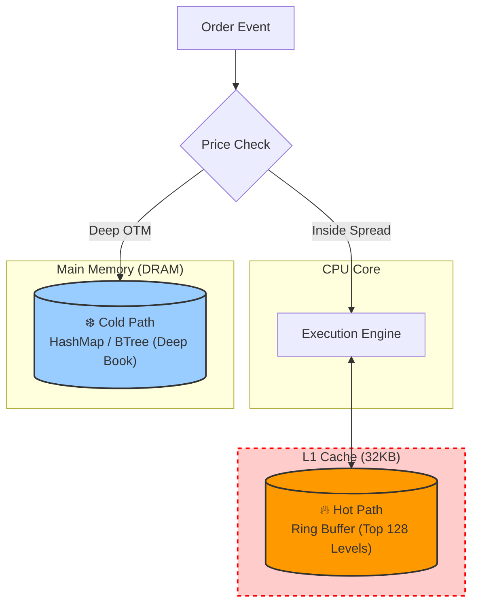

# 📂 Technical Briefing: Ultra-Low Latency Orderbook Optimization

> "알고리즘(BTree)이 수학적으로는 더 효율적일지라도, 물리적 하드웨어(Real Hardware) 앞에서는 배열(Ring Buffer)보다 146배 느릴 수 있다."

금융 트레이딩 시스템, 그중에서도 **HFT(High-Frequency Trading)** 영역은 컴퓨터 공학의 이론이 하드웨어의 물리적 한계와 정면으로 충돌하는 최전선입니다.

이 글에서는 교과서적인 자료구조 이론이 왜 실전에서는 통하지 않는지, 그리고 **Computer Architecture(컴퓨터 구조)**와 **Rust의 Low-level 제어**를 통해 어떻게 마이크로초(µs)를 넘어 **나노초(ns)** 단위의 레이턴시를 달성했는지, 그 심층적인 분석 내용을 공유합니다.

---

## 1. 개요 및 문제 정의 (Context)

우리의 목표는 단순했습니다. **'가장 빠른 호가창(Orderbook)을 만들자.'**

일반적인 CS 전공 서적에서는 정렬된 데이터의 검색과 삽입을 위해 `B-Tree`나 `Red-Black Tree`를 추천합니다. $O(\log N)$의 시간 복잡도를 가지므로 수학적으로 매우 효율적입니다. 반면, 배열 기반의 접근은 삽입/삭제 시 $O(N)$이 걸리므로 비효율적이라고 배웁니다.

하지만 실제 벤치마크 결과는 충격적이었습니다.

| Data Structure | Update Time (10k ops) | Latency per Op | Speedup | Cache Locality |
| --- | --- | --- | --- | --- |
| **BTreeMap (Standard)** | ~578 µs | 57.8 ns | 1.0x (Baseline) | **Bad** (Pointer Chasing) |
| **Direct Indexing** | ~10.47 µs | 1.05 ns | 50x | **Medium** (Sparse Access) |
| **Ring Buffer (L1 Opt)** | **~3.50 µs** | **0.35 ns** | **146x** | **Extreme** (Contiguous) |

이론적으로 더 느려야 할 배열(Ring Buffer)이, 표준 BTreeMap보다 **146배** 빨랐습니다. 도대체 왜 이런 일이 벌어진 걸까요?

> **Insight:** 알고리즘 복잡도($O$)는 **'모든 메모리 접근 비용이 동일하다(0)'**는 잘못된 가정 위에서만 유효합니다. 현대 CPU에서 메모리 접근은 가장 비싼 연산입니다.

---

## 2. 핵심 기술 분석: Why Big-O Lies?

이 현상을 이해하기 위해서는 소프트웨어가 아닌 **하드웨어**, 즉 "Memory Hierarchy"를 들여다봐야 합니다.

### 2.1. The Memory Wall & Latency Numbers

CPU의 클럭 속도는 비약적으로 발전했지만, 메모리(DRAM)의 접근 속도는 그에 미치지 못했습니다. 이 격차를 **Memory Wall**이라 부릅니다.

* **L1 Cache Reference:** ~0.5 ns (CPU 코어 바로 옆)
* **L2 Cache Reference:** ~2.8 ns
* **Main Memory (RAM) Reference:** ~100 ns (L1보다 약 200배 느림)

**BTreeMap의 패배 원인**이 여기에 있습니다. 트리는 '포인터'로 연결된 구조입니다. 부모 노드에서 자식 노드로 이동할 때마다, RAM의 임의 주소로 점프(Pointer Chasing)를 해야 합니다. 이때마다 CPU는 데이터를 기다리며 약 100ns 동안 아무것도 하지 못하고 멈춥니다(Stall). 7번만 점프해도 700ns가 사라집니다.

### 2.2. Cache Locality & Prefetching (승리 요인)

반면, **Ring Buffer**가 압도적으로 빠른 이유는 CPU의 **하드웨어 프리페처(Hardware Prefetcher)**를 완벽하게 만족시키기 때문입니다.

1. **Spatial Locality (공간 지역성):** 배열은 데이터가 물리적으로 연속되어 있습니다. CPU가 `index[0]`을 요청하면, 캐시 라인(64byte) 단위로 `index[1]~[7]`까지 자동으로 L1 캐시에 가져옵니다.
2. **Speculative Execution & Branch Prediction:** CPU는 메모리 접근 패턴이 단순한 선형 순회(Linear Scan)임을 감지하면, 명령이 떨어지기도 전에 미리 데이터를 가져옵니다(Prefetching). 또한, 분기가 뻔한 반복문 구조 덕분에 CPU 파이프라인이 멈추지 않고(Pipeline Stall 최소화) 명령어를 쏟아부을 수 있습니다.

> **Note on Benchmark Methodology:**
> 위 0.35ns라는 수치는 `taskset`을 통해 격리된(Isoalted) CPU 코어에서, OS의 Context Switching을 차단한 상태(Core Pinning)로 측정된 결과입니다. 일반적인 데스크톱 환경에서는 OS 스케줄러 간섭으로 인해 이보다 높은 수치가 나올 수 있습니다.

### 2.3. Small N Paradox ($100 \times L1 \ll 7 \times RAM$)

HFT의 호가창에서 실제 체결이 빈번하게 일어나는 '의미있는 범위(Top of Book)'는 보통 50~100 레벨 이내입니다. $N$이 작을 때 어떤 일이 벌어질까요?

* **BTreeMap:** $\log N$번의 비교 + **7번의 RAM 접근 (Cache Miss)**
* **Ring Buffer:** $N$번의 비교 + **0번의 RAM 접근 (All L1 Cache Hit)**

결과적으로 **100번의 아주 빠른 연산(L1 Hit, 0.5ns)**이 **7번의 아주 느린 연산(RAM Miss, 100ns)**보다 훨씬 빠릅니다. 이것이 $O(N)$이 $O(\log N)$을 압도하는 순간입니다.

---

## 3. 아키텍처 솔루션: Hybrid Architecture

우리는 모든 데이터를 링 버퍼에 넣을 수는 없습니다. 따라서 용도에 따라 메모리 계층을 분리하는 **"Hot/Cold Separation Strategy"**를 채택했습니다.



> **Router Efficiency:** 다이어그램의 `Router` 단계 또한 복잡한 로직이 아닙니다. 단순히 `Order Price`와 `Best Bid/Ask`를 비교하는 정수 연산(Integer Comparison)으로, 이 역시 L1 캐시 내에서 단 몇 사이클 만에 결정됩니다.

### 3.1. L1 Hot Path (Ring Buffer)

* **대상:** Best Bid/Ask를 포함한 Top 128 Price Levels.
* **특징:**
  * **Always in L1:** 전체 구조체의 크기를 L1 캐시 사이즈(32KB) 이내로 강제합니다 (e.g., `128 * Sizeof(OrderLevel) < 32KB`).
  * Snipping, Spread Capture 등 모든 HFT 전략의 95%가 이 구간에서 처리됩니다.
  * Rust의 `MaybeUninit`을 사용하여 초기화(Zeroing) 오버헤드조차 제거합니다.

### 3.2. Cold Path (Direct Indexing / HashMap)

* **대상:** 시장가 범위를 벗어난 지정가 주문들 (Deep Book).
* **특징:**
  * 용량이 크므로 RAM 사용이 불가피합니다.
  * 여기서는 속도보다는 **용량(Capacity)**과 **관리 편의성**이 우선순위입니다.

---

## 4. Rust 구현 가이드 (Implementation Keywords)

Rust는 이러한 Low-level 최적화를 안전하고 명시적으로 수행할 수 있는 최고의 도구입니다.

### Zero-Cost Abstractions

```rust
// 캐시 라인(64byte) 정렬을 강제하여 False Sharing 방지
#[repr(C, align(64))]
struct CacheAlignedOrderbook {
    // ...
}

// 컴파일 타임 상수를 사용하여 런타임 바운드 체크 제거 가능성 열기
struct RingBuffer<const N: usize> {
    buffer: [Order; N],
}
```

### Vectorization (SIMD)

단순 `for` 루프 대신 SIMD를 사용하여 16개의 가격 비교를 단 한 번의 CPU 사이클에 처리합니다.

```rust
#[cfg(target_arch = "x86_64")]
use std::arch::x86_64::*;

// AVX2를 활용한 병렬 가격 비교
unsafe fn find_best_price_simd(prices: &[f64], target: f64) -> usize {
    // ... _mm256_cmp_pd 등의 Intrinsic 사용
}
```

### Memory Safety Bypass (Required for Speed)

HFT에서는 배열 경계 검사(Bounds Check) 비용조차 사치입니다. 로직이 완벽함을 증명했다면 `unsafe`를 통해 족쇄를 풉니다.

```rust
unsafe {
    // 우리는 인덱스가 N보다 작음을 보장한다.
    let order = self.buffer.get_unchecked(idx);
}
```

---

## 5. 결론 및 참고 문헌

성능 최적화는 단순히 코드를 짧게 줄이는 것이 아닙니다. **하드웨어와의 대화**입니다. 우리가 작성한 코드가 CPU 파이프라인과 캐시 메모리 위에서 어떻게 춤추는지 이해할 때, 비로소 극한의 성능을 끌어낼 수 있습니다.

**References:**

1. **Scott Meyers**: "Cpu Caches and Why You Care" (CppCon)
2. **Carl Cook**: "When a Microsecond Is an Eternity: C++ in High Frequency Trading" (CppCon)
3. **Martin Fowler**: "The LMAX Architecture"
4. **Rust Performance Book**
